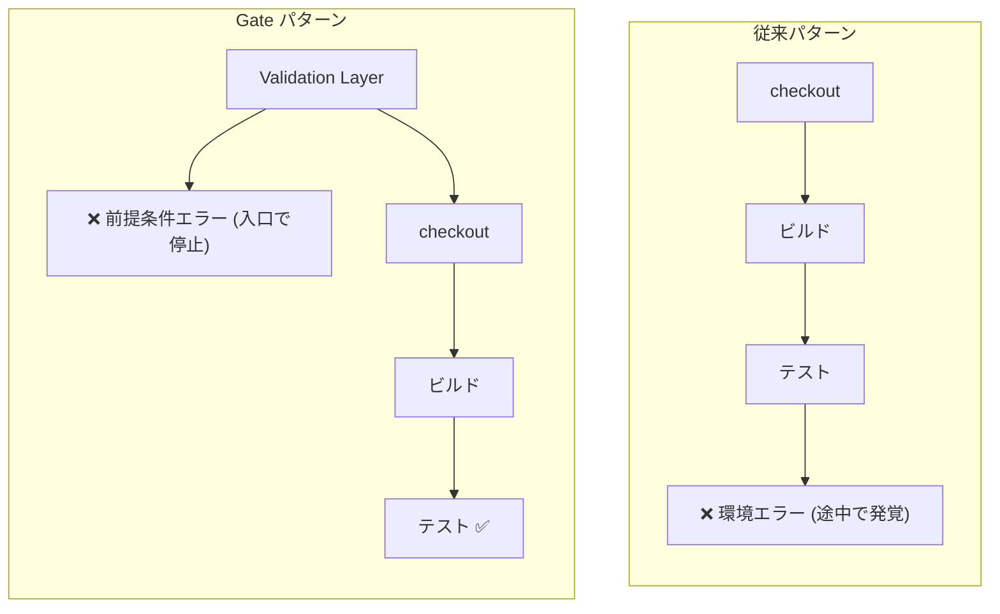
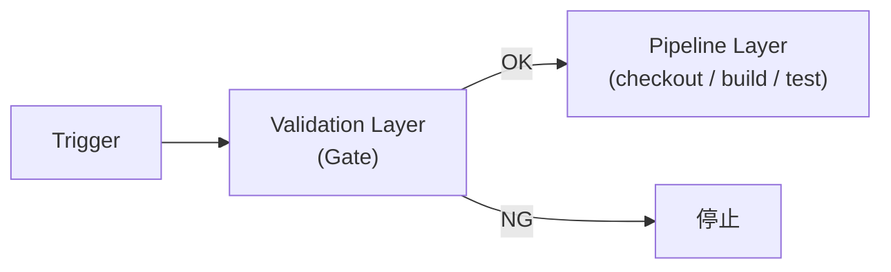
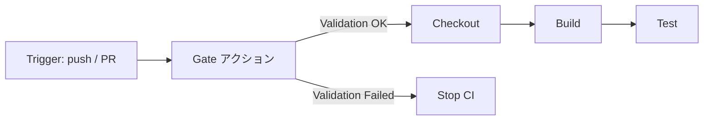
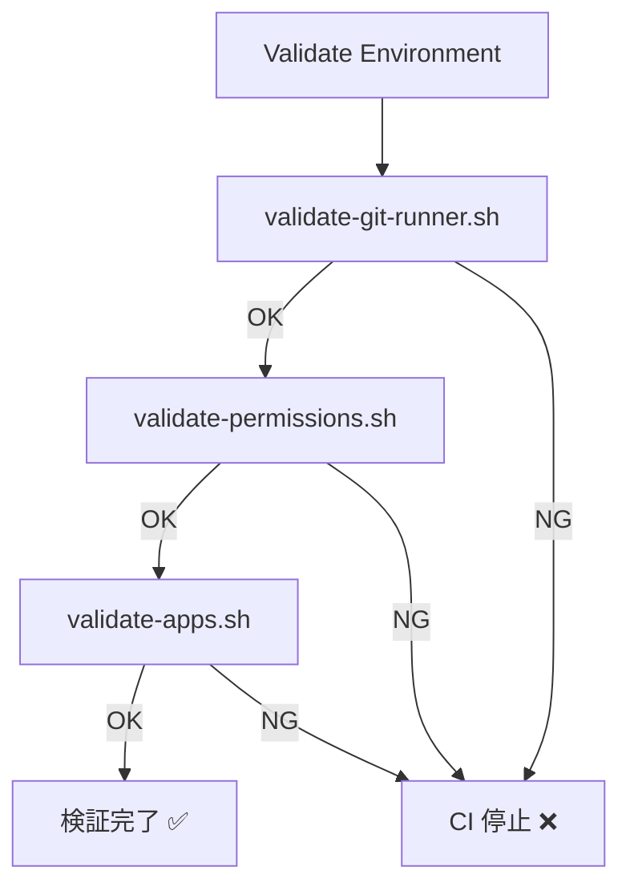

<!-- markdownlint-disable no-emphasis-as-heading -->

## はじめに

atsushifx です。
この記事では、CI の入口で前提条件を検証することで試行錯誤を防ぐ設計パターン **Gate パターン** と、その実践的な実装例 **Validate Environment** を紹介します。

GitHub Actions を作成するとき、「ローカルでは動くのに CI で失敗する」という問題に悩まされた経験はないでしょうか。
エラーを修正して workflow を再実行しても、別の前提条件不足で再び失敗することがあります。
原因の多くは、実行環境の前提条件の欠如です。

Gate パターンを活用することで、この試行錯誤の連鎖を入口で断ち切ることができます。

## この記事で使う用語

### Gate パターン固有の用語

- `Gate パターン`:
  CI/CD パイプラインの入口に Validation Layer を設け、前提条件を検証する設計パターン。
  前提条件を満たさない場合は後続の処理を実行せずに停止する。

- `Gate アクション`:
  Gate パターンを実装した GitHub Action。
  CI パイプラインの最初の step として実行される環境検証専用のアクション。

- `Validate Environment`:
  aglabo CI Platform が提供する Gate アクションの実装例。
  runner 環境・権限・必須ツールを検証する Composite Action。

### GitHub Actions の基本用語

- `GITHUB_TOKEN`:
  GitHub Actions が workflow 実行時に自動発行するトークン。
  トークン本体の環境変数名は `GITHUB_TOKEN`。
  workflow YAML からは `${{ secrets.GITHUB_TOKEN }}` の構文で参照する。

- `permissions`:
  GitHub Actions における `GITHUB_TOKEN` の権限設定。
  `contents: read` や `issues: write` のようにスコープごとに指定する。

## 1. CI でよく起きる問題

CI workflow が途中で失敗するケースには、共通のパターンがあります。
この章では、代表的な 3 つの問題と、その共通構造を整理します。

### 1.1 権限不足

GitHub Actions では、workflow が GitHub API を利用する際に `GITHUB_TOKEN` を使用します。
このトークンの権限が不足している場合、API 呼び出しは失敗します。

```text
Error: Resource not accessible by integration
```

このエラーだけでは「どの権限が不足しているのか」を判断しづらく、原因特定に時間がかかります。

### 1.2 必須ツール不足

CI runner に workflow が前提とするツールがインストールされていない場合、コマンド実行時に失敗します。

```text
jq: command not found
```

このような問題は、CI を開始する前に必須ツールの存在を確認することで防げます。

### 1.3 バージョン不一致

CI runner の環境がローカル環境と異なる場合、エラーになることがあります。

```text
error: Node.js v16 is no longer supported.
```

特にメジャーバージョンが異なると、互換性の問題によってビルドエラーが発生することもあります。

### 1.4 問題の共通構造

これら 3 つの問題には共通の構造があります。

| CI で起きる問題  | 根本原因           | 検出タイミング |
| ---------------- | ------------------ | -------------- |
| 権限不足         | permissions 未設定 | API 呼び出し時 |
| ツール不足       | runner 環境差異    | コマンド実行時 |
| バージョン不一致 | バージョン未固定   | ビルド・実行時 |

*表 1-1: CI で起きる問題の共通構造*

いずれも **CI の本処理を開始する前に検出できる問題** です。
つまり、パイプラインの入口に「前提条件を検証する層」を設ければ、これらの失敗はすべて事前に防げます。
この考え方を設計パターンとして整理したものが **Gate パターン** です。

## 2. Gate パターン

Gate パターンとは、CI/CD パイプラインの入口に **Validation Layer** を設け、
前提条件を検証してから本処理を開始する設計パターンです。
前提条件の検証を専用レイヤに分離することで、本処理の信頼性と再現性を高めます。

### 2.1 設計思想

Gate パターンの根底にある原則は **Fail Fast** です。
問題をできるだけ早い段階で検出し、無駄な処理を実行しないという考え方です。
CI では 1 回の実行に数分から数十分かかるため、
問題を早期に検出できるほどフィードバックサイクルが短くなります。

従来の CI では、前提条件の不備はパイプラインの途中で発覚します。
Gate パターンでは、入口の Validation Layer が前提条件を保証することで、本処理は「前提条件が揃った状態」からのみ開始されます。



*図 2-1: 従来パターンと Gate パターンの比較*

### 2.2 アーキテクチャ

Gate パターンは、CI パイプラインを次の 2 層に分離します。

**Validation Layer (Gate 層)**

- パイプラインの最初に実行される
- 前提条件（権限・ツール・環境）を検証する
- NG の場合、パイプラインの実行を停止する

**Pipeline Layer (本処理層)**

- Gate 層が成功した場合のみ実行される
- checkout・build・test など CI の主処理を担う
- 実行開始時点で前提条件が保証されている



*図 2-2: Gate パターンのレイヤ構造*

### 2.3 Gate パターンの効果

Validation Layer を導入することで、次の効果が得られます。

- **予測可能性の向上**
  本処理が開始された時点で、前提条件が満たされていることが保証されます。

- **CI 実行時間の節約**
  前提条件の不備を入口で検出できるため、無駄な処理を回避できます。

- **デバッグコストの削減**
  エラー原因が明確になり、調査時間が短縮されます。

- **再現性の確保**
  同じ前提条件のもとで CI が実行されるため、環境に依存しない安定したビルドを実現できます。

## 3. Gate アクション

Gate パターンの Validation Layer を実装したものが **Gate アクション** です。

### 3.1 Gate アクションとは

Gate アクションは、CI パイプラインの入口で前提条件を検証する **環境検証専用の GitHub Action** です。
1章で見た権限不足・ツール不足・バージョン不一致などの問題を事前に検証します。
前提条件を満たさない場合は、後続の処理を実行せずに停止します。

次の図は、CI パイプライン全体における Gate アクションの位置を示しています。



*図 3-1: Gate アクションの全体フロー*

### 3.2 検証できる項目

Gate アクションでは、CI を正常に実行するための前提条件を検証します。
代表的な検証項目は次のとおりです。

| 検証項目         | 検証内容の例                           |
| ---------------- | -------------------------------------- |
| permissions      | `contents: read`, `issues: write` など |
| 必須ツール       | `git`, `jq`, `node` の存在確認         |
| ツールバージョン | Node.js >= 20 などの最小バージョン     |

*表 3-1: Gate アクションで検証できる項目*

## 4. Gate アクションの実装例: Validate Environment

### 4.1 概要

Gate パターンを実際の CI に組み込む実装例が **Validate Environment** です。

Validate Environment は [aglabo CI Platform](https://github.com/aglabo/ci-platform/) が提供する
GitHub composite action です。
CI パイプラインの入口で次の前提条件を検証します。

- runner 環境 (OS 種別・アーキテクチャ・runner の種類)
- workflow 権限 (permissions)
- 必須ツール (存在確認・バージョン検証)

### 4.2 検証スクリプト

Validate Environment は、検証責務ごとに分離された 3 つの検証スクリプトで構成されています。

| スクリプト                | 検証内容                      |
| ------------------------- | ----------------------------- |
| `validate-git-runner.sh`  | runner の OS・アーキテクチャ  |
| `validate-permissions.sh` | GitHub API 実行による権限検証 |
| `validate-apps.sh`        | 必須ツールの存在とバージョン  |

*表 4-1: 検証スクリプト一覧*



*図 4-1: Validate Environment の検証フロー*

各スクリプトは順次実行され、スクリプト単位で NG が検出されると後続スクリプトは実行されません。
各スクリプト内でバリデーションが失敗した場合は、エラーメッセージを出力してその場で停止します。

検証スクリプトはユーザー入力を `eval` しない設計です。
ユーザー入力をシェルコマンドとして直接評価しないため、コマンドインジェクションのリスクを回避できます。

### 4.3 入力パラメータ

Validate Environment には、次の入力パラメータがあります。
これらは呼び出し元 workflow で設定します。

| パラメータ              | 必須 | デフォルト値   | 説明                                |
| ----------------------- | ---- | -------------- | ----------------------------------- |
| `architecture`          | 任意 | `amd64`        | runner の CPU アーキテクチャ        |
| `actions-type`          | 任意 | `read`         | GitHub 操作の権限検証モード         |
| `additional-apps`       | 任意 | (なし)         | 追加で検証するツール                |
| `require-github-hosted` | 任意 | `false`        | GitHub-hosted runner を必須とするか |
| `github-token`          | 任意 | `GITHUB_TOKEN` | 権限検証に使用するトークン          |

*表 4-2: Validate Environment の入力パラメータ*

補足:

- `architecture`: 指定できる値は `amd64` / `arm64`。runner の表記 `x86_64` は内部で `amd64` として扱われる。
- `actions-type`: 指定できる値は `read` / `commit` / `pr` / `any`。詳細は [5.3 権限検証の設定](#53-権限検証の設定) 参照。
- `additional-apps`: 1 アプリ 1 行の形式。書式の詳細は下記参照。
- `github-token`: 未指定の場合、GitHub Actions が自動発行するトークン (`GITHUB_TOKEN`) を使用する。追加の権限が必要な場合は PAT (Personal Access Token) を明示的に指定する。

```yaml
with:
  github-token: ${{ secrets.MY_PAT }}
```

#### additional-apps の書式

`additional-apps` には、検証するアプリケーションを **1 アプリ 1 行** の形式で指定します。
各行は `|` 区切りの 4 フィールドで構成されます。

```plaintext
cmd|app_name|version_extractor|min_version
```

| フィールド          | 説明                                                      |
| ------------------- | --------------------------------------------------------- |
| `cmd`               | PATH 上の実行ファイル名                                   |
| `app_name`          | ログやエラーメッセージに表示する名前                      |
| `version_extractor` | バージョン抽出方式 (`field:N` / `regex:PATTERN` / `auto`) |
| `min_version`       | 最低バージョン (空欄の場合はバージョンチェックを行わない) |

*表 4-3: additional-apps のフィールド説明*

複数のアプリを検証する場合は、YAML の multiline 文字列で記述します。

```yaml
additional-apps: |
  gh|GitHub CLI|field:3|2.0
  node|Node.js|regex:v([0-9.]+)|20.0
  jq|jq
```

> バージョンチェックしない場合は、
> 実行ファイル名 (`cmd`) と表示名 (`app_name`) の 2 フィールドのみ指定します。

### 4.4 出力

検証結果は、runner / permissions / apps の各検証ごとに
`status` と `message` の形式で出力されます。

| 出力名                | 内容                                  |
| --------------------- | ------------------------------------- |
| `runner-status`       | runner 検証結果 (`success` / `error`) |
| `runner-message`      | runner 検証の詳細メッセージ           |
| `permissions-status`  | 権限検証結果 (`success` / `error`)    |
| `permissions-message` | 権限検証の詳細メッセージ              |
| `apps-status`         | ツール検証結果 (`success` / `error`)  |
| `apps-message`        | ツール検証の詳細メッセージ            |

*表 4-4: Validate Environment の出力*

> 出力を参照する場合、step に `id:` を設定します。
> 設定後は `steps.<id>.outputs.<出力名>` として参照できます。

### 4.5 制約事項

Validate Environment には、次の制約があります。

- **Linux runner のみ対応**
  `ubuntu-latest` などの Linux runner でのみ動作します。
  Bash と GNU ユーティリティを前提としているためです。

- **self-hosted runner の扱い**
  デフォルト (`require-github-hosted: false`) では self-hosted runner も許可されています。

  GitHub-hosted runner のみ許可する場合は、`require-github-hosted: true` を指定します。

  ```yaml
  with:
    require-github-hosted: true
  ```

## 5. 導入方法

### 5.1 基本的な workflow 例

最小構成の workflow は次のとおりです。

```yaml
jobs:
  build:
    runs-on: ubuntu-latest
    permissions:
      contents: read

    steps:
      - name: Validate Environment
        uses: aglabo/ci-platform/.github/actions/validate-environment@v0.1.0

      - uses: actions/checkout@v4
      - run: pnpm build
```

> Validate Environment は、検証に失敗した場合 `exit 1` で終了し、job はそこで失敗として停止します。
> 前提条件に問題がある場合は後続の step は実行されません。

### 5.2 追加アプリの検証

`additional-apps` を指定することで、追加のアプリケーションを検証できます。
書式の詳細は [4.3 入力パラメータ](#43-入力パラメータ) の `additional-apps` の書式を参照してください。

```yaml
- name: Validate Environment
  uses: aglabo/ci-platform/.github/actions/validate-environment@v0.1.0
  with:
    additional-apps: |
      jq|jq|regex:([0-9.]+)|1.6
      node|Node.js|regex:v([0-9.]+)|20
```

> アプリが未インストール、または指定した最低バージョン未満の場合、job は失敗として終了します。

### 5.3 権限検証の設定

`actions-type` は、Validate Environment が実行する GitHub 権限検証モードを指定します。

| actions-type | 用途         | 必要な permissions                    |
| ------------ | ------------ | ------------------------------------- |
| read         | 読み取り専用 | contents: read                        |
| commit       | コミット操作 | contents: write                       |
| pr           | PR 操作      | contents: write, pull-requests: write |
| any          | 検証スキップ | 検証なし                              |

*表 5-1: actions-type の種類と必要な permissions*

> GitHub Actions の権限は workflow YAML だけでなく、
> Repository / Organization のポリシーによって制限される場合があります。
>
> そのため Validate Environment では YAML を解析するのではなく
> GitHub API を実行して権限を検証する方式を採用しています。

```yaml
- name: Validate Environment
  uses: aglabo/ci-platform/.github/actions/validate-environment@v0.1.0
  with:
    actions-type: "pr"
```

### 5.4 実行ログの見方

検証が成功した場合、次のような出力が表示されます。

成功ログ:

```plaintext
=== Validating GitHub Runner Environment ===
✓ Operating system is Linux
✓ Architecture validated: amd64
  GitHub runner validated: Linux amd64

=== Validating GitHub Permissions ===
Checking permissions for commit operations...
✓ contents: write permission verified

=== Validating Required Applications ===
✓ jq detected (version 1.6)
=== Application validation passed ===
```

検証が失敗した場合、エラーの詳細が表示されます。
各スクリプトは順次実行され、スクリプト単位で NG が検出されると後続スクリプトは実行されません。
各スクリプト内でバリデーションが失敗した場合は、エラーメッセージを出力してその場で停止します。

失敗ログ:

```text
=== Validating GitHub Runner Environment ===
Operating System: linux
✓ Operating system is Linux

Expected architecture: amd64
Detected architecture: x86_64
✓ Architecture validated: amd64

✓ RUNNER_TEMP is set
✓ GITHUB_OUTPUT is set
✓ GITHUB_PATH is set

=== GitHub runner validation passed ===
  GitHub runner validated: Linux amd64

=== Validating GitHub Permissions ===
Checking GITHUB_TOKEN...
✓ GITHUB_TOKEN is set

Checking permissions for PR operations...
✗ pull-requests: write permission missing

```

## おわりに

Gate パターンは、CI/CD パイプラインの入口に Validation Layer を設ける設計パターンです。

このレイヤを導入することで、次の利点が得られます。

- CI の再現性 (同じ前提条件で常に同じ結果が得られる)
- 失敗原因の明確化 (入口で問題を検出し原因を特定しやすくする)
- 実行時間の最適化 (前提条件の不備を早期に検出し無駄な処理を省く)

Validate Environment を導入することで、この Gate パターンをすぐに活用できます。
まずは [5.1 基本的な workflow 例](#51-基本的な-workflow-例) から試してみてください。

それでは、Happy Hacking!

## 参考資料

### Web サイト

- GitHub Actions ドキュメント: <https://docs.github.com/ja/actions>
  GitHub Actions の公式ドキュメント

- GitHub Actions セキュリティガイド: <https://docs.github.com/ja/actions/security-guides>
  GitHub Actions のセキュリティに関するガイド

- GITHUB_TOKEN 自動トークン認証: <https://docs.github.com/ja/actions/security-guides/automatic-token-authentication>
  workflow 実行時に自動発行されるトークンの説明

- Validate Environment アクション: <https://github.com/aglabo/ci-platform/tree/main/.github/actions/validate-environment>
  aglabo CI Platform の環境検証アクション

- Reusable Workflows 入門: <https://zenn.dev/atsushifx/articles/ci-gha-reusable-workflows-01-basics>
  同シリーズの Reusable Workflows 解説記事
