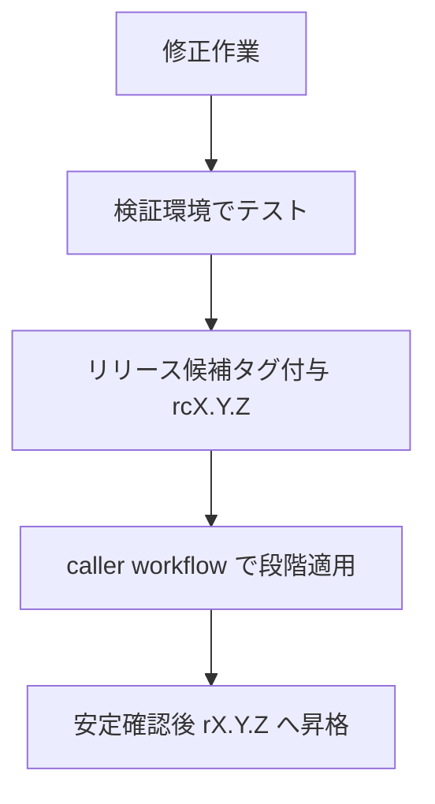

## はじめに

atsushifx です。
本記事では、GitHub の Reusable Workflows を使用し、各プロジェクトを横断して共通の処理を実行させる方法を解説します。

GitHub には、GitHub Actions (`GHA`) という CI/CD を自動化するプラットフォームがあります。
`GHA`は、設定によって各種の Workflows を呼び出し、機密情報のスキャンやコードの品質チェックを行います。
Workflow の結果によっては、PUSH や Merge の取り消しなどを行い、GitHub 上に危険なコードが入るのを防ぎます。

GitHub Workflows は、リポジトリごとに設定します。そのため、同じような Workflows が作成されることがあります。

Reusable Workflows は、上記のような Workflows を統一するための仕組みです。
Reusable Workflows には、機密情報スキャンのような統一処理を実行させ、各リポジトリの違いはパラメータで吸収します。
これにより、安全で統一的な GitHub Workflows を実現します。

本記事では、Reusable Workflows の基本から、作成の方法。
実際に使用するためのリポジトリ、バージョン管理の方法までを説明します。

## 1. 記事の概要と読み方

本記事は、Reusable Workflows を **CI/CD 基盤として設計・運用するための判断軸** を段階的に整理する構成です。
単なる機能説明ではなく、「どこを共通化し、どこを分離すべきか」「どの変更が破壊的になり得るか」といった設計上の要点に焦点を当てます。

前半では、Reusable Workflows の基本概念と仕組みを確認します。`workflow_call` による定義方法、caller からの呼び出し方、inputs / secrets / outputs の役割を押さえることで、以降の設計議論の前提を揃えます。

中盤では、Reusable Workflows 以外の選択肢、Composite Actions、Workflow Templates を比較し、比較軸に沿って整理します。
これにより、「なぜ Reusable Workflows を基盤に据えるのか」「どの要件で他の手段が適するのか」を判断できるようになります。

後半では、実運用を想定した設計原則と運用戦略を扱います。
最小権限 (permissions) の考え方、共通 config とローカル config の二層構造など長期運用で効いてくるポイントを具体例とともに解説します。

### 1.1 この記事の目的

この記事の目的は、Reusable Workflows を CI/CD 基盤として設計・運用するための実践的な判断軸を明確にすることです。GitHub Actions は柔軟性が高い一方、リポジトリ単位で workflow を定義する設計のため、組織規模が大きくなるほど設定の分散や運用負荷が顕在化します。

具体的には、次の課題を解消することを狙います。

- 複数リポジトリにまたがる CI/CD 設定のばらつき
- 共通処理 (lint、scan、test など) の重複定義
- 権限設定やツールバージョンの不整合
- 更新時の影響範囲が把握しづらい構造

Reusable Workflows を基盤に据えることで、これらの課題を **構造的に** 解決します。共通処理は一箇所に集約し、各リポジトリは呼び出しと最小限の入力指定に専念します。これにより、CI/CD の標準化、再現性の確保、そして長期的な保守性を同時に満たすことが可能になります。

本記事では、「Reusable Workflows を使うと便利」という表層的な話ではなく、Reusable 側が持つべき責務を重視します。
すなわち、**どの責務を reusable 側に寄せ、どの責務を caller 側に残すべきか**、また **どの設計が将来的な破壊的変更を生みやすいか** といった観点です。
読後には、既存の CI/CD 構成を見直し、組織全体で統一された基盤へ段階的に移行するための判断材料を得られることを目標とします。

### 1.2 対象読者

本記事の対象読者は、GitHub Actions をすでに業務で利用しており、CI/CD の基本的な仕組みや概念を理解しているエンジニアです。
一方で、複数リポジトリを横断した運用において、設定のばらつきや更新作業の煩雑さに課題を感じている状況を想定しています。

具体的には、次のような立場や状況にある読者を主な対象とします。

- 複数のリポジトリで CI/CD を運用しており、同種の workflow を何度も定義している
- lint やセキュリティスキャンの設定がリポジトリによって微妙に異なり、統一できていない
- 権限設定やツールのバージョン管理に不安があり、意図しない挙動やリスクを避けたい
- 組織やチーム単位で CI/CD の標準化を進めたいが、設計の指針が定まっていない

一方で、本記事は GitHub Actions の入門記事ではありません。workflow_call や uses: といった基本構文、CI/CD の役割そのものについての詳細な解説は最小限にとどめています。すでに単一リポジトリでの運用経験があり、「次の段階として、どう設計すれば破綻しないか」を考え始めた段階の読者に適した内容です。

Reusable Workflows を導入することで得られるのは、単なる記述量の削減ではなく、設計の一貫性と運用上の予測可能性です。
本記事は、その価値を理解し、既存の CI/CD を組織横断の基盤へと発展させたい読者を支援することを目的としています。

### 1.3 GitHub Actions を複数リポジトリで運用する際の課題

GitHub Actions は、単一リポジトリでの CI/CD 構築においては非常に扱いやすい仕組みです。しかし、同じ運用モデルを複数リポジトリへそのまま拡張すると、設計上の歪みが徐々に表面化します。

最も顕著なのは、**設定の分散**です。各リポジトリに workflow を定義する前提のため、lint やセキュリティスキャンといった共通処理が、ほぼ同じ内容で複数箇所に存在しがちです。この構造では、ルール変更やツール更新のたびにすべてのリポジトリを修正する必要があり、更新漏れや不整合が発生しやすくなります。

次に問題となるのが、**権限設定とセキュリティのばらつき**です。`permissions` を caller 側で個別に指定している場合、指定漏れや過剰付与が混在しやすくなります。
結果として、本来は不要な書き込み権限を持った workflow が生まれたり、逆に権限不足で失敗する workflow が発生したりします。これはセキュリティ面だけでなく、運用上のトラブルシューティングコストも増大させます。

さらに、**バージョン管理の難しさ**も無視できません。外部 Actions やツールのバージョンがリポジトリごとに異なると、同じ CI が「あるリポジトリでは成功し、別のリポジトリでは失敗する」といった状況が生じます。CI/CD の結果が再現できなくなると、品質保証の基盤としての信頼性が損なわれます。

これらの課題に共通する根本原因は、**共通化すべき責務がリポジトリ単位に分散している**ことです。
GitHub Actions 自体は強力ですが、組織横断での運用を前提として設計しない限り、スケールとともに保守負荷とリスクが指数的に増えていきます。

この問題を解消するためには、共通処理・権限・バージョン管理といった要素を一段上のレイヤーに引き上げ、各リポジトリからは「使うだけ」にする設計が必要になります。Reusable Workflows は、そのための現実的な選択肢です。

### 1.4 Reusable Workflows が解決すること

Reusable Workflows は、複数リポジトリ運用で発生する問題を、運用ルールではなく構造で解決します。共通処理を各リポジトリから切り離し、基盤として集中管理することで、CI/CD 全体の一貫性と可視性を高めます。

第一に、**設定の分散と更新漏れ**を解消します。lint、セキュリティスキャン、テストなどの共通処理を reusable workflow に集約することで、修正は一箇所で完結します。結果として、全リポジトリに同一の基準が適用され、差分管理や影響範囲の把握が容易になります。

第二に、**権限設計の統一**が可能になります。permissions を reusable 側で明示することで、caller 側の指定漏れや過剰付与を防止できます。最小権限の原則を基盤レイヤーで強制できるため、セキュリティ水準を組織全体で均一化できます。

第三に、**再現性とバージョン管理**の問題を整理できます。Reusable Workflows をタグ固定で参照することで、どのリポジトリでも同一バージョンの CI/CD が実行されます。外部 Actions やツールのバージョンも集約管理でき、環境差異による挙動の揺れを抑えられます。

重要なのは、Reusable Workflows が単なる重複排除の仕組みではない点です。
共通処理・権限・バージョン管理といった **横断的な責務を基盤レイヤーへ明確に分離** することで、caller workflow は「何を使うか」を宣言するだけのシンプルな構成になります。これにより、CI/CD の全体像が読みやすくなり、変更時の影響も予測しやすくなります。

## 2. Reusable Workflows の基礎

この章では、Reusable Workflows の位置づけと最小構成を整理し、以降の設計議論に必要な前提を揃えます。目的は、単に書き方を理解することではなく、**CI/CD 基盤として安全に使えるかどうかを判断できるようになる**ことです。

### 2.1 なぜ必要なのか (課題→解決)

複数のリポジトリで CI/CD を運用すると、lint やセキュリティスキャン、テストといった共通処理が、各リポジトリにほぼ同じ内容で定義されがちです。一見すると問題は少ないように見えますが、この構造は運用規模の拡大とともに確実に歪みを生みます。

最もわかりやすい問題は、**変更時の対応漏れ**です。
ルールやツールの更新が必要になった場合、すべてのリポジトリに同じ修正が必要です。このとき、一部のリポジトリだけが更新されずに残ると、CI/CD の基準が統一されなくなります。

次に顕在化するのが、**権限設定やバージョンの不整合**です。
`permissions` や外部 Actions のバージョンがリポジトリごとに異なると、同じ CI を実行しているはずなのに、成功するリポジトリと失敗するリポジトリが出てきます。これは再現性を損ない、CI/CD を品質保証の基盤として信頼できなくする要因になります。

これらの問題は、運用ルールや注意喚起だけでは根本的に解決できません。原因は、**共通化すべき責務がリポジトリ単位に分散している構造**にあります。

Reusable Workflows は、この構造的な問題に対する解決策です。
共通処理を caller workflow から切り離し、基盤レイヤーに集約することで、次の状態を実現できます。

- 共通処理の修正が一箇所で完結し、影響範囲が明確になる
- 権限やツールバージョンを基盤側で固定でき、再現性が向上する
- caller workflow は「どの基盤を使うか」を宣言するだけの構成になる

重要なのは、Reusable Workflows が単なる重複排除の仕組みではない点です。
**CI/CD における責務を明確に分離し、長期運用に耐える構造を作るための設計要素** です。

この視点を持たずに導入すると、「共通 workflow があるだけ」で終わってしまいます。
基盤として機能させるためには、どの責務を reusable 側に寄せ、どの責務を caller 側に残すのかを、意識的に設計しておきます。

### 2.2 Reusable Workflowsの作成方法 (workflow_call)

Reusable Workflow を作成するには、トリガーとして `workflow_call` を定義します。
`workflow_call` を指定した workflow は、他の workflow から `uses:` ディレクティブで呼び出せるようになります。

以下は、最小構成の Reusable Workflow の例です。

```yaml
name: Reusable Lint
on:
  workflow_call:
    inputs:
      config-file:
        type: string
        required: false
        default: ".shared/configs/lint.yml"

permissions:
  contents: read

jobs:
  lint:
    runs-on: ubuntu-latest
    steps:
      - uses: actions/checkout@v4
      - name: Run lint
        run: echo "Lint with ${{ inputs['config-file'] }}"
```

作成された reusable workflow は単体では呼び出せません。
必ず、caller workflow から`uses:`で呼び出される必要があります。

**`workflow_call`の役割**:

`workflow_call` は、Reusable Workflow における外部公開インターフェースです。
inputs や secrets、outputs といった caller とのやり取りは、すべてこの定義に集約されます。

この構造により、次の性質が生まれます。

- Reusable Workflow の入力と出力が明示的になる
- caller 側が何を指定できるのかが構造として固定される
- 想定外の値や責務が暗黙的に流入することを防げる

特に重要なのは、default を必ず設定することです。
これにより、caller workflow は最小構成で利用でき、基盤側の標準動作を強制できます。

**permissions を reusable 側で定義する理由**:

Reusable Workflow では、`permissions` を caller 側に委ねるのではなく、**reusable 側で明示的に定義することが推奨されます**。

```yaml
permissions:
  contents: read
```

このように定義することで、次の問題を防げます。

- caller 側での指定漏れによる実行失敗
- 不要な書き込み権限の付与
- リポジトリごとの権限ばらつき

Reusable Workflow を基盤として運用する場合、権限設計も「共通責務」に含めるべきです。

**作成時に意識すべきポイント**:

Reusable Workflow を作成する際は、次の点を常に意識します。

- **単独で完結**して実行できる構成にする
- caller の存在を前提とした暗黙の依存を持たせない
- 可変点は inputs に限定し、それ以外は固定する

これにより、Reusable Workflow は「再利用可能な部品」ではなく、**安定した CI/CD 基盤の構成要素**として機能します。

### 2.3 reusable workflow の呼び出し方法 (uses: @ref)

reusable workflow は、caller workflow から `uses:` ディレクティブを使って呼び出します。
このとき caller 側は「どの reusable workflow を、どのバージョンで使うか」を宣言する役割に徹します。

最小構成の caller workflow の例を示します。

```yaml
name: CI
on:
  pull_request:

jobs:
  lint:
    uses: org/.github/.github/workflows/lint.yml@r1.0.0
```

この例では、reusable workflow `lint.yml` を `r1.0.0` タグで固定して呼び出しています。
caller 側には steps や run の記述はなく、処理の中身はすべて reusable 側に委ねています。

**`uses:` の基本形式**:

reusable workflow を呼び出す際の形式は、次のとおりです。

```yaml
uses: <owner>/<repository>/.github/workflows/<workflow-file>@<ref>
```

各要素の意味は以下のとおりです。

- `<owner>`: Reusable Workflow を管理している GitHub アカウントまたは Organization
- `<repository>`: Reusable Workflow を配置したリポジトリ
- `<workflow-file>`: `.github/workflows/` 配下の workflow ファイル
- `<ref>`: 参照するバージョン (タグ、ブランチ、SHA)

**`<ref>` にタグ固定を推奨する理由**:

`<ref>` にはタグ、ブランチ名、SHA を指定できますが、ここでは**タグ固定を基本方針**としています。

```yaml
uses: org/.github/.github/workflows/lint.yml@r1.0.0
```

タグを指定することで、次の性質が得られます。

- 同一の CI/CD が常に再現可能になる
- 意図しない変更が caller 側に波及しない
- 更新タイミングを caller 側で制御できる

ブランチ固定 (例: `@main`) は便利ですが、reusable 側の変更が全 caller に反映されます。
その結果、破壊的変更を混入するリスクがあります。
CI/CD 基盤として運用する場合、再現性と影響範囲の制御を優先すべきです。

### 2.4 reusable workflowのインターフェイス (inputs / secrets / outputs)

reusable workflow は、caller workflow と直接コードのやりとりはしません。
`workflow call`によって定義される `input`/`secrets`/`outputs` の 3つの**明示的なインターフェイス**を使用します。

これらは、Reusable Workflow を CI/CD 基盤として安全に運用するうえで、重要な設計要素の 1つです。
設計を誤ると、柔軟性と引き換えに保守性や再現性を失います。

#### 1. `workflow_call` による定義

インターフェイスの構成要素、`inputs`/`secrets`/`outputs`は `workflow_call`内で定義します。

```yaml
on:
  workflow_call:
    inputs:
      version:
        type: string
        required: false
        default: "8.30.0"
    secrets:
      token:
        required: false
    outputs:
      report-path:
        description: "Lint result path"
        value: ${{ jobs.lint.outputs.report }}
```

この定義が、Reusable Workflow の唯一の公開 API になります。

#### 2. `inputs`: 変更可能点を最小限に絞る

`inputs`は、caller workflow 側で変更したい値を定義します。具体的には、実行するアクションのバージョンや設定ファイルなどです。
安易に増やすと、Reusable Workflow の責務が不明瞭になります。

```yaml
inputs:
  config-file:
    type: string
    required: false
    default: ".shared/configs/gitleaks.toml"
```

設計時の判断基準は次のとおりです。

- caller が本当に変更すべき値か
- default のままでも安全に動作するか
- 単一責務を壊していないか

特に重要なのは、**必ず `default` を設定する**ことです。
これにより、caller workflow は最小構成で利用でき、基盤側の標準動作を維持できます。

#### 3. `secrets`: 必要最小限を明示的に要求する

`secrets` は、PAT や API トークンなどの機密情報を安全に受け渡すための仕組みです。

```yaml
secrets:
  github-token:
    required: true
```

設計上の注意点は次のとおりです。

- 不要な secrets を要求しない
- `GITHUB_TOKEN` で代替できないか常に検討する
- required の指定は慎重に行う

secrets を増やすことは、caller 側の権限要求を増やすことと同義です。
CI/CD 基盤として運用する場合、**secrets の数は最小限であるほど安全**です。

#### 4. outputs: 結果はメタ情報として返す

`outputs` は、reusable workflow の実行結果を caller 側に伝えるための仕組みです。

```yaml
outputs:
  report-path:
    description: "Path to lint report"
    value: ./report/lint.log
```

caller 側では、次のように参照します。

```yaml
steps:
  - name: Print report path
    run: echo "Report: ${{ needs.lint.outputs.report-path }}"
```

設計原則は明確です。

- 実データは artifact で渡す
- outputs では **パスや判定フラグなどのメタ情報のみ**を返す
- outputs のキー変更は **breaking change** として扱う

これにより、内部実装を変更しても、caller 側への影響を最小限に抑えられます。

#### インターフェース設計の要点

Reusable Workflow のインターフェース設計では、次の点を常に意識します。

- 外部に公開する情報を最小化する
- 変更可能点は inputs に集約する
- 依存関係を暗黙化しない

この設計が守られていれば、Reusable Workflow は「便利な共通処理」ではなく、**信頼できる CI/CD 基盤の API** として機能します。

## 3. なぜ Reusable Workflows を基盤に据えるのか

GitHub Actions では、Reusable Workflows 以外の再利用手段として Composite Actions と Workflow Templates を提供しています。
この章では各手段の概要を説明し、**Reusable WorkflowsをCI/CD基盤にすることの妥当性**を確認します。

### 3.1 Composite Actions が基盤にならない理由

Composite Actions は、複数のステップをまとめて再利用する仕組みです。
たとえば「特定ツールのインストール」「設定ファイルの検証」をまとめ、Actions を簡素化できます。

CI/CD 基盤としては、次の限界があります。

- ジョブやランナーの構造を定義できない
- 権限を固定できず、呼び出し側に依存する
- ワークフロー全体の統制ができない

Composite Actions は「小規模な処理」を部品化するための仕組みであり、CI/CD の標準化や再現性を担保するには責務が不足しています。

### 3.2 Workflow Templates が基盤にならない理由

Workflow Templates は、workflow を雛形として各リポジトリにコピーするための仕組みです。
Composite Actions と組み合わせることで、記述量の削減や初期設定時のミス防止に役立ちます。

一方で、Workflow Templates は **コピーされた時点で独立する** という性質を持ちます。
そのため、テンプレート側を更新しても、既存リポジトリには変更が反映されません。

この性質により、次の制約が生じます。

- 共通処理の更新が各リポジトリに伝播しない
- CI/CD の実行結果がリポジトリごとに乖離しやすい
- 権限設定やツールバージョンの統制ができない

Workflow Templates は、**CI/CD の設計思想や推奨構成を配布する用途**には適しています。
しかし、実行内容や安全性を継続的に統制する基盤としては不向きです。

したがって、Workflow Templates は「入口」や「初期導線」として使い、
実行の中核は Reusable Workflows に委ねる設計が適切です。

### 3.3 Reusable Workflows が担うべき責務

Reusable Workflows は、CI/CD における「共通で変更されるべき責務」を引き受けるための仕組みです。

具体的には、次の要素を reusable 側に集約します。

- lint や scan などの共通処理
- permissions を含む権限設計
- 使用するツールや Actions のバージョン
- 出力形式や artifact の命名規則

これらを caller workflow に残すと、設定の分散と不整合が避けられません。
Reusable Workflows に集約することで、変更点と影響範囲を明確にし、
CI/CD 全体を 1つの基盤として管理できます。

一方で、どの reusable workflow を使うか、
どの検査を有効にするかといった選択は caller 側の責務です。

この分離により、Reusable Workflows は CI/CD 基盤の API として機能し、
caller workflow は軽量なフロントエンドになります。

### 3.4 Reusable Workflow / Composite Actions / Workflows Template の比較表

それぞれの向き/不向きを比較すると、以下の表となります。

| 項目              | Reusable Workflows | Composite Actions | Workflow Templates |
| ----------------- | ------------------ | ----------------- | ------------------ |
| 再利用単位        | workflow / job     | step              | workflow (コピー)  |
| 権限統制          | ◎                  | ×                 | ×                  |
| 構造 (job/runner) | ◎                  | ×                 | △                  |
| 更新の伝播        | ◎ (参照)           | ◎ (参照)          | × (コピー)         |
| バージョン固定    | ◎                  | ◎                 | ×                  |
| CI/CD基盤への適性 | ◎                  | ×                 | ×                  |

## 4. 設計原則 (標準化の中核)

この章では、Reusable Workflows を **CI/CD 基盤として長期運用するための設計原則** を整理します。
ここで扱う原則は、記述量削減のテクニックではなく、**変更耐性・安全性・予測可能性** を維持するための判断基準です。

### 4.1 permissions (最小権限)

`permissions` は **横断的で安全性に直結する責務** であるため、reusable workflow 側で明示的に指定すべきです。

最小構成は次のとおりです。

最小権限の例:

```yaml
permissions:
  contents: read
```

多くの lint、静的解析、読み取り専用の検査はこの設定で十分に動作します。
caller 側での指定を不要にすることで、指定漏れやリポジトリ間の差異を構造的に防止できます。

追加権限が必要な場合は、用途を限定して明示します。

```yaml
permissions:
  contents: read
  security-events: write
```

重要なのは、**理由を説明できる権限だけを付与**することです。
「必要そうだから追加する」という判断は、基盤としての一貫性を崩します。

以下が、権限の設計原則です。

- `permissions` は reusable 側で必ず定義する
- caller 側の指定有無に依存しない
- 書き込み権限は目的が明確な場合のみ付与する
- 権限の追加・変更は破壊的変更として扱う

この原則により、次の効果が得られます。

- リポジトリ間での権限ばらつきを防止
- 過剰権限によるセキュリティリスクの低減
- 権限変更時の影響範囲を明確化

`permissions` は単なる設定項目ではありません。
Reusable Workflow を CI/CD 基盤として扱うための設計判断であり、CI/CD 基盤の安全性と予測可能性を担保する手段です。

### 4.2 共通 config + ローカル config の二層構造

Reusable Workflows を基盤として運用する場合、設定ファイルもまた **共通責務** として扱います。
推奨される設計は、**共通 config とローカル config の二層構造**です。

共通 config は `.github`リポジトリなどの基盤側に集約し、Reusable Workflow が常にそれを参照します。
まず、reusable 側で共通設定をチェックアウトします。

```yaml
- name: Checkout shared configs
  uses: actions/checkout@v4
  with:
    repository: aglabo/.github
    ref: releases
    path: .shared
    persist-credentials: false
```

実行時には、inputs で指定された設定ファイルを参照します。

```yaml
- name: Run lint
  run: |
    lint --config ${{ inputs.config-file }} > report.log
```

`inputs` の `default` に共通 config の path を設定します。
これにより、caller 側で指定しない場合は共通 config を参照します。

```yaml
inputs:
  config-file:
    type: string
    required: false
    default: ".shared/configs/lint.yml"
```

caller 側は、必要婆愛にローカル config を指定します。

```yaml
with:
  config-file: "./configs/lint.local.yml"
```

この構造により、次の分離が明確になります。

- 基盤の標準: 共通 config (reusable 側が管理)
- 例外対応: ローカル config (caller 側が明示)

二層構造の設計原則は以下のとおりです。

- 共通 config は必ず default で指定
- ローカル config は明示指定がある場合のみ使用
- caller に共通 config の存在を意識させない

これにより、次の効果が得られます。

- 全リポジトリで統一された基準を維持
- プロジェクト固有要件を局所化
- 設定変更が基盤リポジトリ内で完結

重要なのは、**共通 config を直接編集させない**ことです。
基盤側で管理・レビューされた設定のみが default として配布されることで、CI/CD 全体の一貫性が保たれます。

### 4.3 出力パス・artifact 名の統一

Reusable Workflows を CI/CD 基盤として扱う場合、**出力パスと artifact 名は必ず基盤側で固定**します。
これらを caller 側に委ねると、結果の参照方法が分散し、後続処理やトラブルシューティングが不安定になります。

パスと artifact の固定は、次のようにします。

1. 出力パスを明示的に統一:

   ```bash
   ./report/lint.log
   ./report/ghalint.log
   ./report/scan.json
   ```

2. artifact 名の固定:
   artifact 名も reusable workflow 側で定義します。

   ```yaml
   - name: Upload lint result
     uses: actions/upload-artifact@v4
     with:
       name: lint-report
       path: ./report/lint.log
   ```

   artifact 名は命名規則に従って、決定します。

   命名規則:

   ```text
   <tool-name>-report
   ```

3. `outputs`による返却:
   caller workflow には、`outputs`で**抽象化されたメタ情報**を返します。

   ```yaml
   outputs:
     report-path:
       description: "Path to lint report"
       value: ./report/lint.log
   ```

設計原則は次のとおりです。

1. 出力パスを reusable 側で固定
2. artifact 名も reusable 側で固定
3. 実データは artifact で受け渡す
4. caller は outputs 以外を内部構造を参照しない

この構造により、Reusable Workflow の内部実装を変更しても、
caller workflow への影響を最小限に抑えられます。

出力仕様の統一は見落とされがちですが、
**CI/CD 基盤の予測可能性と運用コストを大きく左右する要素**です。

### 4.4 `inputs` の最小化

`inputs`は、reusable workflow の動作を変更できる**CI/CD基盤における可変点**です。
安易に増やすと、責務が拡散し、基盤としての一貫性と予測可能性が失われます。

設計の前提として、inputs は「柔軟性のための逃げ道」ではありません。
**変更を許容する理由を明確に説明できる場合のみ導入する**ことが原則です。

以下が、`inputs`追加の判断基準です。

- caller が本当に変更すべき値か
- default のままでも安全に動作するか
- 単一責務を壊していないか

この基準を満たさない inputs は、基盤側に固定すべきです。

特に注意すべきなのは、「設定できたほうが便利」という理由での追加です。
その判断を繰り返すと、Reusable Workflow は **暗黙的に分岐する巨大な設定集合** になります。

### 4.5 `version input` の重要性

Reusable Workflows を CI/CD 基盤として長期運用する場合、**ツールや Action のバージョンは必ず `inputs` として外部化**します。
これは利便性のためではなく、**更新を制御可能な設計にするための必須要件**です。

caller 側での典型的な定義例は次のとおり:

```yaml
with:
  version: "8.31.0"
```

この指定は「基盤の標準以外のバージョンを使用する」という意思表示です。
これにより、指定した caller 側では次のような運用が可能になります。

- 一部リポジトリでの先行検証
- 段階的アップグレード
- 問題発生時の即時切り戻し (=過去バージョンの使用)

設計原則として重要なのは、**`version input` を「頻繁に切り替える前提」で使わない**ことです。
あくまで default が基準であり、caller 側の指定は例外対応です。

`version input`に関する原則は以下のとおり:

- 外部ツールや Action のバージョンは必ず inputs として定義
- default は基盤側で責任を持って決定
- caller 側の指定は例外
- default の変更は広範囲に影響する変更として慎重に扱う

`version input` は、柔軟性のための逃げ道ではありません。
**CI/CD 基盤に更新戦略を組み込むための設計装置**です。

ここを省略すると、Reusable Workflows は「便利な共通化」に留まり、基盤として最も重要な **変更耐性** を失います。

## 5. caller workflows の役割と組み合わせ

この章では、Reusable Workflows を基盤とした場合の考え方を整理します。
重要なのは、次の 2つです。

- **caller workflow の責務**
- Reusable Workflows の組み合わせによる CI/CD の構成

個々で大事なのは、caller workflow 側は基盤の制御ではなく宣言にとめること。
つまり、caller workflow は**ロジックを持たない**ことが重要と言うことです。

### 5.1 caller workflow の責務 (軽量フロントエンド)

Reusable Workflows を CI/CD 基盤として採用した場合、caller workflow の責務は **極端に限定**されます。
caller は実装を持たず、**基盤をどう使うかを宣言する薄いフロントエンド**として設計します。

以下に、caller が持つべき責務、持つべきでない責務を挙げます。

caller が担う責務:

- 使用する reusable workflow の選択
- リポジトリ固有の `inputs` の指定
- 必要最小限の `secrets` の受け渡し
- job 間の依存関係 (`needs`) の宣言

caller が **持つべきではない責務**:

- `lint` / `scan`など reusable 側が持つべき実装の詳細
- ツールや Action のバージョン管理
- `permissions` や出力仕様の定義
- 条件分岐や実行ロジック

caller workflow の最小構成例は次のようになります。

```yaml
name: CI
on:
  pull_request:

jobs:
  lint:
    uses: org/.github/.github/workflows/lint.yml@r1.0.0
    with:
      config-file: "./configs/custom-lint.yml"
```

このように、caller workflow には、`steps`,`run`も存在しません。
caller には「どう実行するか」ではなく「どれを使うか」だけを記述します。

この軽量性により、次の効果が得られます。

- caller workflow 自体のレビュー負荷が低い
- CI/CD の挙動変更が reusable 側に集約される
- リポジトリ間で CI 設計が乖離しにくい

重要なのは、caller を **制御層にしない** ことです。
caller workflow は、CI/CD 基盤の「利用者」であり、**基盤設計の例外処理を吸収する場所ではありません**。

この役割分担が守られている限り、CI/CD 構成は宣言的で読みやすく、変更耐性の高い状態を維持できます。

### 5.2 Reusable Workflowsを組み合わせた例 (`lint` / `ghalint` / `gitleaks`)

Reusable Workflows を CI/CD 基盤として運用する場合、**複数の reusable workflow を組み合わせて 1 つの CI を構成する**のが基本形になります。

このとき、caller 側は「どの検査を有効にするか」を **job の有無として宣言**するだけに留めます。

#### 並列実行の基本パターン

以下は、lint / ghalint / gitleaks を並列実行する最も単純な構成例です。

```yaml
jobs:
  lint-actionlint:
    uses: org/.github/.github/workflows/actionlint.yml@r1.0.0

  lint-ghalint:
    uses: org/.github/.github/workflows/ghalint.yml@r1.0.0

  scan-gitleaks:
    uses: org/.github/.github/workflows/gitleaks.yml@r1.0.0
```

上記の通り、caller workflow は次のような特徴を持ちます。

- 各 job が独立
- 実行順序や条件分岐は存在しない
- artifact 名・出力パスは reusable 側で統一
- caller 側にはロジックが存在しない

この形を基本とすることで、CI/CD は**宣言的かつ予測可能**になります。

#### 「検査を有効にする」という設計の意味

上記の例のように、「検査を有効にする」とは「Job を定義し、reusable workflow を呼び出す」ことです。
逆に言えば、「検査を無効にする」は「Job を削除」あるいは「Job をコメントアウト」と同義です。

条件分岐 (`if:`) やフラグによる制御を caller 側に持ち込まないことで、次のような利点が得られます。

- CI の挙動が YAML の構造だけで把握できる
- 「なぜ実行された / されなかったのか」を追いやすい
- 検査の追加・削除が差分として明確になる

#### 再利用性と可視性の両立

Reusable Workflows の組み合わせは、**再利用性のための抽象化と 可視性のための具体性**両立させます。

- 処理内容は reusable 側に隠蔽
- 実行構成は caller 側で明示
- CI の全体像は caller workflow 側で把握可能

この分離が守られている限り、CI/CD 構成は複雑化しません。

Reusable Workflows は「巨大な 1 本の CI」を作るための仕組みではありません。
**小さく完結した基盤部品を、caller 側で宣言的に並べる**ことこそが、長期運用に耐える CI/CD 構成です。

### 5.3 `needs:` による依存管理

Reusable Workflows を組み合わせる際、すべての job を常に並列で実行すべきとは限りません。

一部の検査には、**前提条件や失敗時に以降を止めたい判断**が存在します。
その制御を担うのが、caller workflow における `needs:` です。
重要なのは、`needs:` もまた caller 側の責務であり、reusable workflow 側には一切持ち込まないことです。

#### `needs:` の基本的な役割

`needs:` は、job 間の**実行順序と依存関係**を定義します。

```yaml
jobs:
  lint-actionlint:
    uses: org/.github/.github/workflows/actionlint.yml@r1.0.0

  lint-ghalint:
    needs: lint-actionlint
    uses: org/.github/.github/workflows/ghalint.yml@r1.0.0
```

この構成では、次の挙動になります。

- `lint-actionlint` が成功した場合のみ `lint-ghalint` を実行
- `lint-actionlint` が失敗した場合、以降は自動的にスキップ

条件分岐 (`if:`) を書かずとも、
依存関係そのものが制御ロジックとして機能します。

#### 複数依存の例

複数の検査を前提条件とする場合は、配列で指定します。

```yaml
jobs:
  lint-actionlint:
    uses: org/.github/.github/workflows/actionlint.yml@r1.0.0

  lint-ghalint:
    uses: org/.github/.github/workflows/ghalint.yml@r1.0.0

  scan-gitleaks:
    needs: [lint-actionlint, lint-ghalint]
    uses: org/.github/.github/workflows/gitleaks.yml@r1.0.0
```

この場合、次のようになります。

- 基本的な lint (`actionlint`,`ghalint`) がすべて成功した場合のみ、機密スキャンを実行
- lint 段階で失敗していたら、機密スキャンをしない

#### `needs:` を使う設計上の判断基準

`needs`: を導入するかどうかは、次の観点で判断します。

- 失敗時に後続 job を止める合理性があるか
- 後続 job の実行コストが高いか
- 結果の解釈が段階的か

逆に、次の場合は**並列実行のまま**にすべきです。

- 互いに独立した検査
- 失敗しても他の結果を取得したい場合
- トラブルシューティングの情報量を優先したい場合

#### caller 側に閉じるべき理由

`needs:` を reusable workflow 側に持ち込んではいけません。
その理由は以下の通りです。

- reusable workflow は単独完結が前提
- 他 job の存在を前提にすると再利用性が崩れる
- 実行構成の自由度が caller から奪われる

依存関係は CI の構成に関する判断であり、処理内容に関する判断ではありません。
そのため、以下の責務の分離を厳密に守る必要があります。

- 処理内容 → reusable workflow の責務
- 実行構成 → caller workflow の責務

#### `needs:` を使った CI の読みやすさ

`needs:` を適切に使うと、CI の構造は次のように読めます。

```text
lint が通ったら scan する
lint が落ちたらそこで止める
```

この関係は、YAML を上から読むだけで把握できます。複雑な `if:` 条件やフラグを追う必要はありません。

`needs:` は単なる実行順序指定ではなく、CI/CD の意思決定を構造として表現する手段です。

## 6. バージョン管理と更新戦略

この章では、Reusable Workflows のバージョン管理方法と、安全な更新戦略を説明します。

### 6.1 ref の比較 (branch / tag / SHA)

| 方法         | 例                    | メリット            | デメリット               | 推奨度 |
| ------------ | --------------------- | ------------------- | ------------------------ | ------ |
| ブランチ固定 | `@main` / `@releases` | 最新化が容易        | 意図せぬ破壊的更新が発生 | △      |
| タグ固定     | `@v1.0.0` / `@r1.0.0` | 再現性が高い        | 更新は手動適用           | ◎      |
| SHA 固定     | `@fd5eff...`          | 最も安全 (改変対策) | private 参照で解決失敗   | ○      |

### 6.2 タグ固定が正解になる理由

private リポジトリ特有の事情:

- SHA は private リポジトリで **ref 解決に失敗する既知の挙動**がある
- そのため、private 運用では次の順で選択することが安全:

```text
タグ固定 ＞ SHA 固定 ＞ ブランチ固定
```

タグ固定の利点:

- 再現性が高い
- 影響制御が容易
- private リポジトリでも安定動作

推奨方針:

**タグ固定を基本方針とする**ことが最適解です。

```yaml
uses: org/.github/.github/workflows/lint.yml@r1.0.0
```

### 6.3 SemVer の扱い

Semantic Versioning の基本:

```bash
MAJOR.MINOR.PATCH
```

| 種別  | 内容                   | CI/CD への影響        |
| ----- | ---------------------- | --------------------- |
| MAJOR | 破壊的変更             | caller 側で対策が必要 |
| MINOR | 後方互換ありの機能追加 | 更新推奨              |
| PATCH | バグ修正/内部改善      | 更新推奨              |

GitHub Actions での注意点:

1. バージョン範囲解決をしない (`@v1` → `v1.x.x` への自動変換なし)
2. `v1`タグの上書きが可能 (再現性の崩れ)
3. private repo では SHA 解決が安定しない

推奨:

- Semantic Versioning を採用
- caller は常にフル SemVer でタグ固定 (`@r1.0.0`)

### 6.4 更新フロー (rc → rX.Y.Z)

更新の段階:



| 段階              | 目的                     | 成果物例    |
| ----------------- | ------------------------ | ----------- |
| 修正              | 不具合対応 / 機能拡張    | PR / commit |
| 検証環境          | 破壊的変更の検出         | テスト成功  |
| リリース候補 (rc) | 限定的に利用し互換性検証 | `rc1.2.0`   |
| 段階適用          | 一部 caller に限定反映   | 差分比較    |
| 安定版へ昇格      | 全体展開可能な状態へ     | `r1.2.0`    |

運用チェックリスト:

- `permissions` の変更は必ず事前通知
- outputs のキー変更は互換性破壊
- config-file default の変更は影響範囲が広い
- 外部 Actions の更新は SHA 固定の更新を含む

## 7. 実践運用:releases ブランチ + rX.Y.Z

この章では、releases ブランチと rX.Y.Z タグを使った実践的な運用方法を説明します。

### 7.1 安定ラインとしての releases

`releases` ブランチは、reusable workflows の「安定した更新ライン」を提供します。

役割:

- 開発中の main ブランチとは分離した安定版の管理
- caller が参照すべき「信頼できる基盤」としての位置づけ
- タグ付与の基準となるブランチ

管理ポリシー:

- main からマージされた検証済みコードのみを含む
- 実験的機能は含まない
- タグ付与前に必ず動作確認を実施

### 7.2 タグ (rX.Y.Z) による固定点

タグは特定バージョンのスナップショットであり、caller 側は常に同じ内容を取得できます。

prefix 'r' をつける理由:

- リリース用タグであることを明示
- v1.0.0 などと区別しやすい
- 組織内でのタグ運用ルールを統一

更新モデル:

```text
r1.0.0 → r1.1.0 (MINOR: 後方互換ありの機能追加)
r1.1.0 → r2.0.0 (MAJOR: 破壊的変更)
```

### 7.3 caller 側での使い方

タグ固定による参照:

```yaml
uses: org/.github/.github/workflows/lint.yml@r1.0.0
```

意味:

- r1.0.0 タグが示す特定バージョンを取得
- 再現性が保証される
- 更新は caller 側で明示的に実施

バージョン固定による安定性の確保:

- 意図しない更新を防止
- breaking change の影響を制御
- 段階的アップグレードが可能

### 7.4 複数安定版の併存 (r1 / r2 系統)

大規模運用では、複数のメジャーバージョンを併存させる戦略が有効です。

例:

```text
r1 系列: r1.0.0, r1.1.0, r1.2.0 (安定版)
r2 系列: r2.0.0, r2.1.0 (次期版)
```

利点:

- 段階的移行が可能 (全リポジトリを一度に更新しなくてよい)
- breaking change の影響を最小化
- リポジトリごとのアップグレード計画を柔軟に設定

運用方法:

- 一部リポジトリで r2 系列を先行導入
- 安定性を確認後、他のリポジトリも段階的に移行
- r1 系列は一定期間サポートを継続

## 8. よくあるエラーとその解決

この章では、Reusable Workflows を使ううえでよくあるエラーと対処法をまとめます。

### 8.1 "workflow was not found"

原因:

- `.github/workflows/` 下の相対パス誤り
- private リポジトリで SHA が解決できない
- タグ／ブランチが存在しない ref を指定

対策:

- タグ固定 (`@r1.0.0`) を使用
- パスは必ず `.github/workflows/` を含める
- GitHub Portal でタグの存在を確認

正しい例:

```yaml
uses: org/.github/.github/workflows/lint.yml@r1.0.0
```

### 8.2 権限エラー

症状:

- `actions/checkout` が private リポジトリを取得できない
- `403: resource not accessible by integration`

原因:

- `permissions` が明示されていない
- `GITHUB_TOKEN` が読み取り権限のみで不足
- PAT の付与条件を満たしていない

対策:
最低限の権限を reusable 側で明示:

```yaml
permissions:
  contents: read
```

private リポジトリ参照時:

```yaml
secrets:
  token: ${{ secrets.REPO_ACCESS_TOKEN }}
```

credential 残存防止:

```yaml
- uses: actions/checkout@v4
  with:
    persist-credentials: false
```

切り分けチェックリスト:

<!-- textlint-disable ja-technical-writing/no-exclamation-question-mark -->

| チェック項目                            | Yes の場合                  |
| --------------------------------------- | --------------------------- |
| `.github/workflows/` に権限指定があるか | caller 設定に依存しなくなる |
| private 参照か?                         | PAT 必須の可能性が高い      |
| 403 が発生するのは PR 時のみか?         | GITHUB_TOKEN 制限が原因     |

<!-- textlint-enable -->

## 9. 運用ベストプラクティス (横断的なまとめ)

この章では、Reusable Workflows を使った CI/CD 運用のベストプラクティスをまとめます。

### 9.1 security hardening

最小権限の徹底:

```yaml
permissions:
  contents: read
```

外部 Actions の SHA 固定:

```yaml
uses: actions/checkout@<sha256> # v4.3.0
```

credential 管理:

```yaml
- uses: actions/checkout@v4
  with:
    persist-credentials: false
```

secrets の最小化:

- GITHUB_TOKEN で代替できないか常に検討
- 必要な secrets のみを要求

### 9.2 shared config 戦略

共通 config の集約:

- `.github`リポジトリに設定ファイルを集約
- reusable workflow が `.shared/configs/` を参照
- default で共通 config を設定

ローカル config による上書き:

```yaml
with:
  config-file: "./configs/local.yml"
```

二層構造の維持:

```text
共通設定 → .shared/configs/ 下に集約
独自設定 → with: 句で明示的に変更
```

### 9.3 CI 高速化

キャッシュの活用:

```yaml
- uses: actions/cache@v4
  with:
    path: ~/.npm
    key: ${{ runner.os }}-node-${{ hashFiles('**/package-lock.json') }}
```

並列実行:

- 依存関係のない job は並列に実行
- needs: を使って依存を制御

軽量イメージの使用:

```yaml
runs-on: ubuntu-latest
```

### 9.4 組織統一 CI 方針

標準化レイヤーの定義:

```text
+-----------------------------+
|  リポジトリ固有設定         | ← 最小限
+-----------------------------+
|  組織共通 CI/CD 基盤        | ← reusable workflows
+-----------------------------+
|  ツール / GitHub Actions    | ← 外部 actions
+-----------------------------+
```

`.github`リポジトリの活用:

- lint / scan / test など共通処理を集約
- 全リポジトリが同一基準で CI を実行
- config ファイルの散在を防止

タグ戦略の統一:

- caller はタグ固定を使う (例: `@r1.0.0`)
- releases ブランチは安定版のみに限定
- メジャーアップデートのみ破壊的変更を許容

caller workflows の最小化:

- caller にロジックを書かない
- reusable workflow の組み合わせだけで構成
- 設定は必要な分だけ with: に記述

CI/CD ポリシーの制定:

- reusable workflow 変更時は PR とレビューを必須化
- breaking change はメジャーバージョンでのみ許可
- rc タグによる事前テストを義務化

## 10. まとめ

### なぜこの構成が最適なのか

この記事で紹介した構成は、次の原則に基づいています。

**標準化と柔軟性の両立**:

- 共通基盤 (.github リポジトリ) で統一された CI/CD を提供
- プロジェクト固有要件はローカル config で対応
- inputs による最小限のカスタマイズポイント

**最小権限と明示的設計**:

- permissions を reusable 側で明示
- secrets を最小化し、必要なものだけを要求
- 外部 Actions は SHA 固定で改変を防止

**再現性の確保**:

- タグ固定により、意図しない更新を防止
- private リポジトリでも安定動作する ref 戦略
- outputs による抽象化で内部変更の影響を最小化

**段階的更新**:

- rc タグによる事前検証
- releases ブランチでの安定版管理
- 複数バージョン併存による柔軟な移行

これらの原則を踏まえることで、組織全体の CI/CD を破綻させることなく、長期的に運用を継続できます。

## おわりに

Reusable Workflows を活用することで、複数リポジトリでの CI/CD を標準化し、保守性と安全性を高めることができます。

## 参考資料

### Web サイト

- ワークフローを再利用する: <https://docs.github.com/ja/actions/how-tos/reuse-automations/reuse-workflows>
  Reusable Workflows に関する GitHub の公式ドキュメント

- GitHub Actions のセキュリティ: <https://docs.github.com/ja/actions/concepts/security>
  GitHub Actions に関するセキュリティガイド

- セキュリティで保護された使用に関するリファレンス: <https://docs.github.com/ja/actions/reference/security/secure-use>
  GitHub 公式ドキュメント: GitHub Actions をセキュアに作成、運用するためのプラクティス

- ghalint: <https://github.com/suzuki-shunsuke/ghalint>
  GitHub Actions がセキュアかどうかをチェックする Linter、ghalint の公式リポジトリ

- atsushifx/.github: <https://github.com/atsushifx/.github>
  Reusable workflows, caller workflow の実例がのっているリポジトリ
