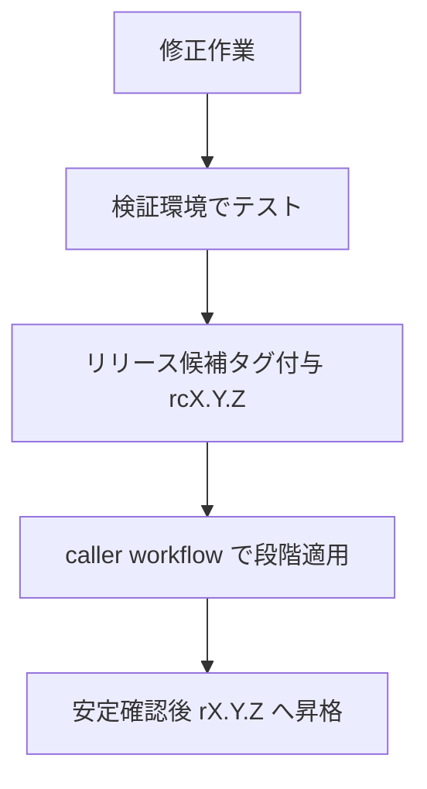

## はじめに

atsushifx です。
ここ数週間は、GitHub の環境整備をしていました。
主にやっていたのが、品質保証の要である CI/CD をセキュアにすること、そして品質を保つことです。
そこで利用したのが、GitHub の Reusable Workflows でした。
この記事では、Reusable Workflows の基礎から CI/CD 用の基盤として統一的に管理する方法を説明します。

## 1. 記事の概要と読み方

GitHub Actions を複数リポジトリで運用する際、統一的な基盤がないと設定が分散し、保守が難しくなります。
この章では、記事全体の構成と読み進め方をまとめ、Reusable Workflows を理解するための導入部分を整理します。
記事を通して扱う概念のつながりを明確にすることで、後続の章で説明する設計原則や運用方法を把握しやすくなります。

### 1.1 この記事の目的

この記事では、Reusable Workflows を基盤として GitHub での統一的な CI/CD 構築の方法を説明します。
GitHub Workflows は基本的にリポジトリごとに workflows を作成するため、GitHub Actions がリポジトリごとに変わり、設定などが統一されません。
これらの問題を、統一的な Reusable Workflows により解消することを、この記事の目的とします。

### 1.2 対象読者

GitHub Actions をすでに利用しているものの、複数リポジトリ間で設定がばらつき、保守や更新の手間が増えている状況に課題を感じている読者を対象としています。
CI/CD の基本は理解しているが、組織的な統一や再現性の確保に踏み込めていない段階を想定しています。
Reusable Workflows を導入することで得られる運用効率と標準化の効果を把握できる内容としています。

### 1.3 GitHub Actions を複数リポジトリで運用する際の課題

複数のリポジトリで個別に workflow を管理すると、設定内容が分散し、更新時の整合性を維持しづらくなります。
lint や gitleaks といった共通処理を各リポジトリで重複して記述すると、バージョンの不一致や権限設定の揺れが発生しやすく、改善や不具合修正の反映にも時間がかかります。
このような構造では、CI/CD の品質が管理できなくなり、長期的な保守の負荷が増大します。

### 1.4 Reusable Workflows が解決すること

複数リポジトリに散在する共通処理を一箇所に集約し、統一された基準で CI/CD を実行できるようになります。
共通の lint、scan、test といった処理を reusable workflow として `.github` リポジトリにまとめることで、各リポジトリは呼び出しのみで同一の検査ができます。
これにより、設定のばらつきがなくなり、バージョンや権限の統一も容易になります。更新は reusable に対して一度行なえばよく、caller 側での変更は最小限で済むため、保守コストの削減と CI/CD の再現性向上を同時に満たせます。

## 2. Reusable Workflows の基礎

この章では、`Reusable Workflows`の基本概念、作成方法、使用方法を説明します。

### 2.1 なぜ必要なのか（課題→解決）

複数リポジトリで CI/CD を運用する際、各リポジトリに同じ内容の workflow を記述すると、次の問題が生じます。

- 変更時の対応漏れ（lint ルール更新などが一部に反映されない）
- 設定の不統一（バージョンや権限設定がバラバラになる）
- 保守コストの増大（修正箇所が分散し、影響範囲が見えづらい）

`Reusable Workflows`は、共通処理を`.github`リポジトリに集約し、各リポジトリから呼び出すだけで使用できる仕組みです。
これにより、CI/CD の標準化と保守性向上を同時に実現できます。

### 2.2 作成方法（workflow_call）

`Reusable Workflow`を作成するには、トリガーとして`workflow_call`を設定します。

```yaml
name: Reusable Lint
on:
  workflow_call:
    inputs:
      config-file:
        type: string
        required: false
        default: ".shared/configs/lint.yml"

permissions:
  contents: read

jobs:
  lint:
    runs-on: ubuntu-latest
    steps:
      - uses: actions/checkout@v4
      - name: Run lint
        run: echo "Lint with ${{ inputs['config-file'] }}"
```

要点:

- `workflow_call`を宣言することで外部から呼び出せる状態になる
- `inputs`で可変部分（設定ファイルパスなど）を受け取る
- `permissions`を明示して最小権限で動作させる

### 2.3 呼び出し方法（uses: …@ref）

caller workflow から`uses:`ディレクティブで呼び出します。

```yaml
name: CI
on:
  pull_request:

jobs:
  lint:
    uses: org/.github/.github/workflows/lint.yml@r1.0.0
    with:
      config-file: "./configs/custom-lint.yml"
```

形式:

```yaml
uses: <owner>/<repository>/.github/workflows/<workflow-file>@<ref>
```

`<ref>`にはタグ、ブランチ、SHA を指定できますが、**タグ固定が推奨**されます（後述）。

### 2.4 Reusable の構成要素（inputs / secrets / outputs）

Reusable Workflow は、次の 4つの要素で外部とやり取りします。

#### 1. workflow_call

外部公開のための必須インターフェース。inputs／secrets／outputs をここで定義します。

```yaml
on:
  workflow_call:
    inputs:
      version:
        type: string
        default: "8.30.0"
    secrets:
      token:
        required: false
    outputs:
      report-path:
        description: "Lint result path"
        value: ${{ jobs.lint.outputs.report }}
```

#### 2. inputs

caller が変更したい値（設定ファイル、バージョン、fetch-depth など）を受け取ります。

```yaml
inputs:
  config-file:
    type: string
    required: false
    default: ".shared/configs/gitleaks.toml"
```

設計原則:

- **必要最小限に絞る**（増やしすぎると保守性が低下）
- default を設定し、caller が省略しても動作する構成にする
- version input を用意し、段階的アップグレードを可能にする

#### 3. secrets

機密情報（PAT、API トークンなど）を安全に受け渡します。

```yaml
secrets:
  github-token:
    required: true
```

注意点:

- 不要な secrets を要求しない（caller の権限設定が過剰になる）
- GITHUB_TOKEN で代替できないか常に検討する

#### 4. outputs

実行結果のメタ情報（レポートパス、判定フラグなど）を caller に返します。

```yaml
outputs:
  report-path:
    description: "Path to lint report"
    value: ./report/lint.log
```

caller 側での利用:

```yaml
steps:
  - name: Print report path
    run: echo "Report: ${{ needs.lint.outputs.report-path }}"
```

設計原則:

- ファイルパスや artifact 名などのメタ情報を返す（実データは artifact で受け渡す）
- outputs のキー変更は breaking change なので慎重に扱う

## 3. 設計原則（標準化の中核）

この章では、Reusable Workflows を複数リポジトリで安定運用するための設計原則をまとめます。

### 3.1 permissions（最小権限）

Reusable Workflow 側で`permissions`を明示することで、caller の設定漏れを防ぎます。

最小権限の例:

```yaml
permissions:
  contents: read
```

限定的な権限の追加:

```yaml
permissions:
  contents: read
  security-events: write
```

原則:

- reusable 側で明示することで caller に依存しない
- 必要最小限の権限のみ付与（多くの場合 `contents: read` で十分）

### 3.2 共通 config + ローカル config の二層構造

設定ファイルを`.github`リポジトリに集約し、reusable workflow が共通 config を参照する構造にします。

共通 config のチェックアウト:

```yaml
- name: Checkout shared configs
  uses: actions/checkout@v4
  with:
    repository: atsushifx/.github
    ref: releases
    path: .shared
    persist-credentials: false
```

実行時の参照:

```yaml
- name: Run lint
  run: |
    lint -c ${{ inputs.config-file }} > report.log
```

inputs の default で共通 config を設定:

```yaml
inputs:
  config-file:
    type: string
    required: false
    default: ".shared/configs/lint.yml"
```

caller でのローカル config 指定:

```yaml
with:
  config-file: "./configs/lint.local.yml"
```

二層構造の利点:

- 全リポジトリで統一された基準を維持
- プロジェクト固有要件はローカル config で対応
- 設定変更が`.github`リポジトリ内で完結

### 3.3 出力パス・artifact 名の統一

Reusable Workflow 側で出力パスと artifact 名を固定します。

出力パスの例:

```bash
./report/lint.log
./report/ghalint.log
./report/scan.json
```

artifact 名の例:

```yaml
- name: Upload lint result
  uses: actions/upload-artifact@v4
  with:
    name: lint-report
    path: ./report/lint.log
```

命名規則:

```text
<tool-name>-report
```

outputs で出力パスを公開:

```yaml
outputs:
  report-path:
    description: "Path to lint report"
    value: ./report/lint.log
```

原則:

1. artifact 名は reusable 側で固定
2. 出力パスも reusable 側で固定
3. outputs で抽象化された値を返す
4. caller は outputs 以外を参照しない

### 3.4 inputs の最小化

inputs を増やしすぎると保守性が低下します。以下の基準で判断します。

判断基準:

- caller が変更したい値か
- default のままでも安全に動作するか
- 追加する inputs がワークフローの単一責務を壊していないか

version input の重要性:

外部ツール（gitleaks、actionlint など）の version を必ず inputs として用意します。

```yaml
inputs:
  version:
    type: string
    required: false
    default: "8.30.0"
```

利点:

- caller が意図したバージョンを明示できる
- reusable 側で固定すると更新時に全リポジトリのバージョンが更新できる
- 段階的アップグレードが可能になる

### 3.5 version input の重要性

## 4. caller workflows の役割と組み合わせ

この章では、caller workflow の責務と、複数の reusable workflows を組み合わせる方法を説明します。

### 4.1 caller の責務（軽量フロントエンド）

caller workflow は、**設定を渡して動作を決めるだけの軽量なフロントエンド**です。

役割:

- どの reusable workflows を組み合わせるかを選択
- リポジトリ固有の設定や入力値を渡す
- 必要な permissions や secrets を最小限で構成
- 後続処理（artifact 取得、通知など）を調整

最小構成例:

```yaml
name: CI
on:
  pull_request:

jobs:
  lint:
    uses: org/.github/.github/workflows/lint.yml@r1.0.0
    with:
      config-file: "./configs/custom-lint.yml"
```

### 4.2 典型的な組み合わせ（lint / ghalint / gitleaks）

複数の reusable workflows を組み合わせて統合 CI を構築します。

並列実行パターン:

```yaml
jobs:
  lint-actionlint:
    uses: org/.github/.github/workflows/actionlint.yml@r1.0.0

  lint-ghalint:
    uses: org/.github/.github/workflows/ghalint.yml@r1.0.0

  scan-gitleaks:
    uses: org/.github/.github/workflows/gitleaks.yml@r1.0.0
```

特徴:

- 3つの job は独立して動作
- artifact 名や出力パスは reusable 側で統一
- caller 側は「どの検査を有効にするか」を job の有無で制御

### 4.3 needs: による依存管理

依存関係のあるパターン:

```yaml
jobs:
  lint-actionlint:
    uses: org/.github/.github/workflows/actionlint.yml@r1.0.0

  lint-ghalint:
    needs: lint-actionlint
    uses: org/.github/.github/workflows/ghalint.yml@r1.0.0

  scan-gitleaks:
    needs: [lint-actionlint, lint-ghalint]
    uses: org/.github/.github/workflows/gitleaks.yml@r1.0.0
```

特徴:

- actionlint が失敗した場合、以降の job をスキップ
- CI の消費リソースを抑えられる
- 依存関係は caller 側の責務（reusable 側は単独完結）

## 5. バージョン管理と更新戦略

この章では、Reusable Workflows のバージョン管理方法と、安全な更新戦略を説明します。

### 5.1 ref の比較（branch / tag / SHA）

| 方法         | 例                    | メリット             | デメリット               | 推奨度 |
| ------------ | --------------------- | -------------------- | ------------------------ | ------ |
| ブランチ固定 | `@main` / `@releases` | 最新化が容易         | 意図せぬ破壊的更新が発生 | △      |
| タグ固定     | `@v1.0.0` / `@r1.0.0` | 再現性が高い         | 更新は手動適用           | ◎      |
| SHA 固定     | `@fd5eff...`          | 最も安全（改変対策） | private 参照で解決失敗   | ○      |

### 5.2 タグ固定が正解になる理由

private リポジトリ特有の事情:

- SHA は private リポジトリで **ref 解決に失敗する既知の挙動**がある
- そのため、private 運用では次の順で選択することが安全:

```text
タグ固定 ＞ SHA 固定 ＞ ブランチ固定
```

タグ固定の利点:

- 再現性が高い
- 影響制御が容易
- private リポジトリでも安定動作

推奨方針:

**タグ固定を基本方針とする**ことが最適解です。

```yaml
uses: org/.github/.github/workflows/lint.yml@r1.0.0
```

### 5.3 SemVer の扱い

Semantic Versioning の基本:

```bash
MAJOR.MINOR.PATCH
```

| 種別  | 内容                   | CI/CD への影響        |
| ----- | ---------------------- | --------------------- |
| MAJOR | 破壊的変更             | caller 側で対策が必要 |
| MINOR | 後方互換ありの機能追加 | 更新推奨              |
| PATCH | バグ修正/内部改善      | 更新推奨              |

GitHub Actions での注意点:

1. バージョン範囲解決をしない（`@v1` → `v1.x.x` への自動変換なし）
2. `v1`タグの上書きが可能（再現性が崩れる）
3. private repo では SHA 解決が安定しない

推奨:

- Semantic Versioning を採用
- caller は常にフル SemVer でタグ固定（`@r1.0.0`）

### 5.4 更新フロー（rc → rX.Y.Z）

更新の段階:



| 段階              | 目的                     | 成果物例    |
| ----------------- | ------------------------ | ----------- |
| 修正              | 不具合対応 / 機能拡張    | PR / commit |
| 検証環境          | 破壊的変更の検出         | テスト成功  |
| リリース候補 (rc) | 限定的に利用し互換性検証 | `rc1.2.0`   |
| 段階適用          | 一部 caller に限定反映   | 差分比較    |
| 安定版へ昇格      | 全体展開可能な状態へ     | `r1.2.0`    |

運用チェックリスト:

- `permissions` の変更は必ず事前通知
- outputs のキー変更は互換性破壊
- config-file default の変更は影響範囲が広い
- 外部 Actions の更新は SHA 固定の更新を含む

## 6. 実践運用：releases ブランチ + rX.Y.Z

この章では、releases ブランチと rX.Y.Z タグを使った実践的な運用方法を説明します。

### 6.1 安定ラインとしての releases

`releases` ブランチは、reusable workflows の「安定した更新ライン」を提供します。

役割:

- 開発中の main ブランチとは分離した安定版の管理
- caller が参照すべき「信頼できる基盤」としての位置づけ
- タグ付与の基準となるブランチ

管理ポリシー:

- main からマージされた検証済みコードのみを含む
- 実験的機能は含まない
- タグ付与前に必ず動作確認を実施

### 6.2 タグ（rX.Y.Z）による固定点

タグは特定バージョンのスナップショットであり、caller 側は常に同じ内容を取得できます。

prefix 'r' をつける理由:

- リリース用タグであることを明示
- v1.0.0 などと区別しやすい
- 組織内でのタグ運用ルールを統一

更新モデル:

```text
r1.0.0 → r1.1.0 (MINOR: 後方互換ありの機能追加)
r1.1.0 → r2.0.0 (MAJOR: 破壊的変更)
```

### 6.3 caller 側での使い方

タグ固定による参照:

```yaml
uses: org/.github/.github/workflows/lint.yml@r1.0.0
```

意味:

- r1.0.0 タグが示す特定バージョンを取得
- 再現性が保証される
- 更新は caller 側で明示的に実施

バージョン固定による安定性の確保:

- 意図しない更新を防止
- breaking change の影響を制御
- 段階的アップグレードが可能

### 6.4 複数安定版の併存（r1 / r2 系統）

大規模運用では、複数のメジャーバージョンを併存させる戦略が有効です。

例:

```text
r1 系列: r1.0.0, r1.1.0, r1.2.0 (安定版)
r2 系列: r2.0.0, r2.1.0 (次期版)
```

利点:

- 段階的移行が可能（全リポジトリを一度に更新しなくてよい）
- breaking change の影響を最小化
- リポジトリごとのアップグレード計画を柔軟に設定

運用方法:

- 一部リポジトリで r2 系列を先行導入
- 安定性を確認後、他のリポジトリも段階的に移行
- r1 系列は一定期間サポートを継続

## 7. よくあるエラーとその解決

この章では、Reusable Workflows を使ううえでよくあるエラーと対処法をまとめます。

### 7.1 "workflow was not found"

原因:

- `.github/workflows/` 下の相対パス誤り
- private リポジトリで SHA が解決できない
- タグ／ブランチが存在しない ref を指定

対策:

- タグ固定 (`@r1.0.0`) を使用
- パスは必ず `.github/workflows/` を含める
- GitHub Portal でタグの存在を確認

正しい例:

```yaml
uses: org/.github/.github/workflows/lint.yml@r1.0.0
```

### 7.2 権限エラー

症状:

- `actions/checkout` が private リポジトリを取得できない
- `403: resource not accessible by integration`

原因:

- `permissions` が明示されていない
- `GITHUB_TOKEN` が読み取り権限のみで不足
- PAT の付与条件を満たしていない

対策:
最低限の権限を reusable 側で明示:

```yaml
permissions:
  contents: read
```

private リポジトリ参照時:

```yaml
secrets:
  token: ${{ secrets.REPO_ACCESS_TOKEN }}
```

credential 残存防止:

```yaml
- uses: actions/checkout@v4
  with:
    persist-credentials: false
```

切り分けチェックリスト:

<!-- textlint-disable ja-technical-writing/no-exclamation-question-mark -->

| チェック項目                            | Yes の場合                  |
| --------------------------------------- | --------------------------- |
| `.github/workflows/` に権限指定があるか | caller 設定に依存しなくなる |
| private 参照か?                         | PAT 必須の可能性が高い      |
| 403 が発生するのは PR 時のみか?         | GITHUB_TOKEN 制限が原因     |

<!-- textlint-enable -->

## 8. 運用ベストプラクティス（横断的なまとめ）

この章では、Reusable Workflows を使った CI/CD 運用のベストプラクティスをまとめます。

### 8.1 security hardening

最小権限の徹底:

```yaml
permissions:
  contents: read
```

外部 Actions の SHA 固定:

```yaml
uses: actions/checkout@<sha256> # v4.3.0
```

credential 管理:

```yaml
- uses: actions/checkout@v4
  with:
    persist-credentials: false
```

secrets の最小化:

- GITHUB_TOKEN で代替できないか常に検討
- 必要な secrets のみを要求

### 8.2 shared config 戦略

共通 config の集約:

- `.github`リポジトリに設定ファイルを集約
- reusable workflow が `.shared/configs/` を参照
- default で共通 config を設定

ローカル config による上書き:

```yaml
with:
  config-file: "./configs/local.yml"
```

二層構造の維持:

```text
共通設定 → .shared/configs/ 下に集約
独自設定 → with: 句で明示的に変更
```

### 8.3 CI 高速化

キャッシュの活用:

```yaml
- uses: actions/cache@v4
  with:
    path: ~/.npm
    key: ${{ runner.os }}-node-${{ hashFiles('**/package-lock.json') }}
```

並列実行:

- 依存関係のない job は並列に実行
- needs: を使って依存を制御

軽量イメージの使用:

```yaml
runs-on: ubuntu-latest
```

### 8.4 組織統一 CI 方針

標準化レイヤーの定義:

```text
+-----------------------------+
|  リポジトリ固有設定         | ← 最小限
+-----------------------------+
|  組織共通 CI/CD 基盤        | ← reusable workflows
+-----------------------------+
|  ツール / GitHub Actions    | ← 外部 actions
+-----------------------------+
```

`.github`リポジトリの活用:

- lint / scan / test など共通処理を集約
- 全リポジトリが同一基準で CI を実行
- config ファイルの散在を防止

タグ戦略の統一:

- caller はタグ固定を使う（例: `@r1.0.0`）
- releases ブランチは安定版のみに限定
- メジャーアップデートのみ破壊的変更を許容

caller workflows の最小化:

- caller にロジックを書かない
- reusable workflow の組み合わせだけで構成
- 設定は必要な分だけ with: に記述

CI/CD ポリシーの制定:

- reusable workflow 変更時は PR とレビューを必須化
- breaking change はメジャーバージョンでのみ許可
- rc タグによる事前テストを義務化

## 9. まとめ

### なぜこの構成が最適なのか

この記事で紹介した構成は、次の原則に基づいています。

**標準化と柔軟性の両立**:

- 共通基盤（.github リポジトリ）で統一された CI/CD を提供
- プロジェクト固有要件はローカル config で対応
- inputs による最小限のカスタマイズポイント

**最小権限と明示的設計**:

- permissions を reusable 側で明示
- secrets を最小化し、必要なものだけを要求
- 外部 Actions は SHA 固定で改変を防止

**再現性の確保**:

- タグ固定により、意図しない更新を防止
- private リポジトリでも安定動作する ref 戦略
- outputs による抽象化で内部変更の影響を最小化

**段階的更新**:

- rc タグによる事前検証
- releases ブランチでの安定版管理
- 複数バージョン併存による柔軟な移行

これらの原則を踏まえることで、組織全体の CI/CD を破綻させることなく、長期的に運用を継続できます。

## おわりに

Reusable Workflows を活用することで、複数リポジトリでの CI/CD を標準化し、保守性と安全性を高めることができます。

## 参考資料

### Web サイト

- ワークフローを再利用する: <https://docs.github.com/ja/actions/how-tos/reuse-automations/reuse-workflows>
  Reusable Workflows に関する GitHub の公式ドキュメント

- GitHub Actions のセキュリティ: <https://docs.github.com/ja/actions/concepts/security>
  GitHub Actions に関するセキュリティガイド

- セキュリティで保護された使用に関するリファレンス: <https://docs.github.com/ja/actions/reference/security/secure-use>
  GitHub 公式ドキュメント: GitHub Actions をセキュアに作成、運用するためのプラクティス

- ghalint: <https://github.com/suzuki-shunsuke/ghalint>
  GitHub Actions がセキュアかどうかをチェックする Linter、ghalint の公式リポジトリ

- atsushifx/.github: <https://github.com/atsushifx/.github>
  Reusable workflows, caller workflow の実例がのっているリポジトリ
