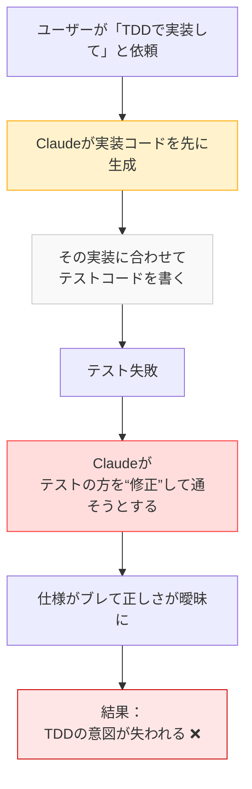
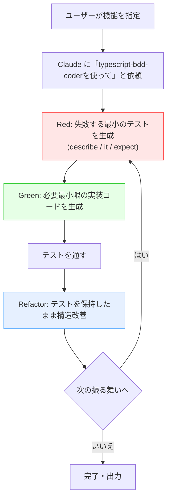

## tl;dr

以下の手順で、Claude Code に BDD でコーディングさせられます。

1. `claude.md`に、`atsushifx式BDD`を設定する
2. カスタムエージェント `typescript-bdd-coder`を作成する
3. 2.のカスタムエージェントを使ってコーディングさせる

Enjoy!

<!-- markdownlint-disable no-emphasis-as-heading -->

## はじめに

atsushifx です。

最近は Claude Code を使って、日々コードを書いています。
コーディングにあたって課題が 1つありました。
Claude に TDD/BDD を使わせるのは、意外と難しいのです。

Claude に TDD でコーディングを任せると、実装コードを書いてからテストを書いたり、機能全体をまとめてテストしたりと、TDD の原則から外れた進め方になりがちです。

そこで、Claude には`t-wada式TDD` をベースに、Claude 向けに最適化した `atsushifx式BDD`を導入しました。

この記事では、その構成や具体的な設定方法、エージェント連携までまとめています。

## 用語集

- `Claude Code`:
  Anthropic 社が提供する AI コーディングツール。プロンプトで指定された機能をコーディングする。

- `claude.md`:
  Claude Code で使用されるメモリーファイル。ユーザーまたはプロジェクト単位でのルール・思想・スタイルを記述可能。

- `atsushifx式BDD`:
  Claude Code 向けに最適化された BDD 実装方式。`t-wada式TDD`を Claude 向けに厳格化。

- `t-wada式TDD`:
  日本のテスト駆動開発の第 1人者 t-wada 氏による、Kent Beck の TDD 定義を再構築した手法。

- `describe / it / expect`:
  BDD フレームワーク (例: Jest) におけるテスト記述構文。振る舞いの構造化を行なう基本単位。

- `Red → Green → Refactoring`:
  TDD プロセスの 3段階。失敗するテストを書く → 最小限のコードで成功させる → コードを改善する。

- `User Memory`:
  Claude Code の設定記憶領域の 1つ。ユーザー全体に適用するコーディングルールを保持する。

- `Project Memory`:
  特定のプロジェクト単位で設定する Claude の記憶領域。リポジトリと一緒に共有・管理可能。

- `typescript-bdd-coder`:
  `atsushifx式BDD` の開発スタイルに準拠した、TypeScript 向け Claude 用カスタムエージェント。

- `OSS`:
  オープンソースソフトウェア (Open Source Software) の略称。ソースコードが公開され、自由に改造、使用できるたソフトウェア。

- `esta`:
  atsushifx 氏による TypeScript 製 OSS プロジェクト。実際にエージェント運用の検証が行なわれている。

- `ペアプロ (ペアプログラミング)`:
  2人で 1つの開発作業を行なう手法。Claude との連携においても“仮想的なペアプロ”として捉えられる。

## 1. atsushifx式BDDとは

`atsushifx式BDD`は、`t-wada式TDD`を`Claude Code`がプログラミングで実現するための方法論です。

### 1.1 `atsushifx式`と`t-wada式`の違い

`t-wada式TDD`は、[【翻訳】テスト駆動開発の定義](https://t-wada.hatenablog.jp/entry/canon-tdd-by-kent-beck) にあるとおり、タスクリストに分解後、1タスクごとに`Red-Green-Refacoring`サイクルを維持しながらコードを実装します。
人間相手ならこれで十分ですが、Claude Code の場合はどこまで細かくタスクを分割するかを指示する必要があります。
タスクを細かく分割しても、1回のテストが複数のタスクにまたがるような大きなテストコードを書いてしまうなど、ユーザーにとって不都合なコーディングになることがあります。



*図1-2: Claude が誤る典型パターン (失敗→成功→テスト書き換え)*

`atsushifx式`は、Claude のようなコーディング AI にあわせ、タスクの分割サイズや方法、テストの実行方法を厳格に定義しました。
テストするタスクを BDD フレームワークにあわせ、`it`単位にまで分解、かつ作成するテストは 1回に`expect`1つだけと制限しています。
また、実装にあわせてテストを改変することも禁止しています。

この開発プロセスによって、BDD による質の高いコーディングを実現しています。

### 1.2 BDDサイクル

BDD を図にすると、次のようになります:

```bash
Red (失敗する最小のテストを書く)
    ↓
Green (必要最小限の実装でテストを通す)
    ↓
Refactor (テストがGreenになるように、コードを改善)
    ↺ (次の振る舞いに進む)
```

*図1-1: Red-Green-Refactoringサイクル*

### 1.3 atsushifx式BDDの実装方法

`atsushifx式`では、以下のようなガイドラインを`claude.md`に定義して Claude に従わせています。

- **仕様の単位は`it`で切る**
  振る舞いを 1つの単位として、テストを定義

- **1つの`it`に含める`expect`は1つだけ**
  Claude が「このテストは何を意図しているか」を明確に判断できる構造にする

- **テストから実装を導く**
  Claude に「テストが先、コードはあと」と認識させる。実装の妥当性はテストによってのみ評価される

- **実装内容によるテスト改変は禁止**
  Claude がテストの意図を“調整”することを防ぐため、「仕様の主語は常にテストである」と宣言する

- **失敗→成功→リファクタの明示**
  Claude には、各ステップでのゴールとその意味を明文化して記述する
  (例: Red のときは最小コード、Green で通す、Refactor でコードを改善)

このプロセスによって、Claude Code は「開発の哲学」に沿った行動を取りやすくなり、人間と同じ TDD プロセスを高い再現性で実施できるようになります。

## 2. Claude Codeに設定する (claude.md)

Claude Code は、メモリーファイル `claude.md` の内容に従ってコーディングします。
`atsushifx式BDD`のためのプロンプトを`claude.md`に記述することで、`atsushifx式`を設定できます。

### 2.1 `claude.md`の構成と設定方法

`claude.md` は「コーディング標準」や「プロジェクトアーキテクチャ」など、Claude Code における基本的なルールや判断基準を記述する設定ファイルです。
`claude.md` には、チームで共有できる「プロジェクトメモリー」と、すべてのプロジェクトに適用される「ユーザーメモリー」があります。

これらの、`claude.md`に「コーディング規約」などを記述することで、質のよいコードを保証できます。

#### 1. `claude.md`ファイル構成図

プロジェクトメモリーのファイル構成は、次のようになります:

```text
<project-root>/
├── .claude/
│   ├── claude.md          ← Claudeのルール（プロジェクト専用）
│   └── agents/
│       └── typescript-bdd-coder.md
├── src/
│   └── ...
└── test/
    └── ...
```

*図2-1: プロジェクトメモリーファイル構成*

ユーザーメモリーのファイル構成は、次のようになります:

```text
~/.claude/
  ├── claude.md              ← Claudeのルール（ユーザー全体に適用）
  └── agents/
      └── typescript-bdd-coder.md
```

*図2-2: ユーザーメモリーファイル構成*

#### 2. 基本構成の例 (`atsushifx式BDD` 向け)

`claude.md`の設定は、マークダウン文書を使用します。
`atsushifx式BDD`を記述する場合は、次のような文書を作成します。

```md
## `atsushifx式BDD`開発プロセス

### 開発哲学

- テストが仕様である
- コードは振る舞いに従って生まれるべき

### BDD制約ルール

- describe / it / expect の構造を厳守
- 1 it につき 1 expect まで
- テストファーストを徹底（実装に合わせたテスト改変は禁止）

### 実装プロセス

- 必ず Red → Green → Refactor を順守
- Red：最小限のコードで失敗させる
- Green：必要最低限のコードでテストを通す
- Refactor：テストが通る状態で構造を改善する

### 参考例

- 正しいテスト／実装例
- よくある失敗パターンとその理由
```

### 2.2 `atsushifx式BDD`プロンプト

実際に使用している `atsushifx式BDD` プロンプトを以下に示します。
このプロンプトは MIT ライセンスで提供しており、自由に利用できます。

@[gist](https://gist.github.com/atsushifx/ea7180b61aeddfa9aad9c41e179b3038?file=claude.md)

### 2.3 ユーザー単位での適用

Claude Code は、設定内容をメモリーファイル (`claude.md`) に保存できます。
ユーザーメモリーに `atsushifx式BDD` を設定しておくことで、以降のすべてのプロジェクトに自動的に適用されます。

#### 1. 適用手順 (ユーザーメモリーへの登録)

次の手順で、プロンプトを設定します。

1. Claude 上で、`/memory`コマンドを実行
2. `User Memory`を選択
3. エディタが開くので、[2.2](#22-atsushifx式bddプロンプト)のプロンプトをコピーアンドペースト。
4. ファイルを保存する。

以後、Claude Code は`atsushifx式BDD`スタイルで記述すると、BDD 型式でコーディングします。

直接編集もできます。

1. エディタでユーザーメモリーファイル (`~/.claude/claude.md`) を開く。
2. [2.2](#22-atsushifx式bddプロンプト)のプロンプトをコピーアンドペースト。
3. ファイルを保存する

この場合も、`atsushifx式BDD`を指定することで、BDD でコーディングします。

ユーザー単位で指定することで、すべてのプロジェクトで`atsushifx式BDD`スタイルを使用できます。

#### 2. メリット

- Claude の出力が毎回ブレず、仕様主導でコーディングできる
- テストの粒度・順序・責務が統一され、レビュー負荷が軽減される
- 設定を個人の開発スタイルに合わせて微調整できる

### 2.4 プロジェクト単位での適用

`claude.md` は、プロジェクト単位の設定ファイルとしても利用できます。
この「プロジェクトメモリー」は Git 経由でチーム全体と共有可能です。

プロジェクトメモリーを設定することで、チームやリポジトリ全体で統一された開発スタイルを Claude Code に設定できます。

<!-- markdownlint-disable no-duplicate-heading -->

#### 1. 適用手順 (プロジェクトメモリーの設定)

次の手順で、プロンプトを設定します。

1. Claude 上で、`/memory`コマンドを実行
2. `Project Memory`を選択
3. エディタが開くので、[2.2](#22-atsushifx式bddプロンプト)のプロンプトをコピーアンドペースト。
4. ファイルを保存する。

直接編集もできます。

1. エディタでプロジェクトメモリーファイル (`<ProjectRoot>/.claude/claude.md`) を開く
2. [2.2](#22-atsushifx式bddプロンプト)のプロンプトをコピーアンドペースト。
3. ファイルを保存し、終了する

以後、`atsushifx式BDD`と指定すると、BDD でコーディングします。

<!-- markdownlint-enable no-duplicate-heading -->

### 2.5 claude.md 各セクションの意図

Claude Code におけるメモリー (`claude.md`) は、“判断基準”・“思想”・“学習データ”です。
各セクションには明確な役割があり、Claude のコーディングスタイルや実装判断に強く影響します。

#### 1. BDD厳格プロセスの意味

Claude が“まずテストを書く”という開発スタイルを再現するためには、`Red → Green → Refactor` のプロセスを明文化する必要があります。
この順序を Claude に理解させないと、いきなり完成形の実装を出してきたり、意図を無視してすべてのテストを一括生成するなど、TDD の原則を破る挙動が発生します。

そのため、claude.md では、段階的開発を構成要素として次のように明示します。

- **Red**：失敗する最小限のテストを書く
- **Green**：最小限の実装でテストを通す
- **Refactor**：仕様に影響を与えず、構造を改善する

Claude にとって、これは抽象的な理念ではなく「手順としての明示的な指示」として認識されます。

| BDD構文    | テストの意図               | Claudeの認識 (実装への影響)                |
| ---------- | -------------------------- | ------------------------------------------ |
| `describe` | 機能やモジュールのまとまり | 実装対象の“スコープ”として理解される       |
| `it`       | 振る舞いの1つのシナリオ    | 実装すべきユースケース (≒仕様1項目)        |
| `expect`   | 成立すべき具体的な条件     | 検証条件 (ゴール) ＝“成功の定義”として扱う |

*表2-1: Claude にとっての「テスト = 仕様」の対応表*

#### 2. describe + it + expect の制限

`t-wada式TDD`では、最初に ToDo リストを作成し、それぞれのタスクに対してコードを実装するというサイクルが基本になります。
Jest などの BDD フレームワークは、Describe/It/expect の階層構造は、ToDo リストをつくるために効果的です。

また、テストを作成するときに expect を 1つという制限をつけることは、1つの ToDo で Red-Green-Refactoring サイクルを維持するという規約を守ることにつながります。

#### 3. 実装例と違反例の重要性

<!-- textlint-disable ja-hiraku -->

Claude は明文化された“ルール”よりも、“例”を通じて学習・模倣する傾向があります。
このため、claude.md においても「良い実装」「悪い実装」の両方の例をあげることが推奨されます。

例:

```ts
// ✅ 良い例
it('空文字列は true を返す', () => {
  expect(isEmpty('')).toBe(true);
});

// ❌ 悪い例（複数の期待を1テストに書いている）
it('文字列の空チェック', () => {
  expect(isEmpty('')).toBe(true);
  expect(isEmpty('abc')).toBe(false);
});
```

Claude にとっては、このように両方のコードを比較することで判断の基準ができることになります。

| 観点               | ✅ 良い実装                      | ❌ 悪い実装                           |
| ------------------ | -------------------------------- | ------------------------------------- |
| テスト構造         | `it`ごとに1つの目的が明確        | 複数の期待を1つの`it`に混在させている |
| `expect`数         | 1つの`it`に`expect`は1つだけ     | `expect`が2つ以上あり責務が不明確     |
| 読みやすさ         | テストの意図がすぐわかる         | 条件が混在して目的が読み取りにくい    |
| Claudeへの指示伝達 | 明確で誤解が少ない               | 解釈がわかれ、出力がブレやすい        |
| 保守性             | テスト失敗時に原因が特定しやすい | どの`expect`が失敗したかわかりづらい  |

> 🧠 Claude Code は例から学習するため、**「良い例・悪い例をセットで記述」するのが効果的**です。

*表2-1: 良い実装 / 悪い実装の比較*

<!-- textlint-enable -->

## 3. Claude Code × エージェント連携

Claude Code で開発プロセスそのものを効率的に運用するためには、特化したサブエージェントの導入が非常に有効です。

Claude には、プロンプトの初期化・動作ルール・記憶内容を保持した「カスタムエージェント」を作成する機能があります。
この仕組みを活用し、`atsushifx式BDD`に最適化されたエージェントを構築することで、一貫性のある BDD スタイルの開発が実現できます。

### 3.1 専用エージェント: `typescript-bdd-coder`

`atsushifx式BDD`は、TypeScript を採用している OSS プロジェクト [esta](https://github.com/atsushifx/esta) で実際に運用されています。
これにあわせて、専用エージェント `typescript-bdd-coder` も TypeScript 用に設計されています。

#### 1. エージェントの入出力フロー



*図3-1: `typescript-bdd-coder`の入力〜出力フロー*

#### 1. 概要

`typescript-bdd-coder` は、TypeScript での BDD 開発のために、次のような特徴をもった Claude サブエージェントです。

- `describe/it/expect` 形式のテストから実装を導く
- 1つの `it` に 1つの `expect` というルールを必ず守る
- Red → Green → Refactor のプロセスを厳格に順守する
- 実装よりも先に、テストの振る舞いと意味を出力する
- 不明確な仕様があれば、実装せず質問を返す

`atsushifx式BDD`の開発プロセスを明文化し、厳格に適用させることで質の高いコーディングを実現します。

#### 2. エージェントの作成

以下の手順で、`typescript-bdd-coder`エージェントを作成します。
今回はプロジェクト用のエージェント作成手順を紹介しますが、ユーザー単位でのエージェント設定も可能です。

1. プロジェクト用エージェントフォルダ (`<ProjectRoot>/.claude/agents/`)に、エージェントファイル (`typescript-bdd-coder.md`)を作成する
2. 作成したマークダウンに、下記のプロンプトをコピーアンドペーストする
3. ファイルを保存して、終了する

作成に成功すると、`/agents`コマンドに`typescript-bdd-coder`エージェントが表示されます。

#### 3. 使用方法

Claude にコーディングを依頼する際、「typescript-bdd-coder を使用して」と明記すれば、該当エージェントが適用されます。

### 3.2 `typescript-bdd-coder`プロンプト

以下に、`typescript-bdd-coder` エージェントで使用しているプロンプトを示します。
MIT ライセンスのもと公開しているため、自由にコピー・再利用できます。

@[gist](https://gist.github.com/atsushifx/ea7180b61aeddfa9aad9c41e179b3038?file=typescript-bdd-coder.md)

このエージェントを使えば、Claude に「今やるべきテスト」「次に書くべきコード」「どの粒度で進めるか」を毎回指示しなくても済むようになります。
結果として、Claude Code を“もう 1人の開発者”として、より自然に扱えるようになります。

## おわりに

`atsushifx式BDD` は、Claude Code を「信頼できるペアプロ相手」に変える方法です。
BDD を通してテストを先に書き、それに従って実装することで、テストが“仕様そのもの”になります。

BDD だけでは、質の高いソフトウェアは実現できませんが、Claude にコーディング作業を任せるための有効な手段になります。
人間側はソフトウェアーキテクチャや、クラスや関数の責務などといった、もっと上流の判断に力を入れることができます。
これにより、より品質の高いソフトウェアの作成を目指せるでしょう。

これからは、Claude と一緒に、気軽にソフトウェア開発を楽しみましょう。

それでは、Happy Hacking!

## 参考資料

### Webサイト

- Claude Code の概要 <https://docs.anthropic.com/en/docs/claude-code/overview>:
  Anthoropic 社による、Claude Code の概要
- Claude のメモリー管理 <https://docs.anthropic.com/ja/docs/claude-code/memory>:
  メモリーファイルを通じて、コーディング標準やスタイルガイドを管理・適用する方法
- サブエージェント <https://docs.anthropic.com/en/docs/claude-code/sub-agents>:
  Claude に自分専用のカスタムエージェントを作成する方法
- 【翻訳】テスト駆動開発の定義 <https://t-wada.hatenablog.jp/entry/canon-tdd-by-kent-beck>:
  Kent Beck による TDD 定義の翻訳記事。原則や哲学が簡潔にまとめられている
