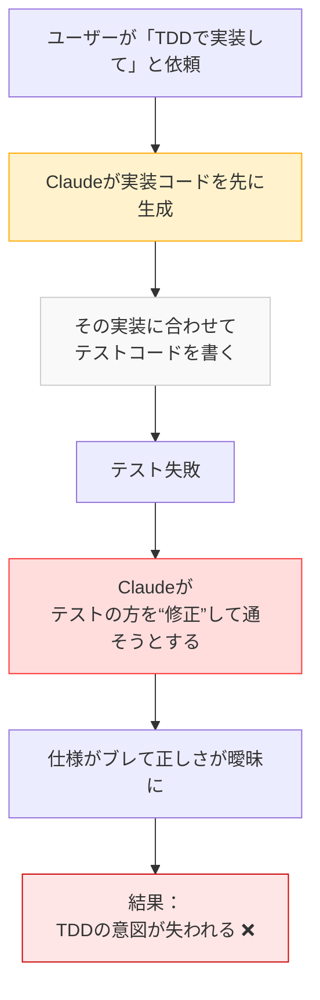
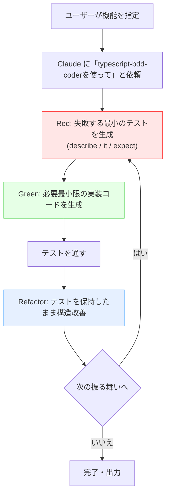

## tl;dr

以下の手順で、Claude Code が BDD 手順に従ってコーディングをします。

1. `claude.md`に、`atsushifx式BDD`を設定する
2. カスタムエージェント `typescript-bdd-coder`を作成する
3. 2.のカスタムエージェントを使ってコーディングさせる

Enjoy!

<!-- markdownlint-disable no-emphasis-as-heading -->

## はじめに

atsushifx です。

最近は Claude Code を使って、日々コードを書いています。
コーディングにあたっての課題は、Claude に TDD/BDD を実践させることが難しい点でした。

Claude に TDD を任せた場合、思わぬ落とし穴にはまることがあります。
たとえば、実装コードから書きはじめる、複数のタスクのテストを一度に書くといった動作です。
こうした挙動は、TDD の基本原則である「テストファースト」「小さく書いて、順に進める」を崩壊させてしまいます。

そこで、Claude には`t-wada式TDD` をベースに、Claude 向けに最適化した `atsushifx式BDD`を導入しました。

この記事では、その構成や具体的な設定方法、エージェント連携までまとめています。

## 用語集

- `Claude Code`:
  Anthropic 社が提供する AI コーディングツール。プロンプトで指定された機能をコーディングする。

- `claude.md`:
  Claude Code で使用されるメモリーファイル。ユーザーまたはプロジェクト単位でのルール・思想・スタイルを記述可能。

- `atsushifx式BDD`:
  Claude Code 向けに最適化された BDD 実装方式。`t-wada式TDD`を Claude 向けに厳格化。

- `t-wada式TDD`:
  日本のテスト駆動開発の第 1人者 t-wada 氏による、Kent Beck の TDD 定義を再構築した手法。

- `describe / it / expect`:
  BDD フレームワーク (例: Jest) におけるテスト記述構文。振る舞いの構造化を行なう基本単位。

- `Red → Green → Refactoring`:
  TDD プロセスの 3段階。失敗するテストを書く → 最小限のコードで成功させる → コードを改善する。

- `User Memory`:
  Claude Code の設定記憶領域の 1つ。ユーザー全体に適用するコーディングルールを保持する。

- `Project Memory`:
  特定のプロジェクト単位で設定する Claude の記憶領域。リポジトリと一緒に共有・管理可能。

- `typescript-bdd-coder`:
  `atsushifx式BDD` の開発スタイルに準拠した、TypeScript 向け Claude 用カスタムエージェント。

- `OSS`:
  オープンソースソフトウェア (Open Source Software) の略称。ソースコードが公開され、自由に改造、使用できるソフトウェア。

- `esta`:
  atsushifx 氏による TypeScript 製 OSS プロジェクト。実際にエージェント運用の検証が行なわれている。

- `ペアプロ (ペアプログラミング)`:
  2人で 1つの開発作業を行なう手法。Claude との連携においても“仮想的なペアプロ”として捉えられる。

## 1. atsushifx式BDDとは

`atsushifx式BDD`は、`t-wada式TDD`を`Claude Code`がプログラミングで実現するための方法論です。

### 1.1 `atsushifx式`と`t-wada式`の違い

`t-wada式TDD`は、[【翻訳】テスト駆動開発の定義](https://t-wada.hatenablog.jp/entry/canon-tdd-by-kent-beck) のプロセスをもとに構築されています。
開発では、タスクリストを作成し、1タスクごとに Red-Green-Refactoring のサイクルで実装を進めます。

人間による開発では問題ありませんが、Claude Code で再現するにはどこまで細かくタスクを分割するかを明示する必要があります。
また、タスクを細かく分割しても、1回のテストが複数のタスクにまたがることがあります。
結果としてテストコードが大きく複雑になり、ユーザーにとって不都合なコーディングとなります。



*図1-1: ClaudeがTDDを誤解し、テストを後付け・改変する誤動作の流れ*

`atsushifx式`は、Claude のようなコーディング AI にあわせ、タスクの分割サイズや方法、テストの実行方法を厳格に定義しました。
テストするタスクを BDD フレームワークにあわせ、`it`単位にまで分解、かつ作成するテストは 1回に`expect`1つだけと制限しています。
また、実装にあわせてテストを改変することも禁止しています。

このプロセスにより、Claude による BDD スタイルの質の高いコーディングが可能になります。

### 1.2 BDDサイクル

BDD を図にすると、次のようになります:

```bash
Red (失敗する最小のテストを書く)
    ↓
Green (必要最小限の実装でテストを通す)
    ↓
Refactor (テストがGreenになるように、コードを改善)
    ↺ (次の振る舞いに進む)
```

*図1-2: TDDにおけるRed→Green→Refactorの基本サイクル*

### 1.3 atsushifx式BDDの実装方法

`atsushifx式`では、以下のようなガイドラインを`claude.md`に定義して Claude に従わせています。

- **仕様の単位は`it`で切る**
  Claude にとって振る舞いを仕様の最小単位として伝えるため、テストは `it` 単位で定義する。

- **1つの`it`に含める`expect`は1つだけ**
  Claude が「このテストが何を検証しているのか」を明確に理解できるよう、`expect` は 1つに限定する。

- **テストから実装を導く**
  実装の主語をテストに据え、Claude に「仕様はテストである」という構図を明示する。
  <!-- textlint-disable prh -->

- **実装内容に基づくテストの改変は禁止する**
  Claude による後付けのテスト調整を防ぐため、仕様はテスト側に固定する。
  <!-- textlint-enable -->

- **失敗→成功→リファクタの明示**
  Claude に "Red → Green → Refactor" の 3段階を正確に認識させるため、それぞれの意味を明確に説明する。

このプロセスによって、Claude Code は「開発の哲学」に沿った行動を取りやすくなり、人間と同じ TDD プロセスを高い再現性で実施できるようになります。

## 2. Claude Code に BDD を設定する方法 (`claude.md`)

Claude Code は、`claude.md` に記述されたルールに従ってコードを生成します。
`atsushifx式BDD`のためのプロンプトを`claude.md`に記述することで、`atsushifx式`を設定できます。

### 2.1 `claude.md`の構成と設定方法

`claude.md` は「コーディング標準」や「プロジェクトアーキテクチャ」などの基本的なルールを書く設定ファイルです。
Claude の開発スタイルを設定し、プロジェクトに合ったコードを生成させるために使用します。

`claude`.md には、チームで共有できる「プロジェクトメモリー」と、すべてのプロジェクトに適用される「ユーザーメモリー」の 2種類の領域があります。

これらの `claude.md`に「コーディング規約」などを記述することで、質のよいコードを保証できます。

#### 1. `claude.md`ファイル構成図

プロジェクトメモリーのファイル構成は、次のようになります:

```text
<project-root>/
├── .claude/
│   ├── claude.md          ← Claudeのルール（プロジェクト専用）
│   └── agents/
│       └── typescript-bdd-coder.md
├── src/
│   └── ...
└── test/
    └── ...
```

*図 2-1: プロジェクトにおける プロジェクトメモリー ('claude.md`)の構成*

ユーザーメモリーのファイル構成は、次のようになります:

```text
~/.claude/
  ├── claude.md              ← Claudeのルール（ユーザー全体に適用）
  └── agents/
      └── typescript-bdd-coder.md
```

*図 2-2 全プロジェクトに適用されるユーザーメモリー (`claude.md`)の配置*

#### 2. 基本構成の例 (`atsushifx式BDD` 向け)

`claude.md`の設定は、マークダウン文書を使用します。
`atsushifx式BDD`を記述する場合は、次のような文書を作成します。

```md
## `atsushifx式BDD`開発プロセス

### 開発哲学

- テストが仕様である
- コードは振る舞いに従って生まれるべき

### BDD制約ルール

- describe / it / expect の構造を厳守
- 1 it につき 1 expect まで
- テストファーストを徹底（実装に合わせたテスト改変は禁止）

### 実装プロセス

- 必ず Red → Green → Refactor を順守
- Red：最小限のコードで失敗させる
- Green：必要最低限のコードでテストを通す
- Refactor：テストが通る状態で構造を改善する

### 参考例

- 正しいテスト／実装例
- よくある失敗パターンとその理由
```

### 2.2 `atsushifx式BDD`プロンプト

実際に使用している `atsushifx式BDD` プロンプトを以下に示します。
このプロンプトは MIT ライセンスで提供しており、自由に利用できます。

@[gist](https://gist.github.com/atsushifx/ea7180b61aeddfa9aad9c41e179b3038?file=claude.md)

### 2.3 適用方法 (Claude Code)

Claude Code における `claude.md` の設定は、共通の適用手順と、適用範囲による 2つのメモリー設定で構成されます。

#### 1 設定手順 (共通)

以下は、`claude.md` に `atsushifx式BDD` を適用する手順です。
ユーザーメモリー・プロジェクトメモリーのどちらでも使えます。

- **手順 1** (Claude カラの登録)
  1. Claude 上で `/memory` コマンドを実行
  2. 設定するメモリー (`User Memory` または `Project Memory`)を選択
  3. エディタが開いたら、[2.2](#22-atsushifx式bddプロンプト) のプロンプトを貼り付ける
  4. ファイルを保存して終了する

- **手順 2** (ファイルの直接編集)
  1. ユーザーメモリー: `~/.claude/claude.md` または、プロジェクトメモリ: `<ProjectRoot>/.claude/claude.md` を開く
  2. [2.2](#22-atsushifx式bddプロンプト) のプロンプトを貼り付ける
  3. ファイルを保存して終了する

  ```text
  ~/.claude/           ← ユーザー設定（個人）
    └── claude.md

  <ProjectRoot>/.claude/   ← プロジェクト設定（チーム共有）
    └── claude.md
  ```

  *図2-3: Claudeが参照するユーザー／プロジェクトごとの設定ファイル*

#### 2. 適用範囲の比較

適用範囲によって効果や共有性が異なります。目的に応じて使い分けてください。

| 設定場所             | 適用範囲               | 共有性           |
| -------------------- | ---------------------- | ---------------- |
| ユーザーメモリー     | 全プロジェクトに適用   | 個人設定のみ     |
| プロジェクトメモリー | 特定リポジトリ内で有効 | チームと共有可能 |

*表2-1:Claudeメモリーファイルの適用範囲*

- ユーザーメモリー (個人設定)
  - 設定すれば、すべての Claude Code セッションに `atsushifx式BDD` が自動適用される
  - 自分の開発スタイルを Claude に設定できる
  - ローカル上の `~/.claude/claude.md` に設定

- プロジェクトメモリー（チーム共有）
  - チーム開発や OSS リポジトリなどで、プロジェクト全体に統一ルールを適用できる
  - Claude Code 上でも、GitHub 上でもメンバーとルールを共有可能
  - プロジェクトルートの `.claude/claude.md` に設定

### 2.4 `atsushifx式BDD`の設計意図

Claude における claude.md は、単なるスタイルガイドではありません。
各セクションが「行動基準」や「学習材料」として機能し、Claude の出力に直接的な影響を与えるためです。

#### **1. BDD厳格プロセスの意義**

Claude に TDD/BDD を忠実に実践させるには、「Red → Green → Refactor」の流れを明確に定義しておく必要があります。
定義が不明確な場合、Claude は完成形のコードを提示したり、テストと実装を同時に生成したりする可能性があります。

以下のように各フェーズでの目的を明記し、段階的な構築手順として Claude に学ばせます。

- **Red**：失敗する最小限のテストを書く
- **Green**：最小限の実装でテストを通す
- **Refactor**：仕様に影響を与えず、構造を改善する

#### **2. describe / it / expect の役割を明確にする**

BDD の基本構文である `describe` / `it` / `expect は`、それぞれ異なる粒度の仕様を表現するものです。
Claude にとっても、これらは単なるテスト記述ではなく、**「実装すべき範囲」や「仕様のスコープ」**を示す信号になります。

また、テストを作成するときに `expect` を 1つという制限をつけることで、1つの ToDo で Red-Green-Refactoring サイクルを維持するという規約を守らせます。

| BDD構文    | テストが表す意図           | Claude の判断基準                                       |
| ---------- | -------------------------- | ------------------------------------------------------- |
| `describe` | 機能やモジュールのまとまり | 実装範囲の**機能スコープ**として認識される              |
| `it`       | 振る舞いのシナリオ         | 実装すべき**仕様単位** (1ユースケース) として解釈される |
| `expect`   | 成立すべき具体的な条件     | 成功の条件 (=**合格基準**・**ゴール**) として扱われる   |

*表2-2: Claude にとってのテスト構文の役割と解釈*

#### **3. よい例と悪い例の提示: Claude の学習に効く**

<!-- textlint-disable ja-hiraku -->

Claude はルールや記号だけでなく、**具体例の比較を通じて学習**する傾向があります。
そのため、claude.md では「正しい実装例」と「避けるべきパターン」をセットで示しておくと効果的です。

```ts
// ✅ 良い例 (テストの目的が明確で責務が1つ)
it('空文字列は true を返す', () => {
  expect(isEmpty('')).toBe(true);
});

// ❌ 悪い例 (複数のexpectにより意図が曖昧)
it('文字列の空チェック', () => {
  expect(isEmpty('')).toBe(true);
  expect(isEmpty('abc')).toBe(false);
});
```

このように構造や意図の違いを明確に見せることで、Claude が「テストの粒度」や「責務の明示」を正確に判断できるようになります。

| 観点               | ✅ 良い実装                      | ❌ 悪い実装                           |
| ------------------ | -------------------------------- | ------------------------------------- |
| テスト構造         | `it`ごとに1つの目的が明確        | 複数の期待を1つの`it`に混在させている |
| `expect`数         | 1つの`it`に`expect`は1つだけ     | `expect`が2つ以上あり責務が不明確     |
| 読みやすさ         | テストの意図がすぐわかる         | 条件が混在して目的が読み取りにくい    |
| Claudeへの指示伝達 | 明確で誤解が少ない               | 解釈がわかれ、出力がブレやすい        |
| 保守性             | テスト失敗時に原因が特定しやすい | どの`expect`が失敗したかわかりづらい  |

*表2-1: 良い実装 / 悪い実装の比較*

<!-- textlint-enable -->

## 3. Claude Code × エージェント連携

Claude Code の開発プロセスを効率化するには、特化型サブエージェントの導入が効果的です。

Claude には、プロンプトの初期化・動作ルール・記憶内容を保持した「カスタムエージェント」を作成する機能があります。
この仕組みを活用し、`atsushifx式BDD`に最適化されたエージェントを構築することで、一貫性のある BDD スタイルの開発が実現できます。

### 3.1 専用エージェント: `typescript-bdd-coder`

`atsushifx式BDD`は、TypeScript を採用している OSS プロジェクト [esta](https://github.com/atsushifx/esta) で実際に運用されています。
これにあわせて、専用エージェント `typescript-bdd-coder` も TypeScript 用に設計されています。

#### 1. エージェントの入出力フロー



*図3-1: Red→Green→Refactorを制御するClaudeエージェントの処理フロー*

#### 1. 概要

`typescript-bdd-coder` は、TypeScript での BDD 開発のために、次のような特徴をもった Claude サブエージェントです。

- `describe`/`it`/`expect` 形式のテストから実装を導く
- 1つの `it` に 1つの `expect` というルールを必ず守る
- Red → Green → Refactor のプロセスを厳格に順守する
- 実装よりも先に、テストの振る舞いと意味を出力する
- 不明確な仕様があれば、実装せず質問を返す

`atsushifx式BDD`の開発プロセスを明文化し、厳格に適用させることで質の高いコーディングを実現します。

#### 2. エージェントの作成

以下の手順で、`typescript-bdd-coder`エージェントを作成します。
今回はプロジェクト用のエージェント作成手順を紹介しますが、ユーザー単位でのエージェント設定も可能です。

1. プロジェクト用エージェントフォルダ (`<ProjectRoot>/.claude/agents/`)に、エージェントファイル (`typescript-bdd-coder.md`)を作成する
2. 作成したマークダウンに、下記のプロンプトをコピーアンドペーストする
3. ファイルを保存して、終了する

作成に成功すると、`/agents`コマンドに`typescript-bdd-coder`エージェントが表示されます。

#### 3. 使用方法

Claude にコーディングを依頼する際、「typescript-bdd-coder を使用して」と明記すれば、該当エージェントが適用されます。

### 3.2 `typescript-bdd-coder`プロンプト

以下に、`typescript-bdd-coder` エージェントで使用しているプロンプトを示します。
MIT ライセンスのもと公開しているため、自由にコピー・再利用できます。

@[gist](https://gist.github.com/atsushifx/ea7180b61aeddfa9aad9c41e179b3038?file=typescript-bdd-coder.md)

このエージェントを使えば、Claude に「次に書くテストやコードの粒度」を毎回指示しなくても済むようになります。
結果として、Claude Code を“もう 1人の開発者”として、より自然に扱えるようになります。

## おわりに

`atsushifx式BDD` は、Claude Code を信頼できる開発パートナーのように扱うための方法です。
BDD を通してテストを先に書き、そのテストに従って実装することで、テスト自体が“仕様そのもの”として機能するようになります。

BDD だけでは、質の高いソフトウェアは実現できませんが、Claude にコーディングを任せる際の、有効な支援手段となります。
ソフトウェアアーキテクチャや、クラスや関数の責務などといった、もっと上流の判断に力を入れることができます。
これにより、より品質の高いソフトウェアの作成を目指せるでしょう。

これからは、Claude と一緒に、気軽にソフトウェア開発を楽しみましょう。

それでは、Happy Hacking!

## 参考資料

### Webサイト

- Claude Code の概要 <https://docs.anthropic.com/en/docs/claude-code/overview>:
  Anthropic 社による、Claude Code の概要
- Claude のメモリー管理 <https://docs.anthropic.com/ja/docs/claude-code/memory>:
  メモリーファイルを通じて、コーディング標準やスタイルガイドを管理・適用する方法
- サブエージェント <https://docs.anthropic.com/en/docs/claude-code/sub-agents>:
  Claude に自分専用のカスタムエージェントを作成する方法
- 【翻訳】テスト駆動開発の定義 <https://t-wada.hatenablog.jp/entry/canon-tdd-by-kent-beck>:
  Kent Beck による TDD 定義の翻訳記事。原則や哲学が簡潔にまとめられている
