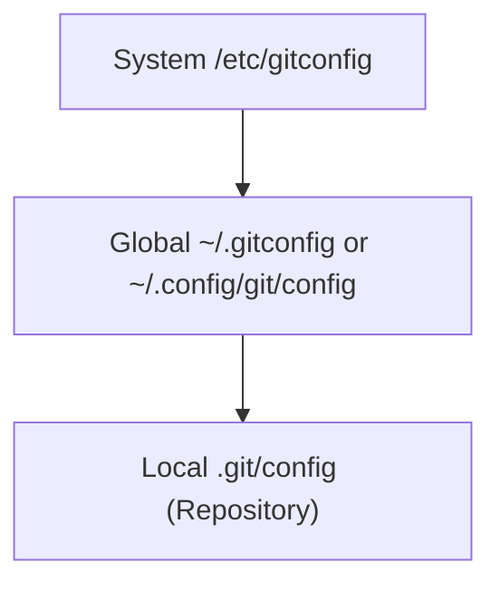

## はじめに

開発環境でのプログラミングにおいて、Git は不可欠なツールです。
ソースコードの変更履歴を管理し、チームでの協力作業をスムーズに行なうために重要な役割を果たします。
この記事では、Windows 上でプログラミングするエンジニア向けに、Git のグローバル設定に焦点をあて、エンジニアが効率的で安全な開発を行なう手助けをします。
また、Git を使いこなすための便利なサポートツールを紹介します。

## 技術用語と注釈

この記事で使用する技術用語とその説明を掲載します。

- `Git`: コードの変更を管理する分散型バージョン管理システム
- `gitconfig`: Git の各種コマンドや動作についての設定が記述されている設定ファイル
- `gitattributes`: 各ファイルに Git の属性を付加するための設定ファイル
- `gitignore`: git のリポジトリに追加せず無視するファイルを記述した設定ファイル
- `XDG Base Directory`: 各種ツールの設定ファイルを保存するディレクトリを決めるための仕様
- `Scoop`: Windows のコマンドラインでツールの管理、インストールを行なうパッケージマネージャー
- `リポジトリ`: Git のようなバージョン管理しシステムにおいてコードなどのファイルを保存し、変更履歴を管理する場所

## 1. Gitの設定

Git の設定は、`gitconfig`ファイルに記述されます。これらの設定は`git config`コマンドを使用するか、設定ファイルを直接編集して行います。

### 1.1. 設定ファイルの階層構造

Git の設定は、以下の 3つの段階で管理されます:



上記の各階層についての説明は、以下の通りです。

- system:
  "/etc/gitconfig"ファイルに保存され、システム全般の設定を記述します。通常、変更する必要はありません。

- global:
  "~/.gitconfig"ファイル、または"~/.config/git/config"ファイルに保存され、ユーザーごとのに各リポジトリ共通の設定を記述します。

- local:
  リポジトリの".git/config"ファイルに保存され、リポジトリごとの設定を記述します。

この記事では、上記のうちの`global`の設定について紹介します。
設定ファイルは`XDG Base Directory`にしたがい、`~/.config/gitconfig`ファイルに記述します。

### 1.2. 基本設定

"git/config"では、\[core\]、\[user\]のようにセクションごとに設定を記述します。

\[core\]には、改行コードやシンボリックの扱いなどの Git の基本的な設定を記述します。\[user\]には、Git で使うユーザー名やメールアドレスを記述します。

#### 改行コードと属性

テキストファイルの改行コードは、 UNIX/Linux 系の`LF`で統一します。
そのため、コミット時に改行コードを`LF`に変更するように`autocrlf=input`と設定します。

"/git/config"ファイルは、以下のようになります:

```toml:  git/config
[core]
    autocrlf = input
```

上記の改行コード変換は、Git の属性で制御できます。`binary`属性を設定すると、コードを変換しません。
また、".gitattributes"を設定することで、あらかじめファイルに属性を設定できます。

次に "git/config" に設定を追加して、"git/attributes"ファイルで属性を設定する方法について説明します。

```toml: git/config
[core]
    attributesfile = ~/.config/git/attributes
```

上記のように設定することで、"git/attributes"ファイルで属性を設定できます。

#### git/attributes

"git/attributes"には、ファイルに設定する属性を記述します。
ファイルの指定に glob が使え、通常は拡張子ごとに属性を設定します。

この記事での"git/attributes"は以下のようになります:

@[gist](https://gist.github.com/atsushifx/da90cf2d7de1a9de897935f6776b0598?file=gitattributes)

#### git/ignore

Git ではリポジトリで管理したくないファイルを無視できます。
"git/ignore"でファイルやディレクトリを指定すると、そのファイルはリポジトリに追加されなくなります。

"git/ignore"の設定については、"[gitignore documentation](https://git-scm.com/docs/gitignore)"を参照してください。

この記事で提供される"git/ignore"の内容は、OS などが作成するシステムファイルや一時ファイル、バックアップファイルなどを無視するためのものです。

同様に、.ssh ディレクトリ内にある秘密鍵などの認証情報ファイルも無視します。

この記事での"git/ignore"ファイルは、以下のようになります:

@[gist](https://gist.github.com/atsushifx/da90cf2d7de1a9de897935f6776b0598?file=gitignore)

#### エディタの設定

Git 操作時のエディタを設定できます。
設定しない場合は、環境変数"EDITOR"で指定したエディタを使用します。

たとえば、Git で`Visual Studio Code`を使いたい場合は以下のように設定します。

```toml: git/config
[core]
    editor = "code --wait "

```

上記のようにすると、コミット時に`VS Code`でコミットメッセージを編集できます。
"--wait"オプションをつけることで、Git 側はメッセージの編集が終わるのを待つことになります。

### 1.3. ユーザーの設定

Git では、"\[user\]"セクションでユーザー名とメールアドレスを設定します。
設定したユーザー名とメールアドレスは、コミットログに`Author`として表示されます。

"git/config"は、以下のようになります:

```toml: git/config
[user]
    name = Furukawa, Atsushi
    email = atsushifx@example.com

```

__注意:__
上記のコードブロックの内容はサンプルです。実際の設定は、自身の設定内容に書き換える必要があります。

### 1.4. ブランチの設定

Git では、機能の開発などをブランチに分けることで効率的に開発しています。
この章では Git におけるブランチの設定について解説します。

#### デフォルトブランチ

Git はリポジトリを初期化するときに、指定されたブランチでリポジトリを作成します。
これをデフォルトブランチといい、"git/config"ファイルで指定できます。

次のようにして、デフォルトブランチを設定します。

```toml:  git/config
[init]
    defaultBranch = main

```

#### pushするブランチの設定

"git/config"では、`git push`時にブランチをどう扱うかを指定できます。

`push.default = current`とすると、同名のリモートブランチに push します。ブランチがない場合は、新たに同名のブランチを作成して、そのブランチに push します。

`push.autoSetupRemote = true`で push 時に upstream のトラックをします。

これらをまとめた、"git/config"は以下のようになります:

```toml git/config
[push]
    default = current
    autoSetupRemote = true

```

#### pull/merge関連

`git pull`、`git merge`を実行したときに、`fast forward`をどうするかを指定します。
`pull`の場合は、`ff = only`として HEAD の位置を移動します。
`merge`の場合は、`ff = false`として`fast forward`を行いません。

上記の設定をまとめた"git/config"は以下のようになります:

```toml: git/config
[merge]
    ff = false

[pull]
    ff = only

```

### 1.5. エイリアスの設定

Git では、コマンドラインを別名で保存するエイリアス機能があります。
エイリアスを使うと、よく使うコマンドを 2 文字程度に短縮して実行させたり、オプション付きの長いコマンドをわかりやすい別名で実行できます。

#### コマンドのエイリアス  (短縮コマンド)

よく使うコマンドやオプションをエイリアスとして設定します。
また、"fixity"というエイリアスを追加することで、コミットを修正する際に便利なオプションを設定できます。
エイリアスは、次のようになります:

```toml: git/config
[alias]
    st = status
    ss = status -s
    co = checkout
    br = branch
    sw = switch
    pr = pull -r
    ps = push
    fixit = commit --amend --no-edit

```

#### コミットログのエイリアス

`git log`コマンドは、さまざまなオプションがありコミット履歴をビジュアルに表示できます。
オプションを覚えるのは大変なので、これもエイリアスにします。

エイリアスは、次のようになります:

<!-- markdownlint-disable line-length  -->
```toml: git/config
[alias]
    l = log --graph --all --pretty=format:'%C(yellow)%h%C(cyan)%d%Creset %s %C(white)- %an, %ar%Creset'
    ll = log --stat --abbrev-commit
    lg = log --color --graph --pretty=format:'%C(bold white)%h%Creset -%C(bold green)%d%Creset %s %C(bold green)(%cr)%Creset %C(bold blue)<%an>%Creset' --abbrev-commit --date=relative
    llg = log --color --graph --pretty=format:'%C(bold white)%H %d%Creset%n%s%n%+b%C(bold blue)%an <%ae>%Creset %C(bold green)%cr (%ci)' --abbrev-commit

```
<!-- markdownlint-enable line-length  -->

#### エイリアスの一覧表示

設定したエイリアスの一覧を取得するコマンドもあります。これもエイリアスとして設定します。
エイリアスは、次のようになります:

```toml: git/config
[alias]
    aliases = !git config --get-regexp '^alias\\.' | sed 's/alias\\.\\([^ ]*\\) \\(.*\\)/\\1\\\t => \\2/' | sort

```

### 1.6. まとめ

ここまでの設定を 1つにまとめると、オススメの"git/config"になります。
作成した"git/config"は、以下のようになります:

@[gist](https://gist.github.com/atsushifx/da90cf2d7de1a9de897935f6776b0598?file=gitconfig)

## 2. Gitを使いこなすためのサポートツール

Git をさらに使いこなすには、下記で紹介したツールが使えます。

### 2.1. 機能拡張ツール

Git の機能を拡張するためのツールについて紹介します。

#### posh-git

`posh-git`は、Git にタブ補完機能などを追加する PowerShell のモジュールです。
インストールは、`Scoop`で簡単にできます。

次の手順で、`posh-git`をインストールします。

1. scoop に extras bucket を追加する:

   ```powershell
    scoop bucket add extras
    ```

2. scoop を使用して`posh-git`を人ストールする:

   ```powershell
   scoop install posh-git
   ```

3. $profile に以下の行を追加して、`posh=git`モジュールをインポートする:

   ``` powershell: $profile
   Import-module posh-git
   ```

以上で、インストールは終了です。
PowerShell を立ち上げ直すと、タブ補完機能が使えます。

### 2.2. 設定用ツール

Git の設定を補助するツールを紹介します。

#### gibo

`gibo`は GitHub のテンプレートから、入力したキーワードに対応するテンプレートを出力するツールです。
開発環境にあわせてキーワードを選ぶことで、一気に gitignore を設定できます。

`gibo`は、`scoop`でインストールできます。
次の手順で、`gibo`をインストールします。

1. scoop で `gibo`をインストールする:

   ```powershell
   scoop install gibo
   ```

以上で、`gibo`のインストールは終了です。

## おわりに

この記事を参考にして、Git の設定を行なうことで、より安全に Git を利用できます。
設定ファイルは MIT ライセンスのもとで提供されているため、自由にコピーして使用できます。

こういった設定は一から調べて設定するのは大変です。
この記事の設定やツールを使えば、効率的にプログラミングをはじめられます。
記事やツールを活用し、ソフトウェア開発の効率化や品質の向上に役立ててください。

それでは、Happy Hacking!

## 参考資料

### 本/Webブック

- [Pro Git 2nd Edition](https://git-scm.com/book/en/v2)

### Webサイト

- [gitignore documentation](https://git-scm.com/docs/gitignore)
- [gitattributes documentation](https://www.git-scm.com/docs/gitattributes)
- [posh-git](https://github.com/dahlbyk/posh-git)
- [gibo](https://github.com/simonwhitaker/gibo)
