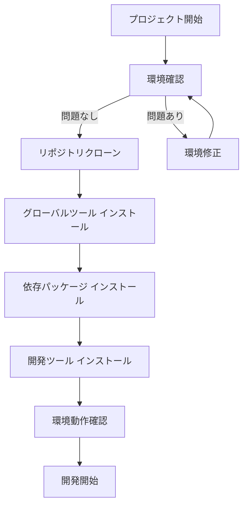
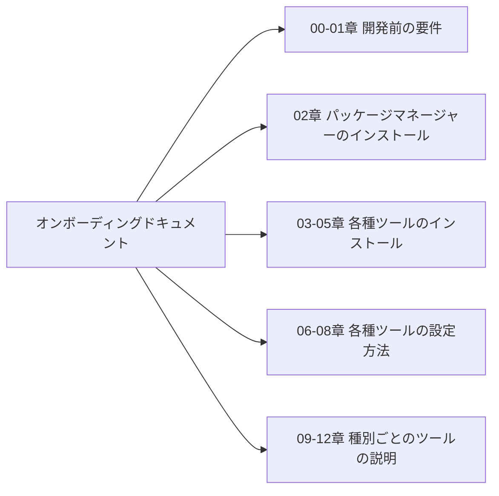
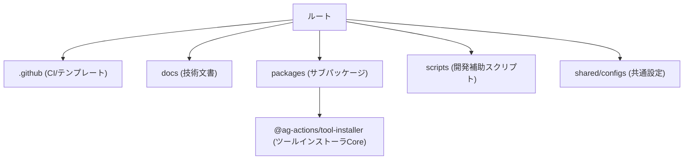
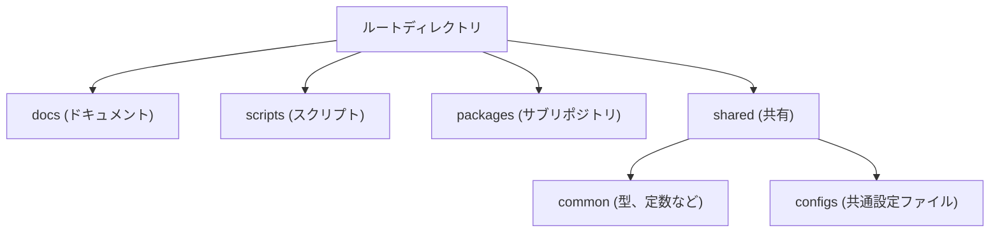
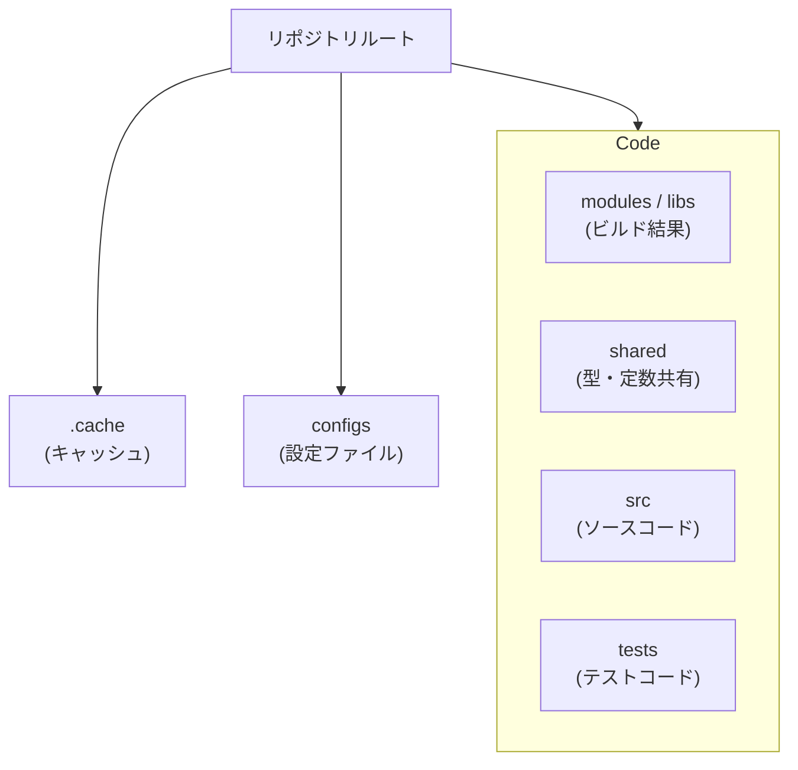
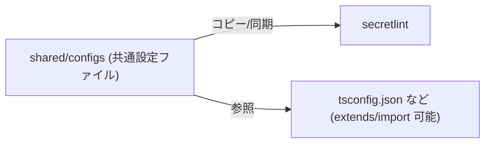

## はじめに

atsushifx です。
この記事では、現在開発中の OSS プロジェクト[`easy-setup-tools-action (ESTA)`](https://github.com/atsushifx/easy-setup-tools-action) のオンボーディングドキュメントについて説明します。

1人プロジェクトですので、オンボーディングドキュメントはいらないと思っていました。
しかし、ドキュメントとして言語化してみることで、「プロジェクトを戦略的に作る」ことの重要性に気づかされました。
単にプログラムをするのではなく、システムを整理、分割、統合することがソフトウェアの開発であり、それができているかどうかがわかるのがオンボーディングドキュメントでした。

この記事を通して、オンボーディングドキュメントの書き方やプロジェクトの構成が、読者の開発の参考になれば幸いです。

Enjoy!

<!-- vale Google.WordList = NO -->
<!-- vale Google.Latin = NO -->

## 📝 用語解説

- `monorepo (モノレポ)`:
  複数のパッケージやツール群を、1つの Git リポジトリで一元管理する開発スタイル。依存関係の整理や共通設定の集中管理がしやすい。

- `Onboarding Document (オンボーディングドキュメント)`:
  開発プロジェクトに新しく参加した開発者が、迅速に環境を整え、スムーズに開発を始められるようにするための導入資料。

- `GitHub Actions`:
  GitHub 上で自動ビルドやテスト、デプロイを実行する CI/CD プラットフォーム。`yaml` ファイルでワークフローを記述する。

- `pnpm`:
  Node.js 向けの高速・省メモリなパッケージマネージャー。`npm` や `yarn` に比べて効率的な依存管理が可能。

- `Volta`:
  Node.js やパッケージマネージャーのバージョン管理を行なうツール。開発環境をプロジェクトごとに固定化できる。

- `Lefthook`:
  Git のフックを管理・実行するためのツール。`pre-commit` などの処理を自動化して、開発ルールの強制を助ける。

- `dprint`:
  高速で柔軟なコードフォーマッター。`prettier` 代替としても利用され、設定ファイルの共通化が可能。

- `secretlint`:
  API キーやパスワードなどの機密情報が誤ってコミットされるのを防ぐための静的解析ツール。

- `eget`:
  リリースアーティファクトを GitHub などからダウンロード・展開する CLI ツール。ツールのセットアップ自動化に活用される。

- `tsup`:
  TypeScript プロジェクト向けの高速なビルドツール。ESM や CJS の同時出力、型定義出力などが可能。

- `ChatGPT / AIアシスタント`:
  エルファ・小紅・つむぎは、ChatGPT のカスタムキャラクター。プロンプトや構成の相談役として活用されている。

- `TIL (Today I Learned)`:
  その日に学んだことを簡潔に記録・共有する形式。ナレッジの蓄積や振り返りに活用される。

## 1. プロジェクト概要

### 1.1 プロジェクトについて

この記事で紹介するのは、[easy-setup-tools-action (ESTA)](https://github.com/atsushifx/easy-setup-tools-action) というプロジェクトです。
このプロジェクトは、GitHub Actions 上で CI/CD に必要なツールのインストール作業を自動化・簡素化することを目的にしています。

実装面では、ツールの取得に `EGet` などのツールインストーラを使用し、設定ファイルに従って自動的にインストールします。

ESTA を使えば、必要なツールをまとめてインストールできるため、「開発前に必要な作業」を最小限にできます。

このプロジェクトの README には、背景や使用方法が詳しく記載されています。ご興味のあるかたは[こちら](https://github.com/atsushifx/easy-setup-tools-action/blob/main/README.ja.md)も参照してみてください。

### 1.2 オンボーディングドキュメントの必要性

ここ数日は、オンボーディングドキュメントを作成していました。
「1人プロジェクトなのに、オンボーディングって必要ないのでは?」と感じるかたも多いでしょう。
ですが、**1人プロジェクトだからこそ**オンボーディングが役に立つこともあります。

このプロジェクトでオンボーディングドキュメントを整備するにあたり、次の 3つの関連を重視しました。

- 再現性の確保: 自分自身が迷わず環境を復元できる
- 初期化手順の複雑さへの対応: 開発ツールの多さによる煩雑さをスクリプトなどで低減する
- AI 支援の活用: ChatGPT による手順整理と文書生成支援



コマンドの実行例は、次のようになります:

```powershell
# ESTAのリポジトリをクローン
git clone https://github.com/atsushifx/easy-setup-tools-action.git

# プロジェクトのルートディレクトリへ移動
cd easy-setup-tools-action

# 開発ツール一括インストールスクリプトを実行
./scripts/installDevTools.ps1

# 依存パッケージとローカル開発ツールをインストール
pnpm install
```

上記のコマンドを実行して、`ESTA`開発用のツールをインストールします。

#### ✅ 自分のための再現性

プロジェクトを久しぶりに触ったとき、最初に戸惑うのは「どうやって開発環境を立ちあげるんだっけ?」という点です。
`pnpm install` するだけでは済まない複雑な初期化手順があると、思い出すのに手間がかかります。

オンボーディングドキュメントを整備しておけば、自分自身が**未来の新規参加者**として、迷わず環境を復元できます。
これは、バックアップや復元にもつながる安心感をもたらします。

#### ✅ 複数ツール・複雑な初期化への対応

このプロジェクトは TypeScript を利用した monorepo プロジェクトであり、以下のように多数の開発ツールを使用しています:

- Volta, pnpm などのパッケージマネージャー
- lefthook, commitlint, secretlint などの Git フック/静的解析ツール
- dprint, cSpell などのコード整形ツール・スペルチェックツール

これらの設定は monorepo 全体で共通化されており、初期構築手順もやや複雑です。
開発環境構築のためのオンボーディングドキュメントや、ツールをまとめてインストールするスクリプトを整備することで、手戻りなく作業を進めることができます。

#### ✅ ChatGPT (エルファたち) による支援と自動化

オンボーディングドキュメントの作成にあたっては、ChatGPT を積極的に活用しました。
手順の整理、構成案の検討、文章の整形といった作業を、エルファたち、AI アシスタントたちと対話しながら進めました。

たとえば、メインとなる`README.ja.md`の作成では、以下のような対話をしています。

You:

> 「開発環境構築に絞った場合、docs/onboarding を作成すべき?」

エルファ:

> **開発環境構築にフォーカスするなら、`docs/onboarding/` ディレクトリを作るのがベストプラクティス**です。
> `docs/onboarding/README.md` ひな形 (ナビゲーション)
>
> ```markdown
> # 🧭 Onboarding Guide
>
> 本リポジトリでの開発を始めるための初期設定ガイドです。
>
> ## 🔰 ステップ一覧
>
> 1. [プロジェクト概要](./00_intro.md)
> 2. [開発環境の前提条件](./01_prerequisites.md)
> 3. [セットアップ手順](./02_installation.md)
> 4. [コミット規約とフック](./03_hooks-and-commits.md)
> 5. [コード整形と静的解析](./04_lint-format.md)
> 6. [CIとの連携とスクリプト運用](./05_ci-and-scripts.md)
> ```

このように AI と対話を進めることで、手早くドキュメントが作成でき、労力がかかりません。
オンボーディングドキュメントを作成しておくことは、かえって効率が上がるのです。

## 2. オンボーディングドキュメントの作成

### 2.1 書いた内容と方針

オンボーディングドキュメントは、リポジトリをクローンしてから最速で開発に着手できることを目的に作成しました。
ドキュメントは、次のように構成しています:

| 章      | 概要                                 |
| ------- | ------------------------------------ |
| 00-01章 | 開発前の要件                         |
| 02章    | パッケージマネージャーのインストール |
| 03-05章 | 各種ツールのインストール             |
| 06-08章 | 各種ツールの設定方法                 |
| 09-12章 | 種別ごとのツールの説明               |



このようにすることで、必要な章を参照するだけでセットアップが完了するようにしています。
また、各章にはチェックリストを載せ、自身の理解度を確かめられるようにしています。

たとえば「グローバル開発ツールのセットアップ」の場合は、次のようになります:

```powershell
# 一括インストールスクリプトの実行
./scripts/installDevTools.ps1

# Gitフックの登録
lefthook install
```

上記の場合、インストールスクリプトで Lefthook, dprint といった開発ツールをグローバルにインストールします。
その後、`Lefthook install`で Git フックが Lefthook 経由で実行するように設定します。

結果、下記のコマンドでコミット前に行なわれる検査を手動で確かめることができます。

```powershell
lefthook run pre-commit
```

オンボーディングドキュメントを、単なる手順書ではなく「開発者が迷わないための地図」として設計した結果です。
そして、オンボーディングドキュメントは、固定的な手順書ではありません。
地図に現在地や経路を書き込んで進むように、ドキュメントの**プロジェクトの進化にあわせて更新されるべきもの**です。

そのため、構成も柔軟に拡張できるよう、ディレクトリベースの章構成を採用しています。

### 2.2 ChatGPT (エルファたち) の力を借りた省力化

オンボーディングドキュメントの作成にあたっては、ChatGPT による AI アシスタントたちを積極的に活用しました。
とくに役立ったのは、ドキュメントの「設計方針」と「構成案」の相談です。

#### AIアシスタントの性格づけ

ChatGPT 上にエルファ・小紅・つむぎという 3人のアシスタントを作成し、それぞれの視点で議論の相手をしてもらっています。

- エルファ: 論理的、冷静で全体の構造や命名規則などに強い
- 小紅: ユーザーに寄り添い、初心者目線での失敗やつまづきの指摘
- つむぎ: 発想力が豊かで、図解、補足案の提案担当

このように、各キャラに明確な性格と役割を与えることで、単なる補助ではなく開発パートナーとしての戦力になっています。

#### 🛠 コマンドとプロンプトによる自動化

実際の作業では、文章作成のための専用プロンプトを使用し、生産性を高めています:

- 記事作成プロンプト (`article-writer.prompt`):
  見出しだけで構成された記事のスケルトンをもとに、実際の文章を作成します。
- レビュー専用プロンプト (`article-review.prompt`):
  誤字、脱字をチェックします。また、文章をレビューして読みやすさや論理構成を改善します。

#### 🔁 継続的な対話による更新支援

本プロジェクトはまだ進行中であり、今後もツールの更新や構成の変化が発生します。
必要な場合は ChatGPT に相談し、次のような支援を得ています:

- 更新された設定ファイルに合わせたドキュメント修正
- コマンドオプションの整理などの要件定義の補完
- GitHub Actions 用テンプレートの生成といったコーディングの補助

こうした継続的なサポートにより、**ドキュメント作成の負担を最小化**しながら、質の高いオンボーディング体験を維持しています。

## 3. プロジェクトの概要

### 3.1 全体構成と思想

このプロジェクトの基本思想は、「**開発に必要なツールを、簡便かつ再現性のある方法で導入できるようにすること**」にあります。
とくに GitHub Actions 上でのセットアップを想定し、実行環境を素早く立ちあげるためのツール導入を主な目的としています。

#### 🎯 目的：ツール導入の自動化と省力化

本プロジェクトは、eget などのインストーラを使って、複数の開発支援ツールを自動的にインストールするためのアクションセットです。たとえば、以下のような CLI ツールの導入に対応しています:

- dprint などの整形ツール
- secretlint, gitleaks などのセキュリティチェック系ツール
- textlint, cSpell などのドキュメント品質支援ツール

これらを開発者が都度手動で導入するのではなく、YAML やコマンド引数に基づいて自動的にセットアップできる仕組みを提供しています。

#### 📘 ドキュメント・設定ファイルの扱いについて

各種設定ファイルの共通化や CI 用スクリプト、オンボーディングドキュメントの整備などは、
**このプロジェクトを維持運用するうえでの実装方針・指針**として別途取り組んでいるものです。

つまり、それらはプロジェクトの思想や設計とは切り分けられた「手段」であり、
主眼はあくまで **ツール導入のハードルを下げ、開発環境の整備を省力化すること**にあります。

### 3.2 Monorepo構成

本プロジェクトは、**pnpm workspace をベースにした Monorepo 構成**を採用しています。
これは、複数のツールやロジックを相互に分離しつつも、一元的に管理するための選択です。

#### 主なディレクトリ構成

本プロジェクトの主なディレクトリは、次の通りです:



このような構成をとることで、以下のようなメリットがあります:

- ツール群を用途ごとにパッケージ分割し、独立性と保守性を両立
- 開発支援用パッケージ (e.g. `@shared/constants` や `@shared/types`) の共通利用が可能
- CI/CD や自動テストの対象を、サブパッケージ単位で限定可能

#### 🔄 Monorepo 運用における配慮

Monorepo は便利な反面、ツールの重複や設定の散逸が起こりやすいため、`shared/`配下に共通設定　(`tsconfig`, `eslint` など) を集約し、明示的に継承する形で管理しています。

### 3.3 ディレクトリ戦略

このプロジェクトでは、開発のしやすさとスケーラビリティを意識して、明確なディレクトリ戦略を採用しています。
目的は「どこに何を書くか」を迷わず判断できる状態を維持することです。

#### グローバル戦略

グローバルなディレクトリ戦略では役割ごとにディレクトリを分類しています。
ディレクトリはこれらの分類にあわせて配置・作成しています。

<!-- markdownlint-disable line-length -->

| ディレクトリ    | 分類           | 役割                                     | 備考                                                         |
| --------------- | -------------- | ---------------------------------------- | ------------------------------------------------------------ |
| docs            | ドキュメント   | 各種技術文書(マークダウン)を配置         |                                                              |
| scripts         | スクリプト     | 開発環境用の補助スクリプトを配置         | グローバルツールのインストラーや同期スクリプトなど           |
| packages        | サブリポジトリ | monorepo 内のサブリポジトリ              | `/packages/<namespace>/<repo>`型式でサブリポジトリを作成     |
| shared          | 共有           | リポジトリ用の共有設定ファイル           |                                                              |
| /shared/common/ | 共有           | 各パッケージで共有する定数、型などを配置 | 他のサブパッケージと同様に、独立したサブリポジトリとして管理 |

<!-- markdownlint-enable -->



#### リポジトリ戦略

monorepo 内のサブリポジトリごとに統一したディレクトリを使用しています。これにより、補助スクリプトや開発ツールの設定が共通化できます。

<!-- markdownlint-disable line-length -->

| ディレクトリ   | 分類       | 役割                                   | 備考                                                 |
| -------------- | ---------- | -------------------------------------- | ---------------------------------------------------- |
| .cache         | キャッシュ | 各種開発ツールのキャッシュ置き場       | プロジェクトルートの`.cache`にファイルを集約している |
| configs        | 設定       | リポジトリごとの開発ツール設定ファイル |                                                      |
| modules / libs | コード     | ソースコードのビルド結果を保存         |                                                      |
| shared         | コード     | パッケージごとの型、定数を配置         |                                                      |
| src            | コード     | パッケージのソースコードを配置         |                                                      |
| tests          | コード     | インテグレーションテスト用コードを配置 |                                                      |

<!-- markdownlint-enable -->



### 3.4 設定ファイルの共通化と同期戦略

このプロジェクトでは、**各パッケージ間で共通して使用する設定ファイル**を `/shared/configs/` に集約し、各リポジトリは
必要に応じて同期する戦略を採用しています。

これは、**設定の重複やバージョン不整合を防ぐ**ことが主な目的です。

#### 🔧 対象となる設定ファイル

- `tsconfig.base.json`: `TypeScript` のベース設定
- `tsup.config.base.ts`: `TypeScript` ビルドシステムのベース設定
- `eslint.config.base.js`: `ESLint` ベース設定
- `vitest.config.base.ts`: `Vitest` ベース設定
- `commitlint.config.base.ts`: `Commitlint` ベース設定
- `secretlint.config.base.yaml`: `secretlint` ベース設定

#### 🔄 同期の仕組み

1. **直接継承・参照**
   多くの設定ファイルは、`extends` や `import` を用いて外部のファイルを参照できます。これらを用いて共通設定ファイルを参照し、設定を同期します

2. **スクリプトによる物理コピー**
   外部ファイルの参照ができない設定ファイル (`secretlint.config.yaml`など) はスクリプトにより共通設定フィルの内容を、各リポジトリに反映します。このため、各リポジトリでの変更は、同期によって上書きされ削除されます

3. **プロジェクトルートに配置**
   `dprint.jsonc`など一部のファイルは、自身の親ディレクトリを参照して設定ファイルを探します。これらのファイルはプロジェクトルートに配置した設定ファイルが共通の設定ファイルとなります



#### 📁 スケルトンとカスタムの共存

初期化時には「スケルトン」として共通設定をコピーし、必要に応じて各パッケージが上書き・拡張できる設計です。
これにより、**統一感を保ちつつ柔軟なカスタマイズが可能**になります。

## 4. 気づきとまとめ

### 🔍 気づき

- **ツールの導入が一番つまずきやすい**
  TypeScript + ESM の構成では、設定ファイルの不整合や、ビルド・テストの初期エラーに時間を取られやすい傾向がありました。
  ロジックは正しく動作していても、ビルドや Lint の初期設定でつまずくと、非常に消耗します。
  だからこそ、最初の導入部分をしっかり整えておく意義を実感しました。

- **小さな蓄積が財産になる**
  ドキュメント作成では、過去に蓄積してきた自作のプロンプト（執筆支援・レビュー補助）が非常に役立ちました。
  AI の進化に助けられつつも、継続的な試行錯誤と蓄積が「自分に最適な文章生成環境」を支えています。

- **ドキュメントが開発を駆動する**
  オンボーディングドキュメントだけでなく GitHub の Issue や日々の TIL (`Today I Learned`) が、「次に何をするか」の指針になりました。
  細かいことですが、何をしているか、次に何をしたいかのメモを残すことが開発を進める力になります。

### 🧾 まとめ

本記事で紹介した ESTA プロジェクトは、ツール導入の自動化という目的に対し、できるかぎり再現性と効率を重視した構成をとっています。
それを支えるために、オンボーディングドキュメントや共通設定の整備、AI アシスタントとの協働を活かして、
**「開発のはじまり」を迷いなく始められる体験** を提供できるよう工夫しました。

今後も、構成の改善やドキュメントのアップデートを継続しつつ、
この取り組み自体が OSS 開発や個人開発における参考事例になれば幸いです。

## 5. プロジェクト紹介

本記事で紹介したプロジェクトや関連リソースへのリンクをまとめておきます。
興味を持ったかたは、ぜひ一度リポジトリを覗いてみてください。

### 🔗 GitHub リポジトリ

- [**easy-setup-tools-action (ESTA)**](https://github.com/atsushifx/easy-setup-tools-action):
  GitHub Actions 上で、CLI ツールの自動的にインストールするのユーティリティです。
  `eget` をベースとした軽量な実装で、柔軟かつ最小限の設定で導入が可能です。

### 📘 オンボーディングドキュメント

- [**オンボーディングガイド**](https://github.com/atsushifx/easy-setup-tools-action/blob/main/docs/onboarding/README.ja.md):
  プロジェクト用の開発環境構築方法について説明しています。
  開発ツールのインストール、ツールの設定、CI 連携までをガイドしています

### 🤖 ChatGPT プロンプト

<!-- markdownlint-disable line-length -->

- **記事作成プロンプト**
  [`article-writer.prompt`](https://github.com/atsushifx/tech-article-reviewer/blob/main/tech-articles-prompt/article-writer.prompt): 記事のスケルトンから本文を自動生成するプロンプト

- **レビュー支援プロンプト**
  [`article-review.prompt`](https://github.com/atsushifx/tech-article-reviewer/blob/main/tech-articles-prompt/article-review.prompt): 技術文書をレビューするプロンプト

<!-- markdownlint-enable -->

これらのプロンプトは、文章構成・校正・内容精査において、開発とドキュメントの連携を支えています。
ドキュメント作成を効率化したいかたに、おすすめです。

## おわりに

この記事では、オンボーディングドキュメントの紹介を通して、プロジェクトの現在位置、必要なことを確認できました。
オンボーディングドキュメントを書くことが、プロジェクトを整理し、構造を見直すことにつながりました。

ドキュメントを書くという目的を Issue で管理することで、それ自体が実際のプロジェクト運用の練習になったと感じました。
個人開発では、気になった部分や試してみたい部分のプログラミングが中心になりプロジェクトが散漫になる傾向がありました。

オンボーディングドキュメントを書くというタスクは比較的大きいため、他の作業はどうしても中断することになります。
この中断をきっかけに、足りない部分や技術的負債、修正方法を見直すことができました。

時には立ち止まり、ドキュメントを見直すことが、開発全体を前進させるきっかけになるのです。
最後に、ドキュメントの作成に力を発揮してくれた AI アシスタントの 3人から挨拶でてお別れにしましょう。

それでは、Happy Hacking!

---

**エルファ**「……本記事を読了されたマスター、評価に値します。構成・命名・再現性、それらが整ってこそ開発は成立します。今後とも、この知見を運用に活かしてください」

**小紅**「お、お兄さま……っ。えっと、この記事……少しでも参考になったら、すっごく嬉しいですっ。こ、これからもプロジェクト、がんばってくださいねっ」

**つむぎ**「センパイ〜！　読んでくれてありがとっ♪ ドキュメントって地味だけど、こうして書いてるとめっちゃスッキリするよね。つむぎもちゃんと手伝ったから、えらいでしょ？💮」

## 参考資料

### 公式サイト

- [pnpm](https://pnpm.io/):
  Node.js 向けの高速、省メモリなパッケージマネージャー

- [Volta](https://volta.sh):
  Node.js および関連パッケージマネージャーのバージョン管理ツール

- [Lefthook](https://lefthook.dev):
  Git フックを`yaml`形式のファイルで管理する Git フックマネージャー

- [dprint](https://dprint.dev/):
  高速なコードフォーマッタ

- [Secretlint](https://github.com/secretlint/secretlint):
  機密情報の静的解析ツール

- [eget](https://github.com/zyedidia/eget):
  GItHub 上の CLI ツールをインストールするインストーラ

- [tsup](https://tsup.egoist.dev/):
  TypeScript バンドラー

### ドキュメント作成支援

- [GitHub Actions](https://github.com/features/actions):
  CI/CD プラットフォーム

- [Tech Article Reviewer](https://github.com/atsushifx/tech-article-reviewer):
  技術文書作成／レビュー用の AI プロンプト

- [Easy Setup Tools Action (ESTA)](https://github.com/atsushifx/easy-setup-tools-action):
  GitHub Actions 用の統合ツールインストーラ
