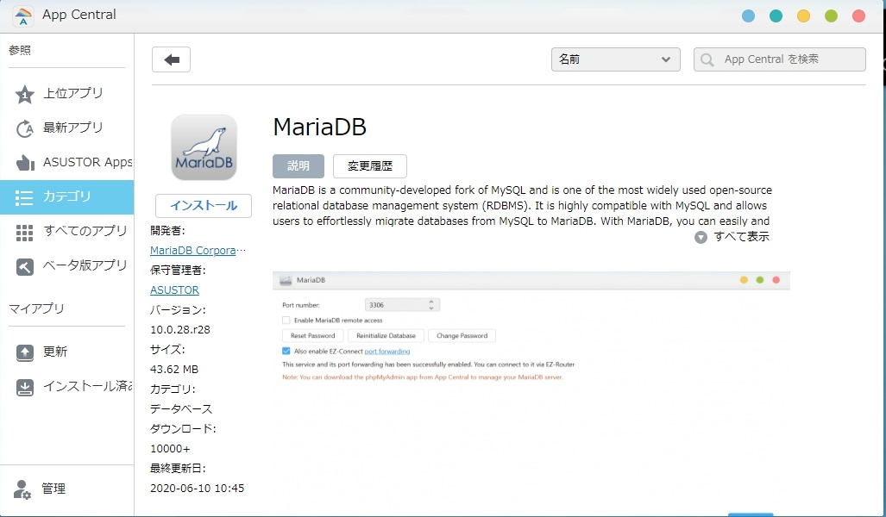
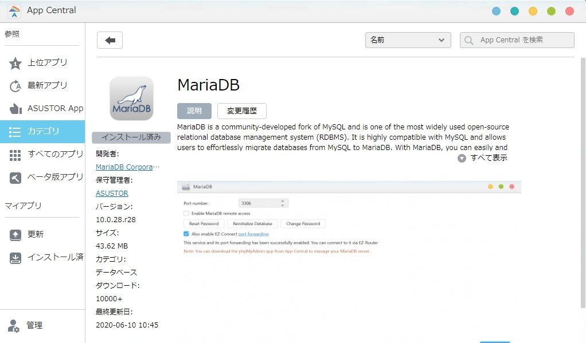
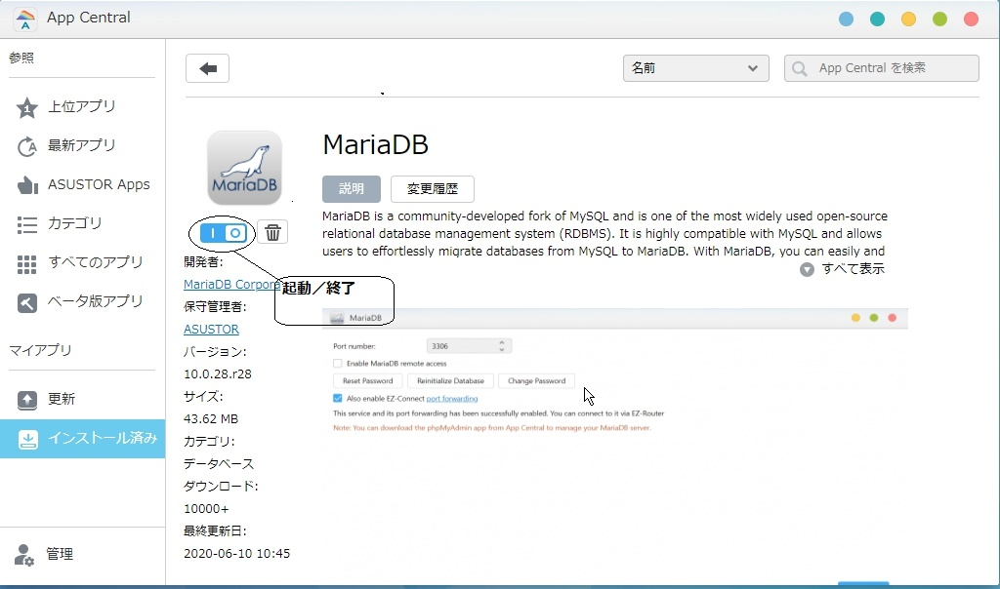

# MariaDBのインストール

## MariaDBのインストール (AppCentral上)

1. Web上のAppCentralにアクセスします
   

2. AppCentralからMariaDBを探し、選択します。
     
    
3. [インストール]をクリックします。
    

4. 以上でインストールは終了です。

## MariaDBの起動/停止/再起動

asustor nasでは、MariaDBの起動／停止をWeb上のAppCentralからおこないます。

1. Web上のAppcentralにアクセスします
    

2. 左サイドメニューの[インストール済み]を選択し、[MariaDB]を開きます。
    

3. [MariaDB]のロゴの下に、実行／終了スライドスイッチがあります。ここを使って、MariaDBを起動／停止します。

4. MariaDBの再起動は、上記のスイッチを使います。MariaDBを終了後、再度MariaDBを実行することで再起動します。

