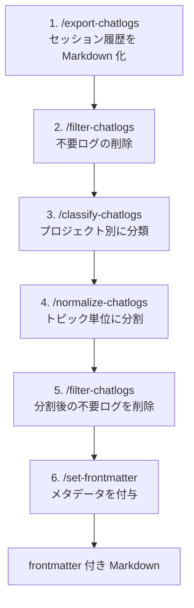

<!-- cspell:words dics atuin -->
<!-- textlint-disable
  ja-technical-writing/sentence-length,
  ja-technical-writing/no-exclamation-question-mark,
  -->
<!-- markdownlint-disable no-emphasis-as-heading line-length -->

## tl;dr

`chatlog-exporter` は、AI エージェントのセッション履歴を Markdown に書き出し、分類・整形するスキル群です。

- `gh skill` または `npx skills` で導入し、`/setup-chatlogs` で初期設定
- 5 つのスキルを 6 手順で通し、ノイズ除去からメタデータ付与まで一括処理
- 出力は frontmatter 付き Markdown なので、`Obsidian` にそのまま取り込める

Enjoy!

## はじめに

atsushifx です。
この記事では、拙作の AI エージェント向けチャットログ整理ツール `chatlog-exporter` を紹介します。

`chatlog-exporter` は、`Claude Code` などのセッション履歴を Markdown 化し、分類・整形する複数のスキルをまとめたユーティリティです。
各機能はエージェントスキルとして提供され、処理後のログは各種メタデータを持つ Markdown として出力されます。

書き出したログは、Obsidian などに取り込むことで、過去の知識 DB として活用できます。
ログはプロジェクト別に分類され、検索や絞り込みのために `category`、`topics`、`tags` などのメタデータが付加されています。

この記事では、チャット履歴の抽出から、知識として活用できる Markdown へ整形するまでの手順を解説します。

## 1. `chatlog-exporter` とは

### 1.1 チャットログが活用できない問題

AI エージェントとのチャットには、試行錯誤の経緯や、採用しなかった案とその理由が含まれます。
しかし、チャットログを過去の知識として活用するのは難しいです。

- 1 つのログに複数の話題が混在
- プロジェクトをまたいだログの混在
- 検索の手がかりとなるメタデータの不在
- システムが作成したログによるノイズの混在

`chatlog-exporter` は、これらの問題に対応するため、以下の機能をそれぞれ独立したスキルとして提供します。

- ログの Markdown 化
- 不要なログの削除
- プロジェクト別の分類
- トピック単位への分割
- 検索や絞り込みのためのメタデータ付与

### 1.2 スキルによるパイプライン処理

`chatlog-exporter` の特徴は、処理を 5 つのスキルに分割している点です。
各スキルは、特定のディレクトリ上の Markdown を入力として受け取り、処理結果を特定のディレクトリに出力します。

| スキル                | 役割                                   |
| --------------------- | -------------------------------------- |
| `/export-chatlogs`    | セッション履歴を Markdown として出力   |
| `/filter-chatlogs`    | 再利用価値の低いログを削除             |
| `/classify-chatlogs`  | プロジェクト別のディレクトリへ振り分け |
| `/normalize-chatlogs` | トピック別のセグメントへ分割           |
| `/set-frontmatter`    | 分類用の frontmatter を付与            |

*表1-1: chatlog-exporter が提供する 5 つのスキルと役割*

これらのスキルは、前のスキルの出力を次のスキルの入力として処理するようになっています。
AI エージェントのチャットログは、各スキルを続けて実行することでパイプライン処理され、知識として活用できる Markdown となります。

処理が独立したスキルに分かれているため、途中まで実行して結果を確認したり、目的に応じて一部のスキルだけを使ったりできます。

ただし、汎用のログ整形ツールではありません。
対象は `Claude Code`・`Codex`・`ChatGPT` の 3 つのセッション履歴に限られます。`chatlog-exporter` では、それぞれ `claude`、`codex`、`chatgpt` というエージェント名で指定します。

分類・分割・メタデータ付与や、内容による不要ログの判定では、指定されたモデルに対応する AI エージェントを呼び出します。
大量のログを一度に処理すると、利用する AI サービスの利用上限に達し、処理を継続できなくなる場合があります。

### 1.3 出力される frontmatter 付き Markdown

`frontmatter` は Markdown の先頭に付加される `---` で囲まれた `YAML` 形式のメタデータです。
`chatlog-exporter` は、`title`・`date` などの基本データ、`session_id`・`slug` などのシステム作成データ、`category`・`topics` などの分類用メタデータを付加します。

`frontmatter` の主要なエントリーは、次の通りです。

| `entry`      | エントリー例                                                   | 説明                                                               |
| ------------ | -------------------------------------------------------------- | ------------------------------------------------------------------ |
| `title`      | `Session format conversion and IDD branch proposal generation` | AI エージェントがチャットに自動的に付けるタイトル                  |
| `date`       | `2026/07/30`                                                   | チャットをしていた日付                                             |
| `type`       | `execution`                                                    | ログの種別。ログの内容により分類される                             |
| `category`   | `tooling`                                                      | ログのカテゴリー。`development`, `infrastructure` などがある。     |
| `session_id` | `7729fc51-3ccf-4028-8140-db8ab48850a2`                         | AI エージェントが各チャットセッションに付与する ID                 |
| `project`    | `agla-doc-tools`                                               | ログが関わっているプロジェクト、主に Git から取得される            |
| `slug`       | `10-snug-treasure`                                             | ログを識別するために生成される識別子                               |
| `topics`     | `tooling`                                                      | ログの内容を分類するキーワード (複数指定可)                        |
| `tags`       | `tool/git`                                                     | `<ネームスペース>/<タグ>` 形式で指定された、ログの分類・検索用タグ |

*表1-2: フロントマターの種類と解説*

### 1.4 カスタマイズできる項目

`chatlog-exporter` は `/setup-chatlogs` スキルでカレントディレクトリ下に設定ファイルやランタイムを展開します。
設定ファイルは、`.config/chatlog-exporter` 下に展開されます。
展開された設定ファイルを修正することで、`chatlog-exporter` の動作を変えられます。

| 設定ファイル  | 概要           | 修正項目                                                                                 |
| ------------- | -------------- | ---------------------------------------------------------------------------------------- |
| `config.yaml` | デフォルト設定 | 出力ディレクトリやエージェントモデルなど、オプション未指定時に指定される項目を変更します |
| `dics/`       | キーワード辞書 | `topics`, `tags` など `frontmatter` に付与されるメタデータを変更できます                 |
| `prompts/`    | プロンプト辞書 | `topics`, `tags` をログ内容から推定するためのプロンプトを変更できます                    |

*表1-3: 設定ファイルと設定項目*

設定項目の一覧と記述形式は、[`chatlog-exporter` ドキュメント](https://aglabo.github.io/chatlog-exporter/) を参照してください。

#### 辞書の修正

`dics/` 下の辞書では、`type`、`category`、`topics`、`tags` に設定する項目を定義します。
辞書に参加中のプロジェクト用のトピックやタグを追加することで、自分の環境に合ったログを出力できます。
`type` と `category` は、通常、変更する必要はありません。

#### システム設定項目

`config.yaml` では、AI エージェントのモデルなど、システムの設定項目を指定します。
一部の設定は、スキルのオプションでも切り替えられます (後述)。

## 2. 動作環境

### 2.1 実行の前提条件

`chatlog-exporter` を実行するためには、次のツールが必要です。

| ツール                 | 用途                                                  | 必須となる場面                         |
| ---------------------- | ----------------------------------------------------- | -------------------------------------- |
| Claude Code (`claude`) | スキル実行プラットフォーム / ログ判定、メタデータ生成 | `chatlog-exporter` 実行時              |
| `bash`                 | `/setup-chatlogs` の初期設定処理                      | `/setup-chatlogs` による初期設定時     |
| `deno`                 | スキルを構成する TypeScript の実行                    | `/setup-chatlogs` 以外のスキルの実行時 |

Claude Code には、`chatlog-exporter` を実行するためのプラットフォームとしての役割があります。
`chatlog-exporter` の各スキルは、`claude` を起動した後の TUI 画面でスキルコマンドを入力することで利用できます。

AI を使うスキルでは `claude` コマンドを呼び出し、ログの判定やメタデータの生成に使用します。
例えば、`/filter-chatlogs` スキルではログの内容から要／不要を判定し、`/set-frontmatter` スキルではログの内容に応じたメタデータを生成します。

`bash` と `deno` は、各スキルから呼び出すスクリプトの実行に使用します。
`/setup-chatlogs` の初期設定処理はシェルスクリプトで実装されており、`bash` で動作します。
`/setup-chatlogs` 以外のスキルで使用するスクリプトは、TypeScript で実装されており、実行には、`deno` が必要です。

いずれのツールもコマンドラインから呼び出されるため、コマンド名だけで起動できる必要があります。

#### Windows 環境での `bash` 設定

Windows 環境の場合、標準では `bash` がインストールされていません。
そのため、`Git for Windows` に含まれる `Git Bash` の `bash` コマンドを使用します。

次の手順で、`bash` をコマンドラインから起動できるようにします。

1. `Git for Windows` のインストール:
   `winget`, `scoop` などのパッケージマネージャー、あるいは公式のインストーラーで `Git for Windows` をインストールします。

2. `bash` を環境変数 `Path` に追加:
   Windows のコマンドラインで `bash` を起動できるようにするため、`bash` をインストールしたディレクトリを環境変数 `Path` に追加します。
   例えば、`C:/app/develop/scm/git` に `Git for Windows` をインストールした場合は、

   ```text
   C:/app/develop/scm/git/bin
   ```

   を環境変数 `Path` に追加します。

### 2.2 インストール用ツールと実行コマンド

`chatlog-exporter` はエージェントスキルとして提供されており、GitHub CLI の `gh skill` サブコマンド、または `skills` パッケージを使ってインストールできます。

| ツール            | 実行コマンド  | 備考                     |
| ----------------- | ------------- | ------------------------ |
| GitHub CLI (`gh`) | `gh skill`    |                          |
| `npm` (`npx`)     | `npx skills`  |                          |
| `pnpm` (`pnpx`)   | `pnpx skills` | `skills` は `npm` と同一 |

*表2-2: インストール用ツールと実行コマンド*

**gh skill**:
`gh skill` は GitHub CLI の組み込みコマンドで、エージェントスキルに対応した GitHub CLI で使用できます。

:::message alert
注意:
GitHub CLI のエージェントスキル機能は現在 Preview として提供されています。
:::

**skills**:
`skills` は、エージェントスキルをインストール・管理するための CLI です。`npx skills` または `pnpx skills` で実行できます。

詳しいインストール方法は、[§3 インストール](#3-chatlog-exporter-のインストール) で解説します。

### 2.3 対応エージェント

現在、`chatlog-exporter` は、次の表で示す各 AI エージェントのチャット履歴に対応しています。

| AIエージェント | エージェント名 | 備考                            |
| -------------- | -------------- | ------------------------------- |
| Claude Code    | `claude`       |                                 |
| Codex CLI      | `codex`        |                                 |
| ChatGPT        | `chatgpt`      | Webからエクスポートする必要あり |

チャットログを出力するときは、次のように `<エージェント名> <対象年月>` を指定します。

```bash
/export-chatlogs claude 2026-06
```

上記の場合、「Claude Code の 2026年6月分のチャット履歴を出力」という意味になります。
このように `<エージェント名> <対象年月>` を指定することで、処理の対象となるチャットログを選択できます。

`/filter-chatlogs` の場合、第1引数にフィルターの種類を指定し、それに続けてチャットログを指定します。
フィルターには、次の種類があります。

- `filter`: AI の内容判定フィルター
- `noise-filter`: パターン認識による高速フィルター
- `strip`: チャットログ内のシステム出力を取り除くフィルター

`strip`、`noise-filter` などの機械的フィルターを先に実行することで、AI による `filter` の対象となるチャットログを減らし、不要な AI 呼び出しを削減できます。

```bash
/filter-chatlogs noise-filter claude 2026-06
```

上記の場合は、「パターン認識を使って、Claude Code の 2026年6月分から不要なログを削除する」という意味となります。

## 3. `chatlog-exporter` のインストール

`chatlog-exporter` は、`gh skill`、`npx skills` で簡単にインストールできます。
この章では、各コマンドによるインストール方法、および、`/setup-chatlogs` による初期設定を解説します。

### 3.1 `gh skill` によるインストール

`chatlog-exporter` は、GitHub CLI の `gh skill` でインストールできます。
インストールする場合は、`gh skill install` を使用します。

```bash
gh skill install aglabo/chatlog-exporter --all --agent claude-code --scope project
```

- `aglabo/chatlog-exporter` は、エージェントスキルが存在するリポジトリを示します。
  本来は、`https://github.com/aglabo/chatlog-exporter` ですが、先頭の `https://github.com/` は省略できます。
- `--all` は、リポジトリ内のすべてのスキルを対象にするオプションです。この場合、全スキルをインストールするという意味になります。
- `--agent claude-code` はスキルを使用するエージェントを指定します。使用できるエージェントは `gh skills` のヘルプを参照してください。
  :::message alert
  Claude Code 以外のエージェントでも動作するはずですが、動作確認をしていないため保証外とします。
  :::
- `--scope project` は、スキルをプロジェクトスキルとしてインストールすることを示します。
  この場合、`chatlog-exporter` はインストールしたディレクトリ以外では実行できません。

なお `gh skills` は `gh skill` のエイリアスのため、どちらの表記でも動作します。

:::message alert
`GitHub CLI` のエージェントスキル対応はプレビュー段階です。
公式マニュアルには、次のとおり明記されています。

> Working with agent skills in the GitHub CLI is in preview and subject to change without notice.

予告なく仕様が変わる可能性もあるため、利用時は最新のマニュアルを確認してください。
:::

### 3.2 `npx skills` によるインストール

`GitHub CLI` を導入していない場合は、`npx skills` でも同じスキルを導入できます。

```bash
npx skills add aglabo/chatlog-exporter --skill '*' --agent claude-code
```

`--skill '*'` は、すべてのスキルを対象にする指定です。
`npx skills` の `--all` は `--skill '*' --agent '*' -y` のショートハンドであり、`--agent` の指定を打ち消します。
インストール先を `Claude Code` に限定する場合は、`--all` ではなく `--skill '*'` を使います。

### 3.3 `/setup-chatlogs` による初期セットアップ

スキルの導入後、プロジェクトで 1 度だけ `/setup-chatlogs` を実行します。

```bash
/setup-chatlogs
```

この初期設定は省略できません。
設定ファイル・分類辞書・共有ライブラリが揃っていないと、他のスキルが動かないためです。

| 展開先                      | 内容                                        | 基準                 |
| --------------------------- | ------------------------------------------- | -------------------- |
| `.config/chatlog-exporter/` | `config.yaml`、分類辞書 `dics/`、`prompts/` | カレントディレクトリ |
| `deno.json`                 | `chatlog-exporter` 用の `Deno` 設定         | カレントディレクトリ |
| `_cle-libs/`                | 各スキルが共有する型・定数・ライブラリ      | スキルの隣           |

*表3-1: /setup-chatlogs が展開する 3 エントリと配置の基準*

`_cle-libs/` だけは配置の基準が違います。
各スキルが `../../_cle-libs/` として参照するため、カレントディレクトリではなくスキルをインストールした場所へ展開されます。

`.config/chatlog-exporter/` と `deno.json` はカレントディレクトリを基準に展開されます。
リポジトリルート以外のサブディレクトリで実行してもエラーにはならず、そのサブディレクトリを基準に展開されます。
実行前に作業ディレクトリを確認しておくと安全です。

## 4. スキルによる基本ワークフロー

### 4.1 ワークフローの全体像

5 つのスキルは、次の 6 手順で実行します。
`/filter-chatlogs` だけは、`/normalize-chatlogs` の前後で 2 回実行します。



*図4-1: export から set-frontmatter までの 6 手順*

出力先のディレクトリは、処理の進行に応じて次のように変わります。

<!-- markdownlint-disable line-length -->

| 手順 | スキル                | 対象・出力先                                                   |
| ---- | --------------------- | -------------------------------------------------------------- |
| 1    | `/export-chatlogs`    | `chatlogs/originalLogs/<agent>/<年>/<年月>/`                   |
| 2    | `/filter-chatlogs`    | 手順 1 の出力先 (その場で削除)                                 |
| 3    | `/classify-chatlogs`  | `chatlogs/originalLogs/<agent>/<年>/<年月>/<プロジェクト名>/`  |
| 4    | `/normalize-chatlogs` | `chatlogs/normalizeLogs/<agent>/<年>/<年月>/<プロジェクト名>/` |
| 5    | `/filter-chatlogs`    | 手順 4 の出力先 (その場で削除)                                 |
| 6    | `/set-frontmatter`    | `chatlogs/outputLogs/<agent>/<年>/<年月>/<プロジェクト名>/`    |

<!-- markdownlint-enable line-length -->

*表4-1: 各手順の対象ディレクトリと出力先*

ディレクトリが `originalLogs` / `normalizeLogs` / `outputLogs` の 3 つに分かれるのは、ファイルの粒度が段階ごとに変わるためです。
`originalLogs` は 1 セッション 1 ファイル、`normalizeLogs` は 1 トピック 1 ファイル、`outputLogs` は frontmatter を備えた完成品です。
元のログを残したまま次の段階へ進むので、途中からやり直せます。

最終成果物は `chatlogs/outputLogs/` に格納されます。

### 4.2 スキル共通の引数とオプション

各スキルは、基本的に次の形式で実行します。

```bash
skill <agent> <yyyy-mm> {<option>}
```

`<agent>` は、ログを出力するエージェントを選択します。
現在は `claude`、`codex`、`chatgpt` の 3 つから選べます。

`<yyyy-mm>` は、ログを出力する年月を指定します。
`2026-06` と指定した場合は、2026 年 6 月のログを出力します。

`<option>` はスキルの動作を変更します。
以下のオプションが使用できます (スキルによって、使用できるオプションは変わります)。

なお、表中のデフォルトは `/setup-chatlogs` が展開する `config.yaml` の値です。
`config.yaml` が無い場合は組み込み既定が使われ、`--model` は `sonnet`、`--chunk-size` は 10、`--timeout-ms` は 120,000 になります。

<!-- markdownlint-disable line-length -->

共通オプション:

| オプション     | パラメータ   | デフォルト                             | 動作                                                          |
| -------------- | ------------ | -------------------------------------- | ------------------------------------------------------------- |
| `--config`     | `configFile` | `.config/chatlog-exporter/config.yaml` | Chatlog Exporterが使用する設定ファイルを読み込みます          |
| `--dry-run`    | --           | false                                  | 処理対象のファイルを確認する。挙動はスキルごとに異なる (後述) |
| `--input-dir`  | `<dir>`      | --                                     | ログを読み込むディレクトリを指定します                        |
| `--output-dir` | `<dir>`      | --                                     | 各スキルが出力するログの出力先を指定します                    |
| `--model`      | `<model>`    | `haiku`                                | AIエージェントが使用するモデル名を指定します                  |

*表4-2: 全スキルに共通のオプション*

`export-chatlogs` 固有オプション:

| オプション     | パラメータ | デフォルト | 動作                                                   |
| -------------- | ---------- | ---------- | ------------------------------------------------------ |
| `--export-dir` | `<dir>`    | --         | `export-chatlogs` で、ログのエクスポート先を指定します |

*表4-3: /export-chatlogs 固有のオプション*

`filter-chatlogs` 固有オプション:

| オプション      | パラメータ | デフォルト | 動作                                                                     |
| --------------- | ---------- | ---------- | ------------------------------------------------------------------------ |
| `--chunk-size`  | `<number>` | 5          | AIエージェントが1度に処理するログの数                                    |
| `--single-file` | --         | false      | 指定するとSingle Fileモードとなり、AIエージェントがログを1つずつ処理する |

*表4-4: /filter-chatlogs 固有のオプション (AI 判定時に有効)*

`normalize-chatlogs` 固有オプション:

| オプション      | パラメータ | デフォルト | 動作                                                                     |
| --------------- | ---------- | ---------- | ------------------------------------------------------------------------ |
| `--concurrency` | `<number>` | 4          | 並列度。1度に呼び出すAIエージェントの最大数                              |
| `--timeout-ms`  | `<number>` | 300_000    | AIエージェントがタイムアウトするまでの時間 (ミリ秒)                      |
| `--fail-fast`   | --         | false      | 指定した場合、AIエージェントがエラーですぐに中断する                     |
| `--single-file` | --         | false      | 指定するとSingle Fileモードとなり、AIエージェントがログを1つずつ処理する |

*表4-5: /normalize-chatlogs 固有のオプション*

`set-frontmatter` 固有オプション:

| オプション      | パラメータ | デフォルト          | 動作                                                                   |
| --------------- | ---------- | ------------------- | ---------------------------------------------------------------------- |
| `--dics`        | `<dir>`    | `dics`              | メタデータ選定に使う分類辞書のディレクトリ                             |
| `--prompts`     | `<dir>`    | `prompts`           | メタデータ設定用プロンプト辞書ディレクトリ                             |
| `--review`      | --         | true                | メタデータ取得後にレビューするか否か。`--no-review` でレビューをしない |
| `--concurrency` | `<number>` | 4                   | 並列度。1度に呼び出すAIエージェントの最大数                            |
| `--cache-dir`   | `<dir>`    | `${TEMP}/cle-cache` | フロントマターなど一時保存用キャッシュディレクトリ                     |

*表4-6: /set-frontmatter 固有のオプション*

<!-- markdownlint-enable line-length -->

`--dics` と `--prompts` は、通常は指定しません。
スキル側が `config.yaml` の `dicsDir` / `promptsDir` を `.config/chatlog-exporter/` 相対で自動解決するためです。

### 4.3 手順1: `/export-chatlogs` によるセッションログの Markdown 化

最初のスキルは、AI エージェントのセッション履歴を Markdown ファイルとして出力します。

```bash
/export-chatlogs claude 2026-06
```

この例では、claude の 2026 年 6 月分のログを対象にしています。
出力先は `chatlogs/originalLogs/claude/2026/2026-06/` です。

年月ごとにディレクトリが分かれるため、月単位で処理を回す運用になります。

:::message alert
`/export-chatlogs` の `--dry-run` は未実装です。
オプションとして解析されるだけで無視され、ファイルは通常どおり生成されます。

再実行すると、同じ会話が別名で二重に出力される場合があります。
やり直すときは、対象期間のディレクトリを削除してから実行してください。
:::

#### ChatGPT のセッションログの取り込み

`ChatGPT` は Web 上にログが記録されているため、ローカルに履歴ファイルがありません。
そのため、`chatgpt` を指定する場合は `--input-dir` によるエクスポート済みディレクトリの指定が必須です。

1. データのエクスポート
   `ChatGPT` の `データをエクスポートする` 機能を使い、セッションログをローカルにダウンロードします。

2. セッションログの展開
   ダウンロードしたセッションログは zip アーカイブになっています。
   任意のディレクトリ (例: `chatlogs/chatgpt/` 配下) に配置し、展開します。
   展開後のディレクトリ直下に `conversations-*.json` があることを確認します。

3. Markdown へのエクスポート
   `--input-dir` に、展開したディレクトリを指定して実行します。

   ```bash
   /export-chatlogs chatgpt 2026-06 --input-dir "./chatlogs/chatgpt/chatgpt-20260804"
   ```

ディレクトリを位置引数として渡すことはできません。
`chatgpt 2026-06 ./path` の形式では、3 つ目が `--output-dir` として解釈されて破棄されます。

### 4.4 手順2: `/filter-chatlogs` による不要ログの削除

再利用価値の低いログを削除します。
ここで不要なログを落としておくと、後続スキルが処理するログの数が減ります。

`/filter-chatlogs` は、先頭のサブコマンドで動作モードを切り替えます。
モードは `noise-filter` (パターンマッチ)、`filter` (AI 判定)、`strip` (本文先頭の定型部を AI なしで除去) の 3 つです。
ここでは、削除を担当する前 2 つを使います。

#### パターンマッチによる不要ログの削除

サブコマンド `noise-filter` は、パターンマッチでログを削除します。
具体的には、次のようなログが該当します。

- AI が使用したプロンプトと、その回答
- Git 操作ログのみのセッションログ
- スキル呼び出し

以下のコマンドを実行すると、上記のログを削除します。

```bash
/filter-chatlogs noise-filter claude 2026-06
```

このモードは AI を呼び出さないため、トークンを消費しません。

#### AI による内容判別

サブコマンド `filter` を指定すると、AI エージェントがログの内容を判定します。
判定軸は、技術的な内容の有無ではありません。
判断の理由が残っているかどうかを見ます。
決定とその根拠、却下された案とその理由、ハマりどころと解法は残り、実行ステータスだけのログや些末な Q&A は削除されます。

```bash
/filter-chatlogs filter claude 2026-06
```

`noise-filter` との違いは、判定に AI を使うかどうかです。
AI 判定はログ本文を読むためトークンを消費します。
`noise-filter` で機械的に削れるものを先に落としてから `filter` をかけると、消費を抑えられます。

#### `--single-file` による 1 ファイルずつの判定

AI 判定では、トークン消費を抑えるため複数のログをまとめて判定しています。
このため、AI が要否を判定できない場合があります。

`--single-file` オプションを指定すると、ログを 1 つずつ判定します。
まとめ読みによる取り違えが減るぶん、判定の精度が上がります。

```bash
/filter-chatlogs filter claude 2026-06 --single-file
```

:::message alert
`filter` モードの `--dry-run` は、claude CLI を呼び出しません。
KEEP / DISCARD の判定そのものが行なわれず (`judged=0`)、確認できるのは判定対象になるファイルの一覧だけです。
削除判定の妥当性を事前に検証する用途には使えません。
:::

### 4.5 手順3: `/classify-chatlogs` によるプロジェクト別の分類

ログを、プロジェクト別のサブディレクトリへ振り分けます。
プロジェクト名は通常、GitHub などに登録しているリポジトリ名です。

```bash
/classify-chatlogs claude 2026-06
```

ログにプロジェクトが登録済みの場合はその値を使い、それ以外は `.config/chatlog-exporter/dics/projects.dic` の辞書をもとに AI が推定します。
判定できなかった場合、プロジェクト名は `misc` になります。

出力先は `chatlogs/originalLogs/claude/2026/2026-06/<プロジェクト名>/` です。
`originalLogs` の中で、プロジェクト名の階層が 1 段深くなります。
このとき、frontmatter に `project` フィールドが付きます。

推定がうまく当たらない場合は、`projects.dic` を編集して自分のプロジェクトを追加できます。

### 4.6 手順4: `/normalize-chatlogs` によるトピック単位への分割

1 つのログを、AI がトピック別の複数セグメントへ分割します (内容によっては 1 つのみ)。

```bash
/normalize-chatlogs claude 2026-06
```

出力先は `chatlogs/normalizeLogs/claude/2026/2026-06/<プロジェクト名>/` に変わります。
1 ファイル 1 トピックになるため、後から参照するときの粒度が揃います。

このスキルは引数を省略できません。
エージェント名と期間、またはパスを指定します。

### 4.7 手順5: 分割後のログに対する 2 回目のフィルター

トピック別に分割したログには、短すぎるログや内容のないログが混じります。
そこで、`/filter-chatlogs` をもう一度実行します。

```bash
/filter-chatlogs noise-filter "chatlogs/normalizeLogs/claude/2026/2026-06"
/filter-chatlogs filter "chatlogs/normalizeLogs/claude/2026/2026-06"
```

ここでは、エージェント名と年月ではなくパスを直接指定します。
`claude 2026-06` の形式は `chatlogs/originalLogs/claude/2026/2026-06/` を指すため、分割後のログには届きません。

### 4.8 手順6: `/set-frontmatter` によるメタデータの付与

最後に、種別やカテゴリーといった分類用の frontmatter を付与します。

```bash
/set-frontmatter claude 2026-06
```

出力先は `chatlogs/outputLogs/claude/2026/2026-06/<プロジェクト名>/` です。
AI が `title` / `type` / `category` / `topics` / `tags` を生成し、タグは `#<namespace>/<tag>` の形式で付きます。

この段階で、検索可能なメタデータを備えた Markdown ファイルが完成します。

一方で、このスキルは 6 手順のなかで最も AI の呼び出し回数が多くなります。
種別判定・カテゴリー判定・トピック判定に加え、生成したメタ情報のレビューでも AI を呼ぶためです。
短時間で処理を終えたい場合は、`--no-review` でレビューフェーズを省略できます。

## 5. Obsidian による知識ベース化

### 5.1 出力ディレクトリの Vault への取り込み

`chatlogs/outputLogs/` 以下に出力されるのは、frontmatter 付きの通常の Markdown ファイルです。
そのため、`Obsidian` の Vault 配下に配置すれば、そのままノートとして認識されます。

取り込み方は、主に次の 2 通りです。

- Vault の中に出力ディレクトリを作り、そこを出力先とする
- 既存の出力ディレクトリを Vault へコピー、または同期する

### 5.2 frontmatter を使った検索・分類

`Obsidian` は frontmatter のフィールドを検索条件として扱えます。
`project` フィールドが入っていれば、プロジェクト単位でのログの絞り込みが可能です。

付与されたタグも `#<namespace>/<tag>` の形式のため、`Obsidian` のタグ機能でそのまま階層的に辿れます。

`chatlog-exporter` 側に `Obsidian` 専用の機能があるわけではありません。
標準的な Markdown と frontmatter を出力する結果として、`Obsidian` と組み合わせられます。
逆に言えば、Vault のリンク構造やテンプレートに合わせた出力は、自分で用意することになります。

こうして、流れて消えるだけだったチャットログが、検索できる知識ベースへと変わります。

## おわりに

この記事では、`chatlog-exporter` の概要と導入手順、5 つのスキルによる基本ワークフローを紹介しました。

`/export-chatlogs` から `/set-frontmatter` までを順に実行すれば、雑多なセッション履歴がプロジェクト別・トピック別に整理された Markdown へと変わります。
出力を `Obsidian` に取り込めば、過去の試行錯誤を後から検索できる資産として扱えます。

まずは 1 か月分のログを対象に、パイプラインを一通り動かしてみてください。

それでは、Happy Hacking!

## 参考資料

### Webサイト

- [chatlog-exporter](https://github.com/aglabo/chatlog-exporter)
  `chatlog-exporter` の実装リポジトリ

- [chatlog-exporter ドキュメント](https://aglabo.github.io/chatlog-exporter/)
  インストール手順、クイックスタート、基本ワークフローの公式ドキュメント

- [gh skill](https://cli.github.com/manual/gh_skill)
  `GitHub CLI` のエージェントスキル管理コマンドのマニュアル

- [Obsidian](https://obsidian.md/)
  Markdown ベースのナレッジベースツール

- [atuin](https://atuin.sh/)
  シェルのコマンド履歴を検索可能なデータベースへ移すツール
