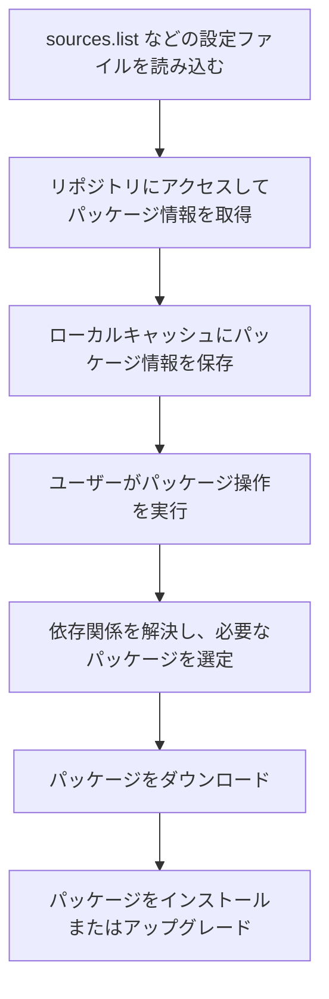
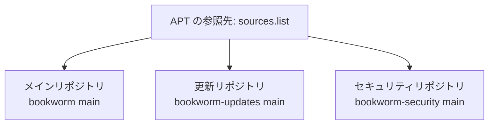
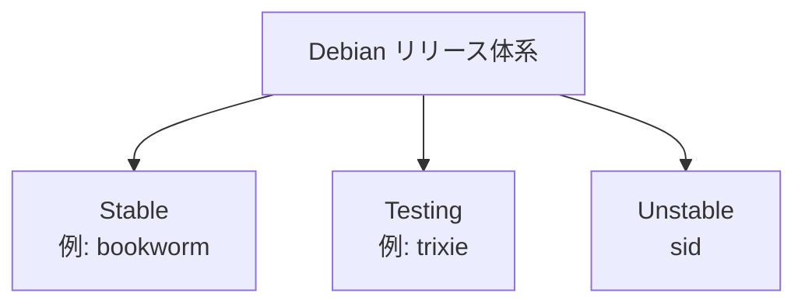
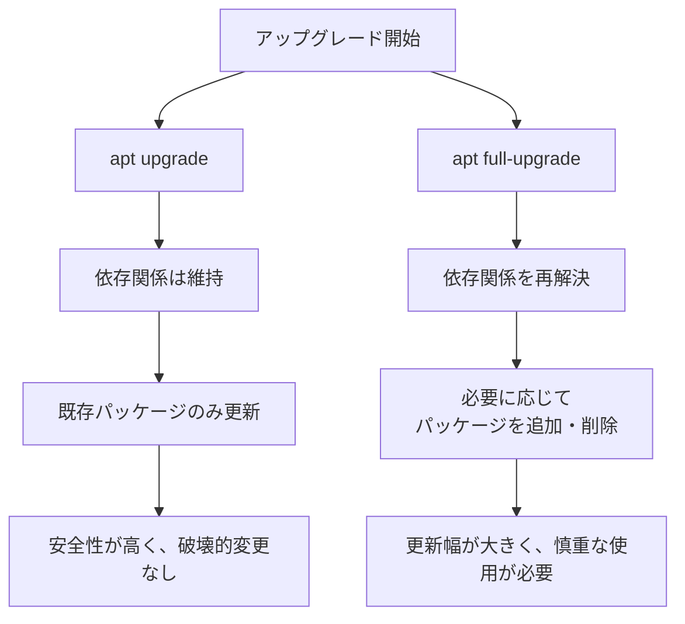

## はじめに

atsushifx です。<!-- textlint-disable ja-technical-writing/sentence-length -->
この記事では、`WSL 2` (`Windows Subsystem for Linux 2`) 上で Debian を快適に使うために、APT (`Advanced Package Tool`) の設定やメンテナンス手法について解説します。
<!-- textlint-enable -->

APT は Debian 系ディストリビューションに採用されているパッケージ管理システムで、ソフトウェアのインストール、アップグレード、削除、依存関係の解決などを一括して実行できます。

WSL 2 のような仮想化環境でも、APT を適切に活用することで、安定した開発環境を構築できます。

この記事では、以下のポイントを中心に紹介します:

- APT の基本的な使い方とコマンド
- ソースリスト (`sources.list`) の管理とミラー設定
- システムアップグレード時の注意点やトラブル対処法
- ストレージ節約や自動更新を含む定期メンテナンスの方法

<!-- textlint-disable ja-hiraku -->
WSL 2環境で Debian を使っており APT の設定に不安がある方、システムをもっと快適に運用したい方の参考になれば幸いです。
Enjoy!<!-- textlint-enable -->

## 用語集

## 1. パッケージマネージャー APT

WSL 2 上の Debian を快適に運用するために、APT (`Advanced Package Tool`) の基本を理解しておくことは非常に重要です。
APT は、Debian 系ディストリビューションの標準的なパッケージ管理ツールであり、パッケージのインストール、アップグレード、削除、依存関係の解決を一括して実行できます。

### 1.1 APT の概要

APT (`Advanced Package Tool`) は、Debian およびその派生ディストリビューションで採用されているパッケージ管理システムです。
ソフトウェアのインストール、アップグレード、削除、依存関係の解決を一貫して行なえるため、効率的なシステム運用が可能になります。

APT は、以下のような特徴を持っています。

- 依存関係の自動解決
  複数のパッケージにまたがる依存関係を自動で解析し、必要なパッケージをまとめて処理します。

- シンプルな CLI 操作
  `apt` コマンドは直感的に操作でき、Linux 初心者でも迷わず使えるインターフェースを提供します。

- リポジトリベースの管理
  `/etc/apt/sources.list` に登録されたリポジトリから、信頼されたパッケージを取得します。

APT は、ソフトウェアをインストールするだけでなく、システムの保守・管理の中心となる存在です。
WSL 2 環境で Debian を使用する場合でも、APT の基本を理解することで、より安定した開発環境を構築できます。

### 1.2 APT の主要コマンド

APT を使ったパッケージ管理では、以下の基本コマンドを覚えておくことで、効率的かつ安全にシステムを操作できます。
これらのコマンドは、通常 `sudo` をつけて実行します。

| コマンド | 説明 | 備考 |
| --- | --- | --- |
| `apt update` | パッケージリストを最新状態に更新 | リポジトリから新しいパッケージ情報を取得します |
| `apt upgrade -y` | 既存のパッケージを最新バージョンに更新 | 依存関係の変更を伴わない通常のアップグレード |
| `apt full-upgrade -y` | 必要に応じてパッケージの追加・削除を伴うアップグレード  | 依存関係が変更される可能性があるため注意が必要 |
| `apt autoremove` | 不要になった依存パッケージを削除 | システムのクリーンアップに有効 |
| `apt list --upgradable` | アップグレード可能なパッケージを一覧表示 | 更新前に影響範囲を確認する際に便利 |
| `apt full-upgrade --dry-run` | 実行前にアップグレードの影響を確認 | パッケージの追加・削除予定を事前に確認可能 |

これらのコマンドを適切に使い分けることで、システムの保守性が向上します。特に `apt full-upgrade` は、依存関係の変化を伴うため、`--dry-run` オプションでの事前確認が推奨されます。

WSL 2 上で安定した Debian 環境を維持するには、日常的に `apt update && apt upgrade` を実行し、定期的なアップデートを習慣化するのが有効です。

### 1.3 APT の基本フロー



## 2. APTのリポジトリ

APT は、リポジトリと呼ばれるサーバー群からパッケージ情報や実体を取得して動作します。
リポジトリの設定は、システムの安定性やセキュリティ、インストール可能なソフトウェアの範囲に大きく影響するため、適切に管理することが重要です。

### 2.1 リポジトリの概要

APT のリポジトリとは、Debian パッケージを配信するサーバー群のことです。
APT は、リポジトリに接続して、最新のパッケージリストや更新情報を取得し、システムの状態を保ちます。

設定ファイル `/etc/apt/sources.list` によって、APT が参照するリポジトリが決まります。このファイルの内容を適切に整えることで、安定性やセキュリティを確保しつつ、必要なパッケージを素早く取得できます。

### 2.2 公式リポジトリの種類

APT における「公式リポジトリ」は、Debian プロジェクトが提供する信頼性の高いパッケージ配信元です。適切なリポジトリ設定を行なうことで、システムの安定性とセキュリティを確保しながら、必要なパッケージをスムーズに取得できます。

#### 公式リポジトリの構成

Debian の標準的な `sources.list` ファイルには、以下の 3 種類のリポジトリが定義されています。

```ini:/etc/apt/sources.list
deb <https://deb.debian.org/debian> bookworm main
deb <https://deb.debian.org/debian> bookworm-updates main
deb <https://security.debian.org/debian-security> bookworm-security main
```

それぞれのリポジトリは、以下のような役割を持っています。

| リポジトリ名 | 用途 | 例 |
| --- | --- | --- |
| **メインリポジトリ** | Debian の基本パッケージを提供 | `deb https://deb.debian.org/debian bookworm main` |
| **更新リポジトリ** | 安定版リリース向けの定期的な更新 | `deb https://deb.debian.org/debian bookworm-updates main` |
| **セキュリティリポジトリ** | セキュリティ修正を優先的に提供 | `deb https://security.debian.org/debian-security bookworm-security main` |

これらのリポジトリを適切に組み合わせて設定することで、通常のアップデートからセキュリティ更新まで一貫したパッケージ管理が可能になります。

#### リポジトリ構成の図解



### 2.3 `backports` の活用

Debian の安定版を使いつつ、より新しいバージョンのパッケージを導入したい場合は、`backports` リポジトリを活用できます。

```ini:/etc/apt/sources.list
deb <https://deb.debian.org/debian> bookworm-backports main
```

backports には、次期リリースに含まれる新しめのパッケージが安定版向けにビルドされた形で提供されており、WSL 2 環境で最新機能を試したいときなどに便利です。

### 2.4 APT のコンポーネント設定

APT のソースリストには、リポジトリのほかに「コンポーネント」と呼ばれる分類を指定できます。これにより、APT が取得・利用するパッケージの種類を制御できます。

#### コンポーネントの概要

Debian のパッケージは、ライセンスや依存関係の方針に基づいて以下のように分類されており、これが「コンポーネント」に対応します。

| コンポーネント名 | 概要 |
| --- | --- |
| `main` | 完全にフリーなソフトウェア（Debian のポリシーを完全に満たす） |
| `contrib` | 自体はフリーだが、非フリーなソフトウェアに依存しているもの |
| `non-free` | フリーでないライセンスのソフトウェア（再配布制限など） |
| `non-free-firmware` | フリーでないファームウェア（多くはハードウェアに必要） |

これらを指定することで、APT はそれぞれのカテゴリに属するパッケージを取得できるようになります。

#### コンポーネントを指定する例

以下のように、ソースリストの末尾にコンポーネント名を空白区切りで追加します。

```ini:/etc/apt/sources.list
deb <https://deb.debian.org/debian> bookworm main contrib non-free non-free-firmware
deb <https://deb.debian.org/debian> bookworm-updates main contrib non-free
deb <https://security.debian.org/debian-security> bookworm-security main contrib
```

この例では、`main` に加えて `contrib`, `non-free`, `non-free-firmware` まで含めており、より多くのパッケージにアクセス可能です。

#### `contrib` や `non-free` を追加すべき場合

- Google Chrome、NVIDIA ドライバ、特定の Wi-Fi ファームウェアなど、プロプライエタリなパッケージを使いたい場合
- 一部のソフトウェアが `non-free` な依存関係により `contrib` に配置されている場合

#### `non-free-firmware` の追加が必要な場合

- 無線 LAN や GPU などのハードウェアが、ファームウェアを必要とする場合
- Debian 12 以降では、このコンポーネントの指定が標準になりつつある

## 3. ソースリストの管理

APT において「ソースリスト (`sources.list`)」は、どのリポジトリからパッケージを取得するかを指定する非常に重要な設定ファイルです。
システムの安定性やセキュリティ、パッケージの取得速度に大きく関わるため、適切に管理・最適化することが求められます。

このセクションでは、ソースリストの基本構造や記述例、複数リポジトリの共存方法など、APT のリポジトリ設定を効率よく管理するための基礎知識を解説します。

### 3.1 ソースリストの概要

ソースリストは、APT が使用するパッケージリポジトリを定義する設定ファイルです。
APT はこのリストの URL にアクセスして、ソフトウェアパッケージの情報を取得します。

最も基本的なソースリストは `/etc/apt/sources.list` に配置され、システム全体のパッケージ取得元として機能します。

また、特定のリポジトリや追加設定は `/etc/apt/sources.list.d/` 以下に個別の `.list` ファイルとして記述することで、柔軟に管理できます。

これにより、以下のようなメリットが得られます:

- リポジトリ設定を用途別に分離して管理しやすくなる
- テスト用・開発用・ミラー用などを安全に切り替えられる
- 複数のリポジトリを重ねて指定しやすくなる

APT はこれらすべてのリストを統合して処理するため、正しく構成されていればどこに記述しても動作上の違いはありません。

### 3.2 ソースリストの記述例

Debian のソースリスト（`/etc/apt/sources.list`）には、APT が参照するリポジトリ情報が記述されています。
リポジトリの構成や目的に応じて複数のエントリを定義し、適切にメンテナンスすることで、より快適で安全なパッケージ管理が可能になります。

#### **代表的な記述例**

以下は、Debian Bookworm（安定版）における基本的なソースリストの一例です。

```ini:/etc/apt/sources.list

# official sources.list

deb <https://deb.debian.org/debian> bookworm main
deb <https://deb.debian.org/debian> bookworm-updates main
deb <https://deb.debian.org/debian> bookworm-backports main
deb <https://security.debian.org/debian-security> bookworm-security main
```

#### **各エントリの構成**

| 項目 | 内容 |　備考 |
| --- | --- | --- |
| `deb` / `deb-src` | `deb` はバイナリパッケージ、`deb-src` はソースパッケージを指定します | |
| リポジトリURL | パッケージの取得元となるサーバーのアドレス | |
| ディストリビューション | 対象となるリリース名 | bookwormなど |
| コンポーネント | パッケージの分類 | main、contrib、non-free など |

#### **コンポーネントの補足**

ソースリストの末尾に指定されるコンポーネントには、以下の種類があります。

| コンポーネント | 説明 |
| --- | --- |
| `main` | 完全にフリーな公式ソフトウェア群 |
| `contrib` | フリーソフトウェアだが非フリーな依存を持つもの |
| `non-free` | 非フリーなライセンスを含むソフトウェア |
| `non-free-firmware` | ハードウェア動作用の非フリーなファームウェア（Debian 12 以降で導入） |

これらを必要に応じて組み合わせることで、APT の柔軟なパッケージ管理が実現できます。

### 3.3 Debianのリリースとリポジトリ

APT のソースリストでは、どの Debian リリースを使用するかを明示的に指定します。
これにより、安定性重視の環境構築や、開発目的での最新版利用など、目的に応じた環境設計が可能になります。

#### Debian の主なリリース体系

Debian では、各リリースにコードネームが割り当てられており、APT ではこのコードネームを元にパッケージを取得します。

| リリース名 | ステータス | 用途 |
| --- | --- | --- |
| `bookworm` | Stable（安定版） | 安定した運用を求めるユーザー向け |
| `trixie` | Testing（テスト版） | 次期安定版候補。新機能の検証に適する |
| `sid` | Unstable（不安定版） | 開発向け。最新のパッケージが最速で反映される |

#### リリース構成図

以下の図は、Debian のリリース構成とその関係を示したものです。APT の設定時に、どのリリースを選ぶべきかの判断材料になります。



#### ソースリストでの指定方法

APT の設定ファイル `/etc/apt/sources.list` では、以下のようにリリースごとに記述できます。

```ini:/etc/apt/sources.list

# 安定版（Stable）

deb https://deb.debian.org/debian bookworm main
deb https://security.debian.org/debian-security bookworm-security main

# テスト版（Testing）
deb https://deb.debian.org/debian trixie main

# 開発版（Unstable）
deb https://deb.debian.org/debian sid main
```

#### `stable` / `testing` といった汎用名を使う際の注意点

APT では、リリース名の代わりに `stable`, `testing` などの汎用名を使うことも可能です。

```ini:/etc/apt/sources.list
deb https://deb.debian.org/debian stable main
```

このように設定すると、Debian の新バージョンが公開されたときに、APT は自動的に新しいリリースに切り替わります。
例：`stable` を指定していると、`bookworm` から `trixie` に自動で移行する可能性があります。

この挙動は意図しないメジャーアップグレードを引き起こすリスクがあるため、
**安定運用を重視する環境では明示的にリリース名を指定するのが安全**です。

## 4. ミラーの設定

### 4.1 ミラーリポジトリの概要

Debian では、公式リポジトリ以外にも、さまざまなミラーリポジトリを利用できます。
ミラーリポジトリを利用することで、地域ごとに最適化されたダウンロード速度を享受できるほか、公式リポジトリの負荷を分散できます。

APT では、ディレクトリ `/etc/apt/sources.list.d/` 下に個別のリストファイルを作成し、追加のリポジトリを指定できます。
たとえば、日本のミラーや CDN ミラーを設定することで、より快適なパッケージ管理が可能になります。

#### ミラーリポジトリの種類

以下に代表的なミラーリポジトリを示します。

| ミラー | ファイル名 | 説明 |
| --- | --- | --- |
| 日本のミラー | `japan.list` | 日本国内の Debian ミラー |
| `Fastly CDN`| `fastly-cdn.list` | Debian の公式 CDN ミラー |

各ミラーリポジトリは、`/etc/apt/sources.list.d/` 下に個別の `.list` ファイルとして作成することで、公式リポジトリと共存できます。

### 4.2 Fastly CDN の活用

Debian のパッケージリポジトリは、Fastly CDN に統合されており、公式の `deb.debian.org` を利用することで、最適な CDN ノードに自動接続されます。
この仕組みにより、世界中のどこからでも高速で安定したパッケージダウンロードが可能になります。

#### **Fastly CDN のメリット**

- **速度向上**: 地理的に近い CDN ノードからパッケージを取得するため、高速なダウンロードが可能
- **可用性の向上**: 公式リポジトリが一時的にダウンしても、CDN にキャッシュされたパッケージが提供される
- **負荷分散**: Debian の公式サーバーの負荷を軽減し、全体のパフォーマンスを向上

#### **Fastly CDN を利用するための設定**

デフォルトでは、`deb.debian.org` を指定すれば Fastly CDN が自動的に利用されます。
しかし、明示的に Fastly の CDN ノードの指定も可能です。

1. `/etc/apt/sources.list.d/cdn-fastly.list` を作成し、次の内容を記述:

   ```ini:/etc/apt/sources.list.d/cdn-fastly.list
   # Fastly CDN mirror

   deb https://cdn-fastly.deb.debian.org/debian stable main
   deb https://cdn-fastly.deb.debian.org/debian-security stable-security main
   deb https://cdn-fastly.deb.debian.org/debian-debug stable-debug main
   ```

2. APT のパッケージリストを更新

   ```bash
   sudo apt update
   ```

この設定により、APT は Fastly CDN を経由してパッケージを取得するようになります。

### 4.3 日本のミラーを使う

日本国内では、日本に設置された Debian ミラーを利用することで、ネットワークの遅延が少なくなります。
つまり、より高速かつ安定した回線でのパッケージの取得が可能です。

#### **日本のミラーのメリット**

- **高速なダウンロード**: 日本国内のサーバーからパッケージを取得できるため、ダウンロード速度が向上
- **公式リポジトリの負荷分散**: Debian の公式サーバーに負荷をかけずに更新可能
- **地域最適化**: 海外リポジトリと比べて接続の安定性が向上

#### **日本のミラーの設定方法**

1. **日本のミラーリストを確認**
   Debian の日本ミラーは、[CDN 対応ミラーの設定](https://www.debian.or.jp/community/push-mirror.html) で最新の情報を確認できます。

2. **日本のミラーを `/etc/apt/sources.list.d/` に追加**
   `/etc/apt/sources.list.d/japan-mirror.list` を作成し、以下の内容を記述します。

   ```ini:/etc/apt/sources.list.d/japan-mirror.list
   # official japan mirror

   deb http://ftp.jp.debian.org/debian/ bookworm main
   deb http://ftp.jp.debian.org/debian/ bookworm-updates main
   deb http://ftp.jp.debian.org/debian/ bookworm-backports main
   deb http://security.debian.org/debian-security bookworm-security main
   ```

3. **APT のパッケージリストを更新**
   ミラーの設定後、以下のコマンドを実行してリポジトリ情報を更新します。

   ```bash
   sudo apt update
   ```

以上で、日本のミラーの設定は完了です。

## 5. システムの更新

Debian のアップグレードとは、システムにインストールされているパッケージを最新の状態に更新するプロセスです。
WSL 2 環境では、安定した環境を維持しつつ定期的なアップデートを行なうことで、セキュリティリスクを低減し、最新の機能を利用できます。

このセクションでは、APT を使ったシステムの更新方法と注意点について解説します。

### 5.1 アップグレードの種類

Debian のアップグレードとは、システムにインストールされているパッケージを最新の状態に更新するプロセスです。
`WSL 2` 環境では、定期的なアップデートが重要です。
これにより、セキュリティリスクを軽減し、常に最新の機能を利用できます。

#### 通常のアップグレード (`apt upgrade`) とフルアップグレード (`apt full-upgrade`) の違い

| アップグレードの種類 | コマンド | 概要 | 影響・特性 | 使用すべき場面 |
| --- | --- | --- | --- | --- |
| 通常のアップグレード | `apt upgrade` | 既存パッケージを依存関係を変えずに更新 | パッケージの追加・削除なし。安全性が高い | 日常的な更新、セキュリティアップデート |
| フルアップグレード | `apt full-upgrade` | 必要に応じてパッケージの追加や削除を行なう | 依存関係の変更あり。パッケージの追加/削除の可能性あり | メジャーアップグレード、新機能を取り込みたいとき |

#### アップグレードのフロー図

以下は、APT におけるアップグレードの選択肢とその挙動を比較した図です。



`apt full-upgrade` を実行すると構成が変わることもあるため、`--dry-run` オプションで事前に内容を確認しておくことが重要です。

#### 影響の事前確認 (`--dry-run`)

アップグレードの影響を確認したい場合は、以下のように `--dry-run` オプションを使用します。実際の変更は行なわれません。

```bash
sudo apt full-upgrade --dry-run
```

このコマンドで、追加・削除される予定のパッケージ一覧を事前に確認できます。

### 5.2 パッケージ更新の手順

Debian を最新の状態に維持するには、まず APT のパッケージリストを更新し、次にパッケージをアップグレードする必要があります。
次の手順で、パッケージを更新します。

1. パッケージリストの更新:
   リポジトリの最新情報を取得します。

   ```bash
   sudo apt update
   ```

   実行すると、以下のように出力されます。

   ```bash
   Hit:1 http://deb.debian.org/debian bookworm InRelease
   Get:2 http://deb.debian.org/debian bookworm-updates InRelease [55.4 kB]
   Get:3 http://security.debian.org/debian-security bookworm-security InRelease [48.0 kB]
    .
    .
    .
   Fetched 39.0 MB in 5s (7,607 kB/s)
   Reading package lists... Done
   Building dependency tree... Done
   2 packages can be upgraded. Run 'apt list --upgradable' to see them.
   ```

2. アップグレード対象の確認:
   アップグレード可能なパッケージを確認します。

   ```bash
   apt list --upgradable
   ```

   実行すると、以下のように出力されます。

   ```bash
   Listing... Done
    .
    .
   vim-common/stable 2:9.0.1378-2+deb12u2 all [upgradable from: 2:9.0.1378-2]
   vim-tiny/stable 2:9.0.1378-2+deb12u2 amd64 [upgradable from: 2:9.0.1378-2]
   ```

3. 通常のアップグレードの実行:
   依存関係を変更せず、既存のパッケージを最新バージョンにアップグレードします。

   ```bash
   sudo apt upgrade -y
   ```

   実行すると、以下のように出力されます。

   ```bash
   Reading package lists... Done
   Building dependency tree... Done
   Calculating upgrade... Done
   The following packages will be upgraded:
    .
    .
    .
   Setting up libgnutls30:amd64 (3.7.9-2+deb12u4) ...
   Processing triggers for libc-bin (2.36-9+deb12u9) ...
   ```

4. フルアップグレードの実行 (必要な場合):
  パッケージの追加・削除を伴うアップグレードが必要な場合は、以下を使用します。

   ```bash
   sudo apt full-upgrade -y
   ```

5. 不要パッケージの削除:
   アップグレード後、使われなくなった依存パッケージを削除します。

   ```bash
   sudo apt autoremove -y
   ```

6. キャッシュのクリーンアップ (任意):
   古くなったパッケージキャッシュを削除してストレージを節約します。

   ```bash
   sudo apt autoclean
   ```

これらの手順を定期的に行なうことで、Debian システムを安定かつ安全に保つことができます。

#### 補足: アップグレード後のクリーンアップ

アップグレードのあとには、不要なパッケージやキャッシュがシステム内に残ることがあります。これらは削除して、システムをクリーンな状態に保つことをおすすめします。
以下のコマンドでシステムをクリーンに保てます。

```bash
sudo apt autoremove -y     # 使われなくなった依存パッケージを削除
sudo apt clean             # 古いパッケージキャッシュの削除
```

リポジトリ情報に不整合がある場合は、次のコマンドでパッケージリストを再構築します。

```bash
sudo rm -rf /var/lib/apt/lists/* && sudo apt update
```

### 5.3 アップグレード時のトラブルシューティング

WSL 2 上の Debian で APT によるアップグレードを行なう際に、まれに問題が発生します。
ここでは、代表的なトラブルとその対処法を紹介します。

#### [NET-001]: `apt update` でリポジトリエラーが発生する

```bash
Failed to fetch <http://deb.debian.org/>... Could not resolve 'deb.debian.org'
```

- 原因:
  - ネットワーク接続の問題
  - DNS 解決が機能していない
  - ミラーサーバーが一時的な障害
  - `sources.list` の記述ミス

- 対策:
  1) ネットワーク接続を確認
     インターネットに接続しているかを確認する

     ```bash
     sudo ping -c 5 deb.debian.org
     dig deb.debian.org
     ```

  2) DNS を一時的に変更 (Google DNS)

     ```bash
     echo "nameserver 8.8.8.8" | sudo tee /etc/resolv.conf
     ```

  3) 別のミラーを試す (例:日本ミラー)

     ```bash
     sudo sed -i 's|deb.debian.org|ftp.jp.debian.org|' /etc/apt/sources.list
     ```

  4) パッケージリストの再構築

     ```bash
     sudo rm -rf /var/lib/apt/lists/*
     sudo apt update
     ```

このエラーは DNS やネットワーク設定の見直しで解決することが多いため、まずは通信の確認から始めるのが効果的です。

#### [APT-001]: `apt upgrade`実行時にパッケージの競合が発生する

```bash
The following packages have unmet dependencies:
  package-name : Depends: lib-xyz (>= 2.0) but it is not going to be installed
E: Unable to correct problems, you have held broken packages.
```

- **原因**
  - 依存関係の破損や不整合
  - 一部パッケージが hold 状態で固定されている
  - リポジトリ間のバージョン差異

- **対処法**
  1. **壊れた依存関係を修復**

     ```bash
     sudo apt --fix-broken install
     ```

  2. **`apt full-upgrade` を試す**

     ```bash
     sudo apt full-upgrade -y
     ```

     :::message alert
     不要なパッケージを削除する可能性があるため、事前に --dry-run で確認することを推奨します
     :::

  3. **固定 (`hold`) パッケージの確認と解除**

     ```bash
     dpkg --get-selections | grep hold
     sudo apt-mark unhold <package-name>
     ```

  4. **APT キャッシュのクリアと再更新**

     ```bash
     sudo apt clean
     sudo rm -rf /var/lib/apt/lists/*
     sudo apt update
     ```

  5. **個別パッケージの調整**
     - 不要なパッケージを削除

       ```bash
       sudo apt remove <package-name>
       ```

     - 特定バージョンを明示的に指定してインストール

       ```bash
       sudo apt install <package-name>=<version>
       ```

     - 依存関係を強制的に修正

       ```bash
       sudo apt install -f
       ```

APT の依存関係エラーは複雑に見えても、順を追って対処すれば解決できるケースがほとんどです。焦らず対処していきましょう。

#### [APT-002] `apt autoremove` で誤って重要なパッケージを削除してしまった

```bash
The following packages were automatically installed and are no longer required:
package-x package-y package-z
Use 'sudo apt autoremove' to remove them.
```

- **問題**:
  `sudo apt autoremove` の実行により、重要なパッケージまで誤って削除してしまい、システムやアプリケーションの動作に支障が出ることがあります。

- **原因**:
  - 手動でパッケージを削除した際、その依存パッケージが「不要」と判定される。
  - `--no-install-recommends` によって推奨パッケージがインストールされておらず、依存関係が不完全になる。
  - APT の管理データが破損し、依存情報が誤って扱われる。

- **対処法**
  1. **削除予定の確認** (`--dry-run`)
     `--dry-run` オプションを使って影響を確認することが推奨されます。

     ```bash
     sudo apt autoremove --dry-run
     ```

     実行前に削除対象を確認できます。

  2. **削除されたパッケージのログ確認**
     `/var/log/apt/history.log`を確認し、削除されたパッケージを調べる。

     ```bash
     grep "Remove" /var/log/apt/history.log

     ```

     必要なパッケージが含まれていた場合、再インストールします。

      ```bash
     sudo apt install <package-name>
     ```

  3. **`--fix-missing` オプションによる復元**

     ```bash
     sudo apt update --fix-missing
     sudo apt upgrade -y
     ````

  4. **タスクメタパッケージで再インストール**:

     ```bash
     sudo apt install --install-recommends task-<meta-package-name>
     ```

     必要な機能に応じて、task-desktop なども使用可能です。

  5. **`dpkg`のデータベース修復**

     ```bash
     sudo dpkg --configure -a
     sudo apt install -f
     ```

  6. **依存関係の自動修復**

     ```bash
     sudo apt --fix-broken install
     ```

  7. **APT 自体が削除された場合の復旧**

     ```bash
     wget <http://ftp.debian.org/debian/pool/main/a/apt/apt>_<VERSION>_amd64.deb
     sudo dpkg -i apt_<VERSION>_amd64.deb
     sudo apt update
     ```

     :::message
      `<VERSION>`は環境に応じて適切なバージョンに置き換えてください。
     :::

#### [SYS-001]: `apt full-upgrade` 後に WSL 2 の動作が不安定になる

- **問題**
  `sudo apt full-upgrade` 実行後、WSL 2 環境で以下のような不具合が発生することがあります。

  - WSL 2 が起動しない、または極端に遅くなる
  - `systemd` に関するエラーが表示される
  - `ping` や `curl` などネットワーク関連のコマンドが動作しない
  - `apt` コマンド実行時にエラーが発生する

- **原因**
  - カーネル関連パッケージがアップグレードされても、WSL 2 のカーネルには反映されない
  - `systemd` が誤って有効化され、サービスの起動に失敗している
  - `/etc/resolv.conf` などネットワーク設定ファイルの変更により DNS 解決に失敗している
  - `full-upgrade` によって重要なパッケージが削除された

- **対処法**
  1. **`WSL 2`の再起動**

     ```powershell
     wsl --shutdown
     ```

     → 再起動によって、環境が正常に戻る場合があります。

  2. **`systemd` の設定を確認**

     ```bash
     systemctl list-units --type=service
     ```

     `systemd` を無効化するには、`/etc/wsl.conf` に以下を追加します。

     ```conf:/etc/wsl.conf

     [boot]
     systemd=false
     ```

  3. **ネットワークの確認と修正**
     DNS 設定の確認:

     ```bash
     cat /etc/resolv.conf
     ```

     空の場合は、DNS サーバーを一時的に設定します。

     ```bash
     # Google DNSを設定
     echo "nameserver 8.8.8.8" | sudo tee /etc/resolv.conf
     ```

     永続化したい場合は、`/etc/wsl.conf` に以下を追加します。:

     ```conf:/etc/wsl.conf

     [network]
     generateResolvConf = false
     ```

  4. **APT の修復処理**

     ```bash
     sudo apt --fix-broken install
     sudo dpkg --configure -a
     sudo apt update
     ```

  5. **削除されたパッケージの確認と再インストール**

     ```bash
     grep "Remove" /var/log/apt/history.log
     sudo apt install <removed-package>
     ```

  6. **WSL の再起動 (再度)**

     ```powershell
     wsl --shutdown
     wsl
     ```

  7. **最終手段: ディストリビューションの再インストール**

     ```powershell
     wsl --terminate Debian
     wsl --unregister Debian
     wsl --install -D Debian
     ```

     :::message alert
     `wsl --unregister`はすべてのデータを削除します。実行前にバックアップを取ってください。
     :::

アップグレード後に不具合が発生した場合でも、手順を追って修正すれば復旧できるケースがほとんどです。
 システム変更の前にはバックアップと事前確認を忘れずに行ないましょう。

## 6. APT の定期メンテナンス

Debian のパッケージ管理システム APT は、定期的なメンテナンスをすることで、システムの安定性とパフォーマンスを維持できます。
特に WSL 2 の環境では、ストレージ使用量を抑え、アップグレード時のトラブルを最小限にするため、定期的なメンテナンスが重要です。

### 6.1 システムのクリーンアップ

APT はパッケージのインストール時に `.deb` ファイルをキャッシュとして保存します。
これらは再インストールなどで再利用されますが、長期間使用していないとストレージを圧迫する要因になります。
特に WSL 2 のような限られたストレージ環境では、定期的なクリーンアップが効果的です。

#### **キャッシュの保存場所**

APT のキャッシュは、通常 `/var/cache/apt/archives/` に保存されます。

#### **キャッシュの削除方法**

- **すべてのキャッシュを削除 (完全削除)**

   ```bash
   sudo apt clean
   ```

   → 上記ディレクトリ内のすべての `.deb` ファイルを削除します。

- **不要なキャッシュのみ削除 (部分削除)**

   ```bash
   sudo apt autoclean
   ```

   → すでにリポジトリに存在しない古い `.deb` ファイルのみを削除します。

#### **削除前に確認する方法**

削除による影響を確認したい場合は、--dry-run オプションを使います。

```bash
sudo apt autoclean --dry-run
```

このようにして、キャッシュの肥大化を防ぎ、ストレージの有効活用が可能になります。

#### **不要パッケージの削除**

アップグレードなどによって不要になったパッケージも削除することで、システムをクリーンに保てます。

1. 削除予定の確認:

   ```bash
   sudo apt autoremove --dry-run
   ```

2. 実際に削除する:

   ```bash
   sudo apt autoremove -y
   ```

これらの操作を定期的に行なうことで、APT のキャッシュ肥大化を防ぎ、WSL 2 のストレージを有効活用できます。

### 6.2 パッケージリストの再構築

APT は、各リポジトリのパッケージ情報をローカルに保持しています。これを「パッケージリスト」と呼びます。
何らかの理由でリストが破損したり、不整合が発生した場合、パッケージの更新やインストールが正常にできなくなることがあります。

このような場合は、パッケージリストを削除して再構築することで、多くの問題が解決します。

#### **パッケージリストの再構築手順**

1. 現在のパッケージリストを削除する:

   ```bash
   sudo rm -rf /var/lib/apt/lists/*
   ```

2. パッケージリストを再取得する:

   ```bash
   sudo apt update
   ```

この手順を行なうことで、APT はすべてのリポジトリから最新の情報を再取得し、正しい状態のパッケージリストを構築します。

#### **こんなときに役立ちます**

- `apt update` で `404 エラー` が発生する
- 新しいミラーに変更したのに、反映されない
- リポジトリ情報が壊れているときの復旧

パッケージ管理でトラブルが発生した際は、この手順を試すと改善することが多くあります。

### 6.3 セキュリティアップデートの適用

Debian では、セキュリティに関するパッケージ更新が迅速に提供されます。
これらのアップデートを定期的に適用することで、システムを安全な状態に保つことができます。
WSL 2 のような開発環境であっても、外部と通信する以上、セキュリティ対策は重要です。

#### **セキュリティアップデートの手順**

1. パッケージリストを更新します:

   ```bash
   sudo apt update
   ```

2. セキュリティ更新を含むすべてのアップグレードを実行します:

   ```bash
   sudo apt upgrade -y
   ```

この手順で、セキュリティ修正を含む最新のパッケージがシステムに適用されます。

#### **セキュリティリポジトリの確認**

セキュリティアップデートを受け取るには、`/etc/apt/sources.list` またはその下位ファイルに、次のような記述があることを確認してください。

```ini:/etc/apt/sources.list
deb https://security.debian.org/debian-security bookworm-security main
```

このリポジトリが存在しない場合は、セキュリティアップデートが適用されません。

セキュリティアップデートは、APT による日常的なアップグレードに含まれます。`apt update && apt upgrade` を定期的に実行するだけで、大半の脆弱性に対処できます。

### 6.4 自動アップデートの設定

APT には、自動でパッケージをアップデートする仕組みが用意されています。これにより、手動で更新作業を行なわなくても、セキュリティ更新を中心にシステムを最新の状態に保つことができます。

#### **`unattended-upgrades` の導入**

 1. パッケージのインストール :

    ```bash
    sudo apt install unattended-upgrades
    ```

 2. 自動実行の有効化:
    自動アップデートを有効にする設定ファイルを作成または編集します。

    ```bash
    sudo vim /etc/apt/apt.conf.d/20auto-upgrades
    ```

    次のように記述します:

    ```conf:/etc/apt/apt.conf.d/20auto-upgrades
    APT::Periodic::Update-Package-Lists "1";
    APT::Periodic::Unattended-Upgrade "1";
    ```

    この設定により、1日ごとにパッケージリストを更新し、セキュリティアップデートが自動で適用されるようになります。

 3. 設定の確認・再構成
    必要に応じて、対話的に設定を見直すことも可能です。

    ```bash
    sudo dpkg-reconfigure unattended-upgrades
    ```

    :::message alert
    - 自動アップデートは、セキュリティパッチが対象です。通常の機能追加やメジャーアップグレードは対象外です。
    - 変更内容をログで確認するには、`/var/log/unattended-upgrades/` を参照してください。
    :::

#### **自動アップデートの処理フロー**

以下は、`unattended-upgrades` による自動更新の処理フローを示した図です。

```mermaid
flowchart TD
    T["1日ごとのタイマー実行"]
    T --> A["パッケージリスト更新 (apt update)"]
    A --> B["セキュリティアップグレードの有無を確認"]
    B --> C["該当パッケージを自動アップグレード"]
    C --> D["ログに記録（/var/log/unattended-upgrades/）"]
````

このように、`unattended-upgrades` はシステムの裏側で静かに動作し、重要なセキュリティアップデートを適用してくれます。
特に WSL 2 環境では放置されやすいため、こうした自動化設定が非常に有効です。

## おわりに

この記事では、WSL 2 上で Debian を快適に使うための APT 設定とメンテナンス手法について解説しました。
APT の基本操作からソースリストやミラー設定の最適化、アップグレード時のトラブル対処法までを体系的に整理することで、より安定した開発環境の構築を目指しました。

WSL 2 は Linux を手軽に扱える強力な環境です。APT を適切に使いこなせば、パッケージ管理の手間を最小限に抑えつつ、安全で最新の環境を維持できます。

この記事の内容が、みなさんの作業環境改善の一助となれば幸いです。
それでは、Happy Hacking!

## 参考資料

### Webサイト

- [第2章 Debian パッケージ管理](https://www.debian.org/doc/manuals/debian-reference/ch02.ja.html):
  公式リファレンスによる、Debian のパッケージ管理方法

- [sources.list - APT のデータ取得元の設定リスト](https://manpages.debian.org/unstable/apt/sources.list.5.ja.html):
  APT のマニュアルにおける、ソースリストの説明

- [Debian SourcesList](https://wiki.debian.org/SourcesList):
  Debian Wiki による、sources.list の解説

- [apt.conf - APT の設定ファイル](https://manpages.debian.org/testing/apt/apt.conf.5.ja.html):
  APT のマニュアルにおける、設定ファイル`apt.conf`の説明

- [UnattendedUpgrades](https://wiki.debian.org/UnattendedUpgrades):
  Debian Wiki による、`UnattendedUpgrades`の解説

- [Debian サーバの自動セキュリティ更新](https://zenn.dev/tetr4lab/articles/bbf4e486038da5):
  UnattendedUpgrades を使用した Debian サーバー更新の備忘録

- [Debian mirrors backed by Lastly CDN](https://deb.debian.org/):
  Fastly による CDN ミラー

- [CDN 対応ミラーの設定](https://www.debian.or.jp/community/push-mirror.html):
  Debian 日本語サイトの CDN ミラー
