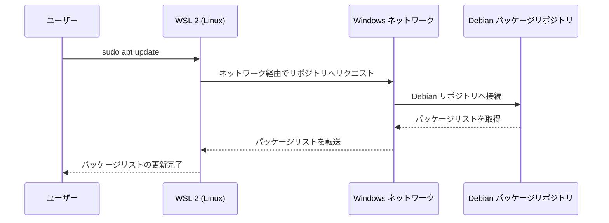
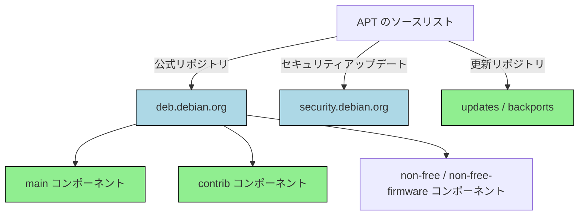
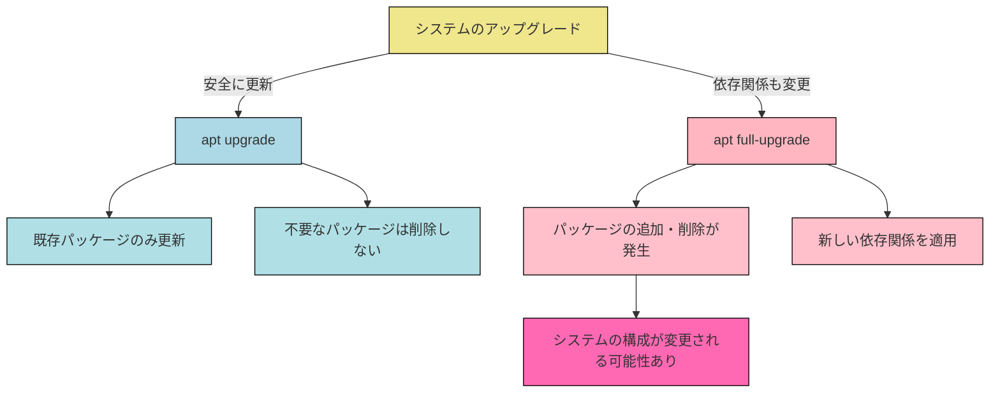

## はじめに

atsushifx です。<!-- textlint-disable ja-technical-writing/sentence-length -->
この記事では、`WSL 2` (`Windows Subsystem for Linux 2`)上の Debian で、パッケージマネージャー APT (`Advanced Package Tool`) を活用したパッケージ管理の方法を解説します。
<!-- textlint-enable -->

APT は  Debian およびその派生ディストリビューションで使用されるパッケージ管理システムです。
Debian では、さまざまなツールやシステムをパッケージ単位で管理し、適切に設定することで快適な開発環境を構築できます。

この記事では、以下の内容を解説します:

- APT の基本設定とよく使うコマンド
- ソースリスト　(`sources.list`) の管理とパフォーマンス向上のためのミラー設定
- APT を使った Debian のアップグレード方法

この記事を参考にして、`WSL 2`上の Debian 環境をより快適に活用してください。
Enjoy!

## 用語集

- `APT` (`Advanced Package Tool`):
  Debian およびその派生ディストリビューションで使用されるパッケージ管理システム

- `WSL 2` (`Windows Subsystem for Linux 2`):
  Windows 上で Linux を実行するための環境。WSL 1 と比較して、完全な Linux カーネルを搭載し、より高速な I/O パフォーマンスを提供する。

- `sources.list`:
  APT が参照するパッケージリポジトリの一覧を記述する設定ファイル

- `Debian`:
  安定性とセキュリティの高さが特徴で Ubuntu のベースとなっている Linuxディストリビューション

- `bookworm`:
  2025年現在、Debian の stable リリースのコードネーム

- `trixie`:
  Debian の unstable リリースで、次期 stable となる予定のコードネーム

- `Fastly CDN`:
  Debian パッケージの配信を高速化するために採用されたコンテンツ配信ネットワーク (CDN)

- `backports`:
  Debian の stable で使用できるように、新しいソフトウェアを古いリリース向けにビルドしたパッケージリポジトリ。

- `security リポジトリ`:
  Debian におけるセキュリティ更新専用のパッケージリポジトリ

- `main` / `contrib` / `non-free`:
  パッケージリポジトリで提供するソフトウェアをカテゴリー別に分けたコンポーネント

- `wsl --shutdown`:
  `WSL 2` を完全に停止する Windows 側のコマンド

## 1. パッケージマネージャー APT

### 1.1 APT とは?

APT(`Advanced Package Tool`) は、Debian およびその派生ディストリビューションで使用されるパッケージ管理システムです。

以下の図1は、`WSL 2` 上で APT がパッケージの更新を処理する流れを示しています。



*[図1] `WSL 2` における `apt update` のリクエストフロー*

### 1.2 APT の主要コマンド

`APT`では、パッケージの管理を効率的に行なうために、以下の基本コマンドを使用します。
(`apt`は root 権限が必要なため、通常`sudo`コマンドを使用します)

| コマンド | 説明 | 備考 |
| --- | --- | --- |
| `apt update` | パッケージリストを最新の状態にする | リポジトリから新しいパッケージやアップデートの情報を取得 |
| `apt upgrade -y` | 既存のパッケージを最新バージョンに更新する | 依存関係を変更せず、既存パッケージのみ更新 |
| `apt full-upgrade -y` | 必要に応じて新しいパッケージをインストール・削除しながらアップグレードする  | 依存関係が変更される可能性がある |
| `apt autoremove` | 依存関係がなくなった不要なパッケージを削除する | |
| `apt list --upgradable` | 更新可能なパッケージを表示 | |
| `apt full-upgrade --dry-run` | フルアップグレードの影響を事前に確認 | 削除されるパッケージを確認 |

## 2. ソースリストの基礎

### 2.1 ソースリストとは?

ソースリストは、APT が使用するパッケージリポジトリが書かれた設定ファイルです。
通常、ソースリストは`/etc/apt/sources.list`として配置されます。
APT は、ここに記載されたリポジトリからパッケージ情報を取得し、それをもとにパッケージのインストールや更新を行ないます。

また、追加のソースリストを作製できます。これらは、`/etc/apt/sources.list.d/`配下に配置され、個別のミラーリポジトリが記載されています。

### 2.2 ソースリストの基本構成

通常、`/etc/apt/sources.list` には以下のエントリが定義されています。

```ini:/etc/apt/sources.list
# official sources.list

deb https://deb.debian.org/debian bookworm main
deb https://deb.debian.org/debian bookworm-updates main
deb https://deb.debian.org/debian bookworm-backports main
deb https://security.debian.org/debian-security bookworm-security main
```

各エントリのパラメータには、以下のような意味を持ちます。

- **deb / deb-src**:
  - `deb` → バイナリパッケージ（実行可能なソフトウェア）を提供
  - `deb-src` → ソースパッケージ（ソースコードを含む）を提供
- **URL**:
  - パッケージを取得するリポジトリのアドレス（例: `https://deb.debian.org/debian`）
- **コードネーム（リリース名）**:
  - APT が管理する Debian のコードネーム
- **リポジトリの種類**:
  - `updates` → 安定版の更新
  - `backports` → 古い Debian でも新しいソフトウェアをインストール可能にするリポジトリ
  - `security` → セキュリティアップデート専用リポジトリ
- **コンポーネント**:
  - `main` → Debian 公式のフリーソフトウェア群
  - `contrib` → 自由ソフトウェアだが、非自由なコンポーネントを含む
  - `non-free` → 非自由なライセンスのソフトウェア
  - `non-free-firmware` - 非自由なライセンスを持つファームウェア

### 2.3 コードネーム (リリース名)

Debian では、各リリースにコードネームが割り当てられており、APT のソースリスト (`/etc/apt/sources.list`) では、これらのコードネームに対応したパッケージを取得します。

#### **現在の主要なリリース**

2025年現在、Debian のリリース状況は以下の通りです。

| リリース名 | ステータス | 役割 |
| --- | --- | --- |
| `bookworm` | **Stable** (安定版) | 現在の正式な安定版リリース |
| `trixie` | **Testing** (テスト版) | 次期 Stable となるリリース候補 |
| `sid` | **Unstable** (不安定版) | 最新のパッケージが常に反映される開発版 |

#### **ソースリストでの指定方法**

APT のソースリスト (`/etc/apt/sources.list`) でリリースを指定する際は、以下のように記述します。

```ini:/etc/apt/sources.list

# 安定版 (Stable)
deb https://deb.debian.org/debian bookworm main
deb https://security.debian.org/debian-security bookworm-security main

# 次期リリース (Testing)
deb https://deb.debian.org/debian trixie main

# 開発版 (Unstable)
deb https://deb.debian.org/debian sid main
```

#### **リリース名の変更とリスク**

ソースリストで `stable` や `testing` を指定できますが、将来的に新しいリリースが出た際に自動で移行されてしまうため、推奨されません。
(例: stable を指定すると、次の Stable リリース (trixie) が公開されたときに、自動で bookworm から trixie へアップグレードされます。)

```ini:/etc/apt/sources.list

deb https://deb.debian.org/debian stable main
```

このような設定をすると、意図せずにシステム全体をメジャーアップグレードする可能性があり、システムの安定性に影響を与えるため注意が必要です。

## 3. ミラーの設定

### 3.1 公式リポジトリ

Debian の公式リポジトリは、APT がパッケージを取得するために利用する標準的なリポジトリです。
ソースリスト (`/etc/apt/sources.list`) に適切なリポジトリを指定することで、安定したパッケージ管理が可能になります。

#### 公式リポジトリの基本構成

デフォルトの `/etc/apt/sources.list` には、以下のようなリポジトリが記述されています。

```ini:/etc/apt/sources.list
# official sources.list

deb https://deb.debian.org/debian bookworm main
deb https://deb.debian.org/debian bookworm-updates main
deb https://security.debian.org/debian-security bookworm-security main
```

この設定により、以下の 3種類のリポジトリが有効になります。

1. **メインリポジトリ** (debian)
   `deb https://deb.debian.org/debian bookworm main`
   Debian の標準パッケージを提供するリポジトリ。

2. **更新リポジトリ** (bookworm-updates)
   `deb https://deb.debian.org/debian bookworm-updates main`
   安定版のアップデートが提供されるリポジトリ。

3. **セキュリティリポジトリ** (debian-security)
   `deb https://security.debian.org/debian-security bookworm-security main`
   セキュリティ修正が最優先で提供されるリポジトリ。

#### リポジトリの種類と役割

| リポジトリ | 説明 |
| --- | --- |
| debian | Debian標準の パッケージを提供 |
| debian-updates | 安定版向けの最新パッケージを提供 |
| debian-security | セキュリティ更新専用のリポジトリ |
| debian-backports | 古い Debian でも新しいパッケージをインストール可能にするリポジトリ |

追加で `backports` を有効にする場合は、以下の行を `/etc/apt/sources.list` に追加します。

```ini:/etc/apt/sources.list
deb https://deb.debian.org/debian bookworm-backports main
```

#### APT の公式リポジトリ構造

以下の図は、APT の公式リポジトリがどのように構成されているかを示します。



*[図2] リポジトリ構造*

### 3.2 ミラーリポジトリ

Debian では、公式リポジトリ以外にも、さまざまなミラーリポジトリを利用できます。
ミラーリポジトリを利用することで、地域ごとに最適化されたダウンロード速度を享受できるほか、公式リポジトリの負荷を分散できます。

APT では、ディレクトリ`/etc/apt/sources.list.d/`下に個別のリストファイルを作成し、追加のリポジトリを指定できます。
たとえば、日本のミラーや CDN ミラーを設定することで、より快適なパッケージ管理が可能になります。

#### ミラーリポジトリの種類

以下に代表的なミラーリポジトリを示します。

| ミラー | ファイル名 | 説明 |
| --- | --- | --- |
| 日本のミラー | `japan.list` | 日本国内のDebian ミラー |
| `Fastly CDN` | `fastly-cdn.list` | Debianの公式CDNミラー |

各ミラーリポジトリは、`/etc/apt/sources.list.d/`下に個別の `.list`ファイルとして作成することで、公式リポジトリと共存できます。

### 3.3 `Fastly CDN` の活用

Debian のパッケージリポジトリは、`Fastly CDN` に統合されており、公式の `deb.debian.org` を利用することで、最適な CDN ノードに自動接続されます。この仕組みにより、世界中のどこからでも高速で安定したパッケージダウンロードが可能になります。

#### **Fastly CDN のメリット**

- **速度向上**: 地理的に近い CDN ノードからパッケージを取得するため、高速なダウンロードが可能
- **可用性の向上**: 公式リポジトリが一時的にダウンしても、CDN にキャッシュされたパッケージが提供される
- **負荷分散**: Debian の公式サーバーの負荷を軽減し、全体のパフォーマンスを向上

#### **Fastly CDN を利用するための設定**

デフォルトでは、`deb.debian.org` を指定すれば Fastly CDN が自動的に利用されます。
しかし、明示的に Fastly の CDN ノードの指定も可能です。

1. `/etc/apt/sources.list.d/cdn-fastly.list` を作成し、次の内容を記述:

   ```ini:/etc/apt/sources.list.d/cdn-fastly.list
   # Fastly CDN mirror

   deb https://cdn-fastly.deb.debian.org/debian stable main
   deb https://cdn-fastly.deb.debian.org/debian-security stable-security main
   deb https://cdn-fastly.deb.debian.org/debian-debug stable-debug main
   ```

2. APT のパッケージリストを更新

   ```bash
   sudo apt update
   ```

この設定により、APT は Fastly CDN を経由してパッケージを取得するようになります。

### 3.4 日本のDebianミラーの設定

日本国内では、日本に設置された Debian ミラーを利用することで、ネットワークの遅延が少なくなります。
つまり、より高速かつ安定した回線でのパッケージの取得が可能です。

#### **日本のミラーのメリット**

- **高速なダウンロード**: 日本国内のサーバーからパッケージを取得できるため、ダウンロード速度が向上
- **公式リポジトリの負荷分散**: Debian の公式サーバーに負荷をかけずに更新可能
- **地域最適化**: 海外リポジトリと比べて接続の安定性が向上

#### **日本のミラーの設定方法**

1. **日本のミラーリストを確認**
   Debian の日本ミラーは、[CDN 対応ミラーの設定](https://www.debian.or.jp/community/push-mirror.html) で最新の情報を確認できます。

2. **日本のミラーを `/etc/apt/sources.list.d/` に追加**
   `/etc/apt/sources.list.d/japan-mirror.list` を作成し、以下の内容を記述します。

   ```ini:/etc/apt/sources.list.d/japan-mirror.list
   # Japan official mirror

   deb http://ftp.jp.debian.org/debian/ bookworm main
   deb http://ftp.jp.debian.org/debian/ bookworm-updates main
   deb http://ftp.jp.debian.org/debian/ bookworm-backports main
   deb http://security.debian.org/debian-security bookworm-security main
   ```

3. **APT のパッケージリストを更新**
  ミラーの設定後、以下のコマンドを実行してリポジトリ情報を更新します。

  ```bash
  sudo apt update
  ```

以上で、日本のミラーの設定は完了です。

### 3.5 `contrib` / `non-free` の有効化

Debian では、パッケージのライセンスや依存関係に応じて、`main` 以外にも `contrib` や `non-free` などのコンポーネントが存在します。
これらを `sources.list` に追加することで、より多くのパッケージを利用できるようになります。

#### **コンポーネントの概要**

| コンポーネント | 概要 | ソフトウェアの例 |
| --- | --- | --- |
| `main` | Debian の公式パッケージで、完全にフリーなソフトウェアのみを含む | `gcc`, `bash`, `vim` |
| `contrib` | 自由なソフトウェアだが、動作に非自由なソフトウェアが必要なもの | `VirtualBox` |
| `non-free` | 非自由なライセンスのソフトウェアを含む | `rar`, `unrar` |
| `non-free-firmware` | 非自由なファームウェアが必要なドライバーなど | `firmware-linux`, `firmware-amd-graphics`, `firmware-iwlwifi` |

#### **`contrib` / `non-free` パッケージの有効化**

1. **`/etc/apt/sources.list` に `contrib` および `non-free` を追加**

   `/etc/apt/sources.list` を編集し、以下のように `contrib` や `non-free` を追加します。

   ```ini:/etc/apt/sources.list
   # official sources.list with contrib and non-free

   deb https://deb.debian.org/debian bookworm main contrib non-free non-free-firmware
   deb https://deb.debian.org/debian bookworm-updates main contrib non-free non-free-firmware
   deb https://deb.debian.org/debian bookworm-backports main contrib non-free non-free-firmware
   deb https://security.debian.org/debian-security bookworm-security main contrib non-free non-free-firmware
   ```

2. **リポジトリ情報を更新**
   `sources.list` を変更したら、次のコマンドでリポジトリの情報を更新します。

   ```bash
   sudo apt update
   ```

3. **パッケージの確認**
   `apt`で`contrib` / `non-free`内のパッケージが存在するかを確認します。

   ```bash
   apt search unrar
   ```

   ここで、`non-free`に分類されるパッケージが表示されれば、設定は正しく適用されています。

4. **パッケージのインストール**
   例として、Intel の Wi-Fi ドライバーをインストールします。
   このドライバーは、`non-free-firmware`コンポーネントに含まれています。

    ```bash
    sudo apt install firmware-iwlwifi
    ````

    これで、**実機の**Debian で Wi-FI によるネットワーク接続が可能になります。

#### **非フリーソフトウェアの利用に関する注意点**

- `non-free` や `non-free-firmware` に含まれるソフトウェアは、Debian の完全にフリーな哲学に沿ったものではなく、一部のライセンス制限があります。利用する際は、ライセンス条件を確認してください。
- `contrib` にあるパッケージはフリーソフトウェアですが、動作に非フリーなソフトウェアを必要とする場合があります。
- セキュリティの観点から、必要な場合のみ `non-free` / `non-free-firmware` を有効化することを推奨します。

## 4. システムの更新とメンテナンス

Debian のアップグレードとは、システムにインストールされているパッケージを最新の状態に更新するプロセスです。
`WSL 2` 環境では、安定した環境を維持しつつ定期的なアップデートを行なうことで、セキュリティリスクを低減し、最新の機能を利用できます。

### 4.1 アップグレードとフルアップグレード

Debian のアップグレードとは、システムにインストールされているパッケージを最新の状態に更新するプロセスです。
`WSL 2` 環境では、安定した環境を維持しつつ定期的なアップデートを行なうことで、セキュリティリスクを低減し、最新の機能を利用できます。

#### **通常のアップグレード (`apt upgrade`) とフルアップグレード (`apt full-upgrade`) の違い**

<!-- markdownlint-disable line-length -->
| アップグレードの種類 | 概要 | 影響・特性 | 使用すべき場面 |
| --- | --- | --- | --- |
| 通常のアップグレード (`apt upgrade`) | 既存のパッケージを更新し、システムの安定性を維持する | 依存関係を変更せず、パッケージを追加・削除しない | 日常的な更新、セキュリティ更新 |
| フルアップグレード (`apt full-upgrade`) | システム全体をアップグレードし、必要に応じて新しいパッケージを追加・不要なパッケージを削除する | 依存関係の変更を許可し、大規模なアップグレードが可能 | メジャーアップグレード時、新しい機能の適用が必要な場合 |
<!-- markdownlint-enable -->

#### **アップグレードの影響を事前確認 (`--dry-run`)**

大規模なアップデートでは、変更の影響を事前に確認することが重要です。
以下のコマンドで、アップグレード時にどのような変更が行なわれるかをシミュレーションできます。

```bash
sudo apt full-upgrade --dry-run
```

このコマンドを実行すると、削除・追加されるパッケージの一覧が表示されるため、予期しない影響を防ぐことができます。

#### **アップグレードの手順**

1. **更新可能なパッケージの確認**:
   まず、更新可能なパッケージを一覧表示します。

   ```bash
   apt list --upgradable
   ```

2. **システムのアップグレード**:
   - **通常のアップグレード (apt upgrade)**
     依存関係を変更せず、既存のパッケージのみ更新します。

     ```bash
     sudo apt upgrade -y
     ```

   - **フルアップグレード (`apt full-upgrade`)**
      必要に応じて新しいパッケージをインストール・削除をしながらアップグレードします。

      影響のあるパッケージを確認します。

      ```bash
      sudo apt full-upgrade --dry-run
      ```

      問題がなければ、フルアップグレードします。

      ```bash
      sudo apt full-upgrade -y
      ```

3. **不要になったパッケージの削除**
   システムのクリーンアップを行ない、不要なパッケージを削除します。

   ```bash
   sudo apt autoremove -y
   ```

4. **キャッシュのクリーンアップ**
   余分なキャッシュを削除して、ストレージの無駄を減らします。

   ```bash
    sudo apt autoclean
    ```

#### `apt upgrade` と `apt full-upgrade の動作の違い`

以下の図は、apt upgrade と apt full-upgrade の違いを示しています。



*[図3] `apt`における`upgrade`と`full-upgrade`の動作の違い*

### 4.2 リポジトリのアップデート

Debian を最新の状態に維持するためには、パッケージのリストを最新の状態に保つ必要があります。
APT では、`apt update` コマンドを実行することで、登録されているリポジトリから最新のパッケージ情報を取得できます。
その後、`apt upgrade` を実行することで、システム全体を最新の状態に保つことができます。

#### **リポジトリの更新手順**

1. **パッケージリストの更新 (`apt update`)**:
  `apt update`コマンドを実行します。

   ```bash
   sudo apt update
   ```

2. **実行結果の確認**:
   コマンドを実行すると、以下のようなメッセージが表示されます。

   ```bash
   Hit:1 http://deb.debian.org/debian bookworm InRelease
   Get:2 http://deb.debian.org/debian bookworm-updates InRelease [55.4 kB]
   Get:3 http://security.debian.org/debian-security bookworm-security InRelease [48.0 kB]
    .
    .
    .
   Fetched 39.0 MB in 5s (7,607 kB/s)
   Reading package lists... Done
   Building dependency tree... Done
   2 packages can be upgraded. Run 'apt list --upgradable' to see them.
   ```

   - `Hit:` はキャッシュされているリポジトリ
   - `Get:` は新たに取得したリポジトリ情報
   - `Fetched:` はダウンロードされたデータサイズ
   - `2 packages can be upgraded.` はアップグレード可能なパッケージ数

以上で、ソースリストのアップデートは完了です。

#### **リポジトリ更新時の注意点**

1. **`apt update` はパッケージを更新しない**
   - `apt update` はリポジトリの情報を更新するだけであり、実際にパッケージを更新するには `apt upgrade` が必要。
2. **リポジトリの接続エラーに注意**
   - `apt update`実行時に `Err:`などのエラーメッセージが表示された場合、リポジトリの URL が正しいか、インターネット接続に問題がないかを確認する。
3. **日本のミラーやCDNの利用**
   - ミラーリポジトリを活用すると、パッケージの取得速度が向上する（詳細は [3.2章](#32-ミラーリポジトリ)を参照）。
4. **アップデートの頻度**
   - 定期的に `apt update && apt upgrade` を実行し、セキュリティアップデートを適用する。

### 4.3 アップグレード手順

Debian のアップグレードは、システムにインストールされているパッケージを最新の状態に更新するプロセスです。
安定した環境を維持しつつ、定期的にアップグレードすることでセキュリティリスクを低減し、最新の機能を利用できます。
以下の手順で、Debian のパッケージを安全にアップグレードしましょう。

---

1. **アップグレード前の準備**
   アップグレード前に、現在のパッケージ情報を更新し、影響を確認することが推奨されます。

   ```bash
   sudo apt update
   ```

2. **利用可能なアップデートの確認**
   次のコマンドで、アップグレードするパッケージを確認します。

   ```bash
   apt list --upgradable
   ```

3. **実行結果の確認**
   以下のように、パッケージ一覧が出力されます。

   ```bash
   Listing... Done
   base-files/stable 12.4+deb12u10 amd64 [upgradable from: 12.4+deb12u9]
   libc-bin/stable 2.36-9+deb12u10 amd64 [upgradable from: 2.36-9+deb12u9]
   libc-l10n/stable 2.36-9+deb12u10 all [upgradable from: 2.36-9+deb12u9]
   ```

   上記のように、パッケージが表示されていれば、そのパッケージは更新できるということです。

4. **アップグレードの実行**
   1) 通常のアップグレード (`apt upgrade`)
      以下のコマンドを実行し、既存のパッケージを最新バージョンにアップグレードします。

      ```bash
      sudo apt upgrade -y
      ```

      画面には、次のようなメッセージが出力されます。

      ```bash
      Reading package lists... Done
      Building dependency tree... Done
      Calculating upgrade... Done
      The following packages will be upgraded:
       .
       .
       .
      Setting up libgnutls30:amd64 (3.7.9-2+deb12u4) ...
      Processing triggers for libc-bin (2.36-9+deb12u9) ...
      ```

      上記のようなメッセージがでれば、アップグレードは完了です。

      **ポイント＊＊:
      - `-y` オプションをつけると、すべての確認プロンプトに自動で「Yes」と回答します。
      - `apt upgrade` は、**パッケージの追加・削除をせず**、既存のパッケージのみを更新します。

   2) フルアップグレード (`apt full-upgrade`)
      `apt full-upgrade を使用すると、必要に応じてパッケージの追加、削除をしながら、システムを最新の状態に更新します。

      ```bash
      sudo apt full-upgrade -y
      ```

      画面には、次のようなメッセージが出力されます。

      ```bash
      Reading package lists... Done
      Building dependency tree... Done
       .
       .
      17 upgraded, 0 newly installed, 0 to remove and 0 not upgraded.
      Need to get 17.8 MB of archives.
      After this operation, 12.3 kB of additional disk space will be used.
       .
       .
      ```

      上記のようにメッセージを出力し、エラーがなければ、正常にアップグレードしています。

      **フルアップグレードの特徴**:
      - `apt upgrade` よりも**広範囲の更新**が可能
      - 依存関係の変更を伴う場合に、新しいパッケージの追加や不要なパッケージの削除を行なう

   3) **影響の事前確認** (`--dry-run`)
      システムに影響を与えうる変更を事前に確認するため、`-dry-run`オプションを使用します。

      ```bash
      sudo apt full-upgrade --dry-run
      ```

      このコマンドを実行すると、システムに適用される変更の一覧が表示されます。
      影響を確認してから実際にアップグレードするとで、予期しない変更を回避できます。

5. **不要パッケージの削除**
   アップグレードが完了した後、不要になったパッケージを削除してシステムをクリーンアップします。

   1) 依存関係がなくなったパッケージの削除

      ```bash
      sudo apt autoremove -y
      ```

      - `autoremove` は、不要になったパッケージを削除します。

   2) 古いキャッシュの削除

      ```bash
      sudo apt clean
      ```

      `clean` は、`/var/cache/apt/archives/` に蓄積されたパッケージキャッシュを削除し、ストレージの節約に役立ちます。

   3) **リポジトリ情報の再構築**
      もう一度 `apt update` を実行してリポジトリ情報を最新に保ちます。

      ```bash
      sudo apt update
      ```

### 4.4 アップグレード後の不要パッケージの削除

Debian のアップグレードを行なうと、一部のパッケージが不要になったり、古いバージョンのパッケージがキャッシュとして残ったりすることがあります。
これらの不要なパッケージを削除し、システムをクリーンに保つことで、ディスクスペースを節約し、パフォーマンスを維持できます。

#### 1. **依存関係がなくなった不要パッケージの削除 (`autoremove`)**

アップグレード後、依存関係がなくなったパッケージを削除するには、以下のコマンドを実行します。

```bash
sudo apt autoremove -y
```

#### 2. **古いパッケージキャッシュの削除 (`clean`)**

APT はダウンロードした `.deb`パッケージのキャッシュを `/var/cache/apt/archives/` に保存します。
アップグレードを繰り返すと、このキャッシュが増え続け、ディスクスペースを圧迫する可能性があります。

古いパッケージキャッシュを削除する:

```bash
sudo apt clean
```

このコマンドの役割:

- `/var/cache/apt/archives/` に保存されているインストール済みの `.deb` ファイルをすべて削除
- 不要なキャッシュを削除することでディスクスペースを確保

#### 3. **古いパッケージリストの削除 (`rm -rf /var/lib/apt/lists/*`)**

APT は、リポジトリのパッケージリストを `/var/lib/apt/lists/` に保存します。
これらのリストが破損すると、パッケージのインストールやアップグレード時にエラー発生の可能性があります。
次の手順で、パッケージリストを再構築します。

```bash
sudo rm -rf /var/lib/apt/lists/*
sudo apt update
```

**このコマンドの役割**:

- `/var/lib/apt/lists/` に保存されている古いリストを削除
- `apt update` を実行し、新しいパッケージリストを取得

### 4.5 アップグレード時のトラブルシューティング

Debian のアップグレードは通常スムーズに進みますが、環境や設定によってエラーが発生することもあります。
ここでは、APT のアップグレード時に発生する可能性のある一般的な問題と、その対処方法を紹介します。

#### [NET-001] `apt update` でリポジトリエラーが発生する

ー トラブル:
  `apt update` を実行した際に、リポジトリにアクセスできない場合、以下のようなエラーメッセージが表示されることがあります。

- エラーメッセージ:
  `Failed to fetch http://deb.debian.org/debian/dists/bookworm/InRelease Could not resolve 'deb.debian.org'`

- 原因:
  - ネットワーク接続の問題
  - DNS 解決が機能していない
  - ミラーサーバーが一時的にダウンしている
  - `/etc/apt/sources.list` の設定ミス

- 対策:
  1) ネットワーク接続を確認
     インターネットに接続しているかを確認する

     ```bash
     sudo ping -c 5 deb.debian.org
     ```

      エラーが出る場合、DNS の設定を見直すか、別のネットワークを試してください。

  2) DNS 設定の修正
     DNS の問題が疑われる場合、一時的に Google のパブリック DNS (`8.8.8.8`) を使用してみます。

     ```bash
     sudo sed -i '1inameserver 8.8.8.8' /etc/resolv.conf
     ```

  3) 別のミラーを試す
     リポジトリがダウンしている可能性があるため、/etc/apt/sources.list の URL を別のミラーに変更します。

     ```bash
     sudo sed -i 's|deb.debian.org|ftp.jp.debian.org|' /etc/apt/sources.list
     ```

  4) パッケージリストの再構築
     `apt update`を実行し、パッケージリストを再構築します。

     ```bash
     sudo apt update
     ```

#### [APT-001] `apt upgrade`実行時にパッケージの競合が発生する

- トラブル:
  `apt upgrade` を実行した際に、パッケージの競合エラーが発生し、アップグレードが正常に進まないことがあります。
- エラーメッセージ:

  ```bash
  The following packages have unmet dependencies:
  package-name : Depends: libxyz (>= 2.0) but it is not going to be installed
  E: Unable to correct problems, you have held broken packages.
  ```

  または

  ```bash
  The following packages will be REMOVED:
    package-a package-b
  ```

  このようなメッセージが表示される場合、依存関係の問題が発生しています。

- **原因**
  1. パッケージの依存関係が壊れている:
     あるパッケージが特定のバージョンのライブラリに依存しているが、リポジトリにそのバージョンが存在しない。
  2. パッケージのバージョン不整合:
     以前インストールしたパッケージが、新しいリリースと互換性がない。
  3. `hold`(固定) されたパッケージ:
     `apt-mark hold`により特定のパッケージのバージョンが固定されているため、アップグレードが妨げられる。

- **対策**
  1. 依存関係を修正する
     依存関係の問題を確認するために、以下のコマンドを実行します。

     ```bash
     sudo apt --fix-broken install
     ```

     このコマンドは、壊れた依存関係を自動的に修正しようとします。

  2. `apt full-upgrade` を試す
     依存関係の変更を伴うアップグレードは、`apt full-upgrade`で解決できる場合があります。

     ```bash
     sudo apt full-upgrade -y
     ```

     不要なパッケージを削除する可能性があるため、事前に `--dry-run` オプションで影響を確認することを推奨します。

  3. パッケージの`hold`を解除
  　 現在 hold されているパッケージを確認する:

     ```bash
     dpkg --get-selections | grep hold
     ```

     `hold`されているパッケージが原因ならば、`hold`を解除します。

     ```bash
     sudo apt-mark unhold <package>
     ```

     再度、`upgrade`します:

     ```bash
     sudo apt upgrade -y
     ```

  4. キャッシュをクリアしてリトライ
     APT のキャッシュが破損している場合、キャッシュを再構築することで解決することがあります。

     ```bash
     sudo apt clean
     sudo rm -rf /var/lib/apt/lists/*
     sudo apt update
     sudo apt upgrade -y
     ```

  5. 手動で問題のあるパッケージを修正
     特定のパッケージが競合している場合、競合を解消するために以下の方法を試します。
     - 古いパッケージを削除

       ```bash
       sudo apt remove <old-package>
       ```

     - 特定のバージョンをインストール

       ```bash
       sudo apt install <package-1.2.3>
       ```

     - パッケージの依存関係を強制的に修正

       ```bash
       sudo apt install -f
       ```

以上の対策で、多くのケースに対応できます。

#### [APT-002] `apt autoremove` で誤って重要なパッケージを削除してしまった

- **問題**:
  `sudo apt autoremove` を実行した際に、誤って必要なパッケージが削除されてしまい、システムの動作に影響が出ることがあります。
- **エラーメッセージ**:

  ```bash

  Removing package-a ...
  Removing package-b ...
  The following packages were automatically installed and are no longer required:
  package-x package-y package-z
  Use 'sudo apt autoremove' to remove them.
  ```

  `apt autoremove` は、依存関係がなくなったパッケージを削除するコマンドですが、場合によっては誤って必要なパッケージを削除することがあります。

- **原因**: <!-- textlint-disable ja-technical-writing/sentence-length -->
  1. 手動でパッケージを削除した際に依存パッケージも削除された:
     例えば、`sudo apt remove <package-a>`を実行すると、そのパッケージに依存していた`<package-b>`も不要と見なされ、`apt autoremove` で削除されることがある。

  2. **`apt install --no-install-recommends` を使用した場合**: <!-- textlint-disable ja-technical-writing/no-doubled-joshi -->
     推奨パッケージがインストールされないため、一部の機能が正しく動作しない可能性がある。
     <!-- textlint-enable -->

  3.**APT のパッケージ管理データの破損**
    `apt` のデータベースが破損し、依存関係の管理が正しく行なわれないことがある。

- **解決策**
  1. **影響を事前に確認する**
     `--dry-run` オプションを使って影響を確認することが推奨されます。

     ```bash
     sudo apt autoremove --dry-run
     ```

     削除予定のパッケージ一覧が表示されるので、問題がないか確認できます。

  2. **誤って削除したパッケージを再インストール**
     `/var/log/apt/history.log`を確認し、削除されたパッケージを調べる。

     ```bash
     cat /var/log/apt/history.log | grep -e "Remove"
     ```

      出力を確認し、必要なパッケージを再インストールする。

      ```bash
     sudo apt install <removed-package>
     ```

  3. **直前に削除したパッケージを一括で復元**
     `--fix-missing`オプションを利用すると、不足しているパッケージを補完できます。

     ```bash
     sudo apt update --fix-missing
     sudo apt upgrade -y
     ````

     `task-<xx>`メタパッケージを使うと、システムの推奨パッケージを一括でインストールできます。

     ```bash
     sudo apt install --install-recommends task-ssh-server
     ```

     上記の例では、`ssh-server`を使うためのパッケージを一括でインストールします。

  4. **`dpkg`のデータベースを修正**
     `apt`コマンドでパッケージを復元できない場合は、`dpkg`のデータベースをリセットします。

     ```bash
     sudo dpkg --configure -a
     sudo apt install -f
     ```

     このコマンドで、未設定のパッケージを再構成し、不足しているパッケージを補完できます。

  5. **依存関係の修正**
     誤って削除したパッケージが依存関係の一部であった場合、以下のコマンドで依存関係を修正します。

     ```bash
     sudo apt --fix-broken install
     ```

  6. **重要なシステムパッケージが削除された場合** <!-- textlint-disable ja-technical-writing/no-doubled-joshi -->
     削除されたパッケージが `apt` や `dpkg` 自体である場合、以下のコマンドで復旧できます。
    <!-- textlint-enable -->

     ```bash
     wget http://ftp.debian.org/debian/pool/main/a/apt/apt_<VERSION>_amd64.deb
     sudo dpkg -i apt_<VERSION>_amd64.deb
     sudo apt update
     ```

     (`<VERSION>`の部分は、適宜置き換えてください)

#### [SYS-001] `apt full-upgrade`後に WSL 2 の動作が不安定になる

- **問題**
  `WSL 2` で `sudo apt full-upgrade` を実行した後、以下のような問題が発生することがあります。

  - `WSL 2`が起動しない、または非常に遅くなる
  - `systemd` 関連のエラーが発生する
  - ネットワークが機能しなくなる (`ping`, `curl` などが動作しない)
  - `apt update` や `apt upgrade` 実行時にエラーが出る

- **原因**
  1. **カーネルの更新後に `WSL 2` を再起動していない**
     `apt full-upgrade` でカーネル関連のパッケージ (`linux-image`, `linux-modules` など) が更新されたが、`WSL 2`は Windows カーネルを使用するため反映されていない。
  2. **`systemd` の設定が変更され、サービスが正常に動作しなくなった**
     `WSL 2` では `systemd` がデフォルトで無効になっているが、`apt full-upgrade` により有効化されてしまった可能性がある。
  3. **ネットワーク設定の変更**
     `resolv.conf` や `hosts` の変更により DNS 解決ができなくなることがある。
  4. **古いパッケージが削除されてしまった**
     `apt full-upgrade` によって、以前動作していたパッケージや設定が削除された可能性がある。

- **解決策**
  1. **`WSL 2`の再起動**
     `WSL 2`を完全に再起動して、カーネルの変更を適用する。

     ```powershell
     wsl --shutdown
     ```

  2. **`systemd` が誤って有効化されていないか確認**
     `systemctl` を実行して、エラーが出るかを確認:

     ```bash
     systemctl list-units --type=service
     ```

     `wsl.conf`を修正:

     ```conf:/etc/wsl.conf

     [boot]
     systemd=false
     ```

  3. **ネットワークが機能しない**
     `/etc/resolv.conf`の確認:
     下記のコマンドを実行し、DNS サーバーが設定されていることを確認。

     ```bash
     cat /etc/resolv.conf
     ```

     Google のパブリック DNS を設定:
     `resolv.conf` が空の場合は、Google のパブリック DNS を設定してみる。

     ```bash
     echo "nameserver 8.8.8.8" | sudo tee /etc/resolv.conf
     ```

     上記の設定の永続化:
     上記の設定のままにしたい場合は、`/etc/wsl.conf`に以下の設定を登録します。

     ```conf:/etc/wsl.conf

     [network]
     generateResolvConf = false
     ```

  4. **`apt`コマンドでエラー**
     `--fix-broken`オプションを試す:

     ```bash
     sudo apt --fix-broken install
     ```

     `dpkg`の破損が疑われる場合:

     ```bash
     sudo dpkg --configure -a
     sudo apt update
     ```

  5. **重要なパッケージが削除されていないか確認**
     `apt full-upgrade` によって重要なパッケージが削除された場合、ログを確認して再インストールします。

     削除されたパッケージのログを確認:

     ```bash
     cat /var/log/apt/history.log | grep "Remove"
     ```

     削除されたパッケージを再インストールする:

     ```bash
     sudo apt install <removed-package>
     ```

  6. **`WSL 2`の再起動**
     上記の対策後は、設定を反映させるため`WSL`を再起動します。

     ```powershell
     wsl --shutdown
     wsl
     ```

  7. **ディストリビューションの再インストール**
     `WSL 2`の動作が不安定な場合は、ディストリビューションの再インストールもあります。

     問題のあるディストリビューションを再インストール:

     ```powershell
     wsl --terminate Debian
     wsl --unregister Debian
     wsl --install -D Debian
     ```

     :::message alert
     `wsl --unregister`を使用すると、既存のデータが削除されます。バックアップを取ってから実行してください。
     :::

## 5. 定期メンテナンスのすすめ

Debian のパッケージ管理システム APT は、定期的なメンテナンスを行なうことで、システムの安定性とパフォーマンスを維持できます。
特に `WSL 2` の環境では、ストレージの無駄を削減し、アップグレード時のトラブルを最小限に抑えるためのメンテナンスが重要です。

### 5.1 パッケージキャッシュの管理

APT はパッケージのキャッシュを保存しますが、不要なキャッシュが蓄積するとストレージを圧迫します。このセクションでは、キャッシュの削除や管理方法について解説します。

#### 1. キャッシュとは

APT のキャッシュは `/var/cache/apt/archives/` に保存された各パッケージのファイルです。
これらは、パッケージの再インストール時に使用されます。ただし、長期間使用するとディスクを圧迫するため、定期的な管理が必要です。

#### 2 キャッシュの削除

APT のキャッシュを削除する方法には、以下の 2つがあります。

1. すべてのキャッシュを削除:

   ```bash
   sudo apt clean
   ```

   `/var/cache/apt/archiver/`に保存された`.deb` ファイルを全削除

2. 不要なキャッシュのみ削除

   ```bash
   sudo apt autoclean
   ```

   古くなった `.deb` ファイルのみ削除し、最近のキャッシュは保持

### 5.2 不要なパッケージの削除

アップグレード後、不要になったパッケージを削除して、システムをクリーンな状態に保ちます。

1. 削除予定のパッケージの確認:
   `--dry-run`オプションで、削除する予定のパッケージを確認。

   ```bash
   sudo apt autoremove --dry-run
   ```

2. 不要パッケージの削除:
   依存関係がなくなったパッケージを削除し、ディスク容量を確保

   ```bash
   sudo apt autoremove -y
   ```

### 5.3 パッケージリストの再構築

APT のパッケージリストが破損した場合、リストを再構築することで修正できます。

以下のコマンドで、`/var/lib/apt/lists/`に保存されたパッケージのリストを削除します。
その後、`apt update`でパッケージリストを最初から作成します。

```bash
sudo rm -rf /var/lib/apt/lists/*
sudo apt update
```

### 5.4 セキュリティアップデートの運用

Debian では、セキュリティ更新を迅速に適用することが推奨されています。
`WSL`環境でも同様です、以下のコマンドを実行することで、セキュリティ関連のパッケージを最新の状態に保ちます。

```bash
sudo apt update && sudo apt upgrade -y
```

### 5.5 自動アップデートの設定

`unattended-upgrades`を導入することで、アップデートを自動化できます。

次の手順で、アップデートを自動化します。

1. 自動アップデートツールのインストール
  `unattended-upgrades` のインストール:

   ```bash
   sudo apt install unattended-upgrades
   ```

2. アップデートの設定
   設定ファイル `/etc/apt/apt.conf.d/20auto-upgrades` を作成または編集:

   ```bash
   sudo vi /etc/apt/apt.conf.d/20auto-upgrades
   ```

3. 設定の記述
   以下の内容を、設定ファイルに記述:

   ```ini:/etc/apt/apt.conf.d/20auto-upgrades
   APT::Periodic::Update-Package-Lists "1";
   APT::Periodic::Unattended-Upgrade "1";
   ```

4. 設定の適用
   以下のコマンドで、設定を適用する:

   ```bash
   sudo dpkg-reconfigure unattended-upgrades
   ```

以上で、自動アップデートの設定は終了です。

### 5.6 メンテナンスの推奨スケジュール

APT のメンテナンスを定期的に実施すると、システムの安定性を維持できます。

| 頻度 | 実施内容 | 説明 |
| --- | --- | --- |
| 毎週 | `sudo apt update && sudo apt upgrade -y` | セキュリティアップデート |
| 毎月 | `sudo apt autoremove -y && sudo apt autoclean` | 不要ファイルのクリア |
| 半年ごと | `sudo apt full-upgrade --dry-run` で影響を確認し、本番実行 | |

## おわりに

この記事では、`WSL 2`上の Debian における APT の設定方法、ソースリストの最適化、アップグレードの手順について詳しく解説しました。特に、`Fastly CDN`や日本の公式ミラーを活用すると、パッケージ管理の快適性が向上します。
もし、アップグレードで何かトラブルが発生した場合は、別記事のトラブルシューティングを参照してください。

APT を適切に設定し、定期的にメンテナンスすることで、`WSL 2`環境を安定して運用できます。
`WSL 2` 環境を最大限に活用し、快適な開発環境を構築してください。
それでは、Happy Hacking!

## 参考資料

### Webサイト

- [第2章 Debian パッケージ管理](https://www.debian.org/doc/manuals/debian-reference/ch02.ja.html):
  公式リファレンスによる、Debian のパッケージ管理方法

- [Debian mirrors backed by Fastly CDN](https://deb.debian.org/):
  Fastly が提供する CDN ミラー

- [CDN 対応ミラーの設定](https://www.debian.or.jp/community/push-mirror.html):
  Debian 日本サイトの CDN ミラー

- [Debian SourcesList](https://wiki.debian.org/SourcesList):
  Debian Wiki による、sources.list の解説
