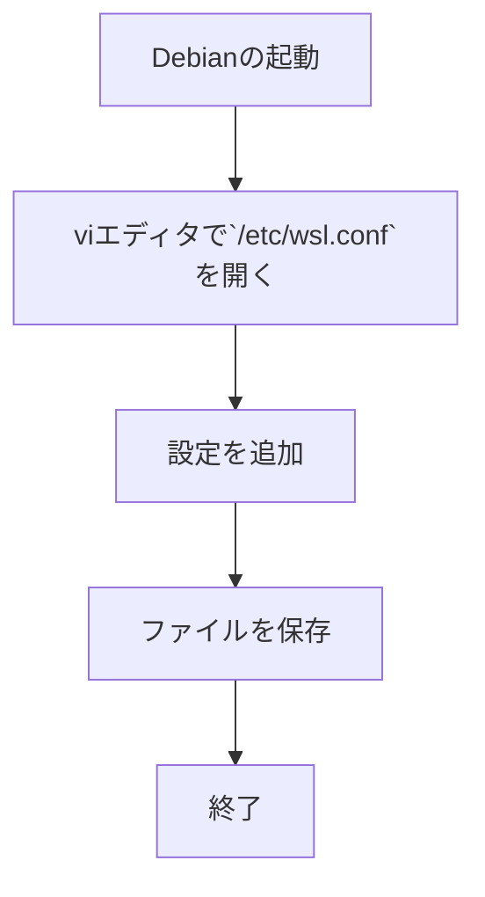
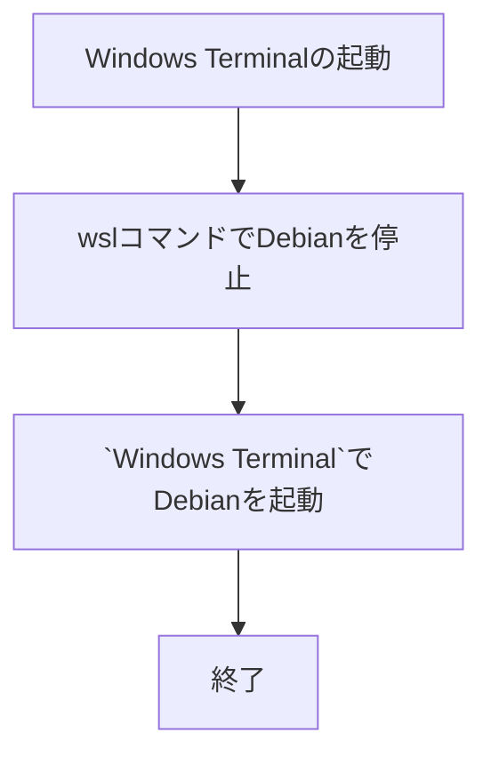

## tl;dr

WSL2 上で Debian の`systemd`を有効化する方法を紹介します。

1. `/etc/wsl.conf`の`[boot]`セクションに`systemd=true`を追加
2. `wsl --terminate Debian`として、Debian を停止
3. `Windows Terminal`上で Debian コンソールを起動

以上で、WSL2 上の Debian で`systemd`を使用可能になります。

## はじめに

この記事では、WSL  $_{(Windows Subsystem for Linux)}$[^1] 上の Debian で`systemd`[^2]を有効化する手順を紹介します。
`systemd` は Linux のサービスやプロセスを管理するための不可欠なツールです。

WSL2 で`systemd`を有効にすることで、Linux の機能を Windows上でも活用できるようになります。

[^1]: WSL: Windows Subsystem for Linux の略で、Windows 上で Linux を実行させるサブシステム
[^2]: `systemd`: Linux のプロセス管理および初期化システム

## 1. `/etc/wsl.conf` の設定

WSL では、`/etc/wsl.conf`を使って細かい動作を設定できます。
`systemd`を動作させる設定も、`/etc/wsl.conf`で設定できます。

### 1.1 `systemd`の有効化

`systemd` を有効化するには、以下の手順で`/etc/wsl.conf`に`systemd`の設定を追加します。



この記事では、Linux で広く使われているテキストエディタ`vi`[^3]を使用して`/etc/wsl.conf`を編集し、`systemd`の設定を追加します。
`vi`エディタの詳しい使い方は、[Vim日本語ドキュメント](https://vim-jp.org/vimdoc-ja/)を参照してください。

次の手順で、`systemd`を有効にします。

1. vi エディタで`/etc/wsl.conf`を編集
   `bash`で次のコマンドを実行します。

   ```bash
   sudo vi /etc/wsl.conf
   ```

   

2. `/etc/wsl.conf`の設定
   `/etc/wsl.conf`に次の設定を追加します

   ```conf: /etc/wsl.conf
   [boot]
   systemd=true
   ```

   

3. `/etc/wsl.conf`の保存
   ノーマルモード[^4]で`:wq`[^5]と入力し、ファイルを保存します。

以上で、`/etc/wsl.conf`の設定は終了です。
Debian を再起動すると、`systemd`が有効となります。

[^3]: `vi`: Linux上で広く使用されているテキストエディタ
[^4]: ノーマルモード: `vi`の編集モードの 1つで、コマンドを入力できるモード
[^5]: `:wq`:  `vi`エディタで編集中のファイルを保存して終了させるコマンド

## 2. Debian の再起動

ここでは、`systemd`を有効化するために、WSL2上の Debian を再起動する方法を解説します。

### 2.1. Debianを再起動する

 `Windows Terminal`[^6] 上で`wsl`コマンド[^7]を使用して Debian を再起動し、`systemd` を有効化します。



次の手順で、Debian を再起動します。

1. Debian の停止
   `wsl`コマンドで、Debian を停止します。

   ```powershell
   wsl --terminate Debian
   ```

   

2. Debian の再起動
    `Windows Terminal`上で Debian を選択して、Debian を再起動します。

以上で、Debian の再起動は完了しました。

[^6]: `Windows Terminal`: Windows上で複数のコンソールを管理するためのアプリケーション
[^7]: `wsl`コマンド: `Windows Subsystem for Linux`を操作するためのコマンド

## おわりに

この記事では、WSL2上の Debian で`systemd`を有効化する手順を紹介しました。
`systemd`を有効にすることで、Linux デーモンや`systemd`に依存するアプリケーションが Windows上でスムーズに動作します。
Linux の機能を Windows上でも活用するための重要なステップです。

これにより、WSL上で Docker のようなコンテナサービスや Web サーバが使えるようになり、WSL の活用の幅が広がります。

是非、WSL2 のさらなる活用を試してみてください。

それでは、Happy Hacking!

## 参考資料

### `systemd`

- [`systemd` - Wikipedia](https://ja.wikipedia.org/wiki/Systemd)

### Microsoft learn

- [WSL での詳細設定の構成](https://learn.microsoft.com/ja-jp/windows/wsl/wsl-config)
- [`systemd`を使用して WSL を使用して Linux サービスを管理する](https://learn.microsoft.com/ja-jp/windows/wsl/systemd)

### `vi`エディタ

- [Vim日本語ドキュメント](https://vim-jp.org/vimdoc-ja/)
