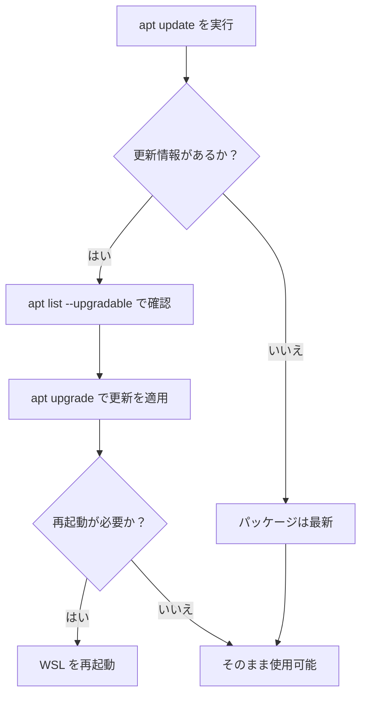
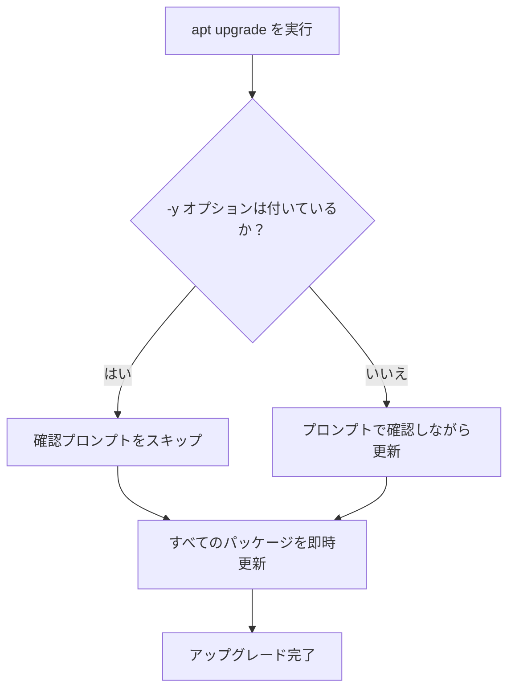

## はじめに

atsushifx です。
この記事では、はじめて WSL を使用するプログラマーに向けて、WSL 2 上で Debian を安全かつ快適に使うための `apt` の設定方法とアップグレード手順を説明します。

<!-- textlint-disable ja-technical-writing/sentence-length -->
WSL (`Windows Subsystem for Linux`) は、Windows 上で Linux 環境を利用できる仕組みであり、WSL 2 では仮想化技術により高い互換性と性能を実現しています。
<!-- textlint-enable -->

これにより、Linux ディストリビューションである Debian を、開発や検証といった日常的な用途で簡単に導入・運用できるようになりました。

WSL 2 上の Debian を快適に使うためには、`apt` (`Advanced Package Tool`) を使用してシステムを最新の情報にしておく必要があります。

この記事を参考にすれば、Debian を安全にアップグレードできるようになります。
Enjoy!

## 用語集

この記事で扱う技術用語を記載します。

- `WSL` (`Windows Subsystem for Linux`)
  Windows 上で Linux を実行可能にするサブシステム

- `WSL 2`:
  仮想化技術を用いた、Linux カーネル互換性と性能向上を実現する WSL の第 2 世代

- `Debian`:
  安定性に優れる代表的な Linux ディストリビューション

- `APT` (`Advanced Package Tool`):
  Debian 系で使用されるパッケージ管理システム

- `apt`:
  `APT` のコマンドラインフロントエンド

- `リポジトリ`:
  ソフトウェアパッケージを提供するインターネット上の保管サーバー

- `ソースリスト`:
  `apt` が参照するリポジトリ情報を記述する設定ファイル (例: `/etc/apt/sources.list`)

- `CDN`:
  地理的に分散したサーバー群によるコンテンツの高速配信ネットワーク

- `Fastly`:
  Debian 公式 CDN に採用されている CDN プロバイダ

- `bookworm`:
  Debian バージョン 12 のコードネーム

- `bookworm-updates`:
  Debian 安定版向けのマイナーアップデート提供リポジトリ

- `bookworm-security`:
  セキュリティ修正パッケージを提供するリポジトリ

- `bookworm-backports`:
  次期リリースの一部機能を安定版に提供する追加リポジトリ

- `vi`:
  UNIX 系で標準的に利用されるテキストエディタ

- `PowerShell`:
  Windows 標準のコマンドラインシェルおよびスクリプト環境

- `Windows Terminal`:
  WSL や PowerShell を統合的に扱えるモダンなターミナルアプリ

- `/etc/apt/sources.list`:
  `apt` が参照する公式リポジトリ情報を記載する設定ファイル

- `/etc/apt/sources.list.d/`:
  追加のリポジトリ設定ファイルを格納するディレクトリ

- `apt update`:
  パッケージリストを最新化するためのコマンド

- `apt list --upgradable`:
  アップグレード可能なパッケージを一覧表示するコマンド

- `apt upgrade`:
  インストール済みパッケージを最新バージョンに更新するコマンド

- `sudo`:
  管理者権限でコマンドを実行するためのプレフィックスコマンド

## 1. APTの概要

`APT` は、Debian 系ディストリビューションにおけるパッケージ管理システムであり、システム内のソフトウェアやリソースを一元管理するツールです。
`apt` はパッケージのインストール、更新、削除などを行なうためのコマンドラインツールです。
`apt` を使用することで、システムの保守管理がより容易になり、最新のセキュリティパッチや機能改善を取り入れることが可能です。

## 2. APTの初期設定

WSL 2 上の Debian環境を快適に利用するためには、まず `apt` の初期設定が重要です。
以下に、`apt` が利用するソースリストやリポジトリの設定について説明します。

### 2.1 ソースリストとリポジトリ

`apt` は、システム内で使用するパッケージの情報を、ソースリスト (例: `/etc/apt/sources.list`) という設定ファイルから取得します。
ソースリストには公式リポジトリやミラーリポジトリの URL が記載され、`apt` はこれらの情報を元にパッケージを管理します。

### 2.2 公式リポジトリ

Debian の公式リポジトリは、`apt` の基本的な参照先として `/etc/apt/sources.list` に記述されています。
WSL 2 上の Debian でも Debian プロジェクトが提供する、Fastly を基盤とした公式 CDN を通じてパッケージが配信されます。
これにより、国内外問わず、安定したパッケージ取得が可能です。

代表的な設定例は以下の通りです:

```ini:/etc/apt/sources.list
# official repository

deb https://deb.debian.org/debian bookworm main
deb https://deb.debian.org/debian bookworm-updates main
deb https://security.debian.org/debian-security bookworm-security main
deb https://deb.debian.org/debian bookworm-backports main
```

これらのエントリは、それぞれ以下のような目的で利用されます:

- main：Debian の基本パッケージ群
- bookworm-updates：安定版リリース向けのマイナーアップデート
- bookworm-security：セキュリティ更新
- bookworm-backports：次期リリースの一部機能を安定版で利用可能にする追加パッケージ

`apt` の挙動はこのソースリストに基づいて制御されるため、公式リポジトリの理解はシステム管理の最初のステップとなります。

### 2.3 日本のミラーリポジトリ

公式リポジトリに加えて、日本国内のミラーリポジトリを利用することで、WSL 2 上の Debian 環境におけるパッケージ取得速度を向上させることができます。
通信環境によっては、国内ミラーのほうが安定する場合もあります。

日本国内向けの代表的な公式ミラーは、以下の通りです:

```ini:/etc/apt/sources.list.d/japan-mirror.list
# official japan mirror

deb http://ftp.jp.debian.org/debian/ bookworm main
deb http://ftp.jp.debian.org/debian/ bookworm-updates main
deb http://ftp.jp.debian.org/debian/ bookworm-backports main
```

上記のように `/etc/apt/sources.list.d/` 下に新しいファイルを作成し、日本ミラーを記述します。
`apt` はリポジトリに定義された優先順位に従って、より上位のミラーから順にパッケージを取得します。

#### ミラー追加の操作フロー


*[図1] 日本ミラー追加のステップ*

#### ミラー追加の手順

次の手順で、日本ミラーを追加します。

1. ミラーファイルの作成:
   エディタで設定ファイルを作成します。

   ```bash
   sudo vi /etc/apt/sources.list.d/japan-mirror.list
   ```

2. パスワードの入力:
   root 権限でファイルを編集するため、`sudo` を使用します。
   下記のようなプロンプトが表示されるので、`<account>`のパスワードを入力します。

   ```bash
   [sudo] password for <account>
   ```

   :::message
   `<account>`は、Debian をインストールしたときに作成したユーザーアカウントです。
   パスワードは、Debian をインストールするときに設定したユーザーアカウント用のパスワードです
   :::

3. リポジトリの入力:
   エディタで `a` を入力して、入力モードにはいります。
   その後、上記のリポジトリエントリをコピーアンドペーストして、`[ESC]` をおします。

   ```vi
   # official japan mirror

   deb http://ftp.jp.debian.org/debian/ bookworm main
   deb http://ftp.jp.debian.org/debian/ bookworm-updates main
   deb http://ftp.jp.debian.org/debian/ bookworm-backports main
   ```

4. リポジトリファイルの保存:
   `:wq`と入力して[Enter]キーを押し、作成した日本ミラー用のリポジトリ設定ファイルを保存します。

5. ミラーの確認:
   次のコマンドで、ミラーリポジトリが作成されているかを確認します。

   ```bash
   cat /etc/apt/sources.list.d/japan-mirror.list
   ```

`/etc/apt/sources.list.d/japan-mirror.list` に上記のリポジトリの内容が保存されていれば、ミラーリポジトリの作成は完了です。

## 3. Debianの更新

`apt` の初期設定が完了したら、システム全体の更新を行ないます。以下の手順により、最新のパッケージ情報の取得とシステムアップグレードが実施されます。

### 3.1 Debianの更新フロー

`apt` による Debian の更新フローを以下に示します:



*[図2] Debian システム更新フロー*

### 3.2 パッケージリストの更新 (`apt update`)

`apt` の初期設定が完了したら、まずはパッケージリストを最新の状態に更新します。
これは、`apt` が各リポジトリに問い合わせて、利用可能な最新のパッケージ情報を取得する処理です。

次のコマンドを実行します:

```bash
sudo apt update
```

:::message
`[sudo] password for <account>` プロンプトが表示されたら、自アカウントのパスワードを入力します。
:::

各リポジトリの取得状況が表示され、問題がなければ、以下のようなメッセージが出力されます。

```bash
Building dependency tree... Done
Reading state information... Done
17 packages can be upgraded. Run 'apt list --upgradable' to see them. # アップグレード可能なパッケージを確認するには apt list --upgradable を実行します
```

更新すべきパッケージがないときは、以下のようなメッセージが出力されます:

```bash
All packages are up to date.
```

この時点で、`apt` は現在インストールされているパッケージと最新バージョンの差分を把握できるようになります。
これにより、次のアップグレード操作へと進む準備が整います。

### 3.3 更新パッケージの確認 (`apt list --upgradable`)

パッケージリストの更新が完了したら、実際にどのパッケージがアップグレードの対象になっているかを確認しておくと安心です。
以下のコマンドを実行します:

```bash
apt list --upgradable
```

このコマンドは、現在のシステムにインストールされているパッケージのうち、アップグレード可能なものを一覧表示します。
出力には、次のような情報が含まれます:

```bash
パッケージ名/リポジトリ バージョン アーキテクチャ [アップグレード元のバージョン]
```

たとえば、

```bash
vim-tiny/stable,stable 2:9.0.1378-2+deb12u2 amd64 [upgradable from: 2:9.0.1378-2]
```

このように表示されることで、どのパッケージがどのバージョンからどのバージョンに更新されるのかを事前に確認できます。

この確認は必須というわけではありませんが、どのような更新が行なわれるのか把握しておくと安心です。
また、トラブルシューティングの際にも役立ちます。

### 3.4 システムの更新 (`apt upgrade -y`)

アップグレード可能なパッケージを確認したら、次は実際にパッケージを更新します。
`apt upgrade` コマンドを使用することで、現在インストールされているパッケージを最新バージョンにアップグレードできます。

次のコマンドを実行します:

```bash
sudo apt upgrade -y
```

:::message
`[sudo] password for <account>`プロンプトが表示されたら、自アカウントのパスワードを入力します。
:::

このコマンドは、インストール済みパッケージのうち、更新対象のものを一括でアップグレードします。
`-y` オプションをつけることで、すべての確認プロンプトに自動的に「yes」と応答し、非対話的に処理が進みます。
対話形式で進めたい場合は `-y` を省略すると、各更新について個別に確認しながら操作できます。



*[図3] `apt upgrade` の処理フロー*

アップグレードが完了すると、システムには最新のセキュリティ修正や機能改善が反映され、より安定して安全な状態となります。

なお、カーネルや低レベルのシステムライブラリが更新された場合は、システムの再起動が必要なこともあります。WSL 2 環境でも次のセクションのように、再起動を行なうことで変更が正しく反映されます。

### 3.5 WSL 2 の終了と再起動

`APT` によるパッケージのアップグレードが完了したら、必要に応じて WSL 2 を再起動します。
特に、システムライブラリや重要なコンポーネントが更新された場合には、WSL 2 を一度終了して再起動することで変更を確実に反映させることができます。

WSL 2 の再起動は、以下の手順で実行できます。

1. **WSL の終了**
   PowerShell または Windows Terminal で、以下のコマンドを実行します:

   ```powershell
   wsl --shutdown
   ```

   このコマンドはすべての WSL インスタンスを完全に停止します。

2. **WSL の再起動**
   再びターミナルから WSL を起動すると、更新が反映された状態で WSL 環境が再び起動します:

   ```powershell
   wsl
   ```

   これで、`apt` によるアップグレードが反映された、最新かつ安定した状態の Debian 環境が利用できるようになります。

## おわりに

WSL 2 上で Debian を活用する際、`apt` の設定と定期的なアップデートは、開発環境を安定かつ安全に保つために、大切なステップです。
ミラーリポジトリの活用や `apt update`, `apt upgrade` の定期的な実行は、セキュリティ対策やパフォーマンス改善にもつながります。

この記事が、`apt` の基本的な仕組みと操作方法、日本のミラーリポジトリの追加手順、そして WSL 2 環境でのパッケージ更新フローについて理解の一助になればうれしいです。

それでは、Happy Hacking!

## 参考資料

### Webサイト

- [第2章 Debian パッケージ管理](https://www.debian.org/doc/manuals/debian-reference/ch02.ja.html):
  公式リファレンスによる、Debian のパッケージ管理方法

- [sources.list - APT のデータ取得元の設定リスト](https://manpages.debian.org/unstable/apt/sources.list.5.ja.html):
  APT のマニュアルにおける、ソースリストの説明

- [CDN 対応ミラーの設定](https://www.debian.or.jp/community/push-mirror.html):
  Debian 日本語サイトの CDN ミラー

- [Debian を快適に使うための APT 設定とメンテナンス](https://zenn.dev/atsushifx/articles/wsl2-config-debian-apt-maintenance):
  APT の設定、使用による Debian のメンテナンスについての記事
