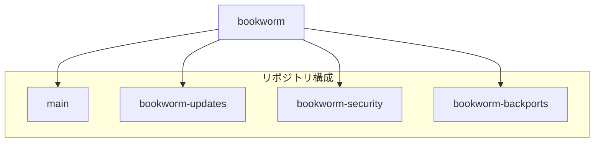
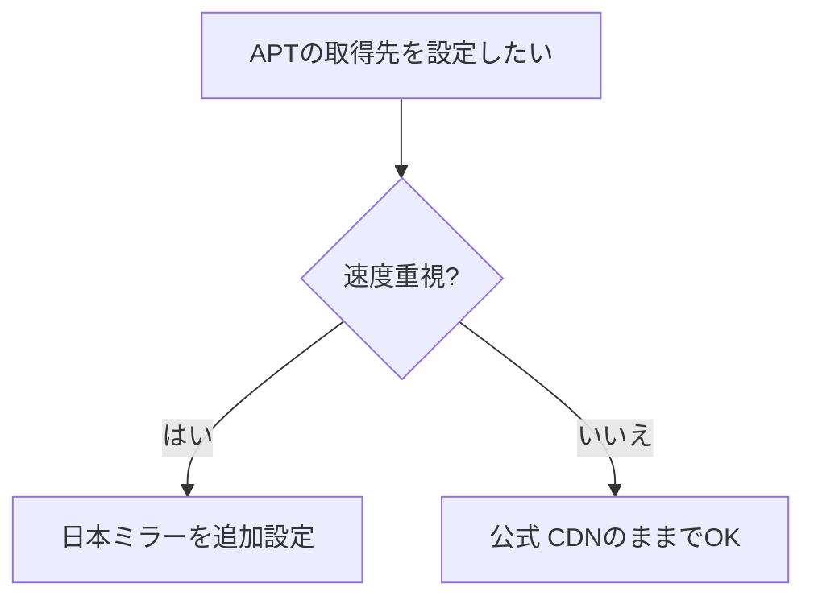
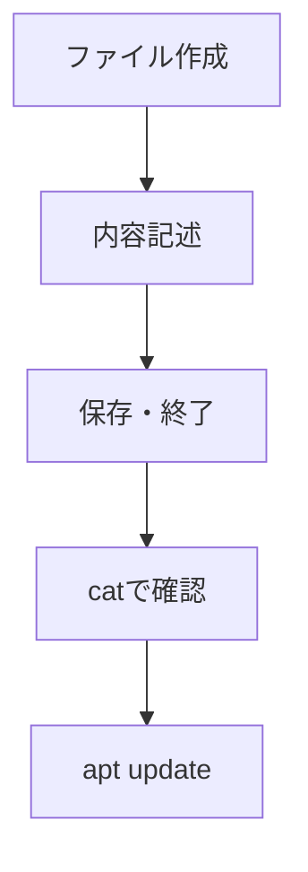
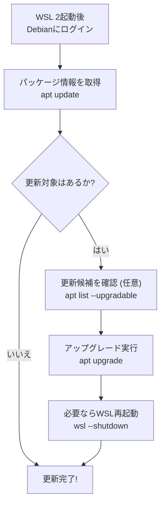
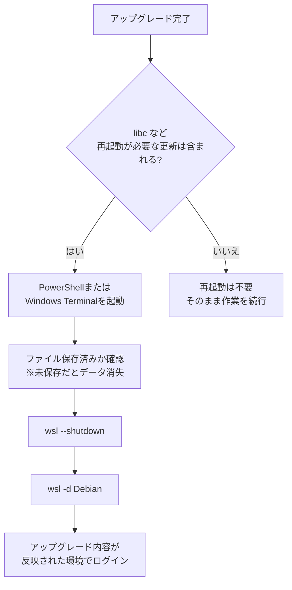

## はじめに

atsushifx です。
この記事では、WSL 2 上の Debian で APT を設定し、アップグレードする方法を解説します。

`WSL 2`（Windows Subsystem for Linux 2）は、仮想化技術により実際の Linux カーネルを動作させる仕組みです。
これにより、通常の Linux と非常に近い環境が実現され、Web アプリケーションの開発やシェルスクリプトの実行、ツールの検証などにも力を発揮します。

一方で、WSL 2 は実際の Linux カーネルと同様の脆弱性を抱える可能性があるため、継続的なアップデートが重要となります。

この記事にしたがって APT を設定し、定期的にパッケージを更新することで、WSL 環境を安全かつ安定して利用できるようになります。

## 用語集

- `WSL` (`Windows Subsystem for Linux`):
  Windows 上で Linux を動作させる仮想環境

- `WSL 2`:
  Linux カーネルを搭載した高性能な WSL の第2世代

- `Debian`:
  安定性と信頼性に定評のある Linux ディストリビューション

- `APT` (`Advanced Package Tool`):
  Debian 系 Linux におけるパッケージ管理ツール

- `パッケージ`:
  ソフトウェアや構成ファイルをまとめた単位

- `リポジトリ` (`Repository`):
  パッケージが保存されているサーバー

- `sources.list`:
  APT 用のリポジトリ設定ファイル

- `apt update`:
  パッケージ情報を最新化するコマンド

- `apt upgrade`:
  パッケージを最新版に更新するコマンド

- `backports`:
  新機能を含む追加提供パッケージ群

## 1. APTの基本: 仕組みと代表的なコマンド

`APT` (`Advanced Package Tool`) は、Debian 系ディストリビューションで使用されるパッケージ管理システムです。
Linux におけるソフトウェアは「パッケージ」という単位で提供されます。
`APT` はそれらを検索、インストール、更新、削除するための仕組みを提供します。

`APT` の代表的なコマンドである `apt` は、端末上で実行できるシンプルなコマンドラインツールです。依存関係の解決、リポジトリの管理、署名の検証などを一括で処理できるため、安全かつ効率的にパッケージを管理できます。

`WSL 2`上で Debian を使用する場合にも、`APT` は欠かせない存在です。新しいソフトウェアを導入したり、セキュリティ更新を適用したりするとき、APT を使った操作が基本となります。

`APT` の代表的なコマンドは以下のとおりです:

```bash
sudo apt update       # パッケージ情報の取得・更新
sudo apt upgrade      # インストール済みパッケージのアップグレード
sudo apt install vim  # パッケージのインストール　(例：vim)
sudo apt remove vim   # パッケージの削除 (例：vim)
```

これらのコマンドを正しく理解し、安全に利用できるようになることで、`WSL 2` 環境における開発や運用がより快適になります。


<!-- markdownlint-disable no-emphasis-as-heading -->
*図1: `APT` の基本操作の流れ（update → list → upgrade）*
<!-- markdownlint-enable -->

## 2. APTの設定方法：`sources.list`とミラーの構成

APT を使用してパッケージをインストール・更新する際、どのサーバー (リポジトリ) から情報を取得するかを指定する必要があります。
この設定を「ソースリスト」と呼びます。

APT はソースリストに記述されたリポジトリの情報をもとに、必要なパッケージの取得先を判断します。
WSL 2 上の Debian では、デフォルトで Debian 公式の CDN（Fastly）を利用した設定が入っており、世界中のミラーから効率的にデータを取得できるようになっています。

### 2.1 ソースリストの構造と記述例

ソースリストは、APT が参照するリポジトリ情報を記述したテキストファイルです。
パッケージをどこから取得するか、どのリリース・カテゴリを対象とするかを指定する内容になっており、APT の動作を決定づける重要な設定です。

主な設定ファイルは `/etc/apt/sources.list` で、追加の設定は `/etc/apt/sources.list.d/` ディレクトリに `.list` ファイルとして保存します。
これらはすべてプレーンなテキストファイルであり、`vi` や `cat` などの基本的なコマンドで編集・確認が可能です。

ソースリストに記述されるリポジトリの構文は、次のようになっています。

```bash
deb https://ftp.jp.debian.org/debian/ bookworm main
```


<!-- markdownlint-disable no-emphasis-as-heading -->
*図2: ソースリスト構文における各項目の構成*
<!-- markdownlint-enable -->

この 1 行には、以下のような意味があります。

| 項目 | 説明 |
|------|------|
| `deb` | バイナリパッケージを対象とするリポジトリ（ソースの場合は `deb-src`） |
| `http://ftp.jp.debian.org/debian/` | パッケージを取得するリポジトリの URL |
| `bookworm` | 対象とするリリース（ここでは Debian 12） |
| `main` | パッケージのセクション（公式にサポートされている基本パッケージ群） |

*表1: `APT` のソースリストにおける各項目の説明*

このように、ソースリストは簡潔な形式でありながら、APT の取得先やポリシーを細かく制御できます。必要に応じて、リリース名やセクションを変更することで、より柔軟なパッケージ管理が可能になります。

### 2.2 Debian公式リポジトリの分類と役割

Debian プロジェクトは、APT を通じて利用できる公式のリポジトリを提供しています。
これらのリポジトリは Debian の開発元が管理しており、安定性と信頼性に優れている点が魅力です。

WSL 2 上で Debian を使用する場合も、初期状態でこの公式リポジトリが `/etc/apt/sources.list` に設定されています。
具体的には、Debian 公式 CDN が設定されており、Fastly 社の CDN により、ユーザーの地理的な位置に応じて最適なミラーに自動的に接続されます。

以下は、Debian 12（コードネーム: `bookworm`）向けの公式リポジトリ設定例です。

```bash
# src: /etc/apt/sources.list
# Debian Official Repository

deb https://deb.debian.org/debian bookworm main
deb https://deb.debian.org/debian bookworm-updates main
deb https://security.debian.org/debian-security bookworm-security main
deb https://deb.debian.org/debian bookworm-backports main
```


<!-- markdownlint-disable no-emphasis-as-heading -->
*図3: `Debian` 公式リポジトリ構成（bookworm から各種セクションへの分岐）*
<!-- markdownlint-enable -->

それぞれのリポジトリには、次のような役割があります。

| リポジトリ名 | 説明 |
|--------------|------|
| `bookworm` | Debian 12 の基本パッケージ群（安定版） |
| `bookworm-updates` | 安定版リリース向けのマイナーアップデート |
| `bookworm-security` | セキュリティ更新専用のリポジトリ |
| `bookworm-backports` | 次期リリースの一部パッケージを安定版に提供する追加リポジトリ |

*表2: `Debian`公式リポジトリにおける各セクションの役割*

これらのリポジトリを有効にしておくことで、常に最新の安定パッケージやセキュリティ修正を受け取ることができ、WSL 環境でも安心して開発作業を行なうことができます。

### 2.3 日本ミラーの追加による速度と安定性の向上

APT では、リポジトリの取得先として地理的に近いミラーサーバーを利用できます。
日本国内のミラーを指定することで、公式ミラーだけの場合より安定して高速にパッケージを取得できる場合があります。

| 比較観点        | 公式 CDN (`deb.debian.org`) | 日本ミラー (`ftp.jp.debian.org`) |
|----------------|-----------------------------|----------------------------------|
| 安定性          | 地理的に最適なミラーに自動接続 | 日本国内なら安定しやすい         |
| 更新の速さ      | 若干遅れる場合がある           | ミラーによっては即時反映される     |
| 柔軟性・自動化  | 初期設定済み、楽               | 手動で追加設定が必要              |

*表3: 公式 CDN (`deb.debian.org`) と日本ミラー (`ftp.jp.debian.org`) の比較*


<!-- markdownlint-disable no-emphasis-as-heading -->
*図4: 公式 CDN と日本ミラーの使い分けフロー*
<!-- markdownlint-enable -->

ミラーの追加は、`/etc/apt/sources.list.d/` ディレクトリに新しい `.list` ファイルを作成する方法が推奨されます。

以下は、日本の公式ミラーである `ftp.jp.debian.org` を指定する例です。

```bash
sudo vi /etc/apt/sources.list.d/japan-mirror.list
```

次の内容をファイルに記述します。

```bash
# src: /etc/apt/sources.list.d/japan-mirror.list
# Debian Japan Official Mirror

deb http://ftp.jp.debian.org/debian/ bookworm main
deb http://ftp.jp.debian.org/debian/ bookworm-updates main
deb http://ftp.jp.debian.org/debian/ bookworm-backports main
```

ファイルを保存して終了するには、`[Esc]` キーを押した後に `:wq` と入力し、Enter キーを押します。

保存後、以下のコマンドで内容を確認できます。

```bash
cat /etc/apt/sources.list.d/japan-mirror.list
```

複数のリポジトリファイルが存在する場合、APT はそれらをすべて読み込み、同一パッケージが複数の場所に存在する場合には、優先度や近さに応じて最適なミラーから取得します。日本ミラーを追加したあとは、通常どおり `apt update` を実行することで、情報が反映されます。

この設定により、WSL 2 環境におけるパッケージ管理がより快適になります。

### 2.4 日本ミラーの設定手順と更新の実行

ここでは日本ミラーを追加して、APT のパッケージ情報を更新する手順を示します。
以下の 4 ステップに従って、日本ミラーの設定とパッケージ情報の更新を行ないます。


<!-- markdownlint-disable no-emphasis-as-heading -->
*図5: `APT` に日本ミラーを追加し、パッケージ情報を更新する手順*
<!-- markdownlint-enable -->

#### 1. ミラー設定ファイルの作成

日本のミラーリポジトリを記述する `.list` ファイルを作成します。ここでは `vi` エディタを使用しています。

```bash
sudo vi /etc/apt/sources.list.d/japan-mirror.list
```

#### 2. ミラー情報の入力

以下の内容をファイルに記述します。

```bash
# src: /etc/apt/sources.list.d/japan-mirror.list
# Debian Japan Official Mirror

deb http://ftp.jp.debian.org/debian/ bookworm main
deb http://ftp.jp.debian.org/debian/ bookworm-updates main
deb http://ftp.jp.debian.org/debian/ bookworm-backports main
```

#### 3. ファイルの保存と確認

`[Esc]` キーを押したあと、`:wq` を入力して Enter を押し、ファイルを保存して終了します。

保存した内容を以下のコマンドで確認できます。

```bash
cat /etc/apt/sources.list.d/japan-mirror.list
```

#### 4. パッケージ情報の更新

ミラーの設定を反映するために、APT のパッケージ情報を更新します。

```bash
sudo apt update
```

更新が成功すると、新たに指定したミラーからパッケージ情報が取得され、以降の `apt install` や `apt upgrade` 操作で日本ミラーが利用されるようになります。

この手順により、WSL 2 上の Debian 環境において、より快適かつ安定したパッケージ管理が可能になります。

## 3. APTによるパッケージ更新の基本フロー

APT の初期設定が完了したら、Debian システム全体の更新をします。これにより、最新のセキュリティ修正や機能改善が反映され、システムを安全かつ安定した状態に保つことができます。

APT による更新は主に次の 3 段階で構成されます:

1. パッケージ情報の取得（`apt update`）
2. アップグレード可能なパッケージの確認（`apt list --upgradable`）
3. 実際のアップグレード実行（`apt upgrade`）

これらの操作は、定期的に実行することが推奨されます。

### 3.1 パッケージ情報の更新フロー

パッケージを更新するか否かは、以下のフローに従います。


<!-- markdownlint-disable no-emphasis-as-heading -->
*図6: パッケージ更新操作の流れ（update → list → upgrade → shutdown）*
<!-- markdownlint-enable -->

### 3.2 `apt update` の役割と実行手順

最初にするのはパッケージ情報の更新です。
これにより、APT は各リポジトリにある最新のパッケージ情報を取得し、アップグレードやインストールに備えることができます。

以下のコマンドを実行します。

```bash
sudo apt update
```

:::message alert
`[sudo] password for <account>` プロンプトが表示されたら、自アカウントのパスワードを入力します。
:::

各リポジトリの取得状況が表示され、問題がなければ、以下のようなメッセージが出力されます。

```bash
Building dependency tree... Done
Reading state information... Done
All packages are up to date.
```

更新すべきパッケージがないときは、次のようなメッセージが出力されます:

```bash
All packages are up to date.
```

この場合は、パッケージを更新する必要なないので、更新はここで終了です。

システム内にアップグレード可能なパッケージがある場合は、次のようなメッセージが表示されます。

```bash
17 packages can be upgraded. Run 'apt list --upgradable' to see them.
```

この場合は、次に進んで更新するパッケージを確認します。

### 3.3 `apt list --upgradable` による確認方法

パッケージ情報の更新が完了すると、システム内でアップグレード可能なパッケージの有無が表示されます。
以下のコマンドで、アップグレードするパッケージを確認します:

```bash
apt list --upgradable
```

このコマンドは、現在インストールされているパッケージのうち、アップグレード対象となるものを一覧表示します。
出力結果には、次のような形式となります:

```bash
vim-tiny/stable,stable 2:9.0.1378-2+deb12u2 amd64 [upgradable from: 2:9.0.1378-2]
```

この表示から、どのパッケージがどのバージョンからどのバージョンへ更新されるのかを確認できます。

この確認は省略可能ですが、更新前に変更点を把握しておくと安心です。
特に、予想外の大量アップデート時には事前確認がトラブル回避に役立ちます。

### 3.4 `apt upgrade` でパッケージを更新する

アップグレード対象のパッケージを確認したあとは、実際にそれらを更新します。

アップグレードには次のコマンドを実行します:

```bash
sudo apt upgrade
```

このコマンドは、インストール済みのパッケージを新しいバージョンへ更新します。
インストール済みパッケージの数や変更内容によっては、途中で確認のためのプロンプトを表示することがあります。

`-y` オプションをつけて実行すると、確認なしですべてのパッケージを更新します。

```bash
sudo apt upgrade -y
```

アップグレードが完了すると、次のようなメッセージが表示されます。

```bash
X upgraded, Y newly installed, Z to remove and N not upgraded.
```

この時点でシステムは最新の状態になります。
ただし、カーネルや libc などの低レイヤーのコンポーネントが更新された場合は、WSL 2 の再起動が必要になることがあります。
それについては次で説明します。

### 3.5 `WSL`を安全に再起動する方法 (コアパッケージ更新時)

一部のパッケージ (特に libc などのシステムコンポーネント) をアップグレードした場合、変更を正しく反映するためには WSL 環境を再起動する必要があります。
これは Windows 自体の再起動ではなく、WSL インスタンスのプロセス再起動 (メモリ解放) を意味します。
`libc`などのコアパッケージを更新しない限り、再起動の必要はありません。

#### WSLの再起動フロー



<!-- markdownlint-disable no-emphasis-as-heading -->
*図7: `apt upgrade`後、WSL の再起動が必要かどうかの判断フロー*
<!-- markdownlint-enable -->

#### WSL の再起動

1. PowerShell または Windows Terminal で、次のコマンドを実行します:

   ```powershell
   wsl --shutdown
   ```

   このコマンドは、すべての WSL インスタンスを終了し、メモリやプロセスを解放します。

   :::message alert
   ほかの WSL インスタンス上の情報は消去されます。あらかじめ、ファイル保存などでデータを保存しておく必要があります。
   :::

2. WSL を再起動するには、次のコマンドを実行します:

   ```powershell
   wsl -d Debian
   ```

   :::message alert
   通常のインストールの場合。
   別ディストリビューション名 (例: `develop`)を付けた場合は、そのディストリビューションを指定します。
   :::

これにより、アップグレードによる変更を適用した Debian が起動します。

## まとめ

WSL 2 上の Debian 環境において APT を活用するためのポイントを簡潔にまとめます。

- **APT の基本操作と役割**:
  `apt update` と `apt upgrade` によるパッケージ管理

- **sources.list によるリポジトリ設定**
  APT は `/etc/apt/sources.list` や `.list` ファイルによる、パッケージを取得するリポジトリの設定

- **日本ミラーの追加による利点**
  `ftp.jp.debian.org` を追加設定による、国内からの高速かつ安定したパッケージ取得

- **パッケージ更新の流れ**
  `apt update` → `apt list --upgradable` → `apt upgrade` の 3 ステップによる安全なパッケージ更新

- **定期的な実行の重要性**
  `apt update`、`apt upgrade` の習慣化による環境の安定運用

## おわりに

この記事では、APT に日本ミラーを追加し、システムを更新する方法を紹介しました。
Debian を使ううえで、APT の設定と定期的なアップグレードは外せないポイントです。

ミラーの設定を済ませれば、日本語化やツールの導入もスムーズになります。

これからは、開発ツールのインストールやシェルのカスタマイズなど、使いやすい環境づくりを紹介します。

それでは、Happy Hacking!

## 参考資料

### Webサイト

- [第2章 Debian パッケージ管理](https://www.debian.org/doc/manuals/debian-reference/ch02.ja.html):
  公式リファレンスによる、Debian のパッケージ管理方法

- [sources.list - APT のデータ取得元の設定リスト](https://manpages.debian.org/unstable/apt/sources.list.5.ja.html):
  APT のマニュアルにおける、ソースリストの説明

- [CDN 対応ミラーの設定](https://www.debian.or.jp/community/push-mirror.html):
  Debian 日本語サイトの CDN ミラー

- [Debian を快適に使うための APT 設定とメンテナンス](https://zenn.dev/atsushifx/articles/wsl2-config-debian-apt-maintenance):
  APT の設定、使用による Debian のメンテナンスについての記事
