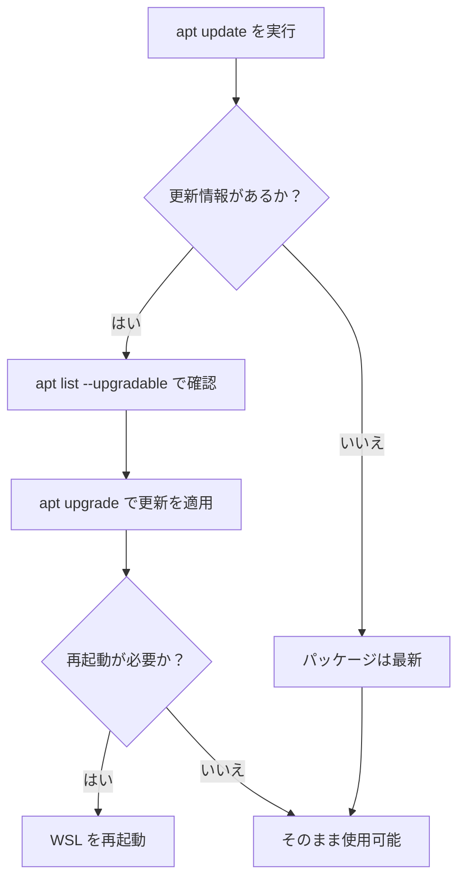

## はじめに

atsushifx です。
この記事では、WSL をはじめて使用するプログラマー向けに、WSL 2 上で Debian を安全かつ快適に使うために `apt` の設定方法とアップグレード手順を紹介します。

<!-- textlint-disable ja-technical-writing/sentence-length -->
WSL (`Windows Subsystem for Linux`) は、Windows 上で Linux 環境を利用できる仕組みであり、WSL 2 では仮想化技術により高い互換性と性能を実現しています。
<!-- textlint-enable -->

これにより、Linux ディストリビューションである Debian を、開発や検証といった日常的な用途で簡単に導入・運用できるようになりました。

WSL 2 上の Debian を快適かつ安全に活用するには、`apt` (`Advanced Package Tool`) を使用してシステムを最新の情報にしておく必要があります。

この記事を参考に Debian を最新の状態にし、定期的なアップデートで安全な環境を維持しましょう。

この記事では、`apt` の初期設定から日本のミラーリポジトリの追加方法、さらにシステムを最新の状態に保つためのアップデート・アップグレードの手順までを丁寧に解説します。

まずはこの記事を参考に、Debian を安全にアップグレードしてみましょう。
Enjoy!

## 1. APTの概要

`APT` は、Debian 系ディストリビューションにおけるパッケージ管理システムであり、システム内のソフトウェアやリソースを一元管理するツールです。
`apt` は各パッケージの依存関係やバージョン管理を行ない、各パッケージのインストールや更新、削除にあわせて依存関係の解決も行ないます。
`apt` を活用することで、システムの保守管理がより容易となり、最新のセキュリティパッチや機能改善を取り入れることが可能です。

## 2. APTの初期設定

WSL 2 上の Debian環境を快適に利用するためには、まず `apt` の初期設定が重要です。
以下に、`apt` が利用するソースリストやリポジトリの設定について説明します。

### 2.1 ソースリストとリポジトリ

`apt` は、システム内で使用するパッケージの情報を、ソースリスト (例: `/etc/apt/sources.list`) という設定ファイルから取得します。
ソースリストには公式リポジトリやミラーリポジトリの URL が記載され、`apt` はこれらの情報を元にパッケージを管理します。

### 2.2 公式リポジトリ

Debian の公式リポジトリは、`apt` の基本的な参照先として `/etc/apt/sources.list` に記述されています。
WSL 2 上の Debian でも同様で、初期状態では Debian プロジェクトが提供する公式の CDN（Fastly を利用）を通じてパッケージが配信されます。
これにより、日本国内や国外にかかわらず高速かつ安定した通信が可能となっています。

代表的な設定例は以下の通りです:

```ini:/etc/apt/sources.list
# official repository

deb https://deb.debian.org/debian bookworm main
deb https://deb.debian.org/debian bookworm-updates main
deb https://security.debian.org/debian-security bookworm-security main
deb https://deb.debian.org/debian bookworm-backports main
```

これらのエントリは、それぞれ以下のような目的で利用されます:

- main：Debian の基本パッケージ群
- bookworm-updates：安定版リリース向けのマイナーアップデート
- bookworm-security：セキュリティ更新
- bookworm-backports：次期リリースの一部機能を安定版で利用可能にする追加パッケージ

`apt` の挙動はこのソースリストに基づいて制御されるため、公式リポジトリの理解はシステム管理の第一歩と言えます。

### 2.3 日本のミラーリポジトリ

公式リポジトリに加えて、日本国内のミラーリポジトリを利用することで、WSL 2 上の Debian 環境におけるパッケージ取得速度を向上させることができます。
特に、通信環境や地域によっては、CDN より国内ミラーのほうが安定することもあります。

日本国内向けの代表的な公式ミラーは、以下の通りです:

```ini:/etc/apt/sources.list.d/japan-mirror.list
# official japan mirror

deb http://ftp.jp.debian.org/debian/ bookworm main
deb http://ftp.jp.debian.org/debian/ bookworm-updates main
deb http://ftp.jp.debian.org/debian/ bookworm-backports main
```

上記のように `/etc/apt/sources.list.d/` 下に新しいファイルを作成し、日本ミラーを記述します。
`apt` は定義された優先順位に従って複数のリポジトリを順に参照します。

#### ミラー追加の手順

次の手順で、日本ミラーを追加します。

1. ミラーファイルの作成:
   エディタで設定ファイルを作成します。

   ```bash
   sudo vi /etc/apt/sources.list.d/japan-mirror.list
   ```

2. パスワードの入力:
   root 権限でファイルを編集するため、`sudo` を使用します。
   下記のようなプロンプトが表示されるので、`<account>`のパスワードを入力します。

   ```bash
   [sudo] password for <account>
   ```

   :::message
   `<account>`は、Debian をインストールしたときに作成したユーザーアカウントです。
   パスワードは、Debian をインストールするときに設定したユーザーアカウント用のパスワードです
   :::

3. リポジトリの入力:
   エディタで `a` を入力して、入力モードにはいります。
   その後、上記のリポジトリエントリをコピーアンドペーストして、`[ESC]` をおします。

   ```vi
   # official japan mirror

   deb http://ftp.jp.debian.org/debian/ bookworm main
   deb http://ftp.jp.debian.org/debian/ bookworm-updates main
   deb http://ftp.jp.debian.org/debian/ bookworm-backports main
   ```

4. リポジトリファイルの保存:
   `:wq`と入力して[Enter]キーを押し、作成した日本ミラー用のリポジトリ設定ファイルを保存します。

5. ミラーの確認:
   次のコマンドで、ミラーリポジトリが作成されているかを確認します。

   ```bash
   cat /etc/apt/sources.list.d/japan-mirror.list
   ```

`/etc/apt/sources.list.d/japan-mirror.list` に上記のリポジトリの内容が保存されていれば、ミラーリポジトリの作成は完了です。

## 3. Debianの更新

`apt` の初期設定が完了したら、システム全体の更新を行ないます。以下の手順により、最新のパッケージ情報の取得とシステムアップグレードが実施されます。

### 3.1 Debianの更新フロー

`apt` による Debian の更新フローを以下に示します:



*[図1] システム更新フロー*

### 3.2 パッケージリストの更新 (`apt update`)

`apt` の初期設定が完了したら、まずはパッケージリストを最新の状態に更新します。
これは、`apt` が各リポジトリに問い合わせて、利用可能な最新のパッケージ情報を取得する処理です。

次のコマンドを実行します:

```bash
sudo apt update
```

:::message
`[sudo] password for` プロンプトが表示されたら、自アカウントのパスワードを入力します。
:::

各リポジトリの取得状況が表示され、問題がなければ、以下のようなメッセージが出力されます。

```bash
Building dependency tree... Done
Reading state information... Done
17 packages can be upgraded. Run 'apt list --upgradable' to see them.
```

更新すべきパッケージがないときは、以下のようなメッセージが出力されます:

```bash
All packages are up to date.
```

この時点で、`apt` は現在インストールされているパッケージと最新バージョンの差分を把握できるようになります。
これにより、次のアップグレード操作へと進む準備が整います。

### 3.3 更新パッケージの確認 (`apt list --upgradable`)

パッケージリストの更新が完了したら、実際にどのパッケージがアップグレードの対象になっているかを確認します。
以下のコマンドを実行します:

```bash
apt list --upgradable
```

このコマンドは、現在のシステムにインストールされているパッケージのうち、アップグレード可能なものを一覧表示します。
出力には、次のような情報が含まれます:

```bash
パッケージ名/リポジトリ バージョン アーキテクチャ [アップグレード元のバージョン]
```

たとえば、

```bash
vim-tiny/stable,stable 2:9.0.1378-2+deb12u2 amd64 [upgradable from: 2:9.0.1378-2]
```

このように表示されることで、どのパッケージがどのバージョンからどのバージョンに更新されるのかを事前に確認できます。

この確認は必須というわけではありませんが、どのような更新が行なわれるのかを把握しておくことで、システム変更への理解が深まります。
また、トラブルシューティングの際にも役立ちます。

### 3.4 システムの更新 (`apt upgrade -y`)

アップグレード可能なパッケージを確認したら、次は実際にパッケージを更新します。
`apt upgrade` コマンドを使用することで、現在インストールされているパッケージを最新バージョンにアップグレードできます。

次のコマンドを実行します:

```bash
sudo apt upgrade -y
```

:::message
`[sudo] password for`プロンプトが表示されたら、自アカウントのパスワードを入力します。
:::

このコマンドは、すでにインストールされているパッケージを対象に、バージョンの更新があるものを一括でアップグレードします。
`-y` オプションをつけることで、すべての確認プロンプトに自動的に「yes」と答えて処理を進めることができます。
対話形式で進めたい場合は `-y` を省略すると、各更新について個別に確認しながら操作できます。

アップグレードが完了すると、システムには最新のセキュリティ修正や機能改善が反映され、より安定して安全な状態となります。

なお、カーネルや低レベルのシステムライブラリが更新された場合は、システムの再起動が必要なこともあります。WSL 2 環境でも次のセクションのように、再起動を行なうことで変更が正しく反映されます。

### 3.5 WSL 2 の終了と再起動

`APT` によるパッケージのアップグレードが完了したら、必要に応じて WSL 2 を再起動します。
特に、システムライブラリや重要なコンポーネントが更新された場合には、WSL 2 を一度終了して再起動することで変更を確実に反映させることができます。

WSL 2 の再起動は、以下の手順で実行できます。

1. **WSL の終了**
   PowerShell または Windows Terminal で、以下のコマンドを実行します:

   ```powershell
   wsl --shutdown
   ```

   このコマンドはすべての WSL インスタンスを完全に停止します。

2. **WSL の再起動**
   再びターミナルから WSL を起動すると、更新が反映された状態で WSL 環境が再び起動します:

   ```powershell
   wsl
   ```

   これで、`apt` によるアップグレードが反映された、最新かつ安定した状態の Debian 環境が利用できるようになります。

## おわりに

WSL 2 上で Debian を活用する際、`apt` の設定と定期的なアップデートは、開発環境の安定性と安全性を維持するために不可欠です。
とくに、ミラーリポジトリの活用や `apt update`, `apt upgrade` の定期的な実行は、セキュリティ対策やパフォーマンス改善にもつながります。

この記事を通じて、`apt` の基本的な仕組みと操作方法、日本のミラーリポジトリの追加手順、そして WSL 2 環境でのパッケージ更新フローについて理解が深まっていれば幸いです。

それでは、Happy Hacking!

## 参考資料

### Webサイト

- [第2章 Debian パッケージ管理](https://www.debian.org/doc/manuals/debian-reference/ch02.ja.html):
  公式リファレンスによる、Debian のパッケージ管理方法

- [sources.list - APT のデータ取得元の設定リスト](https://manpages.debian.org/unstable/apt/sources.list.5.ja.html):
  APT のマニュアルにおける、ソースリストの説明

- [CDN 対応ミラーの設定](https://www.debian.or.jp/community/push-mirror.html):
  Debian 日本語サイトの CDN ミラー

- [Debian を快適に使うための APT 設定とメンテナンス](https://zenn.dev/atsushifx/articles/wsl2-config-debian-apt-maintenance):
  APT の設定、使用による Debian のメンテナンスについての記事
