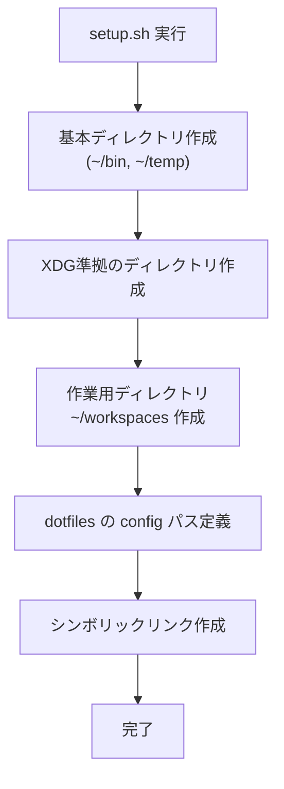
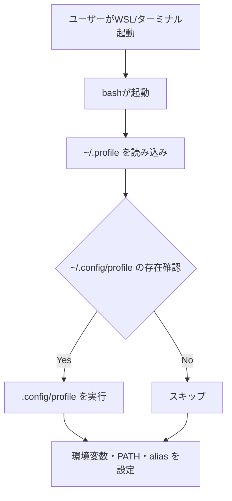

## はじめに

`WSL 2` (`Windows Subsystem for Linux 2`) を活用すれば、Windows 上でも本格的な Linux 環境を手軽に利用できます。
ただし、意識せずに使い始めると、設定ファイルや一時データがホームディレクトリに散在し、環境が散らかりがちです。

複数のプロジェクトを並行して扱う場合や、WSL 環境を複数インスタンスで使い分ける場合には、**作業ディレクトリや設定の構造化**は必須です。

この記事では、次の観点で環境を整理します:

- ホームディレクトリが散らかる背景とその解決方針
- `XDG Base Directory` に準拠したディレクトリ構成の導入
- 作業ディレクトリ・プロジェクトの整理戦略
- 初期構築スクリプトによる自動化と運用管理
- `dotfiles`管理や共通スクリプト化による再利用性の向上

WSL 環境を構造的に設計・運用するための指針を提供し、再現性と移植性の高い作業基盤の構築に役立てます。
このガイドを活用し、快適で保守性の高い Linux 作業環境を構築する際の参考にしてください。

## 前提条件

記事を実践するにあたり、以下の前提条件を満たしていることを前提とします。

### ✅ 対象環境

- **WSL 2** (`Windows Subsystem for Linux 2`) が有効になっている Windows 環境
- **Debian** などの主要な Linux ディストリビューションを WSL にインストール済み

### ✅ 想定する読者

- WSL を日常的に利用している開発者、技術者、学生など
- ファイルや設定を構造化して整理したいと考えている人
- `dotfiles` や `XDG` ディレクトリ構成といった UNIX/Linux のベストプラクティスに興味がある人

### ✅ 必要な知識・準備

- 基本的な Linux シェルコマンド (`cd`, `mkdir`, `ls` など) が使える
- エディタ(例: `vim`, `nano`, `code`) を使ってファイルを編集できる
- GitHub アカウントを持ち、リポジトリを `clone` できる (`dotfiles` 運用を行なう場合)

> ※ 特別な高度スキルは不要。ただし、WSL や Linux の基本操作にある程度習熟していることを前提とする。

## 用語集

- `WSL` (`Windows Subsystem for Linux`):
  Windows 上で Linux 環境を動作させる仕組み

- `WSL 2`:
  WSL の第2世代で、エミュレーションでカーネルを実行する WSL

- `XDG Base Directory`:
  Linux 環境における設定ファイル・キャッシュ・データなどの格納場所を標準化するための仕様

- `dotfiles`:
  ホームディレクトリに置かれる設定ファイル群 (例: `.bashrc`, `.gitconfig` など)

- `環境変数`:
  システムやアプリケーションの動作に影響を与える設定値

- `シンボリックリンク`:
  ファイルやディレクトリの別名 (エイリアス) を作る仕組み

- `workspaces`:
  プロジェクトや用途別に作業ディレクトリを分離するための親ディレクトリ。

- `tree`:
  ディレクトリ構成をツリー状に表示するコマンド。構造の可視化に便利。

## 1. なぜホームが散らかるのか

`WSL 2` を使って開発を始めると、ファイルや設定がホームディレクトリに散乱しがちです。
ここでは、そうした問題が生じる背景と、環境整備の必要性について解説します。

### 1.1 古典的な Linux の課題

かつての Unix や Linux 環境では、アプリケーションの設定ファイルや補助データがホームディレクトリ直下に配置されるのが一般的でした。
例としては、`.bashrc`や`.gitconfig`のような`dotfiles`があげられます。

この方式はシンプルでわかりやすい反面、長期間使っているとファイルが増えすぎて管理が煩雑になります。
設定ファイルだけでなく、一時ファイルやログ、アプリケーションごとの補助ディレクトリがホームディレクトリに雑然と並び、ファイルの所在が不明瞭になり、管理が困難になることがあります。

さらに、こうした構成は他のマシンへの設定移植やバックアップの際にも不便です。
どのファイルが重要で、どれが一時的なものかの判別がつきにくく、誤って不要なファイルを削除・保存してしまうリスクもあります。

### 1.2 `WSL`特有の課題

`WSL` (`Windows Subsystem for Linux`) は、Windows 上で Linux を実行できる柔軟な環境ですが、通常の Linux デスクトップ環境とは異なる点があります。

WSL は基本的に GUI を持たず、端末環境として提供されています。
こうした違いから、Linux デスクトップで一般的な `~/Desktop` や `~/Documents` といったディレクトリは、WSL では初期状態で用意されていません。

とくに Debian では、初期状態のホームディレクトリが空に近く、あらかじめ用意された構成例がないため、どのように整理すべきかの手がかりがありません。
ユーザーが意図的にディレクトリを整備しない限り、作業ファイルや設定ファイルがホーム直下に無秩序に並んでいくことになります。

さらに WSL は、再インストールや環境の複製が非常に容易である反面、構成やファイル配置の再現性を意識しておかないと、環境ごとに構成がバラバラになるという課題もあります。

このような背景から、WSL 環境においても用途別に整理されたディレクトリ構成を導入することは、作業効率や環境の再利用性を高めるうえで重要です。

## 2. `XDG`仕様と設計ガイド

作業環境を整理するには、明確なルールでディレクトリを設計することが大切です。
ここでは、その基礎となる`XDG Base Directory`仕様をもとに、実際の設計方針を紹介します。

### 2.1 `XDG Base Directory`とは

`XDG Base Directory`は、Linux 環境において設定ファイルやデータの保存先を整理するための標準ルールです。
もともとは、設定や一時ファイルがホームディレクトリ直下に無秩序に置かれることによる混乱を防ぐために策定されました。

この仕様では、ファイルの種類ごとに専用ディレクトリを割り当て、環境変数でその保存先を定義します。具体的には、以下のように分類されます:

- 設定ファイル → `~/.config/`
- アプリケーションのデータ → `~/.local/share/`
- キャッシュデータ → `~/.cache/`（または `~/.local/cache/`）
- 状態ファイル (ログ等) → `~/.local/state/`

これらは `$XDG_CONFIG_HOME` や `$XDG_DATA_HOME` などの環境変数で柔軟にカスタマイズできます。

XDG に準拠したディレクトリ構成を導入することで、設定ファイルを Git で管理しやすくし、環境の再現性を保ちやすくします。
また、ツールやスクリプト間での一貫した運用により、作業ミスの低減や運用効率の向上につなげます。

### 2.2 環境変数と対応ディレクトリ

`XDG Base Directory`仕様では、用途ごとに定義された環境変数によって、設定ファイルやアプリケーションデータの保存先を制御します。
これにより、ファイルの配置ルールが明確になり、運用の一貫性が高まります。

以下は、代表的な環境変数とその用途の一覧です:

| 環境変数 | デフォルトパス | 用途 | ファイルの例 |
| --- | --- | --- | --- |
| `$XDG_CONFIG_HOME` | `~/.config` | アプリケーションの設定ファイル | `nvim/init.vim`, `git/config` |
| `$XDG_DATA_HOME` | `~/.local/share` | アプリケーションのユーザーデータ | `lesshst`, `vim/site/` |
| `$XDG_CACHE_HOME` | `~/.cache` または `~/.local/cache` | 一時的なキャッシュデータ | `vim/backup/`, `pnpm/dlx/` |
| `$XDG_STATE_HOME` | `~/.local/state` | 状態ファイル (ログ等) | `bash/history`, `nvim/data/` |

*表2-1: `XDG Base Directory`仕様における主要な環境変数とその用途*

設定ファイルを ~/.config に集約することで、Git での管理や他環境への展開が容易になります。
一方、ユーザーデータやキャッシュ、ログは .local 以下に分離して保存され、構成の透明性と再現性を高めます。

ディレクトリ構成ツリーを以下に示します:

```bash
~/
├── .config/         # アプリケーションの設定ファイル
├── .local/
│   ├── share/       # アプリケーションデータ（ユーザーデータ）
│   ├── cache/       # 一時的なキャッシュデータ
│   └── state/       # 状態ファイルやログなどの永続データ
```

*図2-1: `XDG Base Directory`仕様に準拠したホームのディレクトリツリー*

この構成を取り入れることで、ファイルの役割ごとに整理された、管理しやすい作業環境を実現できます。

### 2.3 導入による利点

`XDG Base Directory`仕様に準拠することで、作業環境は明確に整理され、日常の開発作業や環境構築を大幅に効率化します。

主なメリットは以下のとおりです:

- **視認性の向上**
  ホームディレクトリにファイルを散乱させず、設定・データ・キャッシュ・ログといった用途ごとに場所を分け、目的のファイルをすぐに見つけられる構成にします。

- **`dotfiles` による設定の一元管理**
  `.config/`配下に各種設定ファイルを集約し、Git を使った `dotfiles` 管理を容易にし、再現性の高い環境構築を可能にします。

- **不要ファイルの管理**
  `.cache/` や `.state/` に一時的なデータやログを保存し、定期的な削除・整理を簡単にします。バックアップ対象も明確にします。

- **各ツールの設定方法の統一**
  多くのモダンなアプリケーションが`XDG`に対応しており、設定方法やディレクトリ構成を共通化し、複数ツールを組み合わせた開発でも整合性を保ちます。

`XDG` に準拠することで、ホームディレクトリの視認性と運用性が向上し、管理がしやすくなります。

:::message alert
一部のツールは、`XDG`に対応していません。
[Arch Wiki](https://wiki.archlinux.jp/index.php/XDG_Base_Directory) に対応ツールの一覧、対応方法が載っていますので、参考にするとよいでしょう
:::

とくに WSL や他の仮想環境では、同じ構成を複数環境に展開することが多いため、明確な設計ルールに基づく構成が、保守性と再現性の両立に繋がります。

## 3. 整理されたディレクトリ構成の導入

作業環境を実際に構築するために、あらかじめ設計したルールに従って、必要なディレクトリを整備します。
ここでは、`XDG`仕様以外の、標準ディレクトリやプロジェクト用のワークスペースの構成について解説します。

### 3.1 標準ディレクトリ (`~/bin`, `~/temp`)

`XDG`仕様には含まれませんが、Linux ユーザー環境で広く使われている定番ディレクトリとして、`~/bin` と `~/temp` を整備します。
WSL 環境でも、作業効率や構成の見通しを高めるために導入を推奨します。

| ディレクトリ | 用途 |
| --- | --- |
| `~/bin` | ユーザー固有のコマンドやスクリプトを配置する実行ファイル用ディレクトリ |
| `~/temp` | 一時的な作業ファイル、検証用スクリプト、ダウンロードデータの仮置き領域 |

<!-- markdownlint-disable no-emphasis-as-heading -->
*表3-1: 標準ディレクトリの用途と役割*
<!-- markdownlint-enable -->

`~/bin` は Debian の `~/.profile` によって自動的に `$PATH` に追加されるため、自作スクリプトを配置する場所として適しています。
また、`~/temp` に一時ファイルをまとめることで、作業ディレクトリの煩雑化を防げます。

以下のコマンドで、これらのディレクトリを作成できます。

```bash
mkdir -p ~/bin ~/temp
```

#### 📁 標準ディレクトリの構成例

```bash
~/
├── bin/      # 独自コマンドや補助スクリプトの配置先
└── temp/     # 作業用の一時ファイル・検証用スクリプトなど
```

*図3-2:標準ディレクトリ (`~/bin`, `~/temp`) の構成イメージ*

今後、記事内で紹介するスクリプトの配置や一時的な作業は、この `~/temp` をベースに行ないます。

### 3.2 `XDG`準拠の構成 (`~/.config`など)

Linux の設定ファイルを整理するうえで、`XDG Base Directory`仕様は非常に有効です。
この節では、WSL 環境における基本的な XDG ディレクトリ構成を紹介します。

#### `XDG`準拠ディレクトリ一覧

| ディレクトリ | 環境変数 | 主な用途 | 使用例 |
| --- | --- | --- | --- |
| `~/.config` | `$XDG_CONFIG_HOME` | 設定ファイル | `nvim/init.vim`, `git/config` |
| `~/.local/share` | `$XDG_DATA_HOME` | ユーザーデータ、共通データ | `lesshst`, `vim/site/` |
| `~/.local/cache` | `$XDG_CACHE_HOME` | 一時キャッシュ | `vim/backup/`, `pnpm/dlx/` |
| `~/.local/state` | `$XDG_STATE_HOME` | 状態ファイルやログ | `nvim/data`, `bash/history` |

*表3-2: `XDG`準拠ディレクトリと主な使用例*

#### `Git`関連の補助ディレクトリ (参考)

| ディレクトリ | 用途 |
| --- | --- |
| `~/.config/git` | Git の設定ファイル (`git/config`, `git/ignore` など) |
| `~/.local/share/git` | Git credentialデータファイル (`.git-credentials`) など |

*表3-3: `Git`関連の設定・認証ファイルを配置するディレクトリ一覧*

このように機能別にディレクトリを分けておくことで、設定ファイルやデータの可視性を向上させ、環境の再現性と移植性を高めます。

### 3.3 作業用ディレクトリ (`~/workspaces/`)

開発プロジェクトや学習用コードなどを明確に分類・管理するために、作業用ディレクトリ `~/workspaces/` を導入します。
このディレクトリ配下に、用途別のサブディレクトリを設けることで、目的に応じた整理が可能になります。

#### 作業ディレクトリの構成例

| ディレクトリ | 用途 | 備考 |
| --- | --- | --- |
| `~/workspaces/develop` | 開発中のアプリケーションやツールのプロジェクト | 公開予定または継続的にメンテナンスを行なう実案件 |
| `~/workspaces/education` | 学習・調査・検証用のコードやスニペット | 教材・サンプル・検証コードなど再利用性重視 |
| `~/workspaces/sandbox` | 試験的な実装や概念実証コード | 捨ててもよいコード、着想のメモ、構文実験など |
| `~/workspaces/temp` | ダウンロード・一時検証用コード、一時展開ファイル | Git clone や zip 展開など「一時的なプロジェクト単位の中間領域」 |

<!-- markdownlint-disable no-emphasis-as-heading -->
*表3-4: 作業ディレクトリ構成の例と、それぞれの用途説明*
<!-- markdownlint-enable-->

これらのディレクトリ名はあくまで一例であり、用途に応じて自由にカスタマイズ可能です。
重要なのは、プロジェクトの目的やライフサイクルに応じて適切な場所に配置し、作業単位を明確に分けることです。

この分類によって、環境移行やバックアップの際に、意図した単位で効率的に処理できるようにします。

#### ✅ **`~/temp` と `~/workspaces/temp` の使い分けについて**

- `~/temp`: 単発のスクリプト、設定ファイル、ログ出力など、**プロジェクトに属さない一時的な作業用の仮置き場**です。
  - 例: 検証のために一時的に書いたシェルスクリプト、設定ファイルのバックアップなど

- `~/workspaces/temp`: GitHub から clone したリポジトリや zip 展開したコードなど、**プロジェクト単位の一時的な作業を行なう領域**です。
  - 例: OSS ツールの動作確認用に一時的に `clone` したフォルダなど

用途に応じて「雑多な作業用の一時領域」と「プロジェクトごとの一時的な作業領域」を分離することで、ファイルの所在が明確になり、整理された作業環境を保ちやすくなります。

#### 作業用ディレクトリツリーの例

以下は、作業用途別に分類された `~/workspaces/` 配下のディレクトリツリー例です:

```bash
~/workspaces/
  ├── develop/      # 実運用・公開予定のアプリ、ツールの開発
  ├── education/    # 学習や検証、技術習得のためのコード
  ├── sandbox/      # 検証・実験・一時的に使用するコード
  └── temp/         # 一時利用ファイルやクローンした内容の展開
```

*図3-3: `~/workspaces/`配下の用途別ディレクトリ構成*

## 4. 初期構築スクリプトと運用

整理されたディレクトリ構成を手動で作成するのは手間がかかります。特に再構築や複数環境での展開を考えると、自動化は避けて通れません。
この章では、ディレクトリ作成を自動化するシェルスクリプトを作成し、効率よく初期環境を整える方法を紹介します。

### 4.1 自動作成スクリプト

ディレクトリ構成を毎回手作業で準備する運用は、現実的ではありません。
特に再インストールや環境移行が容易な WSL では、同じ初期状態を素早く再現できる仕組みが重要になります。

ここでは、前章で設計したディレクトリ群を一括で作成できるシェルスクリプトの基本構成と配置方針を紹介します。

#### スクリプトの基本構成

| 要素 | 内容 |
| --- | --- |
| ファイル名 | `create-working-dir.sh` |
| 配置場所 | `~/temp` (一時的な作業ファイル用ディレクトリ) |
| 処理対象ディレクトリ | 標準 (`~/bin`, `~/temp`)、`XDG`準拠、作業用ディレクトリ (`~/workspaces/`) など |

<!-- markdownlint-disable no-emphasis-as-heading -->
*表4-1: セットアップスクリプトの構成要素とその役割*
<!-- markdownlint-enable -->

このスクリプトは一度作成すれば、環境をまっさらな状態から数秒で整えることが可能です。また、実行後は削除しても構いません。
定期的な更新や再利用のしやすさを考慮して、`~/temp` に配置します。

:::message
このスクリプトを `dotfiles/scripts/` などに配置しておけば、`dotfiles` を clone した後にセットアップの一環として実行できます。
これにより、**複数の WSL 環境や端末間で同一のディレクトリ構成を素早く再現**できるようになり、環境構築の自動化が一段と進みます。
:::

#### 📁 スクリプトの配置イメージ

```bash
~/
└─ temp/
    └─ create-working-dir.sh  # 初期セットアップ用スクリプト
```

*図4-1:初期構築スクリプト`create-working-dir.sh`の配置場所の例*

この構成により、作業ディレクトリや設定ファイルを自動で一括生成でき、すばやく整った開発環境を準備できます。

### 4.2 ディレクトリ構成ツリー

スクリプトによって作成されるディレクトリ全体の構成をツリー形式で表現します。
これにより、各ディレクトリの役割や関係性を直感的に理解しやすくします。

```bash
~
├── bin/                  # ユーザー専用スクリプト・ツール
├── temp/                 # 一時的な作業ファイルやスクリプト配置用
├── .config/              # XDG: 設定ファイルの格納先
│   └── git/              # Git関連設定ファイル
├── .local/
│   ├── share/            # XDG: ユーザーデータ
│   │   └── git/          # Git 認証情報など
│   ├── cache/            # XDG: キャッシュファイル
│   └── state/            # XDG: 状態ファイルやログ
└── workspaces/           # プロジェクト用途別の作業ディレクトリ
    ├── develop/          # アプリ・ツールなどの開発用
    ├── education/        # 学習・検証用コード
    ├── sandbox/          # 試行・実験コード用
    └── temp/             # 一時展開・Gitクローン用
```

<!-- markdownlint-disable no-emphasis-as-heading -->
*図4-2: スクリプトで作成されるディレクトリ構成ツリー*
<!-- markdownlint-enable -->

この構成により、用途ごとにディレクトリが明確にわかれ、整理された作業環境を維持しやすくします。
次節では、この構成を自動で作成するシェルスクリプトの具体例と運用方法を紹介します。

### 4.3 カスタマイズと今後の応用

ここでは、先ほど紹介したディレクトリ構成を自動で作成するためのシェルスクリプトを作成し、実行する方法を紹介します。

#### ディレクトリ作成スクリプト

以下のスクリプトを `~/temp/create-working-dir.sh` というファイル名で保存します。

@[gist](https://gist.github.com/atsushifx/c6d69609133c12788986e882b9782017?file=create-working-dir.sh)

#### 実行手順

以下の手順で、スクリプトを実行します。

1. スクリプトを実行します。

   ```bash
   bash ~/temp/create-working-dir.sh
   ```

2. 成功メッセージが表示されます。
   各ディレクトリが作成されていれば完了です。

#### 実行後の確認

`tree`コマンドを使って、作成されたディレクトリ構成を確認します (未インストールの場合は `sudo apt install tree`):

```bash
tree -d -a -L 3 ~
```

このコマンドにより、設計通りの構造が正しく反映されているかどうかを視覚的に確認します。

### 4.4 カスタマイズと応用

今回作成したスクリプトは基本構成向けですが、より実践的な用途に合わせて拡張することで、開発環境を複数環境に展開しやすくなり、用途に応じた切り替えも柔軟に行なえます。

#### `XDG`環境変数の設定による一貫性強化

`XDG Base Directory`仕様を活かすために、シェル起動時に環境変数を定義します。
これにより、各ツールの設定ファイルの配置先を明示的に指定できます。

以下のような内容を `~/.config/profile` などに記述し `.profile` から読み込むようにします。

```bash
# ~/.config/profile の一例
export XDG_CONFIG_HOME="$HOME/.config"
export XDG_DATA_HOME="$HOME/.local/share"
export XDG_CACHE_HOME="$HOME/.local/cache"
export XDG_STATE_HOME="$HOME/.local/state"

# PATH 拡張
export PATH="$HOME/bin:$PATH"
```

`.profile` の末尾に次の一文を加えることで、上記の設定が自動的に反映されるようにします。

```bash
[ -f "$HOME/.config/profile" ] && . "$HOME/.config/profile"
```

#### 🧠 **`~/.profile` と `~/.bashrc` の違い**

- `~/.profile`: **ログインシェル時**に一度だけ読み込まれる設定ファイルです。環境変数 (`PATH`, `LANG`, `XDG_*` など)の定義に適しています。
- `~/.bashrc`: **インタラクティブな非ログインシェル** (例: ターミナルを開いたとき) で読み込まれます。エイリアスやプロンプト設定、補完設定などを記述します。

:::message
**WSLでは…**
WSL の通常起動はログインシェルとして扱われ、`~/.profile` が実行されます。
Debian では`~/.profile`から`~/.bashrc`を呼び出しています。
:::

#### `dotfiles`との統合による環境構築の自動化

環境の再現性を高めるには、構成ファイル一式を Git 管理し、複数環境へ再展開できるようにしておくと便利です。

以下は `dotfiles` を使った典型的なパターンです:

```bash
git clone https://github.com/<youraccount>/dotfiles.git ~/.local/dotfiles
ln -s ~/.local/dotfiles/config ~/.config
ln -s ~/.local/dotfiles/bin ~/bin
```

上記のように記述することで、他の WSL 環境でも同一構成を再現します。

#### 拡張の方向性

- 必要な初期ファイルを一緒に生成 (`.bashrc`, `.gitconfig` のひな形など)
- `~/bin` に便利なユーティリティスクリプトを配置
- GitHub 上の `dotfiles` を `bootstrap.sh` により一括設定

こうした拡張によって、単なるディレクトリ作成から、**開発環境の初期構成フレームワーク**へと進化させることが可能です。

## 5. 環境全体の展開と再利用

ここまでで整備したディレクトリ構成や初期化スクリプトを、他の環境での設定に再利用することで、より価値のある仕組みにします。

この章では、`dotfiles`による設定ファイルのバージョン管理や、共通スクリプトによる自動初期化、複数マシンへの展開といった再利用戦略について解説します。

### 5.1 `dotfiles`運用

`XDG`準拠で整理されたディレクトリ構成は、そのまま `dotfiles` のベースディレクトリとして直接管理できます。
`dotfiles` とは、シェル設定ファイルやエディタの設定、各種ツールの構成ファイルなど、ユーザーごとの設定を Git などでバージョン管理する仕組みです。

#### `Git`リポジトリによる設定ファイルの管理

たとえば、次のような構成でディレクトリを整理することで、WSL 間や Linux 間での再利用を容易にします。

```bash
~/.local/dotfiles/
├── linux/
│   ├── bin/               # 独自スクリプト群
│   ├── opt/               # 任意の補助ツールや構成群
│   └── config/            # ~/.config へリンクされる設定群
└── scripts/
    └── bootstrap/
        └── setup.sh       # 初期化スクリプト
```

*図5-1: `dotfiles`リポジトリでのディレクトリ／ファイル配置例*

これらを GitHub 上に保存しておき、必要な環境で`clone`することで、すぎに自分の開発環境を再現できます。

```bash
git clone https://github.com/<youraccount>/dotfiles.git ~/.local/dotfiles
```

:::message alert
`git clone` の`<youraccount>`は GitHub の自分のアカウントに変更して使用してください。
:::

`dotfiles` を活用することで、設定のバックアップと環境移行が簡潔かつ確実に行なえます。

### 5.2 シンボリックリンクと自動化

`dotfiles` を活用するうえで効果的な方法がシンボリックリンクの活用です。
ホームディレクトリ内の設定ファイルやディレクトリを `dotfiles` リポジトリ内の管理対象とシンボリックリンクで接続することで、利用中の設定群を `dotfiles` に集約できます。

#### シンボリックリンクによる構成統合

次のように、`~/.config` を `dotfiles` 内の構成ディレクトリにリンクすることで、すべての設定を Git 管理下に置くことができます。

```bash
ln -s ~/.local/dotfiles/linux/config ~/.config
```

`~/bin` など他のディレクトリについてもリンクを張ることで、異なる環境間で同じ設定を簡単に使い回せます。

```bash
ln -s ~/.local/dotfiles/linux/bin ~/bin
```

#### スクリプトによるリンクの自動化

こうしたリンク作業を手動で毎回行なうのは手間とミスの原因になりやすいため、初期化スクリプトに組み込んで自動化します。

```bash
# dotfiles の基準ディレクトリを定義
DOTFILES="$HOME/.local/dotfiles/linux"

# 存在しない場合に限りリンクを作成
[ ! -e "$HOME/.config" ] && ln -s "$DOTFILES/config" "$HOME/.config"
[ ! -e "$HOME/bin" ] && ln -s "$DOTFILES/bin" "$HOME/bin"
```

#### 柔軟な構成と拡張性

このようにシンボリックリンクの仕組みを導入することで、以下のように運用できます。

- エディタ、シェル、Git、パッケージマネージャーごとにディレクトリを分割して管理
- 複数の構成を用意して用途に応じた切り替え (例: `config-dev`, `config-lite`)
- 任意のタイミングで構成を入れ替えてテストや移行を行なう

#### 構成例 (リンク先とリンク元)

```bash
~/.local/dotfiles/
├── linux/
│   ├── bin/           # 実行スクリプト群
│   └── config/        # 各種設定ファイル
└── scripts/
    └── bootstrap/
        └── setup.sh   # 初期化スクリプト
```

この構成に対し、以下のようなリンクを張ることで環境全体を統一します。

```bash
~/
├── .config -> ~/.local/dotfiles/linux/config
├── bin     -> ~/.local/dotfiles/linux/bin
```

*図5-2: `dotfiles`とのシンボリックリンク構成の例*

このように構成を統一することで、Git で管理されているファイル群をそのまま使い回せます。
これにより、環境構築の再現性を大幅に高められます。

### 5.3  共通初期化スクリプト

複数の WSL インスタンスや Linux マシンにわたって同じ作業環境を複数の端末で使いたい場合に、環境を統一できます。
この節では、`dotfiles`リポジトリと組み合わせて使える、シンプルで拡張性のある初期化スクリプトの構成と活用方法を紹介します。

#### 📁 初期化スクリプトの構成例

初期化スクリプトは、次のような構成で `dotfiles` 配下に置きます。

```bash
~/.local/dotfiles/
├── linux/
│   ├── bin/
│   └── config/
│
└── scripts/
    └── bootstrap/
         └── setup.sh   # 共通初期化スクリプト
```
<!-- markdownlint-disable no-emphasis-as-heading -->
*図5-4: 共通初期化スクリプトのファイル構成 (dotfiles内)*
<!-- markdownlint-enable -->

このスクリプトは、基本的な作業ディレクトリの作成から設定ファイルのリンクまでを一括で行ないます。
以下のような処理手順で、段階的に初期化が進みます。

#### 🧩 初期化処理のフロー



*図5-5: `setup.sh`による初期化フロー*

#### 🖥️ スクリプトの例

```bash
#!/bin/bash
# src: ~/.local/dotfiles/scripts/bootstrap/setup.sh
set -euCo pipefail

# 基本ディレクトリの作成
mkdir -p "$HOME/bin" "$HOME/temp"

# XDG Base Directory構成
mkdir -p \
  "$HOME/.config" \
  "$HOME/.local/share" \
  "$HOME/.local/cache" \
  "$HOME/.local/state"

# 作業用ディレクトリ
mkdir -p "$HOME/workspaces"

# dotfiles パス定義
DOTFILES="$HOME/.local/dotfiles/linux"

# シンボリックリンク
[ -e "$DOTFILES/config" ] && ln -sfn "$DOTFILES/config" "$HOME/.config"
[ -e "$DOTFILES/bin" ] && ln -sfn "$DOTFILES/bin" "$HOME/bin"
```

このスクリプトを使うことで、WSL の初期セットアップが 1 回のコマンドの実行で完了します。

#### ✅ 利点と運用の工夫

<!-- vale Google.Latin = NO -->
- 手作業ミスを防ぎ、環境構築を均一化
- 他のマシンでも Git clone → `setup.sh` 実行で同じ環境を再現可能
- 将来的な構成変更にも柔軟に対応（e.g. `if` 文による条件分岐追加）
<!=- vale on -->
このように、共通の初期化スクリプトを整備することで、環境構築の標準化・高速化・信頼性向上を同時に実現します。

### 5.4 シェル初期化処理の共通化

WSL や Linux 環境で、同じ設定を毎回手動で行なうのは手間であり、ミスの原因にもなります。
そのため、シェル起動時に自動で実行される初期化処理を定義し、環境変数やパス設定を一貫して適用できるようにしておくのが効果的です。

#### 🪛 `.config/profile` の導入

`XDG`準拠の管理方針にあわせ、環境変数の設定、ツールごとの設定、エイリアスなどは `~/.config/profile` に集約します。
このファイルをシェル設定 (`~/.profile`) から呼び出すことで、ログイン時に自動で反映されるようにします。

```bash
# ~/.profile の末尾に追記
[ -f "$HOME/.config/profile" ] && . "$HOME/.config/profile"
```

上記のスクリプトで、どの環境でも`~/.config/profile`を呼び出します。
`~/.config/profile`で設定を一元管理することで、起動時に必要な環境を自動的に適用し、安定した作業環境を実現します。

#### 🧾 `.config/profile` の例

```bash
# ~/.config/profile

# XDG Base Directory
export XDG_CONFIG_HOME="$HOME/.config"
export XDG_DATA_HOME="$HOME/.local/share"
export XDG_CACHE_HOME="$HOME/.local/cache"
export XDG_STATE_HOME="$HOME/.local/state"

# PATH の拡張
export PATH="$HOME/bin:$PATH"

# エイリアス例
alias ll='ls -alF'
alias gs='git status'
```

こうした定義により、ターミナルを開いた瞬間から一貫した環境を適用し、作業ミスや環境差異を防ぎます。

#### 🔁 シェル起動時の初期化フロー



*図5-6: シェル起動時の`.config/profile`の呼び出しフロー*

この仕組みを導入することで、**起動するたびに環境が整った状態でスタートできる**ようになります。
これにより、WSL 環境の安定運用が格段に楽になります。

## まとめ

記事では、WSL 2 上の Linux 環境において、用途別に整理されたディレクトリ構成とその初期構築方法について紹介しました。

- **設計指針**:
  整理の基準として`XDG Base Directory`仕様を取り入れ、設定ファイル・ユーザーデータ・キャッシュ・ログを明確に分類する構成を提案しました。

- **構築方法**:
  `~/bin` や `~/temp` などの標準ディレクトリ、`XDG`準拠の構成、`~/workspaces/` による用途別整理を導入し、それらを自動で整備するシェルスクリプトを紹介しました。

- **運用と拡張**:
  `dotfiles` による設定管理やシンボリックリンクによる一元化、シェル起動時の初期化処理を取り入れることで、環境の再現性と保守性を高めました。

こうした構成と手法を取り入れることで、WSL の作業環境をシンプルかつ柔軟に設計・管理できます。

## おわりに

`WSL 2`環境を快適かつ安定して運用するには、整理されたディレクトリ構成と、再現性のある初期化手順が不可欠です。

この記事では、`XDG Base Directory`に準拠したディレクトリ設計を軸に、自動化スクリプトによる初期構築、dotfiles を活用した構成管理までを一通り紹介しました。

こうした構成を導入することで、WSL での環境構築や再インストール、別の端末への展開が効率的に行なえます。
日々の開発でも、作業効率や環境の整合性を維持しやすくなります。

今回の内容を参考にして、ご自身の作業スタイルに合った快適な開発環境を構築してみてください。

それでは、Happy Hacking!

## 参考資料

### Webサイト

- [XDG Base Directory Specification](https://specifications.freedesktop.org/basedir-spec/basedir-spec-latest.html):
  `XDG Base Directory`仕様の公式ドキュメント

- [XDG Base Directory](https://wiki.archlinux.jp/index.php/XDG_Base_Directory):
  Arch Wiki による、`XDG Base Directory`仕様の説明
