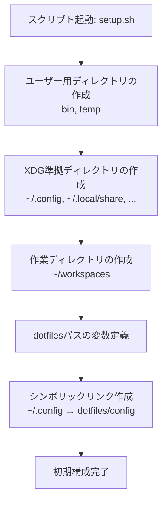
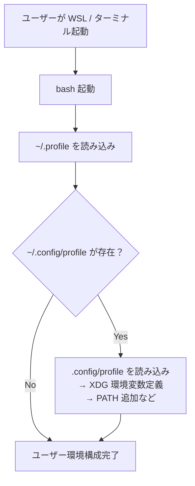

## はじめに

`WSL 2`上で開発を始めると、プロジェクトのコード、設定ファイル、一時ファイルなどがホームディレクトリに混在しやすくなります。
これにより、環境の保守性や可搬性を損なう原因となることも少なくありません。

この記事では、そうした問題を防ぐために、用途別に整理されたディレクトリ構成を設計・導入し、セットアップスクリプトによって初期環境を自動構築する方法を紹介します。

整理された作業ディレクトリは、作業効率の向上に加え、設定ファイルのバージョン管理や環境の再現性の向上にも役立ちます。

## 前提条件

`WSL 2`上の Debian 環境を対象として、ディレクトリ構成の整備と初期構築スクリプトの作成について解説します。
記事は、以下の条件を前提としています。

- **対象環境**
  - Windows 10 または 11 上の WSL 2 (Debian 系を想定)

- **必要なツール**
  - `bash` シェル (WSL の標準)
  - `基本的なLinuxコマンド(mkdir`, `ln`, `tree` など)
  - `git` (設定ファイルの管理・同期に使用)

- **読者に求めるスキルレベル**
  - Linux の基本操作 (ファイル/ディレクトリ管理)
  - ターミナルにある程度慣れていること
  - エディタ`vi`の基本的な使い方

- **本記事では扱わない内容**
  - GUI ツールの導入や設定（例: `VS Code`, GUI アプリケーション）
  - `dotfiles` の詳細な構成と戦略
  - `WSL` のインストール手順や初期設定

あらかじめ WSL の導入が完了しており、最低限のシェル操作に慣れている読者を対象としています。

## 用語集

- `WSL` (`Windows Subsystem for Linux`):
  Windows 上で Linux 環境を動作させる仕組み

- `WSL 2`:
  WSL の第2世代で、エミュレーションでカーネルを実行する WSL

- `XDG Base Directory`:
  Linux 環境における設定ファイル・キャッシュ・データなどの格納場所を標準化するための仕様

- `dotfiles`:
  ホームディレクトリに置かれる設定ファイル群 (例: `.bashrc`, `.gitconfig` など)

- `環境変数`:
  システムやアプリケーションの動作に影響を与える設定値

- `シンボリックリンク`:
  ファイルやディレクトリの別名 (エイリアス) を作る仕組み

- `workspaces`:
  プロジェクトや用途別に作業ディレクトリを分離するための親ディレクトリ。

- `tree`:
  ディレクトリ構成をツリー状に表示するコマンド。構造の可視化に便利。

## 1. WSL環境の特徴とディレクトリ設計の課題

`WSL 2` を使って開発を始めると、ファイルや設定がホームディレクトリに散乱しがちです。
ここでは、そうした問題が生じる背景と、環境整備の必要性について解説します。

### 1.1 WSLとLinuxの構造的な違い

`WSL` (`Windows Subsystem for Linux`) は、Windows 上で Linux 環境を提供する仕組みです。
`WSL 2` では実際の Linux カーネルが利用されているため、よりネイティブに近い動作が可能です。
一方で、純粋な Linux ディストリビューションとはいくつかの重要な違いがあります。

ファイルシステムの面では、`WSL 2`は Windows と Linux のファイルシステムを双方からアクセスできる構造になっています。
Linux 側からは、Windows上のファイルは`/mnt/c/`以下にあるファイルとしてアクセス可能ですが、これは便利である反面、混乱の原因にもなります。

通常の Linux デスクトップ環境では自動で作成される `~/Desktop` や `~/Documents` といったユーザーディレクトリは、WSL 上では用意されていません。そのため、何も設定せずに作業を始めると、ホームディレクトリ直下にプロジェクトや一時ファイル、設定ファイルが混在してしまいがちです。

### 1.2 散らかりやすいホームの問題と整理の必要性

WSL 環境をある程度使い続けていくと、ホームディレクトリ直下にファイルやディレクトリが次第に増えていくことに気づくはずです。`dotfiles` (設定ファイル) やプロジェクトファイル、作業用スクリプト、一時ファイルが混在することで、管理が難しくなり、操作ミスや見落としの原因にもなります。

たとえば、以下のような問題が起こりがちです。

- `.bashrc` や `.gitconfig` といった設定ファイルが、他の用途のファイルと区別しにくい
- 一時的に作成したファイルや、クローンしたプロジェクトのディレクトリが整理されずに残る
- 何のためのファイルなのか判断できず、削除やバックアップの際に困る

こうした状況を防ぐためには、用途に応じたディレクトリを明確に定義し、ファイルの配置場所を一貫して運用することが不可欠です。とくに WSL のような仮想環境では、同じ構成を別のマシンやディストリビューションに展開する機会も多く、環境構築の再現性が求められます。

そこで本記事では、`XDG Base Directory`仕様を基礎に、用途別に整理されたディレクトリ構成を提案し、WSL 上でもシンプルかつ柔軟な作業環境を構築できる手順を紹介していきます。

## 2. ディレクトリ構成の指針：`XDG Base Directory`仕様

作業環境を整理するには、あらかじめ明確なルールに基づいてディレクトリを設計することが重要です。
ここでは、その基盤となる XDG Base Directory 仕様について概観します。

### 2.1 `XDG`仕様の概要

`XDG Base Directory`仕様は、Linux 環境での設定ファイルやデータファイルの格納場所を標準化するために定義された仕様です。
従来の Unix 系システムでは、アプリケーションの設定ファイルやキャッシュデータがホームディレクトリ直下に乱雑に配置される傾向があり、可視性や保守性に課題がありました。

`XDG`の仕様では、設定ファイル・キャッシュ・データ・状態ファイルなどの役割ごとにディレクトリを用途ごとに明確に分離して管理します。
たとえば、設定ファイルは `~/.config/` に、アプリケーションデータは `~/.local/share/` に格納することが推奨されています。

XDG 仕様を導入することで、ホームディレクトリの可読性が高まり、環境構築や移行、Git による `dotfiles`管理といった運用もスムーズになります。

### 2.2 主要な`XDG`環境変数と対応ディレクトリ

`XDG Base Directory`仕様では、用途ごとに特定の環境変数を定義し、それぞれに対応するディレクトリを指定します。
これにより、設定ファイルやデータを一貫したルールのもとで整理できるようになります。

#### `XDG Base Directory`と環境変数

以下は代表的な環境変数とその役割です:

| 環境変数 | デフォルトパス | 用途 | ファイルの例 |
| --- | --- | --- | --- |
| `$XDG_CONFIG_HOME` | `~/.config` | アプリケーションの設定ファイル | `nvim/init.vim`, `git/config` |
| `$XDG_DATA_HOME` | `~/.local/share` | アプリケーションのユーザーデータ | `lesshst`, `vim/site/` |
| `$XDG_CACHE_HOME` | `~/.cache` または `~/.local/cache` | 一時的なキャッシュデータ | `vim/backup/`, `pnpm/dlx/` |
| `$XDG_STATE_HOME` | `~/.local/state` | 状態ファイル (ログ等) | `bash/history`, `nvim/data/` |

*表2-1: `XDG Base Directory`仕様における主要な環境変数とその用途*

これらの環境変数は多くのアプリケーションでデフォルトとして使用されており、明示的に設定しなくても機能する場合が一般的です。
ただし、独自に設定を行なうことでディレクトリ構成をさらに明確化でき、他のツールやスクリプトとの連携も容易になります。

特に `~/.config` 以下の構成は、Git 管理される `dotfiles` に組み込みやすく、環境の可搬性を高めるうえで非常に有効です。

#### `XDG Base Directory`構成の例

以下は、XDG 仕様に準拠したホームディレクトリ内の構成イメージです。
用途ごとにファイルを整理することで、設定ファイル・キャッシュ・データ・状態情報の役割が明確になります。

```bash
~/
├── .config/         # アプリケーションの設定ファイル
├── .local/
│   ├── share/       # アプリケーションデータ（ユーザーデータ）
│   ├── cache/       # 一時的なキャッシュデータ
│   └── state/       # 状態ファイルやログなどの永続データ
```

*図2-1: `XDG Base Directory`仕様に準拠したホームのディレクトリツリー*

### 2.3 XDG準拠による利点

`XDG Base Directory`仕様に準拠することで、作業環境の整理と運用管理に多くの利点があります。

まず、設定ファイル・キャッシュ・データといった用途ごとのファイルが明確に分離されるため、ディレクトリ構成の見通しがよくなります。
 ~/.config に設定ファイルを集約することで、カスタマイズや移植性が向上します。

また、`~/.local/share` や `~/.cache` にそれぞれのデータやキャッシュが分離されることで、不要なデータの削除やバックアップの対象を明確にしやすくなります。

各種の設定ファイルを`~/.config`下に配置することで、`dotfiles`による一元管理が可能になります。
`dotfiles`を使えば、設定ファイルを Git を使用してバージョン管理でき、設定ファイルがほかの WSL へ移行できます。

`XDG`に準拠することで、作業環境が「見える化」され、開発効率と保守性の両面で大きなメリットを得ることができます。

## 3. 推奨ディレクトリ設計：用途別構成の導入

`XDG`仕様に基づくディレクトリの設計方針が定まったら、次は実際の構成を作っていく段階です。
ここでは、用途に応じた標準ディレクトリ、`XDG`準拠ディレクトリ、作業用ワークスペースの設計を紹介します。

### 3.1 標準ディレクトリの作成と運用準備

WSL 環境での作業をスムーズに進めるため、標準ディレクトリとして `~/bin` と `~/temp` の 2 つをあらかじめ作成しておきます。
`XDG`仕様とは直接関係しませんが、多くの Linux ユーザーにとって慣れ親しまれている、実用性の高い構成です。

| ディレクトリ | 用途 |
| --- | --- |
| `~/bin` | ユーザー固有のツール、スクリプトを配置 |
| `~/temp` | 一時的なファイルの保存先、Web上のファイルのダウンロード、展開にも使用される |

*表3-1:WSL環境での作業に便利な標準ディレクトリとその用途の概要*

Debian では初期設定ファイル`~/.profile`によって、`PATH`に`~/bin`が自動的に追加されます。
このため、`~/bin`下のツールは、WSL上のどこでも利用できます。

次のコマンドを実行することで、これらのディレクトリを作成できます。

```bash
mkdir -p ~/bin ~/temp
```

#### 📁 標準ディレクトリの構成イメージ

```bash
~
├─ bin/     # ユーザー固有のツールやスクリプト
└─ temp/    # 一時作業ファイル・スクリプト保存先
```

*図3-2:標準ディレクトリ (`~/bin`, `~/temp`) の構成イメージ*

以降、記事内の操作は `~/temp` を作業ディレクトリとする前提で進めていきます。

### 3.2 XDG準拠ディレクトリ群の構成

`XDG Base Directory`仕様に準拠したディレクトリ構成を採用することで、アプリケーションの設定やデータを明確に分類・整理できます。
以下は、用途と具体的な使用例を含めた対応ディレクトリの一覧です。

#### `XDG Base Directory`対応ディレクトリ

| ディレクトリ | 環境変数 | 用途 | 使用例 |
| --- | --- | --- | --- |
| `~/.config` | `$XDG_CONFIG_HOME` | アプリケーションの設定ファイル | `nvim/init.vim`, `pnpm/rcl` |
| `~/.local/share` | `$XDG_DATA_HOME` | ユーザーデータ、アプリケーションデータ   | `lesshst`, `vim/site/` |
| `~/.local/cache` | `$XDG_CACHE_HOME` | 一時的なキャッシュデータ | `vim/backup/`, `pnpm/dlx/` |
| `~/.local/state` | `$XDG_STATE_HOME` | 状態ファイルやログなど永続的データ | `nvim/data`, `bash/history` |

*表3-2: `XDG`準拠の各ディレクトリとその対応環境変数、具体的な使用例*

#### `Git`関連ディレクトリ　(参考)

| ディレクトリ              | 用途                                         |
|--------------------------|----------------------------------------------|
| `~/.config/git`          | Git の設定ファイル (`git/config`, `git/ignore` など) |
| `~/.local/share/git`     | Git credentialデータファイル (`.git-credentials`) など |

*表3-3: `Git`関連の設定・認証ファイルを配置するディレクトリ一覧*

このようにディレクトリを用途別に構成しておくことで、設定ファイルやデータの可視性が向上し、環境の再現性・移植性も高まります。

### 3.3 `workspaces`ディレクトリの設計

開発プロジェクトや学習用コードなどを明確に分類・管理するために、作業用ディレクトリ `~/workspaces/` を導入します。
このディレクトリ配下に、用途別のサブディレクトリを設けることで、目的に応じた整理が可能になります。

#### 作業ディレクトリの構成例

| ディレクトリ | 用途例 |
| --- | --- |
| `~/workspaces/develop` | 開発中のアプリケーションやツールのプロジェクト |
| `~/workspaces/education` | 学習・調査・検証用のコードやスニペット |
| `~/workspaces/sandbox` | 試験的な実装やPoC（概念実証）コード |
| `~/workspaces/temp`      | ダウンロード・一時検証用コード、一時展開ファイル |

<!-- markdownlint-disable no-emphasis-as-heading -->
*表3-4: 作業ディレクトリ構成の例と、それぞれの用途説明*
<!-- markdownlint-enable-->
これらのディレクトリ名は一例であり、用途に応じてカスタマイズして問題ありません。重要なのは、プロジェクトの目的やライフサイクルに応じて適切な場所に配置し、作業ごとの分離と把握を容易にすることです。

この分類によって、環境移行やバックアップの際にも意図した単位で処理を行ないやすくなります。

#### 作業用ディレクトリツリーの例

以下は、作業用途別に分類された `~/workspaces/` 配下のディレクトリツリーです:

```bash
~/workspaces/
  ├── develop/      # 実運用・公開予定のアプリ、ツールの開発
  ├── education/    # 学習や検証、技術習得のためのコード
  ├── sandbox/      # 検証・実験・使い捨て前提の短期コード
  └── temp/         # 一時利用ファイルやクローンした内容の展開
```

*図3-3: `~/workspaces/`配下の用途別ディレクトリツリー構成*

## 4. 初期構成の自動化：セットアップスクリプトの作成と実行

整理されたディレクトリ構成を手動で作成するのは手間がかかります。
この章では、それらの作業を自動化するシェルスクリプトを作成し、効率よく初期環境を整える方法を紹介します。

### 4.1 スクリプト構成と保存場所

設計したディレクトリ群を手動で作成するのは煩雑なため、シェルスクリプトによって自動化するのが効率的です。
ディレクトリ構成の自動化に必要なスクリプトの構成と配置場所を紹介します。

#### スクリプトの基本構成

| 要素 | 内容 |
| --- | --- |
| ファイル名 | `create-working-dir.sh` |
| 配置場所 | `~/temp` (一時的な作業ファイル置き場) |
| 処理対象ディレクトリ | 標準 (`~/bin`, `~/temp`)、`XDG`準拠、Git用設定ディレクトリ、ワークスペース (`~/workspaces/`) |

<!-- markdownlint-disable no-emphasis-as-heading -->
*表4-1: セットアップスクリプトの構成要素とその役割*
<!-- markdownlint-enable -->

スクリプトは `~/temp` に配置して、柔軟に削除・更新できるようにします。
スクリプト作成後は実行権限を付与し、`bash` で実行することで、必要なディレクトリが一括で作成されます。

#### 📁 スクリプトの配置イメージ

```bash
~
└─ temp/
    └─ create-working-dir.sh  # 初期セットアップ用スクリプト
```

*図4-1:初期構築スクリプト`create-working-dir.sh`の配置場所の例*

このように、一時的な作業ファイルやスクリプトは `~/temp` 配下にまとめておくことで、ファイル整理や管理が簡単になります。

### 4.2 設計に基づくディレクトリツリーの全体像

この節では、第3章で設計したディレクトリ構成にもとづいて、実際に作成されるディレクトリの全体像をツリー形式で示します。
構造を視覚的に把握することで、目的ごとの配置や管理対象を整理しやすくなります。

```bash
~
├── bin/                  # ユーザー専用ツールやスクリプト
├── temp/                 # 一時的な作業ファイルやスクリプト配置用
├── .config/              # XDG: アプリケーションの設定ファイル
│   └── git/              # Git関連設定ファイル
├── .local/
│   ├── share/            # XDG: アプリケーションデータ
│   │   └── git/          # Git の認証情報など
│   ├── cache/            # XDG: キャッシュファイル
│   └── state/            # XDG: ログなど永続的な状態データ
└── workspaces/           # プロジェクト用途別の作業ディレクトリ群
    ├── develop/          # 開発用途（アプリ・ライブラリなど）
    ├── education/        # 学習用（チュートリアル・検証用コード）
    ├── sandbox/          # 実験用・試行錯誤のための領域
    └── temp/             # クローンや初期配置など一時利用用
```

<!-- markdownlint-disable no-emphasis-as-heading -->
*図4-2: スクリプトによって作成されるWSL作業環境全体のディレクトリ構成図*
<!-- markdownlint-enable -->

このツリーは、セットアップスクリプトを実行することで自動的に作成されます。
以降のセクションでは、実際にスクリプトをどのように書き、どう実行するかを具体的に説明します。

### 4.3 ディレクトリ作成スクリプトと実行手順

第3章で設計したディレクトリ群を一括で作成するには、シェルスクリプトを用いた自動化が有効です。
ここでは、作成するスクリプトの中身と実行手順を紹介します。

#### ディレクトリ作成スクリプト

以下のスクリプトを、`~/temp`下に`create-working-dir.sh` という名前で保存します。

@[gist](https://gist.github.com/atsushifx/c6d69609133c12788986e882b9782017?file=create-working-dir.sh)

#### 実行手順

以下の手順で、スクリプトを実行します。

1. 実行権限を付与します:

   ```bash
   chmod +x ~/temp/create-working-dir.sh
   ```

2. スクリプトを実行します。

   ```bash
   bash ~/temp/create-working-dir.sh
   ```

3. 成功メッセージが表示されます。
   各ディレクトリが作成されていれば完了です。

#### 実行後の確認

`tree`コマンドでディレクトリ構成を確認します。 (`tree`が未インストールの場合は `sudo apt install tree` で導入可能です):

```bash
tree -d -a -L 3 ~
```

これにより、設計どおりに構成されたディレクトリが作成されていることを一目で確認できます。

### 4.4 カスタマイズと応用

作成したスクリプトは基本構成のままでも十分機能しますが、実際の運用に合わせて柔軟にカスタマイズすることで、より強力なセットアップツールに発展させることができます。

#### `XDG`環境変数の設定による運用の強化

`XDG Base Directory`仕様に基づいた環境変数を明示的に設定することで、作業環境の一貫性と予測可能性が高まります。
ツールによっては、独自の環境変数を`XDG`仕様にすることで、`XDG Base Directory`仕様による設定ファイルの管理が可能です。

次のように環境変数を設定します:

```bash
# XDG Base Directory 環境変数の定義
export XDG_CONFIG_HOME="$HOME/.config"
export XDG_DATA_HOME="$HOME/.local/share"
export XDG_CACHE_HOME="$HOME/.local/cache"
export XDG_STATE_HOME="$HOME/.local/state"
```

上記を、シェルの設定ファイル(`~/.bashrc`, `~/.profile`)に追記することで有効化されます。
これにより、`XDG`準拠のツール (例: `neovim`, `git`, `pnpm`) は、`XDG`ディレクトリ化の設定ファイルを参照するようになります。

#### `dotfiles`との統合

ディレクトリ構成が整備されることで、`Git`を活用した`dotfiles`運用へとステップアップできます。
たとえば、`~/.config/`配下を Git で管理し、`.bashrc`などの設定ファイルを管理対象とすることで、複数環境への展開が容易になります。

```bash
# 例: dotfiles用の構成
git clone https://github.com/<youraccount>/dotfiles.git ~/.local/
ln -s ~/.local/dotfiles/.config ~/.config
ln -s ~/.config/bashrc ~/.bashrc
```

:::message alert
git clone での`<youraccount>`は、GitHub の自分のアカウントに置き換えてください
:::

#### 今後の拡張アイデア

- `mkdir`によるディレクトリだけでなく、必要なファイルを生成する
- `~/bin`に`VSCode`起動スクリプトなどの開発ツールを設定する
- `dotfiles`からのセットアップスクリプトで、必要な設定ファイル、スクリプトをまとめて設定する

このような拡張により、スクリプトは「構築ツール」から「運用フレームワーク」へ進化します。
小さな工夫と改善によって、WSL環境は自分のための快適な開発環境となります。

## 5. 今後の運用と拡張に向けて

初期構成が整ったら、次は運用の効率化と環境の拡張を考える段階です。
この章では、`dotfiles`管理や`PATH`設定の最適化、複数環境への展開方法を紹介します。

### 5.1 `dotfiles`管理への展開

整備されたディレクトリ構成は、`dotfiles`の管理基盤として活用できます。
ここでは GitHub を利用して、自分専用の環境設定をバージョン管理し、再利用可能な形にする方法を紹介します。

#### `Git`リポジトリによる設定ファイルの管理

`~/.config`上の設定ファイルやスクリプトの管理には、`Git`を用いた`dotfiles`運用が有効です。

例えば、次のようにディレクトリを設定することで、環境の復元やほかの WSL への環境の移行が簡単になります。

```bash
/home/atsushifx/.local/dotfiles/
├── linux
│   ├── bin
│   ├── opt
│   └── .config
└── scripts
    └── bootstrap
          └─setup.sh
```

*図5-1: `dotfiles`リポジトリでのディレクトリ／ファイル配置例*

上記の`dotfiles`は、GitHub上に保存しておき、WSL 側は`clone`して使用します。

```bash
git clone https://github.com/<youraccount>/dotfiles.git　~/.local/dotfiles
```

:::message alert
git clone の`<youraccount>`は GitHub の自分のアカウントに変更して使用してください。
:::

### 5.2 設定ディレクトリのシンボリックリンク管理：dotfiles による構成の一元化

WSL や他の Linux 環境を横断して一貫した構成を維持するには、設定ディレクトリを Git 管理下の`dotfiles`に統合するのが効果的です。
特に XDG 準拠で整理されたディレクトリ構成を活かすことで、設定の再利用や同期がスムーズになります。

#### シンボリックリンクによる構成の統合

`dotfiles`リポジトリ内にある設定ディレクトリを、ホームディレクトリ配下の設定用パスにシンボリックリンクします。
これにより、各種ツールが期待する場所にファイルを配置しつつ、管理の一元化が可能になります。

たとえば、以下のようにしてリンクを作成します:

```bash
ln -s ~/.local/dotfiles/linux/config ~/.config
```

この方法により、config 以下のすべての設定が Git によって管理され、環境構築のたびに手動でコピーする必要がなくなります。

#### スクリプトによるリンク作成の自動化

手動でリンクを貼る作業は煩雑でミスが起こりやすいため、セットアップスクリプトに組み込んで自動化することを推奨します。

```bash
# dotfiles ディレクトリの定義
DOTFILES="$HOME/.local/dotfiles/linux"

# リンク先が存在しない場合のみ作成
[ ! -e "$HOME/.config" ] && ln -s "$DOTFILES/config" "$HOME/.config"
```

このようにスクリプトにしておけば、他のマシンにクローンした直後でも、1 コマンドで同様の構成を復元できます。

#### 構成の柔軟性と今後の拡張

この設計は、ディレクトリ単位での切り出しやツールごとの細分化にも柔軟に対応できます。たとえばエディタやシェル、Git、パッケージマネージャーの設定をサブディレクトリに分けて管理できます。

シンボリックリンクによって物理的なファイル配置を変更することなく構成全体の切り替えが可能となり、開発用途や検証用途での環境スイッチも簡便になります。

#### `dotfiles`構成の例: 物理配置とリンクの関係

以下は、Git 管理下の dotfiles として配置された構成例と、シンボリックリンクによるホームディレクトリ側の構成例です。

```bash
~/.local/dotfiles/
   ├── linux/
   │   ├── bin/            # ユーザー用コマンドスクリプト
   │   ├── config/         # ~/.config にリンクする設定群
   │   └── opt/            # /opt 以下で使う構成ファイルなど
   └── scripts/
       └── bootstrap/
           └── setup.sh    # 初期構築スクリプト
```

*図5-2: `dotfiles`のディレクトリツリー*

この構成に対し、シンボリックリンクを張ると以下のようになります:

```bash
~/
 ├─ .config -> ~/.local/dotfiles/linux/config
 ├─ bin     -> ~/.local/dotfiles/linux/bin
```

*図5-3: `dotfiles`からのシンボリックリンク例*

このようにシンボリックリンクを張ることで、`~/.config`上の設定や`~/bin`上のスクリプトが、`dotfiles`の管理対象となります。

### 5.3 共通初期化スクリプトの導入: 複数環境での再現性を高める

複数の WSL インスタンスや Linux マシンに共通の環境を展開するには、設定済みのスクリプトを用意しておくことが最も効果的です。
`dotfiles`管理と組み合わせることで、構成ファイルや環境変数、PATH の初期化を一括して適用でき、手作業によるミスを防げます。

#### 🗂 初期化スクリプトの配置例

以下のように、共通のセットアップスクリプトを `dotfiles`リポジトリ配下に保存します:

```bash
~/.local/dotfiles/
├── linux/
│   ├── bin/
│   └── config/
└── scripts/
    └── bootstrap/
        └── setup.sh  # 共通初期化スクリプト
```

<!-- markdownlint-disable no-emphasis-as-heading -->
*図5-4: 共通初期化スクリプトのファイル構成 (dotfiles内)*
<!-- markdownlint-enable -->

このスクリプトは、初回セットアップ時や再構築時に実行され、`XDG`準拠ディレクトリ、シンボリックリンクなどを自動的に整備します。

#### 共通初期化スクリプト

スクリプトのフローを以下に示します。



*図5-5: `setup.sh`の実行フロー*

次のスクリプトでクローン後に共通初期化をします:

```bash
#!/bin/bash
# src: ~/.local/linux/scripts/setup.sh
set -euCo pipefail

# 基本ディレクトリ
mkdir -p "$HOME/bin" "$HOME/temp"

# XDGディレクトリ
mkdir -p \
  "$HOME/.config" \
  "$HOME/.local/share" \
  "$HOME/.local/cache" \
  "$HOME/.local/state"

# 作業ディレクトリ
"$HOME/workspaces"

# シンボリックリンク例
DOTFILES="$HOME/.local/dotfiles/linux"
[ -e "$DOTFILES/config" ] && ln -sfn "$DOTFILES/config" "$HOME/.config"

```

このような共通スクリプトを整備しておくことで、他のマシンへもスムーズに移行できます。

### 5.4 シェル起動時の共通初期設定: 環境の自動整合性維持

環境の初期化処理を一度だけ手動で実行する構成でも十分に機能しますが、より実用的な運用には「ログイン時・シェル起動時の自動初期設定」が効果的です。これにより、環境変数やパス、個別設定ファイルの読み込み忘れを防ぎ、安定した動作を継続的に維持できます。

#### 初期化の自動化: シェル設定ファイルからの呼び出し

たとえば、以下のように `~/.bashrc` や `~/.profile` の末尾に設定を追加しておくことで、毎回のシェル起動時に共通の初期化処理を実行できます。

```bash
# ~/.profile の末尾に追加
[ -f "$HOME/.config/profile" ] && . "$HOME/.config/profile"
```

この構成により、`XDG`関連の環境変数、`PATH`の追加、エイリアス、関数などを `.config/profile` に集約して管理でき、他の WSL 環境や Linux デバイスでも再利用しやすくなります。

#### `.config/profile` の記述例

```bash
# ~/.config/profile の一例
export XDG_CONFIG_HOME="$HOME/.config"
export XDG_DATA_HOME="$HOME/.local/share"
export XDG_CACHE_HOME="$HOME/.local/cache"
export XDG_STATE_HOME="$HOME/.local/state"

export PATH="$HOME/bin:$PATH"
```

このように設定しておけば、マシンやシェルを問わず、常に一貫した環境で作業がスタートできるようになります。特に複数の端末で作業を行なう開発者や、WSL と物理 Linux マシンを併用するユーザーにとって、有効なアプローチです。

#### シェル起動時の初期化フロー



*図5-6: シェル起動時の`.config/profile`を呼び出しフロー*

## まとめ

本記事では、WSL 2 上の Linux 環境において、用途別に整理されたディレクトリ構成とその初期構築方法について紹介しました。

- **設計指針**
  整理の基準として `XDG Base Directory`仕様を参考にし、用途ごとに明確な配置ルールを設けました。

- **構築方法**
  標準ディレクトリ・XDG 準拠ディレクトリ・作業ディレクトリの設計と、それらを自動で作成するスクリプトを提示しました。

- **今後の発展**
  `dotfiles`管理の足がかりとして活用でき、複数環境への移植・再構築もスムーズに行なえるようになります。

このような環境設計と初期構成を整えることで、WSL の運用効率は大きく向上します。

## おわりに

`WSL`環境での作業を快適かつ効率的にするためには、整ったディレクトリ構成と、再現性の高い初期化手順が欠かせません。
この記事では、`XDG`仕様をベースに標準ディレクトリとワークスペースディレクトリを追加し、用途ごとに整理された構成と自動化によるセットアップ方法を紹介しました。

日々の開発、勉強、プログラミングを行なううえで力になるのが、こういった整理、整頓されたディレクトリなどの開発環境です。
ぜひ今回の構成を出発点に、ご自身のスタイルに合わせて、環境を育てていきましょう。

それでは、Happy Hacking!

## 参考資料

### Webサイト

- [XDG Base Directory Specification](https://specifications.freedesktop.org/basedir-spec/basedir-spec-latest.html):
  `XDG Base Directory`仕様の公式ドキュメント

- [XDG Base Directory](https://wiki.archlinux.jp/index.php/XDG_Base_Directory):
  Arch Wiki による、`XDG Base Directory`仕様の説明
