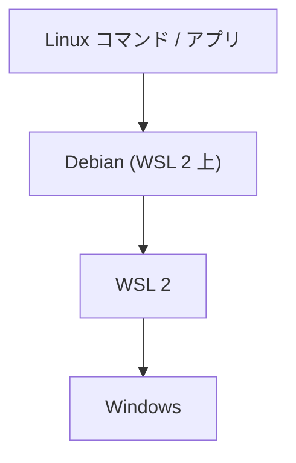
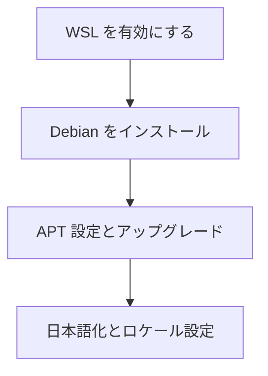

## はじめに

atsushifx です。
`WSL` (`Windows Subsystem for Linux`) は、Windows 上で `Linux` を実行するためのシステムです。
仮想マシンやデュアルブートのような複雑な環境構築をせずに、Windows 上で `Linux` を用いた開発を可能にします。

この記事では、`WSL` を有効にして `Debian` 環境を導入し、開発用に初期セットアップする方法を解説します。
エディタなどの設定方法については、`XDG Base Directory`仕様に沿った構成例を紹介します。
これらの設定ファイルを GitHub リポジトリで管理することで、他のマシンへ簡単に移行できる方法も解説します。

設定手順はすべて公式ドキュメントや広く使われている方法に基づいており、Windows環境があれば誰でも同じ開発環境を構築できます。
このシリーズでは、`Debian` をベースにした開発環境を、段階的に無理なく整備していくためのガイドを提供します。

## 用語集

- `WSL` (`Windows Subsystem for Linux`):
  Windows 上で Linux を実行できる仮想的な環境機構

- `WSL 2`:
  仮想マシンベースで高速なファイル I/O を実現した WSL の第2世代

- `Debian`:
  安定性とシンプルさで定評のある Linux ディストリビューションの 1つ

- `XDG Base Directory`:
  設定ファイルやキャッシュなどの標準ディレクトリ構成仕様

- `vi / vim`:
  ターミナル上で利用される強力なテキストエディタ

- `.bashrc`:
  Bash シェルで実行されるユーザーの設定スクリプトファイル

- `task` メタパッケージ:
  複数のパッケージを一括でインストールできる仮想パッケージ機能

## 1. WSL 2 × Debian で始める開発環境構築

`WSL 2`を使えば、Windows上でもシームレスに `Linux` を扱えます。
この記事では、`Linux` 初心者向けに `Linux` / `Debian` の基礎知識について説明します。
それぞれの説明は、別記事へのリンクとなっていますので、詳細は各記事を参照してください。

Windows における `WSL 2`の構成は、下記の図1のようになっています。

*図1: `WSL 2` 構成概念図*

開発環境の構築でも、PC の操作などの詳細は別ページへのリンクとなっています。
リンクを Ctrl を押しながらクリックして別タブで開きます。その後、このページに戻ってくると作業がスムーズです。

## 2. Linux / Debian の基礎知識

Linux は広く使われているオープンソースの OS です。多くの開発者が Web アプリケーションを作る際の基盤として利用しています。
Windows には`WSL` (`Windows Subsystem for Linux`)として導入されて、Windows ユーザーにも Linux が利用可能です。
ここでは、初心者でも無理なく学べるよう、Linux に関する基礎知識と主要な操作方法をわかりやすく解説します。

- 基本操作・ファイル構造:
  `Linux` のファイルシステムは階層的に構成され、各ディレクトリには固有の役割があります。ファイルの作成、移動、コピー、削除といった基本操作を理解することが、システム操作の第一歩です。

- ユーザー権限とパーミッション:
  `Linux` では、ユーザー権限やファイルパーミッションによってシステムの安全性が保たれています。`sudo` を用いた管理や、`chmod`, `chown` コマンドにより、適切なアクセス制御を実現します。

- テキストエディタ (`vi` / `vim`):
  `vi` や `vim` は `Linux` 環境で広く利用されるテキストエディタです。基本的な編集操作とモード切替を習得することで、効率的なコマンドライン作業が可能となります。

- シェルとカスタマイズ:
  シェルは `Linux` におけるコマンド実行の中心です。.bashrc などの設定ファイルを編集することで、ユーザー独自の環境にカスタマイズし、作業効率を向上させます。

## 3. WSL2 Debian のセットアップ

ここでは、WSL 上に Debian 環境を構築する手順を説明します。

 1. [コマンドを使用しない WSL 手動セットアップガイド](wsl2-setup-without-wsl-command.md):
    通常は `wsl --install` コマンドでセットアップできます。
    `wsl` コマンドが利用できない場合に備え、手動でセットアップする方法も紹介します。

 2. [Debianのインストールと初期設定ガイド](wsl2-setup-debian-install.md):
    `wsl` コマンドを用いて `Debian` をインストールし、初期ユーザーを設定する手順を説明します。

 3. [はじめての apt 設定とアップグレード](wsl2-setup-apt-basics-and-maintenance.md):
    APT のミラーサイトを適切に設定し、パッケージを最新の状態へアップグレードする方法について解説します。

 4. [Debianを日本語対応にする基本セットアップガイド](wsl2-setup-debian-japanese.md):
    `task` メタパッケージを用いた日本語化、および日本語表示に必要な設定項目を説明します。

これらのセットアップ工程をフローチャートにすると、下記の図2となります。

<!-- markdownlint-disable no-emphasis-as-heading -->
*図2: セットアップ工程*
<!-- markdownlint-enable -->

## おわりに

この記事では、Windows 上に `WSL 2` を導入し、`Debian` を使った開発環境の初期構築手順を紹介しました。

ここで紹介した内容を順に実行することで、Windows 環境上で手軽かつ効率的に `Linux` 開発環境を作れます。

今後は、プログラミング言語のインストール、ドットファイルの整理、エディタの設定など、実際の開発に必要なツールや設定を加えて、自分だけの快適な環境を構築できるようになるでしょう。

このシリーズを通じて、自分の開発スタイルに合った `Linux` 環境を身につけましょう。
それでは、Happy Hacking!

## 参考資料

### Webサイト

- Windows に `Linux` をインストールする方法 (Microsoft): <https://learn.microsoft.com/ja-jp/windows/wsl/install>
- WSL の基本的なコマンド (Microsoft): <https://learn.microsoft.com/ja-jp/windows/wsl/basic-commands>
- WSL での詳細設定の構成 (Microsoft): <https://learn.microsoft.com/ja-jp/windows/wsl/wsl-config>
