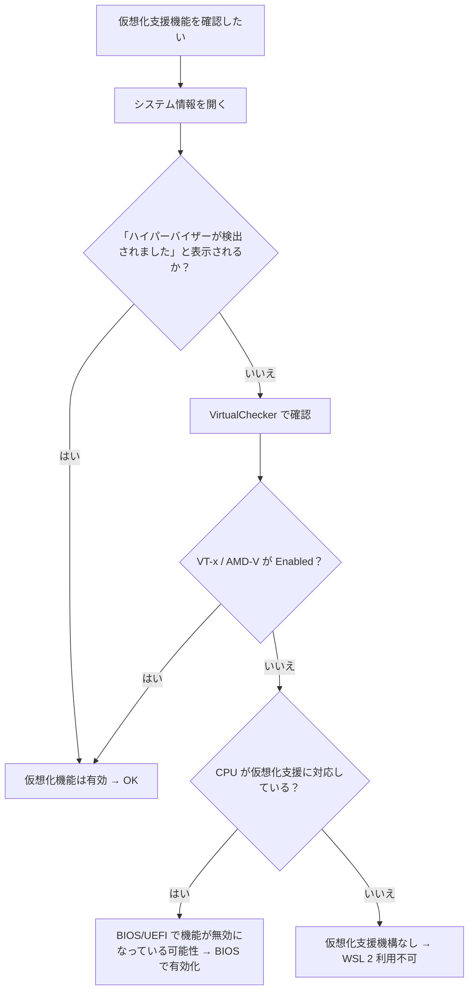
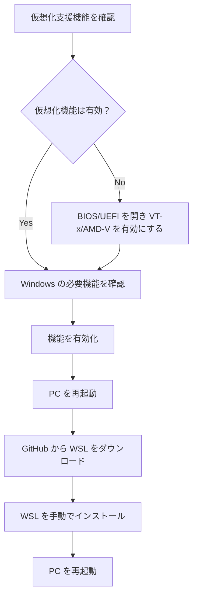
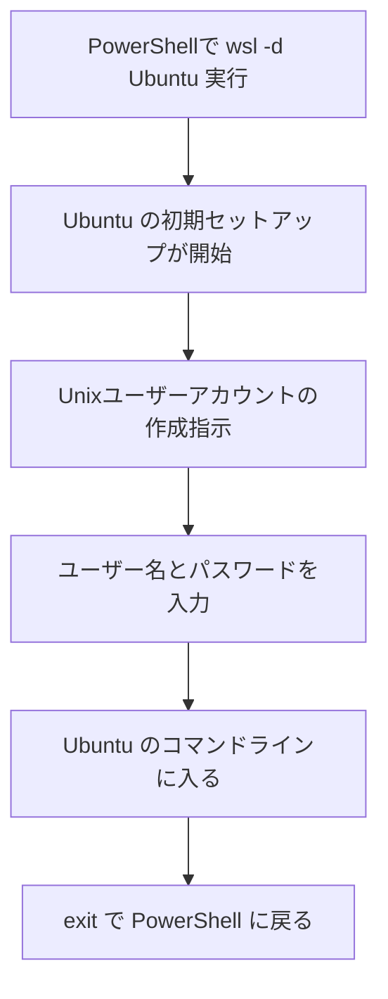

## はじめに

atsushifx です。
この記事では、GitHub のパッケージを利用して `WSL` を手動でインストールする方法を紹介します。

通常、`WSL` のセットアップには `wsl` コマンドを使用します。
機能の有効化からディストリビューションのインストールまで、このコマンドで完結できます。

システム環境に不備がある場合、`wsl` コマンドが起動できず、`WSL` のインストールや実行ができません。
例えば、`ENOENT` エラーで "`wsl.exe` が見つかりません" というメッセージが表示される場合です。

この記事では、`wsl` コマンドが使えない状況でも `WSL` を使えるようにするため、Microsoft が GitHub 上で提供しているパッケージを利用して環境を構築する手順をまとめています。
標準の方法が通用しないときの対処法として、きっと参考になるはずです。

このガイドが、環境構築の役に立てばうれしいです。
Enjoy!

## 用語集

- `Windows Subsystem for Linux` (`WSL`):
  Windows 上で Linux 環境を実行するためのサブシステム

- `WSL 1`:
  システムコールを Windows に変換する互換レイヤー方式の `WSL` 初期バージョン

- `WSL 2`:
  実際の Linux カーネルを仮想マシン上で動かす方式の `WSL` バージョン 2

- `Hyper-V`:
  Windows に標準搭載されている仮想化プラットフォーム

- `VirtualMachinePlatform`:
  `WSL 2` のために必要な Windows のオプション機能

- `HypervisorPlatform`:
  ネスト仮想化などを可能にするオプション機能

- `PowerShell`:
  Windows 上の高機能なコマンドラインシェル

- `sfc /scannow`:
  破損したシステムファイルをスキャン・修復するコマンド

- `DISM /RestoreHealth`:
  Windows イメージを修復するコマンド

- `dism.exe`:
  Deployment Image Servicing and Management の略。Windows の修復や構成に使う管理ツール

- `wsl --set-default-version`:
  デフォルトでインストールされる `WSL` のバージョンを指定するコマンド

- `wsl --install`:
  Windows の `WSL` 環境を自動的に構築するためのコマンド (Windows 11 以降で有効)

- `.msi`:
  Windows 用インストーラー形式

- `Ubuntu`:
  もっとも普及している Linux ディストリビューションの 1つ

## 1. `WSL` の仕組みと構造

## 1.1 `WSL` の動作原理

`WSL` は、Windows 上で Linux をネイティブのように扱える実行環境です。
従来は、Linux を利用するには、仮想マシンまたはデュアルブート構成が必要でした。
`WSL` は、`Windows` のアプリケーションと `Linux` のツールを同時に利用できる統合環境です。

Windows カーネルには、Linux のシステムコールを処理する互換レイヤーや、Linux カーネルを実行する仮想化技術が組み込まれています。
これらにより、`WSL` が Linux 実行環境を提供します。

特に `WSL 2` では、軽量な仮想マシンアーキテクチャが採用されており、実際に Microsoft が配布しているカスタム Linux カーネルが動作します。
このアプローチにより、従来の `WSL 1` よりも高い互換性とパフォーマンスが実現されています。


*[図1] `WSL` の動作原理*

## 1.2 `WSL 1` と `WSL 2` の機能比較

`WSL` には `WSL 1` と `WSL 2` の 2種類のバージョンがあります。
各バージョンには異なる特徴と利点があり、用途に応じて使い分けられます。

### `WSL 1`

`WSL 1` は、Linux のシステムコールを `Windows` カーネルに変換する「互換レイヤー」として動作します。
仮想マシンを用いないため、軽量な動作と短い起動時間が大きな特徴です。
`Windows` のファイルシステムとの連携もスムーズで、ファイル I/O の操作は比較的高速です。

ただし、`Linux` カーネルが提供する一部の機能に互換性がなく、`Docker` などの低レイヤーのシステム機能を必要とするツールは、互換性の問題で動作しない場合があります。

### `WSL 2`

`WSL 2` は、`Microsoft` がカスタマイズした `Linux` カーネルを実際に仮想マシン上で動作させる構造を採用しています。
これにより、`Linux` と同等のシステムコール互換性が実現されており、`Docker` や各種開発ツールがスムーズに動作します。

`WSL 1` に比べて初回起動やファイルアクセスの速度はやや劣る場合がありますが、全体としての互換性と機能性の高さから、多くの開発者にとって、現実的かつ互換性の高い選択肢となっています。

## 2. `WSL 2` のシステム要件

`WSL 2` を利用するには、ハードウェアとソフトウェアで複数の要件が必要です。
ここでは、事前に確認すべきポイントをわかりやすくまとめます。

### 2.1 対応バージョンの確認

`WSL 2` を利用するには、以下の Windows バージョンが必要です。

- Windows 10 バージョン `1903` (ビルド `18362` 以降)
- Windows 11 (全バージョン)

Windows のビルドバージョンは、`[Win]+R` キーで「ファイル名を指定して実行」ダイアログを開き、`winver` と入力して確認できます。

```powershell
winver
```


`Windows` が上記よりも古い場合は、Windows Update を実行して最新版にします。

### 2.2 仮想化支援機構の判定

`WSL 2` を利用するには、CPU が仮想化支援機能 (`Intel VT-x` または `AMD-V`) に対応し、有効であることが必要です。

仮想化支援機構が無効な場合、`WSL 2` は起動せず、一部の機能が動作しないこともあります。

#### Windows 上でハイパーバイザーが有効か確認する手順

まず、`Windows` 上でハイパーバイザーが有効かどうかを確認します。
これは、システムに仮想化機能が有効化されているかの初歩的なチェックになります。

1. `システム情報`の起動:
   \[スタート]メニューから\[システム情報]を起動します。

2. ハイパーバイザーの確認:
  「システムの要約」を開き、右側の表示欄に「ハイパーバイザーが検出されました…」と記載されているか確認します。
   

この記述があれば、仮想化機能は有効です。

#### CPU の仮想化支援機構の確認方法

システム情報でハイパーバイザーの記述が確認できなかった場合は、CPU 自体が仮想化支援機能に対応しているかを確認します。
以下の手順で確認できます。

1. `VirtualChecker` のインストール:
  [`VirtualChecker`](https://openlibsys.org/index-ja.html) をダウンロードしてインストールします。

2. CPU の確認:
   アプリケーションを起動すると、`VT-x`や`AMD-V`が Enabled (有効) になっているかが表示されます。

表示が `Enabled` (有効) であれば、仮想化支援機構は有効です。
`Unsupported` (サポート外) の場合、CPU が仮想化支援機構に対応していないか、BIOS (または UEFI) の設定で無効になっている可能性があります。
必要に応じて BIOS/UEFI で仮想化支援機能を有効にしてください。

#### 仮想化機能の判定一覧

上記の内容をまとめると、次の一覧になります。

| `チェック方法` | `チェック内容` | `表示` | `仮想化機能の有効性` |
| --- | --- | --- | --- |
| `システム情報` | ハイパーバイザー | 表示あり | 有効 |
| `VirtualChecker` | `VT-X` / `AMD-V` | Enabled | 有効 |

上記のいずれも有効でない場合、`WSL`を利用できません。
その場合は、BIOS で仮想化支援機構を有効にします。

#### 仮想化支援機構の判断フロー

以下のフローチャートで、仮想化支援機構を判定します。



*[図2] 仮想化支援機構の判断フロー*

### 2.3 必要な機能の一覧と確認方法

`WSL 2` を利用するためには、複数の Windows 機能を有効にします。
これらの機能が無効だと、仮想化機能や `wsl` コマンドが正常に動作しないことがあります。

#### 必要なシステム機能

WSL 2 の動作に必要な主な Windows 機能は以下の 3つです。

| 機能名 | 説明 |
| --- | --- |
| `Microsoft-Windows-Subsystem-Linux` | Linux サブシステムの中核機能 |
| `VirtualMachinePlatform` | 仮想マシン機能の基盤 |
| `HypervisorPlatform` | Hyper-V 上で軽量な仮想化 API を提供する機能。`WSL 2` を動作させるために必要 |

#### 機能の有効／無効を確認する方法

必要な Windows 機能が有効になっているかを確認するため、PowerShell コマンドを実行します。

```powershell
Get-WindowsOptionalFeature -Online | Where-Object { $_.FeatureName -in `
  "Microsoft-Windows-Subsystem-Linux", `
  "VirtualMachinePlatform", `
  "HypervisorPlatform" } | Format-Table FeatureName, State
```

出力例:

```powershell
FeatureName                          State
------------                         -----
Microsoft-Windows-Subsystem-Linux    Enabled
VirtualMachinePlatform               Enabled
HypervisorPlatform                   Disabled
```

上記のように、`State` が `Enabled` であれば機能が有効化されています。

## 3. セットアップ全体の流れ

`WSL 2` を GitHub から手動で導入する場合、仮想化機能など、必要な Windows 機能が有効か確認します。
その後、GitHub から WSL インストーラーをダウンロードし、WSL をインストールします。

### 3.1 導入手順のフロー図

セットアップの流れは、以下の図3のようになります。



*[図3] WSL セットアップの全体手順*

この流れは、BIOS 設定の変更や仮想化機能の有効化といった初期準備を含めて、`WSL` を問題なく導入するための実践的な手順です。
機能の有効化がうまくいかない場合、「[7. `WSL` 導入時のトラブルと対処法](#7-wsl-導入時のトラブルと対処法)」が参考になります。

## 4. 必要機能の有効化手順

この章では、必要な機能の有効化手順と、それらが正しく反映されたかを確認する方法を紹介します。

### 4.1 機能構成と有効化の概要

`WSL 2` を利用するには、あらかじめ複数の Windows 機能を有効にしておきます。
これらの機能が無効な場合、仮想化が正常に動作せず、`WSL 2` のインストールや起動が失敗する原因となります。

以下の 3つの機能が、`WSL 2` にとって特に重要です。

| `コントロールパネルの表示名` | `機能` | `説明` |
| --- | --- | --- |
| `Linux用 Windows サブシステム` | `Microsoft-Windows-Subsystem-Linux` | WSL の中核機能 |
| `Virtual Machine Platform` | `VirtualMachinePlatform` | 仮想マシン実行の基盤 |
| `Windows ハイパーバイザープラットフォーム` | `HypervisorPlatform` | 軽量な仮想化 APIで、`WSL 2` などの仮想技術を動作させるための中核的な機能 |

これらの機能は、「Windows の機能の有効化」ダイアログから手動で有効化できますが、`PowerShell` を使うとより確実かつ効率的に設定できます。

### 4.2 機能の無効化とリセット手順

WSL が正常に動作しない場合や、機能の設定が不完全な場合は、いったん該当機能を**完全に無効化**してから再設定すると改善することがあります。
このステップは、**初回導入時には基本的に不要** ですが、トラブル時の対処として有効です。

次の手順で、機能を無効化します。

1. 管理者ターミナルの起動:
   \[スタート]ボタンを右クリックし、\[ターミナル (管理者)]を選択します。
   

   管理者権限付きで、ターミナルが立ち上がります。
   

2. 機能の無効化:
   以下の `PowerShell` コマンドで、必要な機能をまとめて無効化できます。
   :::message alert
   操作を誤るとシステムに影響を与えるため、慎重に実行してください。
   :::

   ```powershell
   # Linux 用 Windows Subsystem を無効
   dism.exe /online /disable-feature /featurename:Microsoft-Windows-Subsystem-Linux /norestart

   # 仮想マシンプラットフォームを無効
   dism.exe /online /disable-feature /featurename:VirtualMachinePlatform /norestart

   # ハイパーバイザープラットフォームを無効
   dism.exe /online /disable-feature /featurename:HypervisorPlatform /norestart
   ````

3. PC の再起動:
   機能の無効化を反映させるため、PC を再起動します。

   ```powershell
   # PC の即時再起動
   shutdown /r /t 0
   ```

以上で、機能の無効化は完了です。

### 4.3 `PowerShell` による機能有効化

次の手順で、機能を有効化します。

1. 管理者ターミナルの起動:
   \[スタート]ボタンを右クリックし、\[ターミナル (管理者)]を選択します。
   

   管理者権限付きで、ターミナルが立ち上がります。
   

2. 機能の有効化:
   次のコマンドで、必要な機能をまとめて有効化します。

   ```powershell
   # WSL の中核機能
   dism.exe /online /enable-feature /featurename:Microsoft-Windows-Subsystem-Linux /all /norestart

   # 仮想マシン プラットフォーム
   dism.exe /online /enable-feature /featurename:VirtualMachinePlatform /all /norestart

   # ハイパーバイザー プラットフォーム (WSL2 に必要)
   dism.exe /online /enable-feature /featurename:HypervisorPlatform /all /norestart
   ```

3. PC の再起動:
   有効化した機能を反映させるため、PC を再起動します。

   ```powershell
   # PC の即時再起動
   shutdown /r /t 0
   ```

再起動後、WSL を含む仮想化環境が動作可能になります。

### 4.4 有効化後の動作確認

ここでは、仮想化関連機能や WSL に必要なシステム機能が正しく有効化されたかを確認する手順を紹介します。設定ミスや反映漏れを避けるためにも、インストール前のチェックとして推奨されます。

#### PowerShell コマンドで必要な機能がすべて有効になっているかを確認する手順

以下の管理者用 PowerShell コマンドを実行します。

```powershell
# 各機能の状態を確認
Get-WindowsOptionalFeature -Online | Where-Object {
  $_.FeatureName -in @(
    "Microsoft-Windows-Subsystem-Linux",
    "VirtualMachinePlatform",
    "HypervisorPlatform"
  )
} | Format-Table FeatureName, State
```

次のように出力されます:

```powershell
FeatureName                         State
-----------                         -----
VirtualMachinePlatform            Enabled
HypervisorPlatform                Enabled
Microsoft-Windows-Subsystem-Linux Enabled
```

表示された出力の `State` がすべて `Enabled` であることを確認します。
その場合、WSL 2 用のすべての機能が有効になっています。

## 5. GitHub からの WSL パッケージ導入

Microsoft の GitHub リポジトリから最新の WSL パッケージを手動でダウンロード・インストールする手順を紹介します。

### 5.1 WSL インストーラーのダウンロード手順

`WSL` を手動でインストールするために、Microsoft が GitHub 上で公開している`.msi` パッケージをダウンロードします (通常は、最新の`x64`版)。

以下の手順で、インストーラーをダウンロードします。

1. リリースページにアクセス:
   <https://github.com/microsoft/WSL/releases> のリンクをブラウザで開きます。
   [](https://github.com/microsoft/WSL/releases)

2. `<Latest>` を探す:
   各アセットのうち、右に `<Latest>` タグの付いた最新版のアセットを探します。

   :::message alert
   `<Latest>`タグより新しいアセットは、開発中のためダウンロードしません。
   :::

   

3. `.msi`のダウンロード:
   アセットから `wsl-<version>.<arch>.msi`となっているファイルをダウンロードします。
   ::: message
   `<version>` は、リリースのバージョン。
   `<arch>` は Windows のアーキテクチャ (`Intel`/`AMD`は`x64`、`ARM`系は`arm64`)。
   :::

### 5.2 WSL のインストール

ダウンロードした `.msi` インストーラーを使って、WSL を手動でインストールします。
以下の手順で、WSL をインストールします。

1. WSL インストーラーの実行:
  ダウンロードした `.msi` ファイルを実行します。
  

2. PC の再起動:
   インストール完了後、PC を再起動して、インストール内容を反映させます。
   これにより、Windows がインストール後の WSL 環境を正しく認識します。

   ```powershell
   # PC の再起動
   shutdown /r /t 0
   ```

以上で、WSL のインストールは完了です。

### 5.3 バージョン情報の確認方法

WSL が正しくセットアップされているか確認するために、バージョン情報をチェックします。
以下の手順で、WSL のバージョンを確認します。

1. ターミナルの起動:
   スタートメニューから `PowerShell 7`または`ターミナル`を起動します。
   

2. バージョン確認コマンドの実行:
   `wsl --version`を実行し、バージョンを確認します。

   ```powershell
   wsl --version
   ```

3. バージョン出力の確認:
   以下のように、wsl のバージョンが出力されます。

   ```powershell
   WSL バージョン: 2.4.13.0
   カーネル バージョン: 5.15.167.4-1
   WSLg バージョン: 1.0.65
    .
    .
   ```

   バージョン情報が表示されれば、WSL のインストールは完了です。

#### 補足: `wsl` コマンドが実行できない場合

- コマンドが認識されない場合は、PC の再起動を試してみます。
- それでもコマンドが見つからない場合は、インストールに失敗している可能性があります。
  再度 `.msi` を実行するか、[7. トラブルと対処法](#7-wsl-導入時のトラブルと対処法) を参照します。

## 6. Ubuntu による動作確認と導入検証

この章では、ディストリビューション `Ubuntu` を導入し、WSL上で Linux が動くかを確認します。
動作確認が終わったら、`Ubuntu` は不要となるため WSL から削除できます。

### 6.1 既定バージョンの設定

WSL には `WSL 1` と `WSL 2` の 2種類のバージョンがあります。
既定のバージョンを `WSL 2` に設定することで、以後インストールされる Linux が `WSL 2` で起動するようになります。

次の手順で、既定のバージョンを `WSL 2` に設定します。

1. コマンドの実行:
   `wsl --set-default-version` コマンドを実行します。

   ```powershell
   wsl --set-default-version 2
   ```

2. 出力結果の確認:
   次のように、出力されます。

   ```powershell
   WSL 2 との主な違いについては、https://aka.ms/wsl2 を参照してください
   この操作を正しく終了しました。
   ```

3. バージョン設定の確認:
   `wsl --status` コマンドで、現在のバージョンの確認ができます。

   ```powershell
   wsl --status
   ```

   出力に `規定のバージョン: 2` とあれば設定完了です。

### 6.2 Ubuntu のインストール

ここでは、WSL のデフォルトディストリビューションである `Ubuntu` をインストールします。
`Ubuntu` が正常に動作すれば、`WSL` も正常に動作しています。

次の手順で、`Ubuntu` をインストールします。

1. コマンドの実行:
   `wsl --install`コマンドを実行し、ディストリビューションをインストールします。

   ```powershell
   wsl --install
   ```

2. 出力の確認:
   インストール中は、次のように出力されます。

   ```powershell
   ダウンロード中: Ubuntu
   [==============            24.7%                           ]

   インストール中: Ubuntu
   [==============            24.7%                           ]
   ディストリビューションが正常にインストールされました。'wsl.exe -d Ubuntu' を使用して起動できます
   ```

以上で、`Ubuntu`のインストールは完了です。

### 6.3 Ubuntu の起動と動作確認

ここでの動作確認は、以下の図4 となります。



*[図4] `Ubuntu` 動作確認フロー*

次の手順で、`Ubuntu` が正常に動作するかを確認します。

1. Ubuntu の起動:
   powershell で、次のコマンドを実行します。

   ```powershell
   wsl -d Ubuntu
   ```

   以下のように出力されます。

   ```powershell
   Provisioning the new WSL instance Ubuntu
   This might take a while...
   Create a default Unix user account: <ユーザー名>
   ```

2. アカウントの作成:
   プロンプトに従って、ユーザー名、パスワードを入力します。

   ```powershell
   Create a default Unix user account: <ユーザー名>
   New password:
   Retype new password:
   ```

3. 出力の確認:
   メッセージが出力され、`Ubuntu` のコマンドラインに入ります。

   ```bash
   To run a command as administrator (user "root"), use "sudo <command>".
   See "man sudo_root" for details.
   Welcome to Ubuntu 24.04.2 LTS (GNU/Linux 5.15.167.4-microsoft-standard-WSL2 x86_64)
    .
    .
   <ユーザー名>@ys $
   ```

4. `Ubuntu` の終了:
   `exit` と入力し、`PowerShell` に戻ります。

   ```bash
   exit
   ```

以上のように、`Ubuntu` のコマンドラインに入れる場合、WSL のセットアップは正常に完了しています。

### 6.4 Ubuntu の削除

ここでは、WSL の動作確認用にインストールした `Ubuntu` を削除します。
同様の手順で、後からインストールした Linuxディストリビューションを削除できます。

次の手順で、`Ubuntu` を削除します。

1. ディストリビューションの確認:
   `wsl --list`コマンドで、インストールされているディストリビューションを確認します。

   ```powershell
   wsl --list --verbose
   ```

   出力例:

   ```powershell
     NAME      STATE           VERSION
   * Ubuntu    Stopped         2
   ```

   上記のように、`Ubuntu` が一覧に表示されます。

2. Ubuntu の削除:
   `wsl --unregister` コマンドで、`Ubuntu` を削除します。
   :::message alert
   この操作は `Ubuntu` を完全に削除します。
   再インストールはできますが、データの復元はできないため、必要なデータがある場合は事前にバックアップしてください。
   :::

   ```powershell
   # 安全のため、WSLを停止
   wsl --shutdown

   # Ubuntuを削除
   wsl --unregister Ubuntu
   ```

   出力例:

   ```powershell
   登録解除。
   この操作を正しく終了しました。
   ```

   上記のメッセージが出力されれば、`Ubuntu` は削除されています。

3. Ubuntu が削除されたかの確認:
  `wsl --list`コマンドで、`Ubuntu` が削除されたかを確認します。

   ```powershell
   wsl --list
   ```

   表示された一覧を確認します。
   `Ubuntu` が表示されなければ、削除は完了しています。

## 7. `WSL` 導入時のトラブルと対処法

`Windows` に`WSL`環境をセットアップする際に発生したトラブルとその対処法を掲載します。

### 7.1 システム関連のトラブル

#### [SYS-001]: コマンド実行エラー

トラブル:
`wsl`コマンドを実行しようとすると、`ENOENT`などのエラーが表示され、実行できない。

- 詳細:
  `ENOENT`エラーは、「ファイルまたはディレクトリが見つかりません」という意味です。
  `wsl.exe` のリンク切れや、WSL 関連機能の設定不備が原因で発生します。

- 原因:
  - Windows の機能が無効化されている、または不完全に有効化されている
  - システムファイルの破損や、WSL のインストール不備
  - Windows Update 後の構成不整合

- 対処法:
  次の手順で、WSL を再インストールして問題の解消を試みます。

  1. 機能の再有効化:
    [4.2](#42-機能の無効化とリセット手順), [4.3](#43-powershell-による機能有効化) の手順に従い、機能を再設定し、有効化します。

  2. WSL の手動インストール:
    [5.](#5-github-からの-wsl-パッケージ導入) に従い、WSL を GitHub からインストールします。

以上で、WSL をセットアップできます。

:::message alert
それでも改善しない場合は、以下のコマンドを使用してシステムファイルの整合性をチェック・修復を試してください。
まず、`sfc`コマンドを試し、それでも改善しない場合は`dism`コマンドを試してください。

- `sfc /scannow`:
   システムファイルをスキャンして、破損・欠落を検出&修復する

- `dism /RestoreHealth`:
  破損した Windows の内部イメージをオンライン修復する

:::

### 7.2 設定関連のトラブル

#### [FEAT-001]: 機能有効化の失敗

トラブル:
`WSL`、`仮想マシンプラットフォーム`などの機能が有効化できない。

- 原因:
  - 機能に関連するファイルが壊れている
  - 機能に関するファイルが中途半端に残っている

- 対処法:
  1. [4.2](#42-機能の無効化とリセット手順)の手順に従い、機能を無効化します
  2. [4.3](#43-powershell-による機能有効化)の手順に従い、機能を再度、有効にします。

  以上の手順により、WSL 関連の機能が正しく有効化されます。

## おわりに

この記事では、`wsl` コマンドが使えない状況でも WSL を使えるようにするため、GitHub 上のパッケージを活用したセットアップ方法をまとめました。

本記事の手順を使えば `WSL` を問題なく動作させることができます。
万が一、つまずいても [7 章トラブルと対処法](#7-wsl-導入時のトラブルと対処法) を参考にすれば、ほとんどの問題は解決できます。

開発や検証の場面で、少しでもお役に立てば嬉しいです。
それでは、Happy Hacking!

## 参考資料

### Webサイト

- [Linux用Windowsサブシステム とは](https://learn.microsoft.com/ja-jp/windows/wsl/about):
  公式ドキュメントによる`WSL`の概要

- [`WSL`バージョンの比較](https://learn.microsoft.com/ja-jp/windows/wsl/compare-versions):
  公式ドキュメントによる、`WSL 1`と`WSL 2`の違い

- [以前のバージョンの`WSL`の手動インストール手順](https://learn.microsoft.com/ja-jp/windows/wsl/install-manual):
  公式ドキュメントによる、`WSL`を手動でインストールする方法
