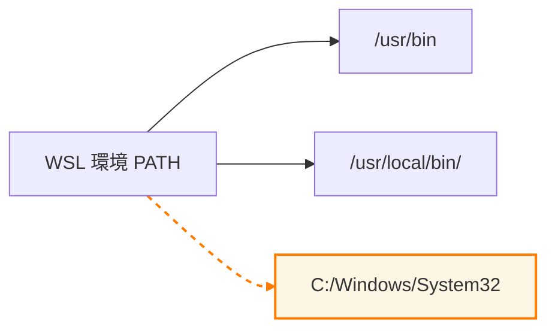

<!-- vale Google.Slang = NO -->
## tl;dr

<!-- vale on -->

WSL 2 をより快適に使うには、`/etc/wsl.conf` による起動設定のカスタマイズが有効です。
`systemd` の有効化やホスト名固定、PATH の調整などを、3 つの手順で簡潔に設定できます。

<!-- markdownlint-disable line-length -->
1. `sudo vi /etc/wsl.conf` で設定ファイルを作成・編集

2. [Gist 設定例](https://gist.github.com/atsushifx/c6d69609133c12788986e882b9782017#file-wsl-conf) をコピーアンドペーストし、必要に応じて `hostname` や `default` を修正

3. `wsl --shutdown` を実行して、WSL を再起動すれば設定反映完了！
<!-- markdownlint-enable -->

Enjoy!

## はじめに

atsushifx です。

`WSL 2` は、Windows 上でネイティブに Linux 環境を動作させることができる強力な仕組みです。
開発や検証環境を手軽に構築できることから、多くのエンジニアに利用されています。

その一方で、WSL をより自分好みに快適に使うためには、起動時の設定や`systemd`の有効化、ユーザーやパス構成などをカスタマイズする必要があります。
特に Docker を WSL 上でネイティブに動作させたい場合は、`systemd`を有効化しておく必要があります。

この記事では、WSL の起動動作を制御する設定ファイルである `/etc/wsl.conf` を用いて、以下のようにカスタマイズする方法を紹介します。

- `systemd` を有効化する
- 起動ユーザーを指定する
- Windows パスの自動追加を抑止する
- ホスト名を固定する

基本的な使い方から、設定反映の手順、確認方法、応用的な設定までを丁寧に解説します。

## 用語集

- `WSL` ('Windows Subsystem for Linux`):
  Windows 上で Linux 環境を動作させる仕組み

- `wsl.conf`:
  WSL 起動時の動作を制御する設定ファイル

- `systemd`:
  Linux の初期化システムおよびサービスマネージャー。

- `hostname`:
  システム起動時に設定されるホスト名

- `appendWindowsPath`:
  WSL の環境変数 `$PATH` に Windows 側のパスを追加する設定

- `journalctl`:
  systemd が出力したログを参照するためのコマンド

- `fstab`:
  Linux でファイルシステムのマウント情報を定義する設定ファイル

- `interop`:
  WSL から Windows アプリを実行したり、Windows 側との連携を制御する機能

- `automount`:
  Windows のドライブ (例：C:) を WSL 上に自動的にマウントする機能

- `Visual Studio Code`:
  Microsoft が提供する WSL とのリモート開発に対応した軽量エディタ

## 1. `wsl.conf` とは

`wsl.conf` は、WSL (Windows Subsystem for Linux) 環境において Linux ディストリビューションの起動動作をカスタマイズするための設定ファイルです。
このファイルを `/etc/wsl.conf` として作成し、適切なセクション・オプションを記述することで、WSL 起動時に自動的に適用される設定を定義できます。

### 1.1 主な用途と特徴

`wsl.conf` は、以下のような用途で活用されます。

- **systemd の有効化**
  近年のディストリビューションでは標準となっている `systemd` を、WSL 2 環境でも利用可能にします。
  WSL上で`Docker`をネイティブに実行させるために、`systemd`を有効化しておく必要があります。

- **起動ユーザーの固定**
  ディストリビューション起動時に毎回 root ユーザーで入るのではなく、特定のユーザーで自動ログインできます。

- **ホスト名（hostname）の設定**
  複数の WSL 環境を使い分ける場合に、識別しやすくなります。

- **Windows 側のパスを除外**
  `appendWindowsPath = false` を設定することで、WSL 内の `$PATH` に Windows のパスが混入するのを防ぎます。

`wsl.conf` の変更はディストリビューションの「起動時設定」として反映されるため、日常の開発体験に大きな影響を与える構成ファイルです。

### 1.2 ファイル形式の特徴

`wsl.conf` は `.ini` 形式の構成ファイルで、\[section]ラベル内に `key=value` 形式で設定を記述します。

この構成により、視認性と保守性に優れたフォーマットでカスタマイズが可能です。
以下は、`systemd` を有効化し、WSL の起動ユーザーを固定する基本的な例です。

```ini:wsl.conf
[boot]
systemd=true

[user]
default=<your-account>
```

設定後は、`wsl --shutdown` を実行してから WSL を再起動することで、内容が反映されます。
このように、`wsl.conf` は WSL 環境の起動時挙動を恒久的に制御するための要となるファイルです。

## 2. `wsl.conf` によるWSLの設定

WSL の動作は、`/etc/wsl.conf` に記述する複数のセクションによって細かく制御できます。
主に使用される設定項目の意味と、実際の `wsl.conf` の具体例を紹介します。

### 2.1. `wsl.conf` のセクションと設定項目

以下に、よく使用されるセクションとその主要な設定項目をまとめます。

- `[boot]`
  WSL 起動時の動作を設定するセクション。

  | 設定項目 | 設定値の例 | 説明 |
  |----------|------------|------|
  | `systemd` | `true`     | WSL で `systemd` を有効にする |
  | `command` | `service ssh start` | 起動時に指定したコマンドを実行する |

- `[network]`
  ネットワーク関連の設定を行なうセクション。

  | 設定項目 | 設定値の例 | 説明 |
  |----------|------------|------|
  | `hostname` | `debian` | ディストリビューションのホスト名を固定する |
  | `generateHosts` | `true` | `/etc/hosts` を自動生成する |
  | `generateResolvConf` | `true` | `/etc/resolv.conf` を自動生成する |

- `[interop]`
  Windows アプリとの連携を制御するセクション。

  | 設定項目 | 設定値の例 | 説明 |
  |----------|------------|------|
  | `enabled` | `true` | Windows プロセスの起動を有効にする (Windows側のコマンドの実行を可能にする) |
  | `appendWindowsPath` | `false` | Windows のパスを `$PATH` に追加しない |

- `[automount]`
  Windows ドライブのマウント方法を制御するセクション。

  | 設定項目 | 設定値の例 | 説明 |
  |----------|------------|------|
  | `enabled` | `true` | Windows のドライブを自動マウントする |
  | `mountFsTab` | `true` | WSL開始時に、`/etc/fstab`を設定する |
  | `root` | `/mnt/` | マウントするディレクトリのルートパスを指定 |
  | `options` | `metadata,umask=022` | 所有権やパーミッションの設定を調整する |

- `[user]`
  WSL 起動時のユーザーを指定するセクション。

  | 設定項目 | 設定値の例 | 説明 |
  |----------|------------|------|
  | `default` | `<your-account>` | 起動時にログインするユーザーアカウント |

これらの設定をどのように記述するかを 2.2 で `wsl.conf`の例で見ていきましょう。

### 2.2 作成した`wsl.conf`

以下に、実際に使用している`wsl.conf`を示します。
この例では、2.1 での設定の例をもとに`wsl`を設定しています。

@[gist](https://gist.github.com/atsushifx/c6d69609133c12788986e882b9782017?file=wsl.conf)

## 3. `wsl.conf`の設定

実際に `/etc/wsl.conf` を編集し、WSL に設定を適用する手順を紹介します。

### 3.1 `wsl.conf`の作成

1. WSL を起動し、以下のコマンドで `/etc/wsl.conf` を作成・編集します。

   ```bash
   sudo vi /etc/wsl.conf
   ```

2. 2.2 で紹介した設定例を、コピーアンドペーストします。

3. 自分の環境に合わせて、以下の項目を変更します。

   - `hostname`: `develop` など、自分の好きな名前をつける
   - `default`: 起動時にログインするユーザーアカウント (省略時は初回インストール時の既定ユーザー)

4. `wsl.conf`を保存する

### 3.2 `wsl`への適用

`/etc/wsl.conf` の設定を WSL に反映するには、WSL を完全に停止して再起動する必要があります。

#### 手順

1. PowerShell または Windows Terminal を起動し、以下のコマンドを実行します。

   ```powershell
   wsl --shutdown
   ```

2. 再度、Windows Terminal から対象のディストリビューション (例: Debian) を起動します。

   ```powershell
   wsl -d Debian
   ```

   プロンプトに `your-username@hostname:~$` のように表示されていれば、設定が反映されています。

#### 注意点

- **構成反映には数秒かかる**：
  WSL の内部サブシステムがシャットダウンするまで、構成変更が反映されません。
- **現在実行中のディストリビューションを確認するには**：

   ```powershell
   wsl --list --running
   ```

   実行中のディストリビューションが表示されなければ、安全に再起動できます。

- **`default` を省略した場合**：
  WSL は、インストール時に設定された初期ユーザー（最初に作成された非 root ユーザー）でログインします。これを変更したい場合は、`wsl.conf` に `default=your-username` を指定するか、以下のコマンドを利用します。

   ```powershell
   debian config --default-user your-username
   ```

### 3.4 `systemd` の確認方法

`wsl.conf` に `systemd=true` を設定すれば、`systemd`は有効になっています。
systemd が正しく有効になっているかを確認するには、以下のコマンドを使用します。

#### 1. systemd サービスの状態を確認する

```bash
systemctl list-units --type=service|grep 'dbus'
```

出力結果:

```bash
  dbus.service                       loaded active running D-Bus System Message Bus
```

上記のように、`dbus.service`が`active`になっていれば、`systemd`は正常に動作しています。

#### 2. `journalctl` が使えるか確認する

```bash
journalctl -xe
```

出力結果:

```bash
May 01 03:10:01 debian CRON[182]: pam_unix(cron:session): session opened for user root(uid=0) by (uid=0)
May 01 03:10:01 debian CRON[183]: (root) CMD (test -e /run/systemd/system || SERVICE_MODE=1 /sbin/e2scrub_all -A -r)
May 01 03:10:01 debian CRON[182]: pam_unix(cron:session): session closed for user root
May 01 03:17:01 debian CRON[185]: pam_unix(cron:session): session opened for user root(uid=0) by (uid=0)
```

上記のようなログが出力されていれば、`systemd`ベースのログ管理が機能しています。

#### 3. systemctl が使えない場合の対処

```bash
systemctl list-units --type=service|grep 'dbus'
```

を実行したときに、次のようなエラーが出た場合:

```text
System has not been booted with systemd as init system (PID 1). Can't operate.
```

これは以下のような原因が考えられます:

- `wsl.conf` に `systemd=true` が正しく書かれていない
- `/etc/wsl.conf` の編集後に `wsl --shutdown` が実行されていない
- 古いバージョンの WSL を使用している（0.67.6 以降が必要）

#### 4. WSL バージョンを確認する

```powershell
wsl --version
```

次のように、バージョンが表示されます:

```powershell
WSL バージョン: 2.4.13.0
カーネル バージョン: 5.15.167.4-1
WSLg バージョン: 1.0.65
MSRDC バージョン: 1.2.5716
Direct3D バージョン: 1.611.1-81528511
DXCore バージョン: 10.0.26100.1-240331-1435.ge-release
Windows バージョン: 10.0.26100.3915
```

`WSL バージョン`が、`0.67.6`以前の場合は、WSL を最新バージョンに更新する必要があります。
以下のコマンドを実行してください。

```powershell
wsl --update

下記のように表示され、WSLが更新されます。

```powershell
ダウンロード中: Linux 用 Windows サブシステム 2.4.13
[========================= 43.8%                           ]

インストール中: Linux 用 Windows サブシステム 2.4.13
[========================= 43.8%                           ]
```

## 4. 上級者向け設定Tips

### 4.1 `appendWindowsPath`を`false`にする理由

WSL ではデフォルトで Windows 側の環境変数 `$PATH` が WSL 環境にも追加されます。
**以下の図は、その構成イメージを示したものです**。



*図4: `appendWindowsPath=true`の場合、Windows側のPathが追加される*

下記のような理由があるときは、`appendWindowsPath=false`と設定する必要があります。

:::message

- **PATH 汚染を避けたいとき**：Windows の実行ファイルが WSL 内のコマンドとバッティングするリスクがある
- **Linux ネイティブのコマンドのみを使用したいとき**
- **ツールチェーンの差異による意図しない挙動を防ぎたいとき**

`appendWindowsPath=false`の場合でも、シェルスクリプトを使うことで Windows上のアプリを使うことができます。
例えば、`Visual Studio Code`の場合:

```bash
#!/usr/bin/env bash
# src: /opt/bin/code
#
# @(#) : VS Code executor for WSL

vscode=/mnt/c/app/develop/ide/VSCode
"$vscode/bin/code" --remote wsl+$(hostname) $*
```

上記のようなシェルスクリプトを組むことで、Windows 側と同じように`Visual Studio Code`を使用できます。

### 4.2 `hostname` の固定

WSL では、起動時に自動的にホスト名が設定されます。
**デフォルトでは、ディストリビューションの名前 (例: `Debian`) がそのままホスト名として使用されます。**

開発環境を複数の WSL インスタンスで使い分けている場合や、SSH やローカルネットワークサービスで識別性を高めたい場合には、**明示的に `hostname` を固定する**のが便利です。

たとえば以下のように記述します。

```ini
[network]
hostname=dev-debian
```

この設定を行なうことで、常に `dev-debian` というホスト名で起動され、ターミナル上のプロンプトも安定して識別できるようになります。

また、`Visual Studio Code` の `Remote WSL`機能や内部 DNS 解決処理などにおいても、安定した名前が使用されることで設定や接続確認がスムーズになります。

## おわりに

この記事では、WSL 2 上の Linux ディストリビューションにおいて、`/etc/wsl.conf` を用いた基本的なカスタマイズ方法を紹介しました。

`wsl.conf` を活用することで、systemd の有効化や Windows 側との連携制御など、WSL 環境をより安定・快適に使うためのベースを整えることができます。

自分の開発スタイルにあわせて `wsl.conf` を調整し、再現性の高い環境構築を実現してください。

それでは、Happy Hacking!

## 参考資料

### Webサイト

- [WSL での詳細設定の構成](https://learn.microsoft.com/ja-jp/windows/wsl/wsl-config):
  `wsl.conf` と `.wslconfig` による WSL の詳細設定と使い分け方法を公式に解説したドキュメント

- [WSL の systemd 対応発表ブログ (英語)](https://devblogs.microsoft.com/commandline/systemd-support-is-now-available-in-wsl/):
  WSL における systemd サポートの背景と手順を説明した公式ブログ

- [GitHub Gist: `wsl.conf` の設定例](https://gist.github.com/atsushifx/c6d69609133c12788986e882b9782017#file-wsl-conf):
  この記事で使用した `wsl.conf` の全文を確認できます
